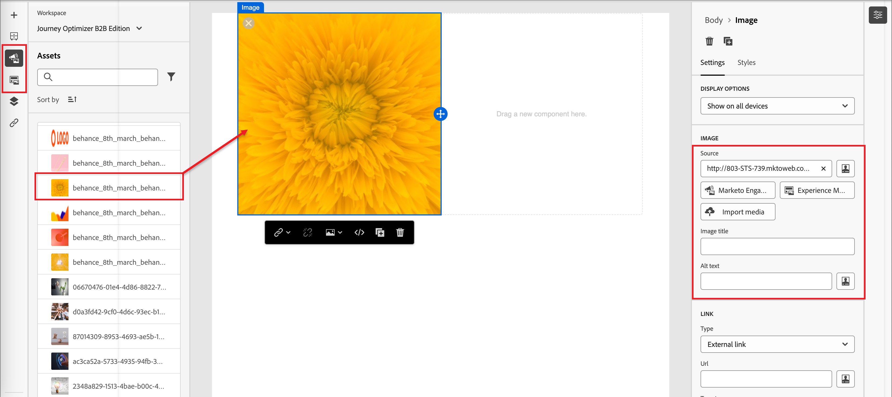

# Inhaltserstellung - Assets

Wählen Sie im Visual Content Editor das Symbol _Assets_ (  ) oder das Symbol _Experience Manager Assets_ (  ) in der linken Navigationsleiste aus. Über den Asset-Wähler können Sie direkt Assets auswählen, die in der Quellbibliothek gespeichert sind.

>[!NOTE]
>
>Wenn Sie mit Adobe Experience Manager as a Cloud Services bereitgestellt wurden, haben Sie Zugriff auf die Repositorys für Journey Optimizer B2B edition und Adobe Experience Manager Assets as a Cloud Service, wenn Ihr Benutzerkonto über die erforderlichen Berechtigungen verfügt. Diese Repositorys sind getrennt und nicht synchronisiert. Sie können Bild-Assets aus beiden Quellen verwenden.

* Fügen Sie ein neues Asset hinzu, indem Sie das Bild-Asset per Drag-and-Drop in eine Strukturkomponente ziehen.

  {width="800" zoomable="yes"}

* Ersetzen Sie ein vorhandenes Bild-Asset, indem Sie es auf der Arbeitsfläche auswählen und in den **[!UICONTROL -Tools auf]** Asset auswählen“ klicken.

  {width="600" zoomable="yes"}

Weitere Informationen zur Verwendung von Assets aus Ihrem Quelltyp finden Sie unter [Verwenden von Assets für die Inhaltserstellung](../user/content/assets-overview.md#use-assets-for-content-authoring).