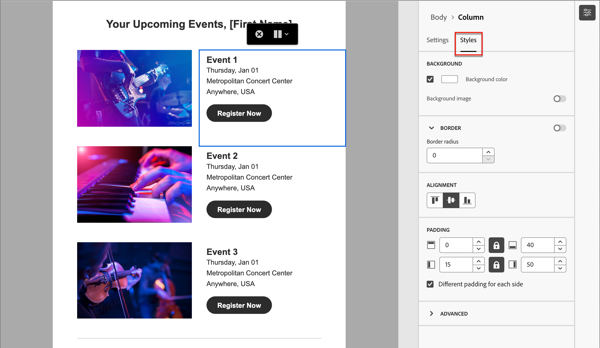

# Inhaltserstellung - Navigation

Während Sie mit dem Inhalt im visuellen Designer arbeiten, können Sie mithilfe des Baums _Navigation_ auf die Ebenen/Container und Elemente zugreifen. Klicken Sie auf das Symbol _Navigation_ , um den Baum links neben der Arbeitsfläche anzuzeigen.

{width="800" zoomable="yes"}

Im folgenden Beispiel werden die Schritte zum Anpassen des Abstands und der vertikalen Ausrichtung innerhalb einer Strukturkomponente beschrieben, die aus Spalten besteht.

1. Wählen Sie die Spalte in der Strukturkomponente direkt auf der Arbeitsfläche aus oder verwenden Sie die links angezeigte _Navigationsstruktur_ .

1. Klicken Sie in der Spaltensymbolleiste auf das Tool _[!UICONTROL Spalte auswählen]_ und wählen Sie das Tool aus, das Sie bearbeiten möchten.

   Sie können sie auch im Strukturbaum auswählen. Die bearbeitbaren Parameter für diese Spalte werden auf den Registerkarten _[!UICONTROL Einstellungen]_ und _[!UICONTROL Stile]_ rechts angezeigt.

   {width="800" zoomable="yes"}

1. Um die Spalteneigenschaften zu bearbeiten, klicken Sie auf die Registerkarte _[!UICONTROL Stile]_ rechts und ändern Sie sie entsprechend Ihren Anforderungen:

   * Ändern Sie für **[!UICONTROL Hintergrund]** die Hintergrundfarbe nach Bedarf.

     Deaktivieren Sie das Kontrollkästchen für einen transparenten Hintergrund. Aktivieren Sie die Einstellung **[!UICONTROL Hintergrundbild]** , um ein Bild als Hintergrund anstelle einer Vollbildfarbe zu verwenden.

   * Wählen Sie für **[!UICONTROL Ausrichtung]** das Symbol _Oben_, _Mitte_ oder _Unten_ aus.
   * Definieren Sie für **[!UICONTROL Abstand]** den Abstand für alle Seiten.

     Wählen Sie **[!UICONTROL Unterschiedliche Abstände für jede Seite]** aus, wenn Sie eine Feinabstimmung für den Abstand vornehmen möchten. Klicken Sie auf das Symbol _Sperren_ , um die Synchronisierung zu unterbrechen.

   * Erweitern Sie den Abschnitt **[!UICONTROL Erweitert]** , um Inline-Stile für die Spalte zu definieren.

   {width="700" zoomable="yes"}

1. Wiederholen Sie diese Schritte bei Bedarf, um die Ausrichtung und den Abstand für die anderen Spalten in der Komponente anzupassen.

1. Speichern Sie Ihre Änderungen.
