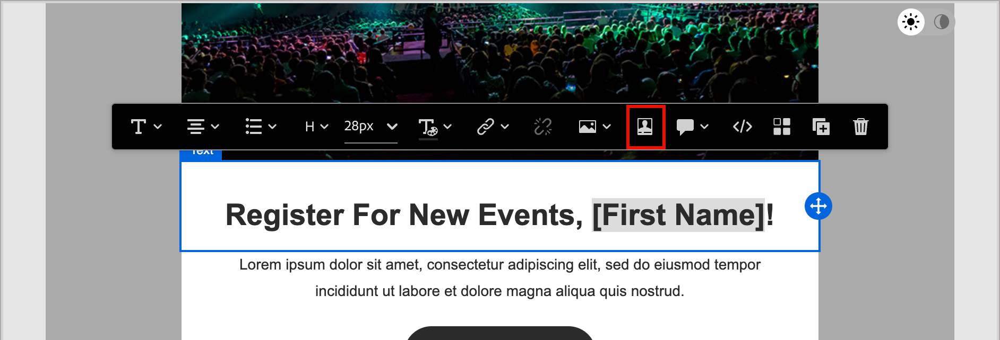

# Inhaltserstellung - Personalisierung

Journey Optimizer B2B Edition verwendet eine einfache Inline-Syntax, mit der Sie Ausdrücke mit personalisierten Inhalten erstellen können, die von geschweiften Klammern `{{}}` eingeschlossen sind. Sie können ohne Einschränkungen mehrere Ausdrücke in demselben Inhalt oder Feld hinzufügen.

Sie können beispielsweise einen Personalisierungsausdruck als `Hello {{lead.firstName}} {{lead.lastName}}` hinzufügen. Bei der Verarbeitung des Inhalts ersetzt Journey Optimizer B2B Edition den Ausdruck durch die in der Experience Platform-Datenbank enthaltenen Daten. Das erste Beispiel wird also _Hallo, Max Mustermann_.

Unter [Personalisierung von Inhalten](../user/content/personalization.md) finden Sie weitere Informationen zur Verwendung von Personalisierungs-Tools in Journey Optimizer B2B Edition.

>[!NOTE]
>
>Journey Optimizer B2B Edition folgt _Binnenmajuskel-_) für Personalisierungs-Token in E-Mails, um sie mit den anderen Adobe Experience Platform-Programmen abzustimmen und so ein konsistentes Erlebnis zu gewährleisten. Dieses Token-Format ist vollständig kompatibel mit der [Handlebars-Vorlagensprache](https://handlebarsjs.com/guide/#what-is-handlebars){target="_blank"}. Alle Token, die vor dieser Änderung hinzugefügt wurden, werden automatisch aktualisiert.

Im folgenden Beispiel werden die Schritte zum Personalisieren von Inhalten mit Personen- und System-Token beschrieben. Dies entspricht der aktuellen Journey Optimizer B2B Edition-Version.

1. Wählen Sie die Textkomponente aus und klicken Sie auf das Symbol _Personalisierung hinzufügen_ (  ) in der Symbolleiste.

   {width="600"}

   Dadurch wird das Dialogfeld _Personalization bearbeiten_ geöffnet.

1. Fügen Sie ein Token hinzu, indem Sie auf das Pluszeichen ( **+** ) daneben klicken.

   Wenn Sie das Token mit einem Fallback hinzufügen möchten (Standardtext, der angezeigt wird, wenn dieses Feld für einen Lead nicht verfügbar ist), klicken Sie auf das Symbol _Mehr_ ( **…** ) und wählen Sie **[!UICONTROL Mit Fallback-Text einfügen]**.

   {width="700" zoomable="yes"}

1. Fügen Sie alle zusätzlichen Token oder anderen statischen Text hinzu, die Sie einbeziehen möchten.

1. Klicken Sie auf **[!UICONTROL Speichern]**.

   Das Personalisierungsskript wird im visuellen Design-Bereich angezeigt. Sie können ihn auswählen, um bei Bedarf Änderungen vorzunehmen.

   {width="600"}
