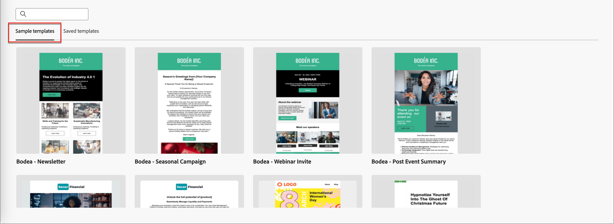

# Inhaltserstellung - E-Mail-Vorlage auswählen

Sie können aus folgenden Optionen wählen:

* **Beispielvorlagen**. Die Benutzeroberfläche von Journey Optimizer bietet 20 vordefinierte E-Mail-Vorlagen, aus denen Sie auswählen können.

* **Gespeicherte Vorlagen**. Verwenden Sie eine gespeicherte benutzerdefinierte Vorlage, die Sie entweder von Grund auf mithilfe des Menüs _[!UICONTROL Vorlagen]_ erstellt oder mithilfe der Option _[!UICONTROL Als Inhaltsvorlage speichern]_ aus einer E-Mail in einer Journey gespeichert haben.

Verwenden Sie den Abschnitt _[!UICONTROL Designvorlage auswählen]_ , um mit der Erstellung Ihres Inhalts aus einer Vorlage zu beginnen. Sie können eine Beispielvorlage oder eine gespeicherte benutzerdefinierte E-Mail-Vorlage aus Ihrer Journey Optimizer B2B Edition-Instanz verwenden.

>[!BEGINTABS]

>[!TAB Gespeicherte Vorlagen]

Auf der Startseite _Vorlage erstellen_ ist die Registerkarte _Beispielvorlagen erstellen_ standardmäßig ausgewählt. Um eine benutzerdefinierte Vorlage zu verwenden, wählen Sie die Registerkarte **[!UICONTROL Gespeicherte Vorlagen]** aus.

Die Liste aller E-Mail-Vorlagen, die in der aktuellen Sandbox erstellt wurden, wird angezeigt. Sie können sie nach _[!UICONTROL Name]_, _[!UICONTROL Zuletzt geändert]_ und _[!UICONTROL Zuletzt erstellt]_ sortieren.

{width="800" zoomable="yes"}

Wählen Sie die gewünschte Vorlage aus der Liste aus.

Nach der Auswahl wird eine Vorschau der Vorlage angezeigt. Im Vorschaumodus können Sie mithilfe der Rechts- und Linkspfeile zwischen allen Vorlagen einer Kategorie (Beispiel oder je nach Auswahl gespeichert) navigieren.

{width="800" zoomable="yes"}

Wenn die Anzeige mit dem übereinstimmt, was Sie verwenden möchten, klicken Sie oben rechts im Vorschaufenster auf **[!UICONTROL Diese Vorlage verwenden]** .

Mit dieser Aktion wird der Inhalt in den visuellen Inhaltsentwickler kopiert, wo Sie den Inhalt nach Bedarf bearbeiten können.

>[!TAB Beispielvorlagen]

Adobe Journey Optimizer B2B Edition bietet eine Auswahl an vordefinierten E-Mail-Vorlagen _1}, die zur Erstellung von E-Mails und E-Mail-Vorlagen verwendet werden können._

{width="800" zoomable="yes"} bereitgestellte Vorlage aus.

>[!ENDTABS]