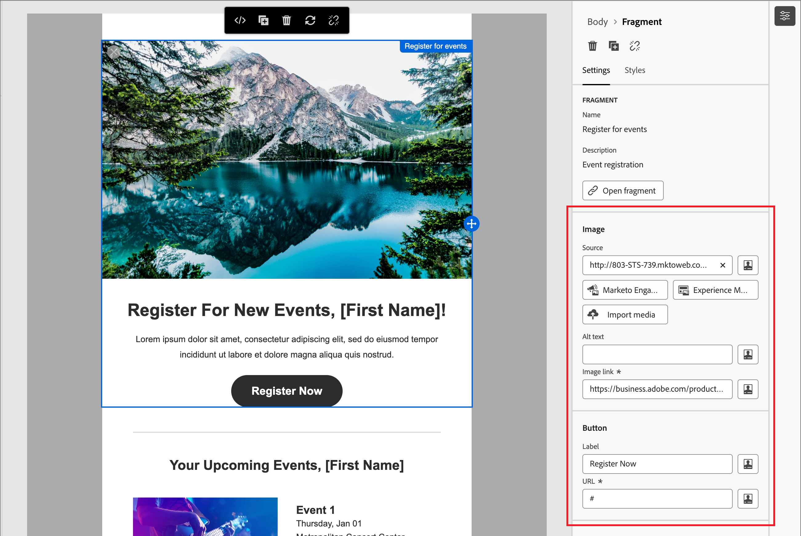

# Inhaltserstellung - Verwenden von visuellen Fragmenten

Ein visuelles Fragment ist eine wiederverwendbare Design-Komponente, die von mehreren Inhalts-Assets in Adobe Journey Optimizer B2B edition referenziert werden kann. Normalerweise handelt es sich dabei um einen Inhaltsblock, der vorab erstellt und schnell eingefügt werden kann, um das Authoring schneller und konsistenter zu machen.

Im folgenden Beispiel werden Schritte zum Hinzufügen von Fragmenten bei der Erstellung von Inhalten beschrieben.

1. Um die Fragmentliste zu öffnen, wählen Sie das Symbol _Fragmente_ aus ( ).

   Sie haben folgende Möglichkeiten:

   * Sortieren Sie die Liste.
   * Durchsuchen, Suchen oder Filtern der Liste.
   * Wechseln zwischen Miniatur- und Listenansicht.
   * Aktualisieren Sie die Liste, um die kürzlich erstellten Fragmente anzuzeigen.

   {width="700" zoomable="yes"}

1. Ziehen Sie eines der Fragmente per Drag-and-Drop in die Strukturkomponente.

   Der Editor rendert das Fragment innerhalb des Abschnitts/Elements der E-Mail-Struktur.

   >[!TIP]
   >
   >Um das Fragment so hinzuzufügen, dass es das gesamte horizontale Layout in der E-Mail einnimmt, fügen Sie eine 1:1-Spaltenstruktur hinzu und ziehen Sie das Fragment dann per Drag-and-Drop hinein.

   Der Inhalt des Fragments wird innerhalb der Struktur dynamisch aktualisiert, um anzuzeigen, wie der Inhalt in Ihrem Inhalt angezeigt wird.

>[!BEGINSHADEBOX]

**Bearbeitbare Felder in anpassbaren Fragmenten**

Ein visuelles Fragment kann bearbeitbare Felder enthalten, die Sie anpassen können. Mit benutzerdefinierten Feldern können Sie Parameter ändern, wenn Sie das Fragment in Ihren Inhalt integrieren und ein maßgeschneidertes Erlebnis erstellen, ohne das ursprüngliche Fragment zu beeinflussen. Der Fragmentautor kann [das Fragment für die Anpassung entwerfen](../user/content/fragment-authoring.md#enable-fragment-customization) von Text-, Bild- und Schaltflächenkomponenten. Wenn ein eingeschlossenes Fragment Komponenten mit bearbeitbaren Feldern enthält, können Sie die Standardwerte ändern, um es für Ihren Inhalt anzupassen.

1. Wählen Sie die Fragmentkomponente aus.

   Die auf der rechten Seite angezeigten Einstellungen enthalten bearbeitbare Felder mit den Standardwerten.

   {width="700" zoomable="yes"}

1. Ändern Sie jedes bearbeitbare Feld nach Bedarf.

>[!ENDSHADEBOX]
