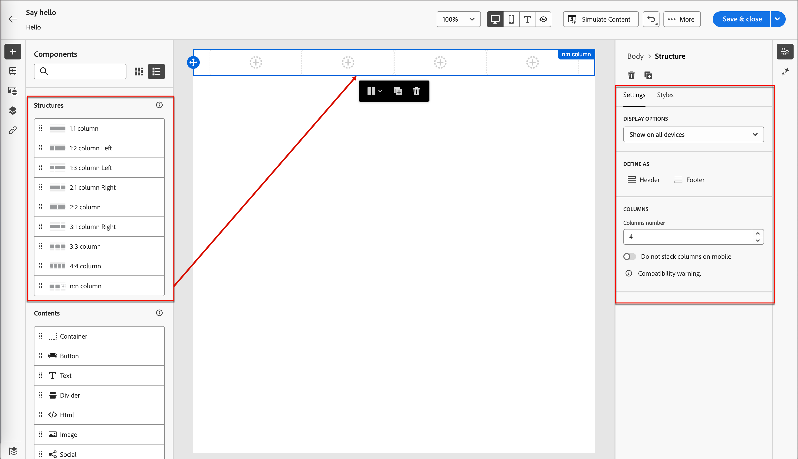

# Snippets

<!-- Content authoring steps for reuse -->

## Inhaltserstellung - Komponenten - Schritt „Strukturen“ {#structures-step}

1. Ziehen Sie zum Beginnen Ihres Inhaltsdesigns ein Element aus der **[!UICONTROL Strukturen]** und legen Sie es auf der Arbeitsfläche ab.

   Fügen Sie so viele Elemente aus _[!UICONTROL Strukturen]_ hinzu, wie Sie benötigen, und bearbeiten Sie die Einstellungen für jedes Element im Bereich auf der rechten Seite.

   >[!TIP]
   >
   >Wählen Sie die Komponente _[!UICONTROL n:n]_ aus, um die Anzahl der Spalten zu definieren (zwischen drei und 10). Sie können auch die Breite jeder Spalte definieren, indem Sie die Pfeile unter die Spalte verschieben.

   {width="800" zoomable="yes"}

   Die Größe einer Spalte darf nicht kleiner als 10 % der Gesamtbreite der Strukturkomponente sein. Nur leere Spalten können entfernt werden.

## Inhaltserstellung - Komponenten - Inhaltsschritt {#contents-step}

1. Erweitern Sie **[!UICONTROL Abschnitt]** Inhalte“ und fügen Sie beliebig viele Elemente zu einer oder mehreren Strukturkomponenten hinzu.

   {width="800" zoomable="yes"}
   <!--
   reference to the contents elements--->

## Schritt „Inhaltserstellung - Komponenten - Einstellungen“ {#settings-step}

1. Bei Bedarf können Sie auf den Registerkarten _[!UICONTROL Einstellungen“ oder „Stil]_ zusätzliche Anpassungen _[!UICONTROL jede Komponente]_.

   Sie können beispielsweise den Textstil, den Abstand oder den Rand jeder Komponente ändern.

## Inhaltserstellung - Schritt Assets {#assets-step}

1. Über die _Asset_-Auswahl können Sie direkt Assets auswählen, die in der Asset-Bibliothek gespeichert sind.

   Doppelklicken Sie auf den Ordner, der Ihre Assets enthält. Ziehen Sie die Elemente per Drag-and-Drop in eine Strukturkomponente.

   >[!NOTE]
   >
   >Wenn Sie über ein Abonnement für Experience Manager Assets as a Cloud Service zusammen mit dem standardmäßigen Adobe Marketo Engage Design Studio verfügen, müssen Sie bei der Erstellung ](../user/content/assets-overview.md#choose-an-asset-source) E-Mail, E-Mail-Vorlage oder visuellen Fragments die [Bildquelle“ auswählen. Sie können jedoch auch die Bildquelle auswählen, bevor Sie den Content Designer zur Bearbeitung öffnen.

   Weitere Informationen zur Verwendung von Assets aus Ihrem Quelltyp finden Sie unter [Hinzufügen von Assets zu Ihrem Inhalt](../user/content/assets-overview.md#add-assets-to-your-content).

   {width="800" zoomable="yes"}

## Inhaltserstellung - Personalisierungsschritt {#personalization-step}

1. Fügen Sie Personalisierungsfelder ein, um Ihren Inhalt aus Profilattributen, Zielgruppenzugehörigkeiten, kontextuellen Attributen und mehr anzupassen.

## Inhaltserstellung - Bedingungsinhaltsschritt aktivieren {#dynamic-content-step}

1. Klicken Sie **[!UICONTROL Bedingten Inhalt aktivieren]**, um dynamischen Inhalt hinzuzufügen und den Inhalt auf der Grundlage von bedingten Regeln an die Zielprofile anzupassen.

## Inhaltserstellung - Schritt zum Linktracking {#links-tracking-step}

1. Wählen Sie die **[!UICONTROL Links]** aus dem linken Bereich, um alle getrackten URLs Ihres Inhalts anzuzeigen.

   Sie können den _Tracking-Typ_ oder _Label_ ändern und bei Bedarf Tags hinzufügen.
