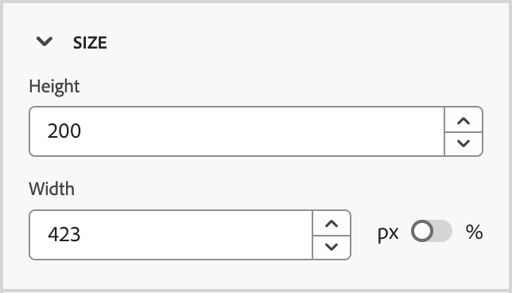
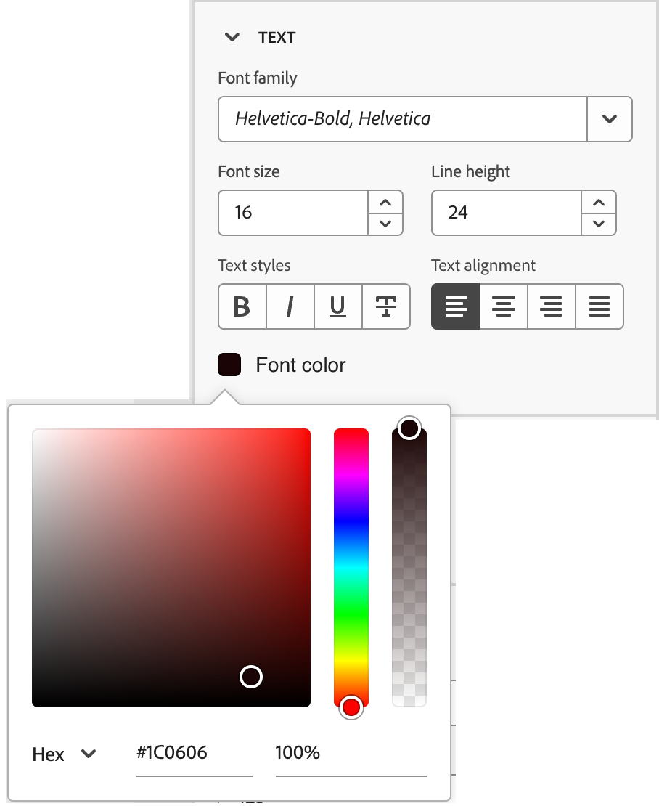

# Ausschnitte

<!-- Content authoring steps for reuse -->

## Konfiguration der Absichtsdaten {#intent-data-note}

>[!NOTE]
>
>Intent-Daten sind enthalten, wenn sie für Ihre Journey Optimizer B2B edition-Instanz konfiguriert sind. Es sind auch eine oder mehrere veröffentlichte Journey (**)** Einkaufsgruppen erforderlich. Weitere Informationen zum Modell zur Absichtserkennung und zum Senden von Schlüsselwörtern, Produkten und Kategorien finden Sie unter [Absichtsdaten](../user/admin/intent-data.md).

## AEM Assets-Lizenzhinweis {#aem-assets-licensing-note}

>[!NOTE]
>
>Lizenzen für AEM Assets as a Cloud Service und Dynamic Media-Lizenzen sind Voraussetzungen für die Integration. Stellen Sie sicher[ dass „Dynamic Media mit Open API](https://experienceleague.adobe.com/de/docs/experience-manager-cloud-service/content/assets/dynamicmedia/dynamic-media-open-apis/dynamic-media-open-apis-overview){target="_blank"} aktiviert ist. Die Integration ist auf Repositorys der _Bereitstellungsebene“_. Wenn Sie die _Autorenebene_ verwenden und sie konvertieren möchten, wenden Sie sich an den Adobe Experience Manager-Support. 
>Abhängig von Ihrem Vertrag und Ihrer Konfiguration können Sie beim Entwerfen visueller Inhalte direkt über Adobe Journey Optimizer B2B edition auf Adobe Experience Manager Assets as a Cloud Service zugreifen.

## Inhaltserstellung - Komponenten - Schritt „Strukturen“ {#structures-step}

1. Ziehen Sie zum Beginnen Ihres Inhaltsdesigns ein Element aus der **[!UICONTROL Strukturen]** und legen Sie es auf der Arbeitsfläche ab.

   Fügen Sie so viele Elemente aus _[!UICONTROL Strukturen]_ hinzu, wie Sie benötigen, und bearbeiten Sie die Einstellungen für jedes Element im Bereich auf der rechten Seite.

   >[!TIP]
   >
   >Wählen Sie die Komponente _[!UICONTROL n:n Column]_ aus, um die Anzahl der Spalten zu definieren (drei bis zehn). Sie können auch die Breite jeder Spalte definieren, indem Sie die Pfeile unter die Spalte verschieben.

   {width="800" zoomable="yes"}

   Die Größe einer Spalte darf nicht kleiner als 10 % der Gesamtbreite der Strukturkomponente sein. Nur leere Spalten können entfernt werden.

## Inhaltserstellung - Komponenten - Inhaltsschritt {#contents-step}

1. Erweitern Sie **[!UICONTROL Abschnitt]** Inhalte“ und fügen Sie beliebig viele Elemente zu einer oder mehreren Strukturkomponenten hinzu.

   {width="800" zoomable="yes"}
   <!--
   reference to the contents elements--->

## Schritt „Inhaltserstellung - Komponenten - Einstellungen“ {#settings-step}

1. Bei Bedarf können Sie auf den Registerkarten _[!UICONTROL Einstellungen“ oder „Stil]_ zusätzliche Anpassungen _[!UICONTROL jede Komponente]_.

   Sie können beispielsweise den Textstil, den Abstand oder den Rand jeder Komponente ändern.

## Inhaltserstellung - Schritt Assets {#assets-step}

1. Über die _Asset_-Auswahl können Sie direkt Assets auswählen, die in der Asset-Bibliothek gespeichert sind.

   Doppelklicken Sie auf den Ordner, der Ihre Assets enthält. Ziehen Sie die Elemente per Drag-and-Drop in eine Strukturkomponente.

   Weitere Informationen zur Verwendung von Assets aus Ihrem Quelltyp finden Sie unter [Hinzufügen von Assets zu Ihrem Inhalt](../user/content/assets-overview.md#use-assets-for-content-authoring).

   {width="800" zoomable="yes"}

## Inhaltserstellung - Personalisierungsschritt {#personalization-step}

1. Fügen Sie Personalisierungsfelder ein, um Ihren Inhalt aus Profilattributen, Zielgruppenzugehörigkeiten, kontextuellen Attributen und mehr anzupassen.

## Inhaltserstellung - Bedingungsinhaltsschritt aktivieren {#dynamic-content-step}

1. Klicken Sie **[!UICONTROL Bedingten Inhalt aktivieren]**, um dynamischen Inhalt hinzuzufügen und den Inhalt auf der Grundlage von bedingten Regeln an die Zielprofile anzupassen.

## Inhaltserstellung - Schritt zum Linktracking {#links-tracking-step}

1. Wählen Sie die **[!UICONTROL Links]** aus dem linken Bereich, um alle getrackten URLs Ihres Inhalts anzuzeigen.

   Sie können den _Tracking-Typ_ oder _Label_ ändern und bei Bedarf Tags hinzufügen.

## Inhaltskomponenten - Erweiterte Stile {#styles-advanced}

Verwenden Sie die Stileinstellungen **[!UICONTROL Erweitert]**, um zusätzliche CSS-kompatible Attribute mit Werten anzuwenden. Sie können die Werte der vorhandenen Attribute ändern oder neue hinzufügen. Die Formatierung wird mithilfe des CSS-Vererbungsmodells für über- und untergeordnete Komponenten (Elemente) auf die Komponente angewendet.

Die angezeigten Attribute spiegeln die Stile wider, die derzeit für die Komponente definiert sind. Sie können die Werte entsprechend den [CSS-Definitionen](https://www.w3schools.com/CSSref/index.php){target="_blank"} ändern. Klicken Sie auf _Hinzufügen_ (**+**), um ein neues Stilattribut für die Komponente hinzuzufügen.

{width="250"}

## Inhaltskomponenten - Ausrichtungsstile horizontal {#styles-alignment-h}

Erweitern Sie den Abschnitt **[!UICONTROL Ausrichtung]** und wählen Sie die horizontale Ausrichtung aus, die Sie verwenden möchten: links, zentriert oder rechts. Dieser Stil wird in einen standardmäßigen `text-align`-CSS-Stil übersetzt und wirkt sich darauf aus, wie die Komponente in der enthaltenden Komponente positioniert wird.

{width="250"}

## Inhaltskomponenten - Stile für vertikale Ausrichtung {#styles-alignment-v}

Erweitern Sie den **[!UICONTROL Ausrichtung]** und wählen Sie die vertikale Ausrichtung aus, die Sie verwenden möchten: oben, Mitte oder unten. Dieser Stil wird in einen standardmäßigen `vertical-align`-CSS-Stil übersetzt und wirkt sich auf die Positionierung innerhalb der enthaltenden Komponente aus.

{width="250"}

## Inhaltskomponenten - Ausrichtungsstile horizontal und vertikal {#styles-alignment-h-v}

Erweitern Sie den Abschnitt **[!UICONTROL Ausrichtung]** und wählen Sie die horizontale und vertikale Ausrichtung aus, die Sie verwenden möchten. Die Ausrichtungsstile beeinflussen, wie die HTML-Komponente innerhalb der enthaltenden Komponente (Struktur oder Container) positioniert wird.

Die horizontale Ausrichtung wird in einen standardmäßigen `text-align`-CSS-Stil übersetzt und Sie können zwischen links, zentriert oder rechts wählen. Die vertikale Ausrichtung entspricht dem standardmäßigen `vertical-align`-CSS-Stil. Sie können zwischen oben, Mitte oder unten wählen.

{width="300"}

## Inhaltskomponenten - Hintergrundstile {#styles-background}

Wenn Sie im rechten Bedienfeld die _[!UICONTROL Stile]_ ausgewählt haben, definieren Sie im Abschnitt **[!UICONTROL Hintergrund]** die Hintergrundfarbe für die Komponente.

Aktivieren Sie das Kontrollkästchen und klicken Sie auf das Farbfeld, um eine Farbe aus der Auswahl auszuwählen. Sie können eine Farbe auswählen, indem Sie einen bekannten RGB-, HSL-, HSB- oder Hexadezimalwert eingeben. Sie können auch den Farbregler und das Farbfeld verwenden, um die Farbe auszuwählen.

{width="300"}

## Inhaltskomponenten - Rahmenstile {#styles-border}

1. Erweitern Sie im rechten Bedienfeld mit _[!UICONTROL ausgewählten Registerkarte]_ den Abschnitt **[!UICONTROL Rahmen]** und legen Sie die Optionen zum Anzeigen eines Rahmens für die Komponente fest:

1. Schieben Sie den Umschalter nach rechts, um die Anzeigeoptionen für den Rahmen zu aktivieren und sie entsprechend Ihren Entwurfskriterien festzulegen:

   * Um die **[!UICONTROL Rahmenfarbe]** festzulegen, aktivieren Sie das Kontrollkästchen und klicken Sie auf das Farbfeld, um eine Farbe aus der Auswahl auszuwählen. Sie können eine Farbe auswählen, indem Sie einen bekannten RGB-, HSL-, HSB- oder Hexadezimalwert eingeben. Sie können auch den Farbregler und das Farbfeld verwenden, um die Farbe auszuwählen.

   {width="300"}

   * Zum Festlegen der **[!UICONTROL Rahmengröße]** (Linienbreite) klicken Sie auf die Pfeilsymbole nach oben und unten, um die Anzahl der Pixel zu erhöhen oder zu verringern.

   * Um den **[!UICONTROL Rahmenstil“ festzulegen]** wählen Sie einen Wert aus der Liste der standardmäßigen CSS-`border-style` aus.

   * Um zu bestimmen, wo der Rahmen angezeigt wird, aktivieren Sie jedes Kontrollkästchen **[!UICONTROL Rahmenposition]**.

   {width="250"}

1. Legen Sie für **[!UICONTROL Rahmenradius]** den numerischen Wert entsprechend der gewünschten Kurve für die Ecken fest.

   Ein Wert von 0 (Standard) ergibt eine quadratische Ecke.

## Inhaltskomponenten - Stile für Ränder {#styles-margin}

Erweitern Sie im rechten Bedienfeld mit _[!UICONTROL ausgewählten Registerkarte]_ Stile“ den Abschnitt **[!UICONTROL Rand]** und legen Sie die Optionen für den Randabstand in der Strukturkomponente fest. Dieser Stil repliziert den CSS-`margin`, der den Bereich außerhalb eines Komponentenrahmens steuert und ihn von anderen Komponenten trennt. Dadurch wird eine Lücke um die Komponente geschaffen, um ihre Positionierung und das Layout des umgebenden Inhalts zu beeinflussen.

Legen Sie die Randwerte in Pixeln entsprechend Ihren Design-Anforderungen fest. Sie können den Rand für alle Seiten, die obere Schaltfläche, die linke oder die rechte Seite der Komponente unabhängig voneinander festlegen:

* **Alle Seiten** - Wenn Sie einen Wert festlegen möchten, der auf alle Seiten angewendet werden soll, deaktivieren **[!UICONTROL das Kontrollkästchen „Unterschiedlicher Rand für jede Seite]**. Klicken Sie auf die Pfeilsymbole nach oben und unten, um die Anzahl der Pixel zu erhöhen oder zu verringern.

  {width="250"}

* **Oben unten** - Um die oberen und unteren Ränder auf denselben Wert festzulegen, legen Sie das Symbol _Gesperrt_ zwischen den oberen und unteren Einstellungen fest. Klicken Sie auf die Pfeilsymbole nach oben bzw. unten, um die Anzahl der Pixel zu erhöhen oder zu verringern.

* **Links-**: Um die linken und rechten Ränder auf denselben Wert festzulegen, legen Sie das Symbol _Gesperrt_ zwischen den linken und rechten Einstellungen fest. Klicken Sie auf die Pfeilsymbole nach oben bzw. unten, um die Anzahl der Pixel zu erhöhen oder zu verringern.

  {width="250"}

* **Unabhängig** - Um jeden Rand auf einen unabhängigen Wert festzulegen, legen Sie das Symbol _Entsperrt_ zwischen den oberen und unteren Einstellungen sowie zwischen der linken und rechten Einstellung fest. Klicken Sie für jede Einstellung auf die Pfeilsymbole nach oben und unten, um die Anzahl der Pixel zu erhöhen oder zu verringern.

  {width="250"}

## Inhaltskomponenten - Auffüllstile {#styles-padding}

Erweitern Sie im rechten Bedienfeld mit _[!UICONTROL ausgewählten Registerkarte]_ Stile“ den Abschnitt **[!UICONTROL Padding]** und legen Sie die Optionen für den Abstand innerhalb der Strukturkomponente fest. Dieser Stil repliziert den CSS-`padding`, der den Abstand zwischen dem Inhalt einer Komponente und ihrem Rahmen darstellt. Der Abstand sorgt für einen internen Abstand, mit dem Sie den Abstand zwischen Inhalt und Rahmen der Komponente steuern können.

Legen Sie die Abstandswerte entsprechend Ihren Design-Anforderungen in Pixel fest. Sie können den Abstand für alle Seiten, die obere Schaltfläche, die linke oder die rechte Seite der Komponente unabhängig voneinander festlegen:

* **Alle Seiten** - Wenn Sie einen Wert festlegen möchten, der auf alle Seiten angewendet werden soll, deaktivieren Sie das Kontrollkästchen **[!UICONTROL Unterschiedlicher Abstand für jede Seite]**. Klicken Sie auf die Pfeilsymbole nach oben und unten, um die Anzahl der Pixel zu erhöhen oder zu verringern.

  {width="250"}

* **Oben-unten** - Um den oberen und unteren Abstand auf denselben Wert festzulegen, legen Sie das Symbol _Gesperrt_ zwischen den oberen und unteren Einstellungen fest. Klicken Sie auf die Pfeilsymbole nach oben bzw. unten, um die Anzahl der Pixel zu erhöhen oder zu verringern.

* **Left-Right** - Um den linken und rechten Abstand auf denselben Wert festzulegen, legen Sie das Symbol _Locked_ zwischen den linken und rechten Einstellungen fest. Klicken Sie auf die Pfeilsymbole nach oben bzw. unten, um die Anzahl der Pixel zu erhöhen oder zu verringern.

  {width="250"}

* **Unabhängig** - Wenn Sie den Abstand für jede Seite auf einen unabhängigen Wert festlegen möchten, legen Sie das Symbol _Entsperrt_ zwischen den oberen und unteren Einstellungen sowie zwischen der linken und der rechten Seite fest. Klicken Sie für jede Einstellung auf die Pfeilsymbole nach oben und unten, um die Anzahl der Pixel zu erhöhen oder zu verringern.

  {width="250"}

## Inhaltskomponenten - Formatvorlagen {#styles-size}

Erweitern Sie im rechten Bedienfeld mit _[!UICONTROL ausgewählten Registerkarte]_ den Abschnitt **[!UICONTROL Größe]** und legen Sie die Optionen für die Komponentenhöhe und -breite fest:

* **[!UICONTROL Höhe]** - Klicken Sie auf die Pfeilsymbole nach oben und unten, um die Anzahl der Pixel zu erhöhen oder zu verringern. Ein leerer Wert (Auto) ist der Standardwert und bestimmt die Höhe des Elements entsprechend seinem Inhalt.

* **[!UICONTROL Breite]** - Verwenden Sie den Umschalter, um die Breite nach Pixel oder Prozentsatz festzulegen.

   * Legen Sie für eine prozentuale Breite mithilfe des Schiebereglers den prozentualen Wert fest. Der Prozentsatz bestimmt die Elementgröße anhand des Inhaltsfelds des enthaltenden Blocks, wobei Auffüllung und Rahmen ausgeschlossen sind. Bei einem Wert von 50 wird beispielsweise die Elementbreite auf 50 % der Breite festgelegt, die den Block enthält.

     {width="250"}

   * Klicken Sie bei einer pixelbasierten Breite auf die Pfeilsymbole nach oben und unten, um die Anzahl der Pixel zu erhöhen oder zu verringern. Ein leerer Wert (Auto) ist der Standardwert und bestimmt die Breite des Elements entsprechend seinem Inhalt.

     {width="250"}

## Inhaltskomponenten - Textstile {#styles-text}

Erweitern Sie im rechten Bedienfeld mit _[!UICONTROL ausgewählten Registerkarte]_ Stile“ den Abschnitt **[!UICONTROL Text]** und legen Sie die Optionen für die Komponenten-Textstile fest:

* **[!UICONTROL Schriftfamilie]** - Klicken Sie auf das Abwärtspfeilsymbol, um eine Schriftfamilie für Text in der Komponente auszuwählen.

* **[!UICONTROL Schriftgröße]** - Klicken Sie auf die Pfeilsymbole nach oben und unten, um die Schriftgröße zu erhöhen oder zu verringern, oder geben Sie einen Wert ein. Für eingegebene Werte können Sie Dezimalzahlen verwenden.

* **[!UICONTROL Zeilenhöhe]** - Klicken Sie auf die Pfeilsymbole nach oben und unten, um die Zeilenhöhe zu erhöhen oder zu verringern, oder geben Sie einen Wert ein. Für eingegebene Werte können Sie Dezimalzahlen verwenden.

  {width="250"}

* **[!UICONTROL Textstile]** - Wählen Sie das Symbol für den Textstil aus: _Fett_, _Kursiv_, _Unterstrichen_ oder _Durchgestrichen_.

* **[!UICONTROL Textausrichtung]** - Wählen Sie das Symbol für die horizontale Textausrichtung aus: _Links_, _Zentriert_, _Rechts_ oder _Blocksatz_.

* **[!UICONTROL Schriftfarbe]** - Klicken Sie auf das Farbquadrat, um eine Schriftfarbe aus der Auswahl auszuwählen. Sie können eine Farbe auswählen, indem Sie einen bekannten RGB-, HSL-, HSB- oder Hexadezimalwert eingeben. Sie können auch den Farbregler und das Farbfeld verwenden, um die Farbe auszuwählen.

  {width="300"}

## Inhalt - Bildauswahl - Marketo DAM {#me-dam}

Wählen Sie diesen Typ aus, um ein Bild-Asset aus der Journey Optimizer B2B edition-Bibliothek oder der verbundenen Market Engage-Instanz zu durchsuchen und auszuwählen.

{width="700" zoomable="yes"}

Im Dialogfeld können Sie ein Bild aus dem ausgewählten Repository auswählen. Klicken Sie auf **[!UICONTROL Auswählen]**, um das Asset hinzuzufügen.

Es stehen Tools zur Verfügung, mit denen Sie das benötigte Asset finden können:

* Klicken Sie _oben links auf_ Filter), um die angezeigten Elemente nach Ihren Kriterien zu filtern.

* Geben Sie Text in das _Suchen_-Feld ein, um die angezeigten Elemente nach einer Übereinstimmung mit dem Asset-Namen zu filtern.

  {width="700" zoomable="yes"}

## Inhalt - Bildauswahl - AEM Assets {#aem-assets-dam}

Wählen Sie diesen Typ aus, um ein Bild-Asset aus einem [konfigurierten Experience Manager Assets-Repository“ zu durchsuchen und ](../user/admin/configure-aem-repositories.md).

Wählen Sie im Dialogfeld _[!UICONTROL Assets auswählen]_ ein Bild mit den verfügbaren Tools aus, um das benötigte Asset zu finden, und klicken Sie auf **[!UICONTROL Auswählen]**.:

* Ändern Sie **[!UICONTROL Repository]** oben rechts.

* Klicken Sie **[!UICONTROL oben rechts auf]** Assets verwalten“, um das Assets-Repository in einer anderen Browser-Registerkarte zu öffnen und AEM Assets-Verwaltungstools zu verwenden.

* Klicken Sie oben rechts auf _Ansichtstyp_, um die Anzeige in **[!UICONTROL Listenansicht]**, **[!UICONTROL Rasteransicht]**, **[!UICONTROL Galerieansicht]** oder **[!UICONTROL Wasserfallansicht]** zu ändern.

* Klicken Sie auf _Symbol „Sortierreihenfolge_, um die Sortierreihenfolge zwischen aufsteigender und absteigender Reihenfolge zu ändern.

  {width="700" zoomable="yes"}

* Klicken Sie auf **[!UICONTROL Menüpfeil]** Sortieren nach“, um die Sortierkriterien in **[!UICONTROL Name]**, **[!UICONTROL Size]** oder **[!UICONTROL Modified]** zu ändern.

* Klicken Sie _oben links auf_ Filter), um die angezeigten Elemente nach Ihren Kriterien zu filtern.

* Geben Sie Text in das _Suchen_-Feld ein, um die angezeigten Elemente nach einer Übereinstimmung mit dem Asset-Namen zu filtern.

  {width="700" zoomable="yes"}

## Inhalt - Bild-Upload {#image-upload}

Wählen Sie diesen Typ aus, um eine Datei aus Ihrem System auszuwählen und in die Journey Optimizer B2B edition Asset-Bibliothek zu importieren.

Ziehen _[!UICONTROL im Dialogfeld]_ Bild hochladen“ eine Datei aus dem System per Drag-and-Drop in das Feld „Datei“. Die maximale Dateigröße beträgt 100 MB.

{width="450"}

Die Dateinamen der ausgewählten Bilder werden im Dialogfeld angezeigt. Asset-Dateinamen müssen eindeutig sein (in allen Ordnern). Wenn bereits eine Datei mit dem Namen vorhanden ist, wird eine Meldung angezeigt. Namen dürfen maximal 100 Zeichen lang sein und keine Sonderzeichen enthalten (beispielsweise `;`, `:`, `\` und `|`).

Klicken Sie **[!UICONTROL Importieren]**.

## Aktivitäten mit Interaktionswert - Marketo {#engagement-activities-me}

| Aktivitätsname | Beschreibung | Maximale tägliche Frequenzlimitierung | Standardmäßige Aktivitätsgewichtung des Modells |
| --- | --- | --- | --- |
| [!UICONTROL An Veranstaltung teilnehmen] | Ein Mitglied nimmt an einem Event teil | 20 | 60 |
| [!UICONTROL E-Mail angeklickt] | Ein Mitglied klickt auf einen Link in einer E-Mail | 20 | 30 |
| [!UICONTROL E-Mail geöffnet] | Ein Mitglied öffnet eine E-Mail | 20 | 30 |
| [!UICONTROL Formular ausgefüllt] | Ein Mitglied füllt ein Formular auf einer Web-Seite aus und sendet es ab | 20 | 40 |
| [!UICONTROL Interessanter Moment] | Ein Mitglied hat einen interessanten Moment | 20 | 60 |
| [!UICONTROL Link-Klicks] | Ein Mitglied klickt auf einen Link auf einer Web-Seite | 20 | 40 |
| [!UICONTROL Seitenansichten] | Ein Mitglied zeigt eine Web-Seite an | 20 | 40 |
| [!UICONTROL Für Veranstaltung registrieren] | Ein für ein Ereignis registriertes Mitglied | 20 | 60 |
