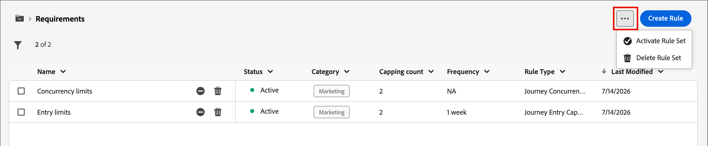
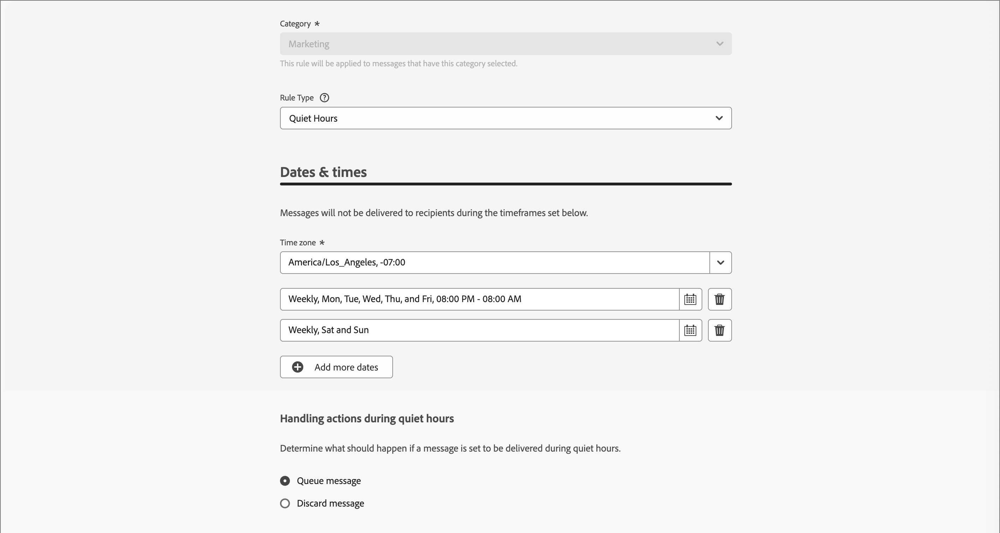

# Geschäftsregeln {#business-rules}

>[!CONTEXTUALHELP]
>id="ajo-b2b-prime_business_rules_rule_sets"
>title="Regelsätze"
>abstract="Verwenden Sie Regelsätze, um die Frequenzbegrenzung oder Regeln für Ruhezeiten auf verschiedene Arten von Marketing-Kommunikation anzuwenden. Sie können auch Regelsätze erstellen, um Journeys für einen Teil Ihrer Zielgruppe basierend auf Frequenzbegrenzungsregeln auszuschließen."

Geschäftsregeln ermöglichen es Ihrem Unternehmen, mehrere Regeln zu definieren und zu Regelsätzen zusammenzufassen, sodass Marketer sie bei Bedarf auf ihre E-Mails anwenden können. Dies bietet eine verbesserte Granularität, mit der beschränkt werden kann, wie oft und wie viele Journey ein Kunde innerhalb eines bestimmten Zeitraums eingeben kann, oder gesteuert werden kann, wie oft Benutzer Nachrichten je nach Kommunikationstyp erhalten.

Es können zwei Arten von Regelsätzen erstellt werden:

* Regelsätze des Typs **Kanal** wenden Begrenzungsregeln auf Kommunikationskanäle an. Sie ermöglichen es Ihnen, Folgendes festzulegen:

   * **Regeln zur Frequenzlimitierung** - Beispiel: *Senden Sie nicht mehr als eine E-Mail-, SMS-, Push-, Briefpost- oder WhatsApp-Kommunikation pro Tag.*
   * **Regeln für ruhige Stunden** - Beispiel: *Senden Sie keine E-Mail-Nachrichten außerhalb des Zeitfensters von 8:00 bis 21:00 Uhr.*

* **Journey**-Regelsätze wenden Regeln für Eintritts- und Gleichzeitigkeitsbegrenzung auf eine Journey an. (In der Beta-Version noch nicht unterstützt.)

>[!PREREQUISITES]
>
>Um mit Geschäftsregeln arbeiten zu können, benötigen Sie die folgenden CX Enterprise-Berechtigungen:
>
>* **[!UICONTROL Häufigkeitsregeln anzeigen]**: Zugreifen auf und Anzeigen von Geschäftsregeln.
>* **[!UICONTROL Häufigkeitsregeln verwalten]**: Erstellen, Bearbeiten oder Löschen von Geschäftsregeln.

## Zugreifen auf und Verwalten von Regelsätzen {#access-manage}

Um auf alle vorhandenen Regelsätze zuzugreifen, erweitern Sie **[!UICONTROL Administration]** im linken Navigationsbereich und wählen Sie **[!UICONTROL Geschäftsregeln]**.

{width="800" zoomable="yes"}

### Globale und benutzerdefinierte Regelsätze {#global-custom}

Beim erstmaligen Zugriff auf _Regelsätze_ wird ein Standardregelsatz vorab erstellt und aktiv: **_[!UICONTROL GLOBALER REGELSATZ]_**. Dies ist ein globaler Regelsatz, mit dem Sie steuern können, wie oft Benutzer Nachrichten über einen oder mehrere Kanäle erhalten. Die in diesem Regelsatz definierten Regeln gelten für alle ausgewählten Kanäle.

{width="700" zoomable="yes"}

Zusätzlich zu diesem Standardregelsatz können Sie Ihre eigenen benutzerdefinierten Regelsätze erstellen und sie auf einen Journey- oder Kanalknoten anwenden, um bestimmte Begrenzungs- und Ruhezeitregeln zu verwenden.

### Regelsatz öffnen {#open-rule-set}

Klicken Sie auf den Namen eines Regelsatzes, um seine Regeldefinitionen anzuzeigen und zu bearbeiten. Alle Regeln, die in diesem Regelsatz enthalten sind, werden aufgelistet. Verwenden Sie das _Mehr_-Menü ( **…** ) oben rechts, um es zu aktivieren, zu deaktivieren oder zu löschen.

{width="700" zoomable="yes"}

### Regeln bearbeiten {#edit-rules}

Klicken Sie für einen Regelentwurf im Regelsatz auf das Symbol _Bearbeiten_ (  ) neben dem Regelnamen, um die Regeleinstellungen zu bearbeiten. Sie können auch auf das Symbol _Mehr Menü_ ( **…** ) klicken, um die Regel zu aktivieren oder zu löschen.

{width="500" zoomable="yes"}

Um eine Regel zu deaktivieren, klicken Sie auf das Symbol _Deaktivieren_ (  ) neben der aktiven Regel. Klicken Sie im Bestätigungsdialogfeld auf **[!UICONTROL Deaktivieren]**. Der Status ändert sich in **_[!UICONTROL Inaktiv]_** und die Regel gilt nicht für zukünftige Nachrichtenausführungen. Alle aktuell ausgeführten Nachrichten sind davon nicht betroffen.

>[!NOTE]
>
>Das Deaktivieren eines Regelsatzes wirkt sich weder auf die Zählung für einzelne Profile aus, noch wird die Zählung zurückgesetzt.

## Erstellen und Aktivieren benutzerdefinierter Regelsätze {#create}

>[!CONTEXTUALHELP]
>id="ajo-b2b-prime_rule_set_domain"
>title="Domain eines Regelsatzes"
>abstract="Beim Erstellen eines Regelsatzes müssen Sie angeben, ob die Regeln im Regelsatz für Kommunikationskanäle oder Journeys spezifische Begrenzungsregeln erzwingen."

>[!CONTEXTUALHELP]
>id="ajo-b2b-prime_rule_sets_category"
>title="Auswählen der Kategorie für die Nachrichtenregel"
>abstract="Bei Aktivierung und Anwendung auf eine Nachricht werden alle Häufigkeitsregeln, die der ausgewählten Kategorie entsprechen, automatisch auf diese Nachricht angewendet. Derzeit ist nur die Kategorie „Marketing“ verfügbar."

>[!CONTEXTUALHELP]
>id="ajob2b-prime_rule_type"
>title="Regeltyp"
>abstract="Wählen Sie den gewünschten Regeltyp für Ihren Kanalregelsatz aus: Verwenden Sie den Typ **Frequenzbegrenzung**, um Begrenzungsregeln auf Kommunikationskanäle anzuwenden. Senden Sie beispielsweise nicht mehr als eine E-Mail- oder SMS-Kommunikation pro Tag. Wählen Sie **Ruhezeiten** aus, um zeitbasierte Ausschlüsse zu definieren, damit während bestimmter Zeiträume keine Nachrichten gesendet werden."

>[!CONTEXTUALHELP]
>id="ajo-b2b-prime_rule_sets_duration"
>title="Begrenzungsfrequenz zurücksetzen"
>abstract="Wählen Sie den Kalenderzeitraum aus, der zum Zurücksetzen des Begrenzungszählers verwendet wird: stündlich, täglich, wöchentlich oder monatlich. Der Zähler wird zu Beginn jedes neuen Zeitraums automatisch auf 0 zurückgesetzt."

>[!CONTEXTUALHELP]
>id="ajo-b2b-prime_rule_set_rule_capping"
>title="Regelbegrenzung"
>abstract="Legen Sie die Begrenzung für Ihre Regel fest. Je nach Domain des Regelsatzes und Auswahl im Feld „Regeltyp“ lässt sich in diesem Feld die maximale Anzahl an Nachrichten definieren, die an ein Profil gesendet werden können, bzw. die maximale Anzahl an Journeys, in die das Profil eintreten kann oder an denen es gleichzeitig teilnehmen kann."

>[!CONTEXTUALHELP]
>id="ajo-b2b-prime_journey_business_rules"
>title="Regelsatz"
>abstract="Wählen Sie den Regelsatz aus, der auf Ihre benutzerdefinierte Aktion angewendet werden soll."

>[!NOTE]
>
>Sie können bis zu 10 Regelsätze für die Kanaldomäne und 10 Regelsätze für die Journey-Domain erstellen, also insgesamt 20 Regelsätze.

1. Erweitern Sie **[!UICONTROL Administration]** im linken Navigationsbereich und wählen Sie **[!UICONTROL Geschäftsregeln]**.

1. Klicken Sie auf _[!UICONTROL Listenseite]_ Regelsätze **[!UICONTROL oben rechts auf]** Regelsatz erstellen“.

   {width="400"}

1. Geben Sie einen eindeutigen **[!UICONTROL Namen]** (erforderlich) für den Regelsatz ein und fügen Sie eine **[!UICONTROL Beschreibung]** hinzu (optional).

1. Wählen Sie den Regelsatz **[!UICONTROL Domain]** aus.

   * **[!UICONTROL Kanal]** - Wenden Sie Begrenzungsregeln oder Regeln für ruhige Stunden auf Kommunikationskanäle an.
   * **[!UICONTROL Journey]** - Wenden Sie Begrenzungsregeln für Einträge und gleichzeitige Zugriffe auf eine Journey an.

   >[!IMPORTANT]
   >
   >Journey-Regeln werden in dieser Beta-Version noch nicht unterstützt.

1. Klicken Sie auf **[!UICONTROL Speichern]**.

   {width="700" zoomable="yes"}

### Regeln hinzufügen {#add-rules}

Nachdem Sie den Regelsatz erstellt haben, fügen Sie jede Regel hinzu, die Sie einbeziehen möchten.

1. Klicken Sie **[!UICONTROL Regel hinzufügen]**.

1. Konfigurieren Sie die Regelparameter entsprechend ihrem Zweck.

   Die für die Regel verfügbaren Parameter hängen von der bei ihrer Erstellung ausgewählten Regelsatz-Domain ab.

   {width="700" zoomable="yes"}

   Detaillierte Informationen zum Konfigurieren von Journey- und Kanalregeln finden Sie in den folgenden Abschnitten:

   <!-- * [Journey capping](../conflict-prioritization/journey-capping.md) -->
   * [Frequenzbegrenzung nach Kanal und Kommunikationstyp](#frequency-capping)
   * [Ruhezeiten](#quiet-hours)

1. Klicken Sie **[!UICONTROL Regel erstellen]**, um die Regelerstellung zu bestätigen.

   Die neue Regel wird im Regelsatz mit dem Status _Entwurf_ aufgeführt.

1. Wiederholen Sie die vorherigen Schritte, um so viele Regeln hinzuzufügen, wie für den Regelsatz erforderlich sind.

   Bei der Erstellung einer Regel hat _[!UICONTROL Status „Entwurf]_ und kann sich noch auf keine Nachricht auswirken.

   {width="700" zoomable="yes"}

1. Um eine Regel für den Regelsatz zu aktivieren, klicken Sie auf das Symbol _Mehr Menü_ ( **…** ) neben dem Regelnamen und wählen Sie **[!UICONTROL Aktivieren]**.

   Klicken Sie im Bestätigungsdialogfeld auf **[!UICONTROL Aktivieren]**.

### Aktivieren des Regelsatzes {#activate-rule-set}

Durch Aktivieren des Regelsatzes kann er auf eine Journey- oder Kanalnachricht angewendet werden. Wenn ein Regelsatz aktiv ist, können Sie ihm keine weiteren Regeln hinzufügen. Sie können sie deaktivieren, um Änderungen vorzunehmen, und sie dann erneut aktivieren.

1. Öffnen Sie den Regelsatz auf der Listenseite _Regelsätze_ .

1. Klicken Sie oben rechts auf _Mehr_-Menü ( **…** ) und wählen Sie **[!UICONTROL Regelsatz aktivieren]**.

   {width="700" zoomable="yes"}

1. Klicken Sie im Bestätigungsdialogfeld auf **[!UICONTROL Aktivieren]**.

   >[!NOTE]
   >
   >Es kann bis zu 10 Minuten dauern, bis eine Regel oder ein Regelsatz vollständig aktiviert ist. Sie müssen keine Nachrichten ändern oder Journeys erneut veröffentlichen, damit eine Regel wirksam wird.

Sie können den aktiven Regelsatz auf eine Nachricht oder eine Journey anwenden, je nach der Domain-Einstellung für den Regelsatz.

## Frequenzlimitierung nach Kanal {#frequency-capping}

Legen Sie Häufigkeitsbegrenzungen nach Kanal und Kommunikationstyp fest, um zu begrenzen, wie viele Nachrichten ein Profil erhält, und um zu vermeiden, dass Kunden mit ähnlichen Nachrichten überfordert werden. Kanalregelsätze wenden Begrenzungsregeln auf Kommunikationskanäle an. Senden Sie beispielsweise nicht mehr als eine E-Mail- oder SMS-Kommunikation pro Tag.

Mithilfe von Kanalregelsätzen können Sie die Frequenzbegrenzung nach Kommunikationstyp festlegen, um zu verhindern, dass Kundinnen und Kunden zu viele ähnliche Nachrichten erhalten. Sie können zum Beispiel eine Regel festlegen, um die Anzahl der _Werbemitteilungen_ zu begrenzen, die an Ihre Kundinnen und Kunden gesendet werden, und eine andere Regel, um die Anzahl der _Newsletter_ zu begrenzen, die an sie gesendet werden. Sie können dann entweder den Regelsatz Werbekommunikation oder Newsletter anwenden.

>[!IMPORTANT]
>
>Um sicherzustellen, dass die Begrenzung auf Kanalebene ordnungsgemäß funktioniert, stellen Sie sicher, dass Sie beim Erstellen einer Journey den Namespace mit der höchsten Priorität auswählen. Weitere Informationen zur Namespace-Priorität finden Sie im [Handbuch zum Platform Identity Service](https://experienceleague.adobe.com/de/docs/experience-platform/identity/features/identity-graph-linking-rules/namespace-priority){target="_blank"}.

### Erstellen einer Kanal-Begrenzungsregel {#create-capping-rule}

>[!CONTEXTUALHELP]
>id="ajo-b2b-prime_rule_sets_channel"
>title="Kanäle definieren, für die die Regel gilt"
>abstract="Wählen Sie mindestens einen Kanal aus. Die Begrenzung gilt als Gesamtanzahl für alle Kanäle."

1. Wählen Sie den Kanalregelsatz aus, dem Sie die Begrenzungsregel hinzufügen möchten, oder erstellen Sie einen neuen Kanalregelsatz.

1. Klicken Sie auf der Seite „Regelsatz“ auf **[!UICONTROL Regel hinzufügen]** und geben Sie einen eindeutigen Namen für die Regel ein.

   >[!NOTE]
   >
   > Das Feld _[!UICONTROL Kategorie]_ gibt die Nachrichtenkategorie für die Regel an. Derzeit ist dieses Feld schreibgeschützt und nur die Kategorie **[!UICONTROL Marketing]** ist verfügbar.

1. Wählen Sie für _[!UICONTROL Regeltyp]_ die Option **[!UICONTROL Kanalbegrenzung]** aus.

   {width="700" zoomable="yes"}

1. Legen **[!UICONTROL im Feld]** Begrenzungsanzahl“ den Begrenzungswert für Ihre Regel fest.

   Dieser Wert ist die maximale Anzahl von Nachrichten, die je nach Auswahl in den anderen Feldern monatlich, wöchentlich, täglich oder stündlich an ein einzelnes Benutzerprofil gesendet werden können.

1. Wählen **[!UICONTROL unter]** zurücksetzen aus, ob die Begrenzung angewendet werden soll.

   Die Häufigkeitsbegrenzung basiert auf dem ausgewählten Kalenderzeitraum. Sie wird am Anfang des entsprechenden Zeitrahmens zurückgesetzt. Ablaufdatum des Zählers für jeden Zeitraum auswählen:

   * **[!UICONTROL Stündlich]**: Die Frequenzbegrenzung ist für die ausgewählte Anzahl an Stunden gültig. Der Zähler wird zu Beginn jedes Zeitfensters automatisch zurückgesetzt. Bei einer Frequenzbegrenzung von 1 Stunde wird er jede Stunde zurückgesetzt, in Übereinstimmung mit dem Ende einer UTC-Stunde.
   * **[!UICONTROL Täglich]**: Die tägliche Frequenzbegrenzung ist für den Tag bis 23:59:59 UTC gültig und wird zu Beginn des nächsten Tages auf 0 zurückgesetzt.
   * **[!UICONTROL Wöchentlich]**: Die Frequenzbegrenzung ist bis Samstag, 23:59:59 Uhr UTC dieser Woche gültig. Das Ablaufdatum gilt unabhängig davon, wann die Regel erstellt wurde. Wenn die Regel beispielsweise am Donnerstag erstellt wird, gilt diese Regel bis Samstag um 23 Uhr:59:59.
   * **[!UICONTROL Monatlich]**: Die Frequenzbegrenzung ist bis zum letzten Tag des Monats um 23:59:59 UTC gültig. Beispielsweise beträgt die monatliche Gültigkeit für den 31.01.23:59:59 UTC.

   >[!IMPORTANT]
   >
   >* Um Genauigkeit zu gewährleisten, stellen Sie sicher, dass Sie beim Bearbeiten einer Journey den Namespace mit der höchsten Priorität auswählen. Weitere Informationen zur Namespace-Priorität finden Sie im [Handbuch zum Platform Identity Service](https://experienceleague.adobe.com/de/docs/experience-platform/identity/features/identity-graph-linking-rules/namespace-priority){target="_blank"} .
   >
   >* Der Wert des Profilzählers wird aktualisiert, wenn die Kommunikation zugestellt wird. Beachten Sie dies, wenn Sie große Mengen an Nachrichten senden, da der Durchsatz dazu führen könnte, dass der Empfänger die E-Mail Minuten oder sogar Stunden nach der Initiierung der Kommunikation erhält (in dem Fall, dass Sie Millionen von Nachrichten gleichzeitig senden). Dies ist wichtig, wenn eine Person zwei Nachrichten kurz nacheinander erhält. Es wird empfohlen, die Kommunikation im Abstand von mindestens zwei Stunden zu halten, um dem Empfänger ausreichend Zeit für den Empfang der Nachricht zu geben und den Zählerwert entsprechend zu aktualisieren.

1. Verwenden Sie das Feld **[!UICONTROL Alle]**, um die Häufigkeit für die Begrenzungsregel über mehrere Stunden, Tage, Wochen oder Monate (je nach angegebenem Zeitrahmen) festzulegen.

   Geben Sie einen Wert ein, der dem ausgewählten Dauertyp entspricht: 1-23 für _Stündlich_, 1-30 für _Täglich_, 1-4 für _Wöchentlich_ und 1-3 für _Monatlich_.

   Der Zähler wird automatisch auf 0 zurückgesetzt, wenn ein neues Zeitfenster beginnt. Bei einer Frequenzlimitierung von zwei Tagen erfolgt dieses Zurücksetzen alle zwei Tage um Mitternacht UTC.

1. Wählen Sie die Kanäle aus, die Sie für diese Regel verwenden möchten:

   * **[!UICONTROL E-Mail]**
   * **[!UICONTROL SMS]** (wird derzeit für diese Beta-Version nicht unterstützt)
   * **[!UICONTROL Push-Benachrichtigung]** (derzeit für diese Beta-Version nicht unterstützt)
   * **[!UICONTROL Briefpost]** (derzeit für diese Beta-Version nicht unterstützt)
   * **[!UICONTROL WhatsApp]** (derzeit für diese Beta-Version nicht unterstützt)

   {width="700" zoomable="yes"}

   Wählen Sie mehrere Kanäle aus, wenn Sie eine Begrenzung auf alle ausgewählten Kanäle als Gesamtanzahl anwenden möchten.

   Legen Sie beispielsweise die Begrenzung auf 5 fest und wählen Sie dann den E-Mail- und SMS-Kanal aus. Wenn ein Profil für den ausgewählten Zeitraum bereits drei Marketing-E-Mails und zwei Marketing-SMS-Nachrichten erhalten hat, wird dieses Profil vom nächsten Versand einer Marketing-E-Mail oder SMS-Nachricht ausgeschlossen.

1. Klicken Sie auf **[!UICONTROL Speichern]**, um die Erstellung der Regel zu bestätigen.

   Ihre Häufigkeitsregel wird dem Regelsatz mit dem Status _[!UICONTROL Entwurf]_ hinzugefügt.

1. Wiederholen Sie die obigen Schritte, um dem Regelsatz so viele Regeln wie nötig hinzuzufügen.

1. Wenn die Begrenzungsregel für die Anwendung auf Nachrichten bereit ist, aktivieren Sie die Regel und den Regelsatz.

### Anwenden des Regelsatzes für die Kanalbegrenzung {#apply-capping-rule}

1. Fügen Sie beim Erstellen einer Journey einen der [Aktionsknoten) für ](../marketing/action-nodes.md) Kanal hinzu, den Sie für Ihre Regel ausgewählt haben, und bearbeiten Sie den Inhalt Ihrer Nachricht.

1. Legen Sie auf _[!UICONTROL Registerkarte]_ die Option **[!UICONTROL Geschäftsregeln]** auf die Regel fest, die mit der Frequenzlimitierungsregel festgelegt wurde.

   {width="600" zoomable="yes"}

   >[!NOTE]
   >
   >In der Liste sind nur aktivierte Regelsätze verfügbar.

   <!--Messages where the category selected is **[!UICONTROL Transactional]** will not be evaluated against business rules.-->

1. Bevor Sie Ihren Journey aktivieren, sollten Sie sicherstellen, dass die Ausführung mindestens 10 Minuten in der Zukunft liegt.

   Dadurch wird die erforderliche Zeit zum Ausfüllen der Zählerwerte im Profil für die ausgewählte Geschäftsregel bereitgestellt. Wenn Sie den Journey sofort aktivieren, können die Zählerwerte des Regelsatzes nicht in den Empfängerprofilen angezeigt werden und die Nachricht wird nicht auf die Regeln zur Frequenzlimitierung für die benutzerdefinierten Regelsätze angerechnet.

<!-- 
1. You can view the number of profiles excluded from delivery in the [Customer Journey Analytics report](../reports/report-gs-cja.md), and in the [Live report](../reports/live-report.md), where frequency rules will be listed as a possible reason for users excluded from delivery.

-->

>[!NOTE]
>
>Für denselben Kanal können mehrere Regeln angewendet werden, aber sobald die untere Begrenzung erreicht ist, wird das Profil von den nächsten Sendungen ausgeschlossen.

Beim Testen von Häufigkeitsregeln wird empfohlen, ein neu erstelltes Testprofil zu verwenden, da es bei Erreichen der Häufigkeitsbegrenzung eines Profils bis zum nächsten Zeitraum nicht mehr möglich ist, den Zähler zurückzusetzen. Wenn Sie eine Regel deaktivieren, können Profile mit Begrenzungen Nachrichten empfangen, es werden jedoch keine Zählerschritte entfernt oder gelöscht.

## Festlegen von Ruhezeiten {#quiet-hours}

**_Ruhige Stunden_** ermöglichen es Ihnen, zeitbasierte Ausschlüsse für E-Mail-, SMS-, Push- und WhatsApp-Kanäle zu definieren. Sie stellen sicher, dass während bestimmter Zeiträume keine Nachrichten gesendet werden, und helfen Ihnen so, Kundenpräferenzen und Compliance-Anforderungen zu erfüllen.

>[!NOTE]
>
>In der aktuellen Version von Beta werden in Journey nur E-Mail- und WhatsApp-Kanäle unterstützt.

Sie können in Journey für eine präzise Steuerung ruhige Stunden über Regelsätze anwenden und diese einzelnen Kanalaktionen zuweisen. Durch die Optimierung dieser Standards können Sie das Kundenerlebnis verbessern, Zeit sparen und die Einhaltung von Kommunikationsregeln sicherstellen:

* **Wecken Sie Ihren Kunden nicht** - *Der richtige Kunde, der richtige Kanal, die richtige Zeit* ist das Mantra vieler Marketing-Experten, daher ist es sinnvoll, dass das Timing ein wichtiger Teil des Kunden-Journey ist. Durch die Festlegung einer Regel für ruhige Stunden haben Marken eine bessere Kontrolle darüber, wann Kontakte Nachrichten erhalten, sodass sie diese erhalten, wenn sie mit größerer Wahrscheinlichkeit auf Ihre Nachricht reagieren.
* **Komfort**: Fangen Sie Nachrichten in Kampagnen und Journeys ganz einfach ohne Stoppen der gesamten Journey oder Kampagne ab, wenn Sie verhindern müssen, dass eine Zielgruppe eine Nachricht erhält.
* **Zeitersparnis**: Verwalten Sie Ausschlüsse durch Erstellen einer **zeitbasierten Regel** an einem Ort, anstatt mehrere Bedingungsknoten mit benutzerdefinierten Ausdrücken hinzuzufügen.\
  <!--* **Extra Safeguard** - Benefit from an extra safeguard in case audience criteria or time-window configurations were incorrectly set, ensuring individuals are still excluded when they should be.-->

>[!BEGINSHADEBOX]

**Leitplanken und Einschränkungen**

* **Verzögerung der Anwendung**: Es kann bis zu 12 Stunden dauern bis Aktualisierungen von Regeln für Ruhezeiten auf Kanalaktionen angewendet werden, die diese Regel bereits verwenden.
* **Latenz bei hohem Volumen**: Im Fall von Nachrichten mit hohem Volumen benötigt das System möglicherweise zusätzliche Zeit, um mit der erfolgreichen Durchsetzung von Unterdrückungen für Ruhezeiten zu beginnen.

>[!ENDSHADEBOX]

<!--* **Custom actions** – For custom actions, only quiet hours rules are enforced. If a rule set also includes other rules (e.g., frequency capping), those rules are ignored.-->
<!--* **Pre-suppression window** – The system begins suppressing communications 30 minutes before quiet hours start, ensuring that no messages are delivered once the quiet period begins.-->

### Erstellen von Regeln für ruhige Stunden {#create-quiet-hour-rules}

>[!NOTE]
>
>Ruhezeiten können nur in **_benutzerdefinierten Regelsätzen_** definiert werden. Der globale Regelsatz unterstützt keine Konfiguration von Ruhezeiten.

1. Wählen Sie den Kanalregelsatz aus, dem Sie die Regel hinzufügen möchten, oder erstellen Sie einen neuen Kanalregelsatz.

1. Klicken Sie auf der Seite „Regelsatz“ auf **[!UICONTROL Regel hinzufügen]** und geben Sie einen eindeutigen Namen für die Regel ein.

   >[!NOTE]
   >
   > Das Feld _[!UICONTROL Kategorie]_ gibt die Nachrichtenkategorie für die Regel an. Derzeit ist dieses Feld schreibgeschützt und nur die Kategorie **[!UICONTROL Marketing]** ist verfügbar.

1. Wählen Sie für _[!UICONTROL Regeltyp]_ die Option **[!UICONTROL Stille Stunden]** aus.

   {width="700" zoomable="yes"}

1. Definieren Sie Abschnitt **[!UICONTROL Datum und Uhrzeit]**, wann Ruhezeiten angewendet werden sollen:

   * Wählen Sie **[!UICONTROL Zeitzone]** eine Standardzeitzone für alle Empfängerinnen und Empfänger in der Zielgruppe, unabhängig von ihrer individuellen Zeitzone.

     Um das Zeitzonenfeld jedes Profils zu verwenden, wählen Sie **[!UICONTROL Lokale Zeitzone der Empfänger verwenden]**.

     >[!IMPORTANT]
     >
     >Wenn für ein Profil kein Zeitzonenwert festgelegt ist, werden für dieses Profil keine Ruhezeiten erzwungen.

   * Klicken Sie auf _Kalender_ und geben Sie den Zeitraum an, in dem ruhige Stunden gelten sollen.

      * **[!UICONTROL Wöchentlich]**: Wählen Sie bestimmte Wochentage und ein Zeitfenster aus. Sie können die Regel auch &quot;**[!UICONTROL Tag“]**.

      * **[!UICONTROL Benutzerdefiniertes Datum]**: Wählen Sie bestimmte Daten im Kalender und ein Zeitfenster aus. Sie können die Regel auch &quot;**[!UICONTROL Tag“]**.

     {width="450"}

   * Klicken Sie auf **[!UICONTROL Schaltfläche „Weitere Daten]**&quot;, um bis zu fünf separate Zeiträume hinzuzufügen.

1. Wählen Sie im Abschnitt **[!UICONTROL Handhabung von Aktionen während Ruhezeiten]** aus, wie Nachrichten während des ausgewählten Zeitraums behandelt werden:

   

   * **[!UICONTROL Warteschlangenmeldung]**: Nachrichten werden nach Abschluss der Ruhezeit gesendet, es sei denn, sie befinden sich im Status „Pausiert“.

     >[!NOTE]
     >
     >Wenn eine Nachricht länger als 7 Tage in der Warteschlange für ein Profil bleibt, wird die Nachricht verworfen.

   * **[!UICONTROL Nachricht verwerfen]**: Nachrichten werden nie gesendet.

     >[!NOTE]
     >
     >Wenn Sie **[!UICONTROL Verwerfen]** auswählen und diese Regel auf eine Journey-Aktion anwenden, wird das Profil aus dem Nachrichtenversand entfernt und von der Journey beendet.

1. Klicken Sie auf **[!UICONTROL Speichern]**, um die Erstellung der Regel zu bestätigen.

   Ihre Regel für ruhige Stunden wird dem Regelsatz mit dem Status _[!UICONTROL Entwurf]_ hinzugefügt.

1. Wiederholen Sie die obigen Schritte, um dem Regelsatz so viele Regeln wie nötig hinzuzufügen.

1. Wenn die Regel bereit zum Anwenden auf Nachrichten ist, aktivieren Sie die Regel und den Regelsatz.

### Anwenden von ruhigen Stunden auf eine Journey-Aktion {#apply-quiet-hours}

Nachdem die Regel gespeichert und der Regelsatz aktiviert wurde, können Sie ihn auf Kanalaktionen in Journey anwenden.

1. Fügen Sie beim Erstellen einer Journey einen der [Aktionsknoten) für ](../marketing/action-nodes.md) Kanal hinzu, den Sie für Ihre Regel ausgewählt haben, und bearbeiten Sie den Inhalt Ihrer Nachricht.

1. Legen Sie auf _[!UICONTROL Registerkarte]_ die Option **[!UICONTROL Geschäftsregeln]** auf die Regel fest, die mit der Regel für ruhige Stunden festgelegt wurde.

   {width="600" zoomable="yes"}

   >[!NOTE]
   >
   >In der Liste sind nur aktivierte Regelsätze verfügbar.

1. Vervollständigen und veröffentlichen Sie die Journey, wenn Sie bereit sind.
