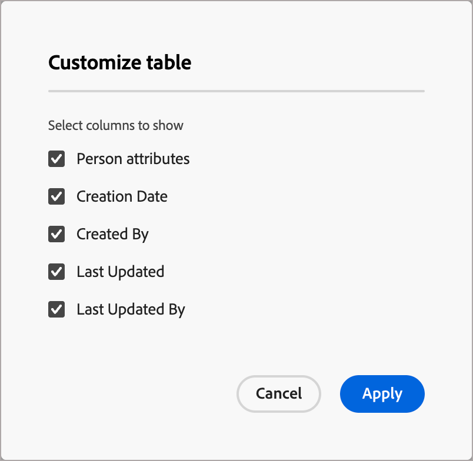

# Persona-Mapping

<!-- not available until GA -->

Personas sind ein wichtiger Aspekt in einem Account-Based Marketing (ABM)-Ansatz, da sie Marketing-Experten dabei helfen, ihre Strategien an die spezifischen Bedürfnisse, Präferenzen und Schmerzpunkte von Personen in Zielkonten anzupassen. Marketing-Experten können für jede Rolle ein detailliertes Profil erstellen, einschließlich Hintergrund, Zuständigkeiten, Probleme und bevorzugter Kommunikationskanäle. Mit diesen Definitionen können Admins in Journey Optimizer B2B Prime Personas anhand von Personenattributen konfigurieren, sodass Personenlisten und Journey optimierte und konsistente Filter verwenden können, mit denen diese Personas erfasst werden.

In Journey Optimizer B2B Prime bietet die Rollenzuordnung eine zusätzliche Funktion, die über die Bedingungen von Rollenvorlagen hinausgeht: Sie können [Personenlisten](../audiences/people-lists.md) und [Personen-Journey](../marketing/person-journeys.md) mithilfe **[!UICONTROL Abgeleiteten]** als Filterkriterium filtern. Eine _abgeleitete Persona_ ist die Persona, die das System für einen Personendatensatz ableitet, indem es seine Attribute mit allen konfigurierten Persona-Definitionen vergleicht.

Definition der Persona und Nutzungsbeschränkungen:

* Es können bis zu 20 Personas in der Liste „Persona _[!UICONTROL Zuordnung“ definiert]_.
* Jede Rolle kann bis zu fünf Attribute in ihre Definition aufnehmen.
* Sie können für alle definierten Personas bis zu zehn verschiedene Personenattribute verwenden.

>[!BEGINSHADEBOX]

**Anwendungsfall: Varianten der Auftragstitel**

Viele Marketing- und Verkaufsteams verwenden Jobtitel als Möglichkeit, verschiedene Rollen innerhalb eines Kontos zu identifizieren. Titel für Kontakte können jedoch inkonsistent sein und zahlreiche Varianten für ähnliche Rollen verwenden. Beim Erstellen von Personenlistenfiltern oder Personen-Journey-Zielgruppenbedingungen kann es erforderlich sein, dass Sie jede mögliche zugehörige Stellenbezeichnung für eine bestimmte Rolle definieren. Sie können diese Definitionen vereinfachen und Personen mit ähnlichen Stellenbezeichnungen unter eine abgeleitete Rolle bringen, die Sie dann ansprechen können, indem Sie nach „Abgeleitete _ist Produktverwaltung“ filtern_ anstatt einzelne Stellenbezeichnungswerte abzugleichen.

>[!ENDSHADEBOX]

## Zugreifen auf die konfigurierten Personas {#access}

1. Wählen Sie in der linken Navigation **[!UICONTROL Administration]** > **[!UICONTROL Konfigurationen]**.

1. Klicken Sie **[!UICONTROL Zwischenbereich auf]** Persona-Zuordnung“, um die Liste der Personas anzuzeigen.

   {width="800" zoomable="yes"}

   Auf dieser Seite können Sie [erstellen](#create-a-persona), [bearbeiten](#edit-a-persona) oder [löschen](#delete-a-persona).

   Die Persona-Zuordnungsliste ist als Tabelle organisiert und zeigt oben die zuletzt aktualisierten Personas an (sortiert nach _[!UICONTROL Letzte Aktualisierung]_). Sie können die angezeigte Tabelle anpassen, indem Sie auf das Symbol _Spalteneinstellungen_ (  ) in der oberen rechten Ecke klicken und die Kontrollkästchen für die Spalten aktivieren oder deaktivieren.

   {width="300"}

1. Um auf die Details einer Rolle zuzugreifen, klicken Sie auf den Namen.

### Standard-Personas

Die _Persona-Zuordnung_ enthält fünf standardmäßige Personas, die anhand des Attributs für die Auftragstitel definiert werden. Sie können jede dieser Standardpersonas entsprechend den Anforderungen Ihres Unternehmens bearbeiten:

| Persona | Stellenbezeichnungen |
| ------- | ---------- |
| CXO / EVP - CXO / Executive Vice President | CEO, CIO, CTO, CMO, CFO, Executive Vice President of Strategy |
| SVP / VP - Senior Vice President / Vice President | SVP Marketing, VP Sales, SVP Operations, VP Product, VP IT |
| Senior Director / Director - Senior Director / Director | Director of Engineering, Senior Director of Product, Director of Finance, Director of Customer Success |
| Senior Manager/Manager - Senior Manager/Manager | Senior Marketing Manager, IT Manager, Operations Manager, Sales Manager, HR Manager |
| Einzelner Mitwirkender - Einzelner Mitwirkender | Kundenbetreuer, Software-Ingenieur, Marketing-Spezialist, Customer Success-Vertreter |
| Analyst - Analyst | Business Analyst, Data Analyst, Market Research Analyst, Financial Analyst, Operations Analyst |
| Entwickler - Entwickler | Frontend-Entwickler, Backend-Entwickler, Full-Stack-Entwickler, Mobile-App-Entwickler, DevOps-Ingenieur |
| Professionelles Personal - Professionelles Personal | HR Specialist, Legal Counsel, Compliance Officer, Project Manager, Procurement Specialist |
| Berater - Berater | Unternehmensberater, IT-Berater, Business Process Consultant, Marketing Consultant |
| Andere - Andere | Branchenspezialist, unabhängiger Berater, freiberuflicher Berater, Fachexperte |

### Filtern von Listen

Um die gewünschte Persona zu finden, geben Sie eine Textzeichenfolge in die Suchleiste ein, um Personas anhand des Namens zuzuordnen.

{width="700" zoomable="yes"}

## Persona erstellen {#create-a-persona}

1. Wählen Sie in der linken Navigation **[!UICONTROL Administration]** > **[!UICONTROL Konfiguration]** aus.

1. Klicken Sie **[!UICONTROL Zwischenbereich auf]** Persona-Zuordnung“.

1. Klicken Sie **[!UICONTROL Persona erstellen]**.

1. Geben Sie einen eindeutigen **[!UICONTROL Namen]** und **[!UICONTROL Beschreibung]** (optional) für die Rolle ein.

   {width="700" zoomable="yes"}

1. Wählen Sie die Attribute aus, die für die Zuordnung der Rolle verwendet werden sollen.

   * Klicken Sie **[!UICONTROL Personenattribute auswählen]**.

   * Aktivieren Sie im Dialogfeld das Kontrollkästchen für jedes Attribut, das Sie zuordnen möchten (maximal fünf).

     Sie können die angezeigte Tabelle anpassen, indem Sie auf das Symbol _Spalteneinstellungen_ (  ) in der oberen rechten Ecke klicken.

     Um die Attributliste nach Namen zu filtern, geben Sie eine Textzeichenfolge in die Suchleiste ein. Sie können auch auf das Symbol _Filter_ (  ) oben links klicken, um die angezeigte Liste nach Typ, _Standard_ oder _Benutzerdefiniert_ zu filtern.

     {width="700" zoomable="yes"}

   * Klicken Sie auf **[!UICONTROL Speichern]**.

     Die ausgewählten Attribute werden im Abschnitt &quot;_[!UICONTROL -Attribute]_ ausgefüllt.

1. Geben Sie für jedes Attribut die kommagetrennten Werte ein, denen Sie für das Attribut entsprechen möchten.

1. Klicken Sie auf **[!UICONTROL Senden]**.

## Persona bearbeiten {#edit-a-persona}

Klicken Sie auf den Personennamen, um auf die Details der Rolle zuzugreifen und sie zu bearbeiten.

Sie können den Namen oder die Beschreibung ändern, Attribute hinzufügen oder die Attributwerte aktualisieren. Klicken Sie **[!UICONTROL Senden]** wenn Ihre Änderungen abgeschlossen sind.

## Persona löschen {#delete-a-persona}

Wenn Sie eine Rolle löschen, wird sie aus der Liste _Persona-Zuordnung_ entfernt und ist nicht mehr als abgeleiteter Personenfilter in Personenlisten oder Journey-Listen verfügbar.

1. Suchen Sie auf _[!UICONTROL Seite]_ Persona-Zuordnung“ die Persona, die Sie löschen möchten.

1. Klicken Sie neben dem Namen auf die Auslassungspunkte (**…**) und wählen Sie **[!UICONTROL Löschen]**.

1. Klicken Sie im Bestätigungsdialog auf **[!UICONTROL Löschen]**.

## Nach abgeleiteter Persona filtern {#derived-persona-filter}

Nach der Konfiguration von Personas leitet Journey Optimizer B2B Prime eine Persona für jeden Personendatensatz ab, indem die Attribute des Datensatzes mit den definierten Persona-Zuordnungen verglichen werden. Sie können das abgeleitete Ergebnis - die _abgeleitete Persona_ - als Filter verwenden, wenn Sie die Audience für eine Personen-Liste oder eine Personen-Journey definieren.

Der Filter Abgeleitete Persona wird im Filterbedienfeld unter der Kategorie **[!UICONTROL Spezielle Filter]** zusammen mit anderen abgeleiteten Attributen wie z. B. der Journey-Mitgliedschaft angezeigt.

### Personenlisten

Wenn Sie Mitglieder zu einer statischen Personenliste hinzufügen oder daraus entfernen oder wenn Sie die Mitgliedschaftsregeln für eine dynamische Personenliste definieren, können Sie nach Abgeleiteter Rolle filtern, um alle Personen anzusprechen, deren Attribute einer bestimmten konfigurierten Rolle entsprechen.

**Statische Liste - Mitglieder hinzufügen**

1. Öffnen Sie die statische Liste und klicken Sie **[!UICONTROL oben]** auf „Personen hinzufügen“.

1. Erweitern Sie im Filterdialogfeld **[!UICONTROL Sonderfilter]** und ziehen Sie **[!UICONTROL Abgeleitete Persona]** auf die Arbeitsfläche.

1. Wählen Sie in der Filterbedingung **[!UICONTROL ist]** und wählen Sie eine oder mehrere Rollen aus der Liste aus.

1. Klicken Sie **[!UICONTROL Fertig]**, um den Filter anzuwenden und passende Personen für die Liste zu qualifizieren.

**Dynamische Liste - Festlegen von Mitgliedschaftsregeln**

1. Öffnen Sie die dynamische Liste und wählen Sie die Registerkarte **[!UICONTROL Regeln]** aus.

1. Klicken Sie **[!UICONTROL Regeln bearbeiten]**.

1. Erweitern Sie im Filterdialogfeld **[!UICONTROL Sonderfilter]** und ziehen Sie **[!UICONTROL Abgeleitete Persona]** auf die Arbeitsfläche.

1. Wählen Sie in der Filterbedingung **[!UICONTROL ist]** und wählen Sie eine oder mehrere Rollen aus der Liste aus.

1. Klicken Sie **[!UICONTROL Fertig]**, um die Regel zu speichern.

   Die Mitgliedschaft wird automatisch aktualisiert, wenn Personendatensätze anhand der Regel ausgewertet werden.

### Personen-Journey

Wenn Sie die Zielgruppe für eine Personen-Journey mit einer Ereignis-Zielgruppe konfigurieren, können Sie die abgeleitete Persona als Personenprofilfilter verwenden, um zu steuern, welche Personen auf die Journey zugreifen.

1. Klicken Sie auf **[!UICONTROL Journey-Arbeitsfläche auf]** Knoten „Zielgruppe Person“.

1. Wählen Sie im Bedienfeld Knoteneigenschaften als Zielgruppentyp **[!UICONTROL Ereigniszielgruppe]** aus.

1. Klicken **[!UICONTROL unter „Personenprofilfilter]** auf **[!UICONTROL Filter hinzufügen]**.

1. Erweitern Sie **[!UICONTROL Spezialfilter]** und ziehen Sie **[!UICONTROL Abgeleitete Persona]** auf die Filterarbeitsfläche.

1. Wählen Sie in der Filterbedingung **[!UICONTROL ist]** und wählen Sie eine oder mehrere Rollen aus der Liste aus.

   Nur Personen, deren abgeleitete Rolle mit den ausgewählten Werten übereinstimmt, können die Journey aufrufen.
