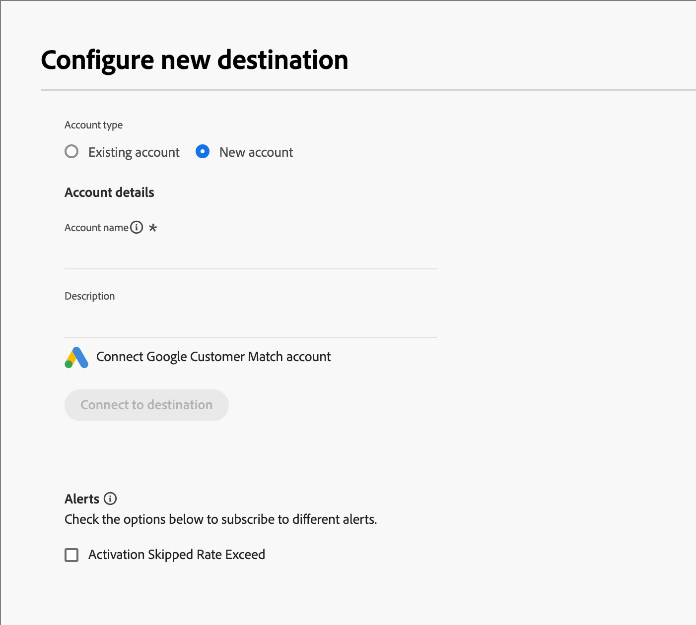

# Ziele

Ziele sind vorgefertigte Integrationen, mit denen Sie Personendaten aus [!DNL Adobe Journey Optimizer B2B Prime] in externe Marketing-Plattformen wie Werbenetzwerke, E-Mail-Dienstanbieter und CRM-Systeme exportieren können. In [!DNL Journey Optimizer B2B Prime] aktivieren Sie [statische Personenlisten](./people-lists.md#static-list) (die aus Marketo Engage-Personendatensätzen bestehen) für Ziele, damit diese Zielgruppen für die Zielgruppenbestimmung und die Interaktion in nachgelagerten Kanälen verfügbar sind.

<!-- 
Does not align w/AEP info for Beta

Activating a static list to a destination follows a three-step process:

1. **Connect** — Authenticate and configure a connection to a destination platform.
1. **Map** — Select the static list and map its people attributes to the fields required by the destination.
1. **Schedule** — Define when and how often the list data is exported to the destination.

Destination activations reflect the membership state of the static list at the time of each synch.

## Destination types {#destination-types}

[!DNL Journey Optimizer B2B Prime] supports the following destination types for activating static people lists:

| Type | Description |
|--- |--- |
| Streaming | Real-time API-based connections that push audience membership updates to the destination as they occur. |
| File-based (batch) | Scheduled exports that deliver audience data as structured files to cloud storage or SFTP locations, which the destination platform then ingests. |

-->

## Mit Ziel verbinden {#connect-destination}

1. Erweitern Sie in der linken Navigation **[!UICONTROL Verbindungen]** und wählen Sie **[!UICONTROL Ziele]** aus.

1. Suchen Sie auf _[!UICONTROL Registerkarte]_ Katalog“ den Connector für den externen Zieltyp.

   >[!TIP]
   >
   >Sie können den Connector schnell finden, indem Sie den Namen, wie z. B. `LinkedIn`, in das Suchfeld eingeben.

   {width="800" zoomable="yes"}

1. Klicken Sie auf der Connector-Karte auf **[!UICONTROL Neues Ziel konfigurieren]**.

1. Wählen Sie **[!UICONTROL Neues Konto]** aus und geben Sie Ihre Kontoanmeldeinformationen ein.

   {width="500"}

1. Klicken Sie **[!UICONTROL Mit Ziel verbinden]**.

   >[!IMPORTANT]
   >
   >Geben Sie an dieser **nicht** &quot;_[!UICONTROL &quot;]_. Es wird nur die Verbindung benötigt.

1. Überprüfen Sie die Einstellungen für Data Governance und Marketing-Aktionen und klicken Sie dann auf **[!UICONTROL Speichern]**.

Das verbundene Ziel wird in der Liste auf der Registerkarte _[!UICONTROL Durchsuchen]_ angezeigt und ist für die Aktivierung statischer Listen verfügbar.

## Aktivieren einer statischen Liste für ein Ziel {#activate}

>[!NOTE]
>
>Nur [statische Personenlisten](./people-lists.md#static-list) können für Ziele in [!DNL Journey Optimizer B2B Prime] aktiviert werden. [Dynamische Listen](./people-lists.md#dynamic-lists) sind nicht für die Zielaktivierung geeignet.

1. Erweitern Sie in der linken Navigation **[!UICONTROL Marketing-Verwaltung]**.

1. Wählen Sie rechts in der **[!UICONTROL Marketing]**-Ressourcenliste **[!UICONTROL Personenlisten]** aus.

   {width="800" zoomable="yes"}

1. Wählen Sie die **[!UICONTROL Statische Listen]** aus.

1. Suchen Sie die statische Liste, die Sie für ein Ziel aktivieren möchten.

1. Klicken Sie auf _Aktivieren_ (  ) neben dem Namen der statischen Liste.

1. Aktivieren Sie das Kontrollkästchen für die konfigurierte Zielverbindung.

   {width="700" zoomable="yes"}

1. Klicken Sie auf **[!UICONTROL Speichern]**.

<!--

This method not working for Beta

1. On the _[!UICONTROL Browse]_ tab, locate the destination you want to use for the activation and click the name to open it.

1. Select the **[!UICONTROL Activation data]** tab.

1. Click **[!UICONTROL Activate people lists]**.

1. Select the static people list you want to export and click **[!UICONTROL Next]**.

1. Map the people list attributes to the required fields of the destination schema and click **[!UICONTROL Next]**.

1. Set the export schedule:

   * **[!UICONTROL Frequency]** — Choose how often the list is exported (for example, daily or weekly).
   * **[!UICONTROL Start date]** — Set when the first export should run.

1. Review the activation summary and click **[!UICONTROL Finish]**.

The activation is created and the static list data is exported to the destination according to the defined schedule.

-->

