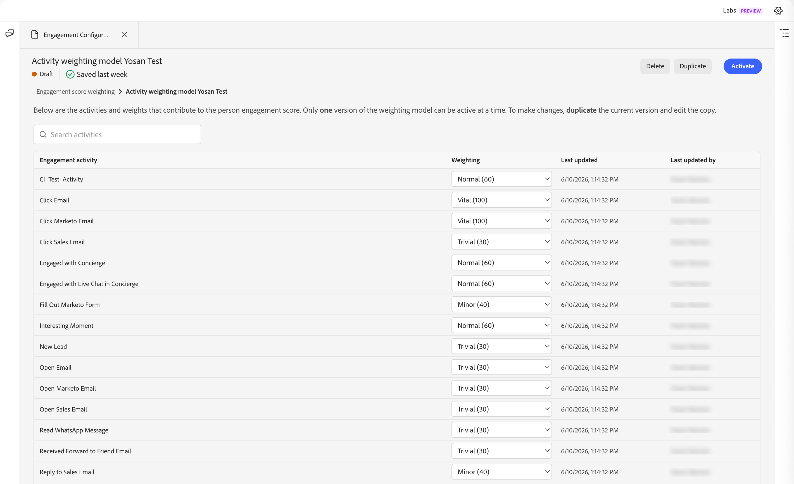

# Personeninteraktionsbewertungen {#engagement-scores}

>[!CONTEXTUALHELP]
>id="ajo-b2b-prime_person_engagement_score"
>title="Personeninteraktionsbewertung"
>abstract="Personeninteraktionsbewertungen spiegeln den Grad der Interaktion für einzelne Leads basierend auf ihren letzten Aktivitäten wider."

Ein Personen-Interaktionswert ist eine Zahl, die den Grad der Interaktion für einen einzelnen Lead widerspiegelt. Die Bewertungen basieren auf den Aktivitäten einer Person, wobei jeder Aktivitätstyp einen gewichteten Wert aufweist. Die Bewertungen werden innerhalb Ihrer Instanz (Mandant) normalisiert, um einen konsistenten Vergleich zu ermöglichen und umsetzbare Einblicke zu ermöglichen.

Die Score-Berechnung wird täglich ausgeführt. Jede interaktionsgewichtete Aktivität, die von der Person innerhalb der letzten 30 Tage durchgeführt wird, trägt zur Bewertung bei. Bei diesem rollierenden 30-tägigen Fenster laufen ältere Aktivitätsereignisse ab und die Bewertungen können im Laufe der Zeit abnehmen (Score-Abfall). Die angezeigten Werte werden gerundet (z. B. wird ein Wert von 75,89999 als 76 angezeigt).

Interaktionsbewertungsdaten finden Sie unter **[!UICONTROL Berichte]**.

{width="800" zoomable="yes"}

Der Personeninteraktionswert ist ein Attribut, das Sie als [Filterbedingung](#engagement-score-filter) in Personenlisten und in Pfadeunterteilungsknoten innerhalb von Journeys von Personen verwenden können.

## Für die Interaktionsbewertung verwendete Aktivitäten {#activities}

Die Interaktionsbewertung basiert nicht auf _Triggern_. Es handelt sich um einen täglichen Prozess, der die Aktivität für alle Leads auswertet und die Bewertungen neu berechnet. Aktivitäten verwenden _Gewichtungen_ um die Bewertung gemäß dem aktiven Gewichtungsmodell zu ermitteln, das bestimmt, wie viel jeder Aktivitätstyp zur Gesamtbewertung beiträgt.

Für jeden Aktivitätstyp gibt es eine tägliche Häufigkeitsbegrenzung von 20. Wenn eine Person dieselbe Aktivität mehr als 20 Mal an einem Tag ausführt, wird die Anzahl für diese Aktivität auf 20 begrenzt.

| Aktivitätsname | Richtung | Beschreibung | Standardgewichtung |
|---|---|---|---|
| Konferenz besuchen | Eingehend | Persönlich absichtliches Interaktionssignal | 60 |
| Auf E-Mail klicken | Eingehend | Aktiver Klick = aussagekräftige Interaktion | 30 |
| Auf Verkaufs-E-Mail klicken | Eingehend | Aktiver Klick auf Verkaufsvermittlung | 30 |
| Klicken Sie auf Marketo Email | Eingehend | Aktiver Klick = aussagekräftige Interaktion | 30 |
| Interagiert mit dem Concierge | Eingehend | Live-Interaktion mit dem Concierge-Tool | 60 |
| Interagiert mit Live-Chat im Concierge | Eingehend | Live-Chat = hohe Kaufabsicht | 60 |
| Marketo-Formular ausfüllen | Eingehend | Formularausfüllung = explizite Lead-Absicht | 40 |
| Interessanter Moment | Eingehend | Hochwertiger verhaltensbezogener Trigger | 60 |
| Neuer Lead | Eingehend | Einstiegspunkt — Baseline-Score | 30 |
| E-Mail öffnen | Eingehend | Passive Interaktion; niedriger als Klick | 30 |
| Marketo-E-Mail öffnen | Eingehend | Passive Interaktion; niedriger als Klick | 30 |
| Verkaufs-E-Mail öffnen | Eingehend | Passive Interaktion; niedriger als Klick | 30 |
| WhatsApp-Nachricht lesen | Eingehend | Passives Lesen; Kanal mit niedrigerem Gewicht | 30 |
| Weiterleitung an E-Mail-Adresse eines Freundes wurde empfangen | Eingehend | Virales Signal; leicht positiv | 30 |
| Antwort auf Verkaufs-E-Mail | Eingehend | Direkte Antwort = starkes Kaufsignal | 40 |
| Anfordern von Kampagne | Eingehend | Selbstinitiierte Aktion - hohe Absicht | 30 |
| Marketo-Kampagne anfordern | Eingehend | Selbstinitiierte Aktion - hohe Absicht | 30 |
| Terminierte Besprechung im Concierge | Eingehend | Konvertierungsaktion mit der höchsten Absicht | 60 |

>[!NOTE]
>
>Aktivitäten mit dem Interaktionswert werden im Aktivitätsprotokoll von Marketo Engage für eine Person aufgezeichnet. Sie können auf dieses Protokoll in der zugehörigen Marketo Engage-Instanz zugreifen. Weitere Informationen finden Sie unter [Suchen des Aktivitätsprotokolls für eine Person](https://experienceleague.adobe.com/de/docs/marketo/using/product-docs/core-marketo-concepts/smart-lists-and-static-lists/managing-people-in-smart-lists/locate-the-activity-log-for-a-person){target="_blank"} in der Dokumentation zu Marketo Engage.

## Bewertungslogik {#scoring-logic}

Das System wendet einen mehrstufigen Normalisierungsprozess an, um eine konsistente Bewertung über alle Leads in Ihrer Instanz hinweg zu erzielen.

1. Identifizieren Sie alle _Interaktionsgewichteten_ Aktivitätstypen mit zugehörigem Gewicht und täglichem Kontingent, wie E-Mail-Klicks, Ausfüllen von Formularen und Anwesenheitsereignisse.

1. Identifizieren Sie alle _Interaktionsgewichteten_ Aktionen, die von der Person innerhalb des Lookback-Fensters ausgeführt werden, das derzeit 30 Tage beträgt.

1. Normalisieren Sie die Gewichtungen der Aktivitätstypen für alle in _1 identifizierten (_) Aktivitätstypen und ignorieren Sie dabei Typen, die nicht im Lookback-Fenster auftraten.

   Dieser Schritt verwendet _Min-Max-Normalisierung_ und reduziert die künstliche Verdünnung der Aktivitätstypgewichtung für Instanzen, die nicht die meisten Aktivitätstypen verwenden.

1. Wenden Sie die tägliche Häufigkeitsbegrenzung pro Person und Aktivitätstyp an.

   Dieser Schritt reduziert den Einfluss von Aktivitäten mit hohem Volumen und niedrigerem Wert auf die Gesamtbewertung.

1. Berechnen Sie den unformatierten Interaktionswert, indem Sie die tägliche Aktivität pro Aktivitätstyp addieren, sie mit der zugehörigen Gewichtung multiplizieren und dann im Lookback-Fenster die Ergebnisse für alle Tage addieren.

1. Wenden Sie eine _Leistungstransformation_ (Quadratwurzel) an, um die Varianz zu stabilisieren, indem Sie die Auswirkungen von Ausreißern reduzieren.

   Diese Transformation reduziert die Verzerrung und macht die Muster in den Daten linearer.

1. Wenden Sie eine _Skalierte Normalisierung_ an, um sicherzustellen, dass die Bewertungen den gesamten Bereich von 0 bis 100 verwenden.

## Nach Interaktionswert filtern {#engagement-score-filter}

Sie können Personeninteraktionswerte als Filter beim Definieren der Zielgruppe für eine Personenliste oder zum Segmentieren in einer Personen-Journey verwenden.

Der _[!UICONTROL Wert der Personeninteraktion]_ Filter wird im Filterbedienfeld unter der Kategorie **[!UICONTROL Personenattribute]** angezeigt.

### Personenlisten {#people-lists}

Wenn Sie Mitglieder zu einer [statischen Personenliste](./people-lists.md#static-list) hinzufügen oder daraus entfernen oder wenn Sie die Mitgliedschaftsregeln für eine [dynamische Personenliste](./people-lists.md#dynamic-lists) definieren, können Sie nach dem Interaktionswert der Person filtern, um alle Personen anzusprechen, deren Attribute Ihren Scoring-Kriterien entsprechen.

{width="700" zoomable="yes"}

**Statische Liste - Mitglieder hinzufügen**

1. Öffnen Sie die statische Liste und klicken Sie **[!UICONTROL oben]** auf „Personen hinzufügen“.

1. Erweitern Sie im Filterdialogfeld **[!UICONTROL Personenattribute]** und ziehen Sie **[!UICONTROL Personeninteraktionswert]** auf die Arbeitsfläche.

1. Wählen Sie in der Filterbedingung einen Operator aus und geben Sie einen Wert ein, der den Werten entspricht, die Sie ansprechen möchten.

1. Klicken Sie **[!UICONTROL Fertig]**, um den Filter anzuwenden und passende Personen für die Liste zu qualifizieren.

**Dynamische Liste - Festlegen von Mitgliedschaftsregeln**

1. Öffnen Sie die dynamische Liste und wählen Sie die Registerkarte **[!UICONTROL Regeln]** aus.

1. Klicken Sie **[!UICONTROL Regeln bearbeiten]**.

1. Erweitern Sie im Filterdialogfeld **[!UICONTROL Personenattribute]** und ziehen Sie **[!UICONTROL Personeninteraktionswert]** auf die Arbeitsfläche.

1. Wählen Sie in der Filterbedingung einen Operator aus und geben Sie einen Wert ein, der den Werten entspricht, die Sie ansprechen möchten.

1. Klicken Sie **[!UICONTROL Fertig]**, um die Regel zu speichern.

   Die Mitgliedschaft wird automatisch aktualisiert, wenn Personendatensätze anhand der Regel ausgewertet werden.

### Personen-Journey {#person-journeys}

Wenn Sie die Segmentierung für eine Personen-Journey in einem [_Aufspaltungs-Pfade_-Knoten](../marketing/split-merge-paths-nodes.md) konfigurieren, können Sie den Personeninteraktionswert als Personenprofilfilter verwenden, um zu steuern, welche Personen in den Journey-Pfad eintreten.

{width="700" zoomable="yes"}

1. Klicken Sie auf **[!UICONTROL Arbeitsfläche Journey auf]** Knoten „Pfade aufteilen“.

1. Klicken Sie im Bedienfeld Knoteneigenschaften rechts auf **[!UICONTROL Bedingung anwenden]** oder **[!UICONTROL Bedingung bearbeiten]** für einen Pfad.

1. Erweitern Sie im Filterdialogfeld **[!UICONTROL Personenattribute]** und ziehen Sie **[!UICONTROL Personeninteraktionswert]** auf die Arbeitsfläche.

1. Wählen Sie in der Filterbedingung einen Operator aus und geben Sie einen Wert ein, der den Werten entspricht, die Sie ansprechen möchten.

1. Klicken Sie **[!UICONTROL Fertig]**, um den Filter für den Pfad zu speichern.

## Konfigurieren der Gewichtung der Interaktionswerte {#configure-weighting}

In [!DNL Journey Optimizer B2B Prime] können Sie die Gewichtung der Interaktionswerte direkt über die [KI-Assistenten-Chat-Oberfläche“ &#x200B;](../agents/chat-interface.md).

Hintergrundinformationen zu Interaktionsbewertungsmodellen, Gewichtungsbändern und Aktivitätsgewichten finden Sie unter [Konfigurieren der benutzerdefinierten Interaktionsbewertungsgewichtung](https://experienceleague.adobe.com/en/docs/journey-optimizer-b2b/user/admin/configurations/engagement-score-weighting).

1. Öffnen Sie das **[!UICONTROL KI]** Assistent) Chat-Panel auf der linken Bildschirmseite (Chat-Symbol).

1. Geben Sie im Eingabefeld Chat den Befehl für einen Schrägstrich ein, gefolgt von Ihrer Absicht. Beispiel:

   `/engagement-configuration Configure activity weights for the person engagement score model`

   Während der Eingabe von `/` zeigt der KI-Assistent eine Liste der verfügbaren Schrägstrichbefehle und Fähigkeiten an. Der Befehl für die Interaktionskonfiguration wird direkt zur Seite mit der Gewichtung der Interaktionsbewertung weitergeleitet.

   {width="700" zoomable="yes"}

1. Klicken Sie auf _Senden_ (Nach-oben-Taste) oder drücken Sie die Eingabetaste.

   Der KI-Assistent verarbeitet die Anfrage und öffnet **[!UICONTROL Registerkarte]** Interaktionskonfiguration“ im Hauptinhaltsbereich neben dem Chat-Bedienfeld.

### Überprüfen der Gewichtungsliste für den Interaktionswert {#review-weighting-list}

Nach dem Öffnen der Registerkarte zeigt _Seite &quot;_&quot; alle vorhandenen Bewertungsmodelle in einer Tabelle mit den folgenden Spalten an:

| Spalte | Beschreibung |
|---|---|
| **Name** | Der Modellname (klicken Sie, um Details zu öffnen) |
| **Status** | Aktiv, Entwurf oder archiviert |
| **Erstellungsdatum** | Zeitpunkt der Modellerstellung |
| **Zuletzt aktualisiert** | Zeitstempel des letzten Speichervorgangs |
| **Zuletzt aktualisiert von** | Benutzer, der zuletzt Änderungen gespeichert hat |

{width="700" zoomable="yes"}

Es kann immer nur **ein** Modell aktiv sein. Das derzeit aktive Modell wird auf alle Interaktionsbewertungsberechnungen angewendet.

### Scoring-Modell öffnen {#open-scoring-model}

Klicken Sie auf den Namen eines beliebigen Modells in der Liste, um die zugehörige Detailseite zu öffnen.

Die Detailseite zeigt Folgendes an:

* Modellname und aktueller Status (_Aktiv_, _Entwurf_ oder _Archiviert_)
* Ein _Suchen_-Feld zum Filtern der Aktivitätsliste
* Die vollständige Aktivitätstabelle mit den Spalten **[!UICONTROL Interaktionsaktivität]**, **[!UICONTROL Gewichtung]**, **[!UICONTROL Zuletzt aktualisiert]** und **[!UICONTROL Zuletzt aktualisiert von]**

{width="700" zoomable="yes"}

Bei archivierten Modellen werden **[!UICONTROL Löschen]** und **[!UICONTROL Duplizieren]** oben rechts angezeigt. Für Entwurfsmodelle wird **[!UICONTROL Aktivieren]** ebenfalls angezeigt.

### Bearbeiten der Aktivitätsgewichte für ein Entwurfsmodell {#edit-activity-weights}

Entwurfsmodelle verfügen für jede Interaktionsaktivität über _[!UICONTROL Optionen (]_). So ändern Sie eine Gewichtung:

1. Klicken Sie auf den Namen des Entwurfsmodells in der Liste.

1. Suchen Sie in der Aktivitätstabelle die Interaktionsaktivität, die Sie aktualisieren möchten.

1. Klicken Sie auf **[!UICONTROL Pfeil]** Gewichtung“ nach unten für diese Aktivität und wählen Sie das entsprechende Gewichtungsband aus (z. B. `Important`, `Trivial`, `Minor`, `Normal` und `Vital`).

   Änderungen werden automatisch gespeichert - es ist keine explizite Speicheraktion erforderlich.

>[!NOTE]
>
>Um ein aktives oder archiviertes Modell zu bearbeiten, können Sie es duplizieren, um ein neues Entwurfsmodell zu erstellen, und dann das Duplikat bearbeiten und aktivieren. Ein aktives Modell kann nicht im Kontext bearbeitet werden.

### Aktivieren eines Entwurfsmodells {#activate-weighting-model}

Beim Aktivieren eines Entwurfsmodells wird das zuvor aktive Modell automatisch archiviert. Das neu aktivierte Modell gilt dann für alle zukünftigen Interaktionsbewertungsberechnungen. Wenn Ihr Entwurfsmodell mit den richtigen Aktivitätsgewichten konfiguriert wird:

1. Klicken Sie auf den Namen des Entwurfsmodells in der Liste.

1. Klicken **[!UICONTROL oben]** auf „Aktivieren“.

1. Bestätigen Sie dies im Dialogfeld.

