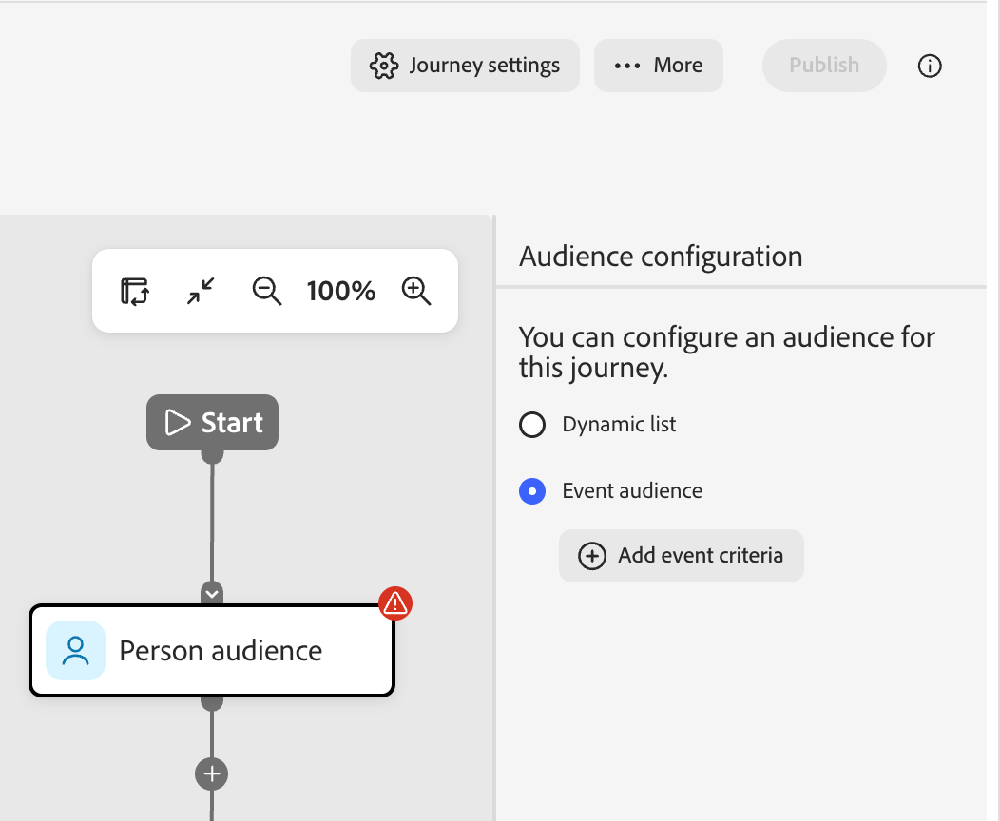
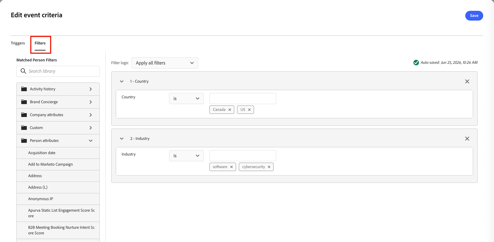

# Ereignisbasierte Zielgruppen

Mit _ereignisbasierten Zielgruppen_ können Sie [!DNL Adobe Journey Optimizer B2B Prime] Zielgruppenmitglieder nahezu in Echtzeit zu einer Live-[Personen-Journey](../marketing/person-journeys.md) hinzufügen, wenn eine [!DNL Marketo Engage] stattfindet. Sie konfigurieren ereignisbasierte Zielgruppen auf dem Zielgruppenknoten der Journey-Arbeitsfläche:

* Wählen Sie eine oder mehrere [!DNL Marketo Engage] Aktivitäten (Standard oder benutzerdefiniert) als qualifizierende Ereignisse aus.
* Fügen Sie optional Personenprofilfilter hinzu (z. B. Branche, Region oder Lebenszyklusphase), um einzugrenzen, welche Personen eintreten können.
* Definieren Sie optional Aktivitätsattribut-Einschränkungen (z. B. ein bestimmtes Formular, eine bestimmte URL oder ein bestimmtes Programm), um einzugrenzen, welche Vorkommen jeder Aktivität qualifiziert sind.

Wenn eine qualifizierte Aktivität für einen Lead [!DNL Marketo Engage] angemeldet und in [!DNL Adobe Journey Optimizer B2B Prime] repliziert wird, wertet das System den entsprechenden Personendatensatz anhand Ihrer konfigurierten Filter und Begrenzungen aus. Wenn die Bedingungen erfüllt sind, gelangt die Person sofort über den Zielgruppenknoten auf die Journey.

_So definieren Sie eine ereignisbasierte Zielgruppe für eine Personen-Journey :_

1. Wählen Sie den [_Zielgruppe Person_-Knoten](../marketing/person-audience-node.md).

1. Wählen Sie rechts in den Knoteneigenschaften als Eintragstyp **[!UICONTROL Ereigniszielgruppe]** aus.

   {width="400"}

1. Klicken Sie **[!UICONTROL Ereigniskriterien hinzufügen]**.

1. Fügen Sie _[!UICONTROL Dialogfeld Ereigniskriterien bearbeiten]_ eine oder mehrere [!DNL Marketo Engage] Aktivitäten als qualifizierte Ereignisse hinzu, z. B.:

   * _Teilnahme am Webinar_
   * _E-Mail wird zugestellt_
   * _Klicks auf Link in E-Mail_

   >[!NOTE]
   >
   >Sie können auch benutzerdefinierte Aktivitäten auswählen, die in der zugehörigen [!DNL Marketo Engage]-Instanz definiert sind.

   Legen Sie für jede Aktivität den passenden Operator und die entsprechenden Werte fest.

   {width="700" zoomable="yes"}

   Eine Person qualifiziert sich für die Journey, wenn eine dieser konfigurierten Aktivitäten für diesen Lead protokolliert wird.

1. (Optional) Um eine Ereignis- und Filterkombination für die Zielgruppen-Qualifizierung zu verwenden, fügen Sie Filter auf Personenebene hinzu.

   * Wählen Sie die **[!UICONTROL Filter]** aus.
   * Ziehen Sie jeden Filter und legen Sie die entsprechenden Kriterien fest.

   {width="700" zoomable="yes"}

   Wenn Sie Filter hinzufügen, muss die Person mindestens eine konfigurierte Aktivitätsbedingung und die konfigurierten Filter erfüllen.

1. Klicken Sie auf **[!UICONTROL Speichern]**.

