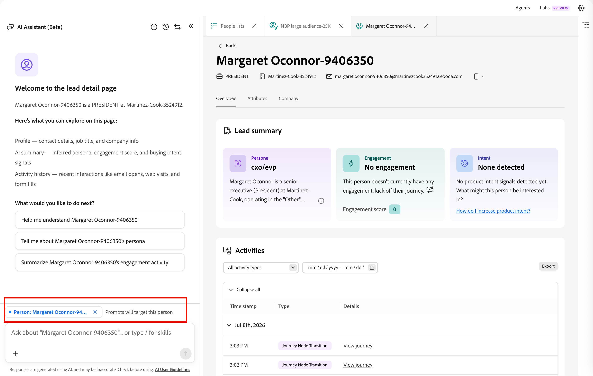

# Personendetails

Wenn Sie [!DNL Adobe Journey Optimizer B2B Prime] auf der Registerkarte _[!UICONTROL Mitglieder]_ einer (Personenliste[&#128279;](./people-lists.md) auf den Namen einer Person klicken,  die Seite mit den Personendetails mit einer konsolidierten Ansicht dieser Person geöffnet. Diese Seite bietet:

* Eine von KI generierte Rolle, Interaktion und Absichtserklärung
* Vollständiger Aktivitätsverlauf
* Profil- und Firmenattribute
* Die Chat-Oberfläche des KI-Assistenten beantwortet Fragen zur Person.

## Personendetails öffnen {#open-person-details}

1. Erweitern Sie in der linken Navigation **[!UICONTROL Marketing-Verwaltung]**.

1. Wählen Sie rechts in der **[!UICONTROL Marketing]**-Ressourcenliste **[!UICONTROL Personenlisten]** aus.

1. Öffnen Sie eine dynamische oder statische Liste.

1. Klicken Sie auf **[!UICONTROL Name]** einer Person in der Liste.

   {width="600" zoomable="yes"}

Die Seite mit Personendetails wird mit drei Registerkarten geöffnet **[!UICONTROL „Übersicht]**, **[!UICONTROL Attribute]** und **[!UICONTROL Unternehmen]**.

## Seitenkopf {#page-header}

In der Kopfzeile wird der Name der Person als Seitentitel zusammen mit einer Schnellansichts-Kontaktleiste angezeigt:

* Stellenbezeichnung
* Unternehmen
* E-Mail-Adresse
* Telefonnummer

Klicken Sie **[!UICONTROL Zurück]**, um zur Ursprungsliste zurückzukehren.

## Registerkarte „Überblick“ {#overview-tab}

Die **[!UICONTROL Übersicht]** enthält die Karten mit der Lead-Zusammenfassung und die Zeitleiste der Aktivität.

{width="700" zoomable="yes"}

### Lead-Zusammenfassung {#lead-summary}

Drei Karten geben eine KI-generierte Bewertung der Person ab:

| Karte | Inhalt |
|---|---|
| **[!UICONTROL Persona]** | Die [abgeleitete &#x200B;](./personas.md) für die Person sowie eine kurze Erzählung, die ihre Rolle, ihr Unternehmen und ihre Branche beschreibt. Klicken Sie auf das Infosymbol, um weitere Details anzuzeigen. |
| **[!UICONTROL Interaktion]** | Der [Interaktionswert für Personen](./engagement-scores.md) der Trend (z. B _„steigend_) und die Ebene (_niedrig_, _Medium_, _hoch_). |
| **[!UICONTROL Intent]** | Erkannte Kaufabsicht oder _Keine erkannt_ mit kontextueller Anleitung und einem Link, der Ihnen hilft, die Produktabsicht zu erhöhen. |

### Aktivitäten {#activities}

Unter der Lead-Zusammenfassung **[!UICONTROL das Bedienfeld]** Aktivitäten“ den vollständigen Interaktionsverlauf der Person nach Datum gruppiert. Jede Datumgruppe ist erweiterbar und ausblendbar, und jede Zeile zeigt einen Zeitstempel, ein Aktivitätstyp-Tag (z. B. _[!UICONTROL Datenwert ändern]_, _[!UICONTROL Zu Liste hinzufügen]_, _[!UICONTROL Person zum Journey hinzufügen]_ oder _[!UICONTROL Journey-Knotenübergang]_) und eine unmissverständliche Beschreibung der Geschehnisse. Gegebenenfalls enthält die Beschreibung einen Link wie **[!UICONTROL Liste anzeigen]** oder **[!UICONTROL Journey anzeigen]**, um zum zugehörigen Objekt zu springen.

Verwenden Sie die Bedienfeld-Steuerelemente, um mit der Zeitleiste zu arbeiten:

* **Aktivitätstyp** - Filtern Sie die Zeitleiste nach einem bestimmten Aktivitätstyp, z. B. E-Mail-Sendungen, Webinar-Interaktionen oder Listen- und Journey-Änderungen.
* **Datumsbereich** - Begrenzt die Zeitleiste mithilfe des Calendar-Steuerelements auf einen bestimmten Datumsbereich.
* **[!UICONTROL Export]** - Exportieren Sie die sichtbaren Aktivitätsdaten.
* **[!UICONTROL Alle reduzieren]/[!UICONTROL Alle erweitern]** - Schaltet jede Datumsgruppierung ein oder aus, die gleichzeitig geöffnet oder geschlossen ist.

## Registerkarte „Attribute“ {#attributes-tab}

{width="700" zoomable="yes"}

Auf **[!UICONTROL Registerkarte]** Attribute“ werden die gespeicherten Profilfelder der Person als Titel-/Werteliste angezeigt:

* Vorname
* Zweiter Vorname
* Last name
* E-Mail
* Titel
* Telefon
* Adresse
* Stadt
* Bundesland
* Land
* Unternehmen
* Erstellt
* Zuletzt aktualisiert

## Registerkarte „Unternehmen“ {#company-tab}

{width="700" zoomable="yes"}

Auf **[!UICONTROL Registerkarte]** Unternehmen“ werden firmografische Daten angezeigt, die mit dem Unternehmen der Person verknüpft sind:

* Unternehmen
* Branche
* Jahresumsatz
* Abrechnungsstraße
* Rechnungsort
* Abrechnungsstatus
* Postleitzahl der Rechnung
* Rechnungsland

Felder ohne verfügbare Daten werden als Bindestriche angezeigt.

## Fragen des KI-Assistenten nach einer Person {#ask-ai-assistant}

Öffnen Sie das Symbol **[!UICONTROL KI]** Assistent-Bedienfeld“ oben auf der Seite, um Hilfe zum aktuellen Personendatensatz zu erhalten. Das Bedienfeld wird für diese Person geöffnet - ein Chip unterhalb des Nachrichten-Threads (z. B. _person: [person name]_) bestätigt, welcher Datensatz Ihre Eingabeaufforderungen als Ziel hat.

{width="700" zoomable="yes"}

### Mit vorgeschlagener Eingabeaufforderung starten {#suggested-prompts}

Wenn Sie das Bedienfeld über eine Seite mit Personendetails öffnen, begrüßt Sie der KI-Assistent mit einer kontextuellen Begrüßungsnachricht und vorgeschlagenen Standardaufforderungen, z. B.:

* _Helfen Sie mir, den [Personennamen“ zu]_
* _Erzählen Sie mir [ Persona ]Personennamen_
* _Zusammenfassen [ Interaktionsaktivität ]Personennamens_

Klicken Sie auf eine vorgeschlagene Eingabeaufforderung oder geben Sie Ihre eigene Frage in das Eingabefeld am unteren Rand des Bedienfelds ein.

### Überprüfen der Antwort {#review-response}

Wenn Sie eine Eingabeaufforderung auswählen, wird ein mehrstufiger [Qualifikation](../agents/skills.md) ausgeführt, der als sequenzielle Statusschritte angezeigt wird (z. B. _Person nach ID_ und _Person-Story abrufen_), während der KI-Assistent die Antwort zusammenstellt. Die Antwort ist eine strukturierte Zusammenfassung, die Profildetails, den Interaktionsverlauf und die E-Mail-Leistung der Person enthalten kann.

Verwenden Sie das Steuerelement „Daumen hoch“/„Daumen runter“, um die Antwort zu bewerten. Wie bei allen Ausgaben des KI-Assistenten sollten Sie die Antwort überprüfen, bevor Sie sie verwenden. Weitere Informationen finden Sie in den [Benutzerrichtlinien für die generative KI von Adobe](https://www.adobe.com/legal/licenses-terms/adobe-dx-gen-ai-user-guidelines.html){target="_blank"}.
