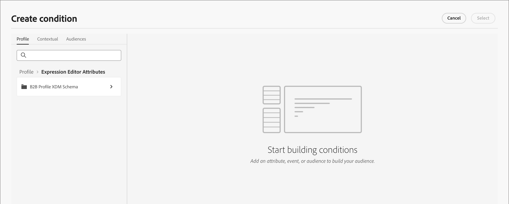
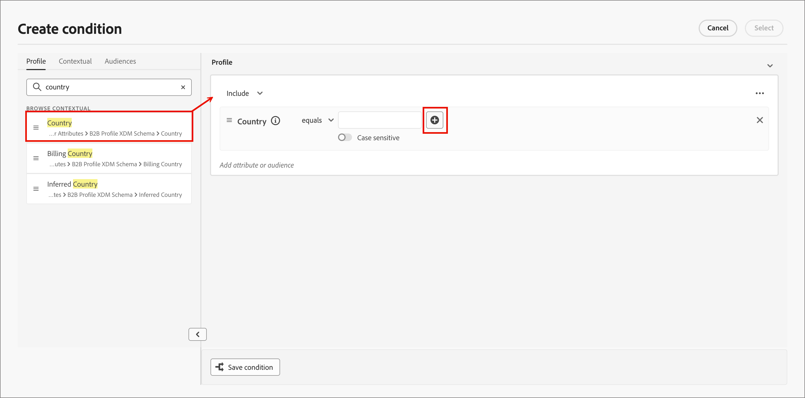

# Bedingte Inhalte

Bedingte Inhalte ermöglichen es Ihnen, E-Mail- und Fragmentinhalte auf der Grundlage von bedingten Regeln anzupassen. Diese Regeln werden mithilfe von Profilattributen oder kontextuellen Ereignissen definiert. Sie können im Regel-Builder bedingte Regeln erstellen und diese zur Wiederverwendung in Ihren Personen-Journey speichern.

Um Ihren Fragmenten und E-Mail-Nachrichten bedingte Inhalte hinzuzufügen, können Sie mit [!DNL Journey Optimizer B2B Prime] bedingte Regeln anwenden, die in der Bibliothek _Bedingungen_ gespeichert sind. Wenden Sie beim Erstellen (E-Mail[Inhalt oder Fragment](./email-authoring.md) bedingte Regeln [ visuellen Design-Bereich ](./fragment-authoring.md).

## Hinzufügen bedingter Inhalte {#add-conditional-content}

>[!CONTEXTUALHELP]
>id="ajo-b2b-prime_conditional_content"
>title="Bedingte Inhalte"
>abstract="Verwenden Sie Regeln mit Bedingungen, um mehrere Varianten einer Content-Komponente zu erstellen. Wenn beim Senden der Nachricht keine der Bedingungen erfüllt ist, wird der Content der Standardvariante angezeigt."

>[!CONTEXTUALHELP]
>id="ajo-b2b-prime_conditional_rule_select"
>title="Bedingte Inhalte"
>abstract="Verwenden Sie eine in der Bibliothek gespeicherte Regel mit Bedingung oder erstellen Sie eine neue."

Verwenden Sie beim Erstellen [ (](./fragment-authoring.md)) oder [E-Mail](./email-authoring.md) im visuellen Design-Bereich bedingte Regeln, um mehrere Varianten für eine Inhaltskomponente zu definieren.

1. Wählen Sie eine Inhaltskomponente aus und klicken Sie auf das Symbol **[!UICONTROL Bedingten Inhalt aktivieren]** in der Komponenten-Symbolleiste.

   Siehe [Inhaltskomponenten-Symbolleisten](./content-components.md#content-component-toolbars).

   Die Komponente ist orange umrandet, um anzugeben, dass sie als bedingte Komponente aktiviert ist. Der Bereich **[!UICONTROL Bedingter Inhalt]** wird auf der linken Seite mit der _Standardvariante_ und _Variante - 1_ angezeigt.

   {width="700" zoomable="yes"}

   Der von Ihnen ausgewählte und aktivierte Originalinhalt ist die Standardeinstellung und wird angewendet, wenn keine der bedingten Regeln für eine der von Ihnen definierten Varianten erfüllt ist.

   In diesem Bereich können Sie mithilfe von bedingten Regeln mehrere Varianten für die ausgewählte Inhaltskomponente definieren.

1. Bewegen Sie den Mauszeiger über die erste Variante (_Variante - 1_) und klicken Sie auf das _Bedingung auswählen_-Symbol (  ).

   {width="700" zoomable="yes"}

   Das _[!UICONTROL Bedingung auswählen]_ Dialogfeld wird geöffnet und die Bedingungsbibliothek wird angezeigt.

   Wenn Sie Details zu einer Bedingung anzeigen möchten, um sicherzustellen, dass sie wirklich das ist, was Sie möchten, klicken Sie auf das _Mehr Menü_-Symbol (**…**) und wählen Sie **[!UICONTROL Info anzeigen]**.

   {width="600" zoomable="yes"}

   Wenn die benötigte Bedingung nicht vorhanden ist, erstellen [ eine bedingte Regel, ](#create-conditional-rule) Sie auf **[!UICONTROL Neu erstellen]**.

1. Wählen Sie die bedingte Regel aus und klicken Sie auf **[!UICONTROL Auswählen]**, um sie mit der Variante zu verknüpfen.

<!-- 

   You can review the associated condition by clicking the _More menu_ icon (**...**) for the variant and choosing **[!UICONTROL View condition]**.

   {width="600" zoomable="yes"}

   Click X at the top right to close the popup.

   {width="500"}

   -->

1. Um die Lesbarkeit zu verbessern, benennen Sie die Variante um, indem Sie auf _Mehr Menü_ Symbol (**…**) klicken für die Variante auf und wählen Sie **[!UICONTROL Umbenennen]**.

   Geben Sie einen aussagekräftigen Namen für die Variante ein, der Ihnen bei der Identifizierung der Variante und ihrer Absicht hilft.

   {width="600" zoomable="yes"}

1. Wenn die Variante im linken Bereich ausgewählt ist, ändern Sie die Komponente, um zu ändern, wie sie in der Nachricht angezeigt wird, wenn die Bedingung erfüllt ist.

   In diesem Beispiel verwendet die Variante für die Textkomponente eine andere Beschreibung, die auf der Region des Empfängers basiert.

   {width="600" zoomable="yes"}

1. Definieren Sie bei Bedarf eine andere Variante, indem Sie auf **[!UICONTROL Variante hinzufügen]** klicken.

   Wiederholen Sie die Schritte 2-5, um eine Bedingung auszuwählen, die Variante umzubenennen und die Komponente für die Variante zu ändern.

   Sie können so viele Varianten hinzufügen, wie für die Inhaltskomponente erforderlich sind. Sie können die ausgewählte Variante jederzeit im linken Bereich ändern, um zu überprüfen, wie die Inhaltskomponente für die Bedingung angezeigt wird.

   >[!IMPORTANT]
   >
   >Bedingte Inhalte werden anhand der zugehörigen Regeln in der Reihenfolge ausgewertet, in der die Varianten aufgelistet sind. Die erste Variante mit einer Bedingung, die als „true“ ausgewertet wird, wird für die Komponente verwendet.
   >
   >Wenn keine der definierten Variantenbedingungen beim Senden der Nachricht als „true“ ausgewertet wird, wird die Inhaltskomponente gemäß der **[!UICONTROL Standardvariante]** angezeigt.

1. Um eine Variante zu löschen, klicken Sie auf _Mehr Menü_ Symbol (**…**) für die Variante und wählen Sie **[!UICONTROL Löschen]**.

   Klicken **[!UICONTROL im]** auf „Löschen“.

## Bedingte Regeln {#conditional-rules}

Bedingte Regeln sind ein Satz bedingter Ausdrücke, die als „true“ oder „false“ ausgewertet werden können. Verwenden Sie diese Regeln, um basierend auf verschiedenen Filtern wie Profilattributen oder kontextuellen Ereignissen zu bestimmen, welche Inhaltsvariante in einer Nachricht angezeigt werden soll.

Die Regeln werden in der Bedingungsbibliothek gespeichert, wo sie für Ihre Organisation zur Wiederverwendung in E-Mail- und Fragmentinhalten verfügbar sind.

<!--
M1.5 info -- out of date?

### Condition filters {#condition-filters}

| Condition type | Filters | Description |
| -------------- | ------- | ----------- |
| **Account** | Account Attributes | Attributes from the account profile, including: <li>Annual revenue</li><li>City</li><li>Country</li><li>Employee size</li><li>Industry</li><li>Name</li><li>SIC code</li><li>State</li> |
| | [!UICONTROL Special filters] > [!UICONTROL Has Buying Group] | The account does or does not have members of buying groups. The filter can also be evaluated against one or more of the following criteria: <li>Solution Interest</li><li>Buying Group status</li><li>Completeness Score</li><li>Engagement Score</li> |
| **Person** | [!UICONTROL Activity history] > [!UICONTROL Email] | Email activities associated with the journey: <li>[!UICONTROL Clicked link in email]</li><li>Opened Email</li><li>Was delivered email</li><li>Was sent email</li> These conditions are evaluated using a selected email message from earlier in the journey. |
| | [!UICONTROL Person Attributes] | Attributes from the person profile, including: <li>City</li><li>Country</li><li>Date of birth</li><li>Email address</li><li>Email invalid</li><li>Email suspended</li><li>First name</li><li>Inferred state region</li><li>Job title</li><li>Last name</li><li>Mobile phone number</li><li>Phone number</li><li>Postal code</li><li>State</li><li>Unsubscribed</li><li>Unsubscribed reason</li> |
| | [!UICONTROL Special filters] > [!UICONTROL Member of Buying Group] | The person is or is not a buying group member evaluated against one or more of the following criteria: <li>Solution Interest</li><li>Buying Group status</li><li>Completeness Score</li><li>Engagement Score</li><li>Is Removed</li><li>Role</li> |
-->

### Erstellen einer bedingten Regel {#create-conditional-rule}

>[!CONTEXTUALHELP]
>id="ajo-b2b-prime_conditions_rule_editor"
>title="Erstellen einer Bedingung"
>abstract="Kombinieren Sie Attribute und kontextuelle Ereignisse, um Regeln zu erstellen, die bestimmen, welche Content-Variante in E-Mail-Nachrichten angezeigt werden soll."

Greifen Sie auf den Builder für bedingte Regeln über den Design-Bereich zu, wenn Sie eine Bedingung für eine Komponentenvariante auswählen.

1. Klicken Sie im _[!UICONTROL Bedingung auswählen]_ auf **[!UICONTROL Neu erstellen]**.

   {width="700" zoomable="yes"}

   Diese Aktion öffnet das Dialogfeld _[!UICONTROL Bedingung erstellen]_. Verwenden Sie die Dialogfeldwerkzeuge, um Attribute in der Arbeitsfläche zu kombinieren (ähnlich wie beim Erstellen von Segmenten in Experience Platform). Die Filterattribute sind in drei Registerkarten unterteilt:

   * **[!UICONTROL Profil]** - Das XDM-Schema des B2B-Profils listet alle Profilattribute auf, die mit dem in Adobe Experience Platform definierten Schema des Experience-Datenmodells (XDM) verknüpft sind.

   * **[!UICONTROL Kontextuell]** - Wenn die Nachricht auf einer Journey verwendet wird, stehen auf dieser Registerkarte kontextuelle Journey-Felder zur Verfügung.

   * **[!UICONTROL Zielgruppen]** - Listet alle Zielgruppen auf, die aus Segmentdefinitionen generiert wurden, die im Segmentierungs-Service von Adobe Experience Platform erstellt wurden.

   {width="700" zoomable="yes"}

1. Erstellen Sie die Regel mit Bedingung entsprechend Ihren Anforderungen.

   Ziehen Sie für jeden Filter, den Sie in die Regel aufnehmen möchten, das Element per Drag-and-Drop auf die Arbeitsfläche der Regel. Erweitern Sie den Filter und vervollständigen Sie den Ausdruck.

   {width="700" zoomable="yes"}

   Ziehen Sie bei Bedarf zusätzliche Filter per Drag-and-Drop hinüber.

   Wenn Sie mehr als einen Filter einbeziehen, können Sie die Filterlogikeinstellung entsprechend der gewünschten Anwendung der Filter umschalten:

   * **[!UICONTROL Und]** - Die Regel wird als „true“ ausgewertet, wenn **alle** Filter „true“ sind.
   * **[!UICONTROL Oder]** - Die Regel wird als „true **ausgewertet, wenn einer** Filter „true“ ist.

   {width="700" zoomable="yes"}

1. Klicken Sie **[!UICONTROL Auswählen]**, um die benutzerdefinierte Regel für die Bedingung zu verwenden.

   Wenn Sie die Regel zur Wiederverwendung verfügbar machen möchten, können Sie sie der Bibliothek hinzufügen.

### Hinzufügen einer Bedingung zur Bibliothek {#add-to-library}

1. Klicken Sie im Dialogfeld „Bedingung erstellen **[!UICONTROL unten auf]** Bedingung speichern“.

1. Geben Sie rechts den **[!UICONTROL Namen]** (erforderlich) und eine **[!UICONTROL Beschreibung]** (optional) für die Regel ein.

   Verwenden Sie einen aussagekräftigen Namen und eine nützliche Beschreibung, um anderen in Ihrer Organisation zu helfen, ihn wiederzuverwenden, anstatt eine doppelte Bedingung zu erstellen.

   {width="700" zoomable="yes"}

1. Klicken Sie auf **[!UICONTROL Hinzufügen]**.

   Die bedingte Regel wird in der Bibliothek gespeichert und kann für die aktuelle Variante ausgewählt werden. Es ist auch in der -Bibliothek enthalten, damit es von allen anderen Varianten dynamischer Inhalte in Personen-Journey verwendet werden kann.

>[!NOTE]
>
>Sie können keine bedingte Regel ändern, die in der Bibliothek gespeichert ist. Sie können jedoch eine gespeicherte Regel verwenden, um eine neue Regel zu erstellen. Öffnen Sie dazu die bedingte Regel, nehmen Sie die gewünschten Änderungen vor und speichern Sie sie dann unter einem neuen Namen in der Bibliothek.

<!--

### Duplicate a rule {#duplicate-rule}

Conditional rules saved to the library cannot be modified. However, you can duplicate an existing rule and change it to create a new rule.

1. Click the _More menu_ icon (**...**) for the variant and choose **[!UICONTROL Duplicate]**.

   A duplicate of the rule opens in the rule builder. Use the duplicate as a starting point for the rule that you want to build.

   {width="600" zoomable="yes"}

1. In the rule builder, change, add, or delete conditions according to what you need.

1. Change the name and description to match the purpose or items in the rule.

1. When your conditional rule is complete, click **[!UICONTROL Save]**.
-->
