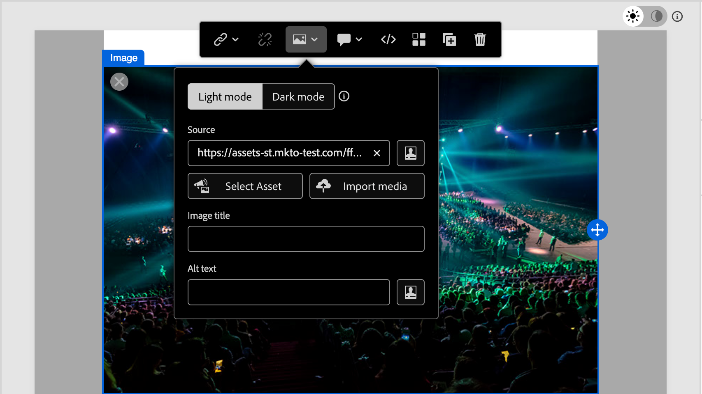

# Assets

In der [!DNL Adobe Journey Optimizer B2B Prime] sind Assets normalerweise die Bilder, die beim Entwerfen von Inhalten zur Unterstützung von Journey verwendet werden. Sie können diese Bilder in Ihren [E-Mails](email-authoring.md), [E-Mail-Vorlagen](templates.md) und [visuellen Fragmenten](email-authoring.md#visual-fragments) über den Asset-Wähler oder eine einfache Drag-and-Drop-Oberfläche im visuellen Design-Bereich verwenden.

Folgende Dateiformate werden unterstützt: JPG, JPEG, GIF, PNG, EPS, SVG und RGB.

<!--
>[!NOTE]
>
>In this Beta release, you can choose images and assets from a one-time copy of your Marketo Engage asset library directly inside the email canvas. Modifying assets in Marketo Engage after the initial copy is **not** reflected in [!DNL Journey Optimizer B2B Prime].
-->

>>
Sie können zusätzliche Bild-Assets aus der _[!UICONTROL Assets]_-Bibliothek oder dem Inhaltsdesign-Bereich hochladen. Diese hochgeladenen Assets sind nur für die Verwendung in der [!DNL Journey Optimizer B2B Prime] verfügbar.
>>
Der Import von Assets aus externen Systemen und der Zugriff auf eine vorausgefüllte Asset-Bibliothek sind noch nicht verfügbar. Künftige Versionen werden voraussichtlich Asset-Importe aus vorhandenen Systemen, Ordnerunterstützung und erweiterte Asset-Management-Funktionen umfassen.

<!-- You can [edit these assets using Adobe Express](./image-edit-adobe-express.md), and move them into folders to organize them for use across your emails, templates, and fragments. -->

Die **Assets**-Bibliothek bietet Zugriff auf das zentrale Repository zum Speichern und Verwalten von Bildern und anderen Kreativ-Assets. Es enthält KI-gestützte Funktionen, die automatisch Metadaten generieren und die Suche in natürlicher Sprache ermöglichen.

Erweitern Sie in der linken Navigationsleiste **[!UICONTROL Content-Management]** und wählen Sie **[!UICONTROL Assets]**.

{width="800" zoomable="yes"}

>[!BEGINSHADEBOX]

Wenn Sie das erste Mal auf die Bibliothek _[!UICONTROL Assets]_ zugreifen, lesen Sie die [_[!UICONTROL Nutzungsbedingungen für Generative AI ]_](https://www.adobe.com/de/legal/licenses-terms/adobe-gen-ai-user-guidelines.html) und bestätigen Sie Ihr Einverständnis.

{width="500"}

>[!ENDSHADEBOX]

Die -Bibliothek unterstützt zwei Layout-Optionen:

* **[!UICONTROL List]** - Klicken Sie auf das Symbol _Listenansicht_ (  ), um Assets in einer sortierbaren Tabelle mit Metadatenspalten anzuzeigen.
* **[!UICONTROL Galerie]** - Klicken Sie auf das Symbol _Galerieansicht_ (  ), um Assets als visuelles Miniaturraster anzuzeigen.

## Nach Assets suchen {#find-assets}

Verwenden Sie das Feld _[!UICONTROL Suche]_, um Assets zu finden, indem Sie beschreiben, was Sie in natürlicher Sprache benötigen. Suchergebnisse basieren auf KI-generierten Metadaten, sodass Sie nicht auf die Suche nach Dateinamen beschränkt sind.

**Beispiele:**

* `team members`
* `nature`
* `exercise`

{width="700" zoomable="yes"}

## Asset-Details anzeigen {#view-details}

Wählen Sie ein Asset in der Listen- oder Galerieansicht aus, um seine Detailansicht auf der rechten Seite zu öffnen, in der eine KI-generierte Beschreibung, Tags, Keywords und zusätzliche Metadatenfelder angezeigt werden. Diese Informationen werden beim Hochladen des Assets automatisch generiert. Wählen Sie die Registerkarte **[!UICONTROL KI-]**) aus, um die generierte Beschreibung, die Tags und die Metadaten zu überprüfen.

{width="700" zoomable="yes"}

## Hochladen eines Assets {#upload}

1. Klicken **[!UICONTROL oben]** auf „Hochladen“.

1. Ziehen Sie im Dialogfeld eine Datei per Drag-and-Drop aus Ihrem lokalen System.

   {width="450"}

   Alternativ können Sie auf **[!UICONTROL Datei auf Ihrem Computer auswählen]** klicken, um Ihr lokales Dateisystem zum Suchen und Auswählen der Datei zu verwenden.

1. Klicken Sie **[!UICONTROL Datei hochladen]**, um zu bestätigen und die Datei in das Repository hochzuladen.

Nach Abschluss des Uploads generiert das System automatisch eine Beschreibung, weist Tags und Keywords zu und extrahiert visuelle Attribute wie Betreff und Einstellung. Es ist kein manuelles Tagging erforderlich. Das neue Bild wird mit dem Status _[!UICONTROL VERARBEITUNG“ angezeigt]_ bis dieser Vorgang abgeschlossen ist.

{width="700" zoomable="yes"}

## Verwenden von Assets für das Content-Authoring {#assets-authoring}

Verwenden Sie Assets beim Erstellen von E-Mails, E-Mail-Vorlagen und visuellen Fragmenten. Der Visual Content Editor bietet Zugriff auf die Bilder in der Bibliothek _Assets_. Sie können auch ein Bild-Asset hochladen, wodurch es im internen Assets-Repository abgelegt wird.

Sie können das Bild-Asset auswählen, wenn Sie die Einstellungen für eine Bildkomponente oder direkt auf der Arbeitsfläche bearbeiten:

* **_Leere Komponente_** - Wenn Sie eine Bildkomponente zur Arbeitsfläche hinzufügen, ist sie leer und bietet einfachen Zugriff zum Auswählen oder Importieren einer Bilddatei.

  {width="500"}

* **_Bildkomponenten-Symbolleiste_** - Wenn Sie eine Bildkomponente auf der Arbeitsfläche ausgewählt haben, bietet die Symbolleiste einfachen Zugriff, um eine Quelle und die Bilddatei auszuwählen.

  {width="500"}

* **_Einstellungen der Bildkomponente_** - Wenn Sie eine Bildkomponente auf der Arbeitsfläche ausgewählt haben, können Sie die Einstellungen im rechten Bedienfeld anzeigen und bearbeiten. Um die in der Komponente angezeigte Bilddatei hinzuzufügen oder zu ändern, wählen Sie den Quelltyp und dann eine Bilddatei aus.

  {width="350"}

Klicken Sie **[!UICONTROL Asset auswählen]**, um den Asset-Wähler zu öffnen, in dem Sie ein Bild aus dem [!DNL Journey Optimizer B2B Prime] Asset-Repository auswählen können.

{width="700" zoomable="yes"}

Sie können die Suche und Filter verwenden, um das gewünschte Bild-Asset zu finden. Wählen Sie das Asset aus und klicken Sie auf **[!UICONTROL Auswählen]**, um es für die Bildkomponente zu verwenden.

Sie können ein Bild-Asset auch in den Hintergrundeinstellungen für eine Strukturkomponente auswählen.
