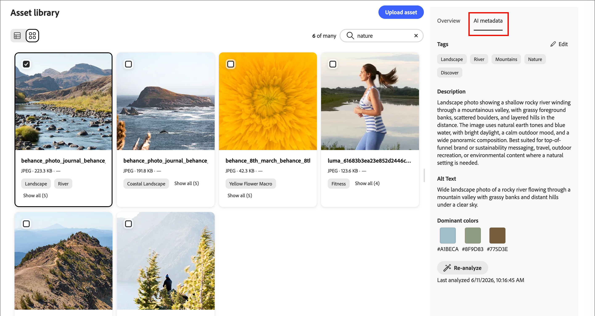

# Assets

In der [!DNL Adobe Journey Optimizer B2B Prime] sind Assets normalerweise die Bilder, die beim Entwerfen von Inhalten zur Unterstützung von Journey verwendet werden. Sie können diese Bilder in Ihren E-Mails, E-Mail-Vorlagen und visuellen Fragmenten über den Asset-Wähler oder eine einfache Drag-and-Drop-Oberfläche im visuellen Design-Bereich verwenden.

Folgende Dateiformate werden unterstützt: JPG, JPEG, GIF, PNG, EPS, SVG und RGB.

>>
Der Import von Assets aus externen Systemen wie dem Marketo Engage-DAM und der Zugriff auf eine vorausgefüllte Asset-Bibliothek sind noch nicht verfügbar. Künftige Versionen werden voraussichtlich Asset-Importe aus vorhandenen Systemen, Ordnerunterstützung und erweiterte Asset-Management-Funktionen umfassen.

<!-- You can [edit these assets using Adobe Express](./image-edit-adobe-express.md), and move them into folders to organize them for use across your emails, templates, and fragments. -->

Die **Assets**-Bibliothek bietet Zugriff auf das zentrale Repository zum Speichern und Verwalten von Bildern und anderen Kreativ-Assets. Es enthält KI-gestützte Funktionen, die automatisch Metadaten generieren und die Suche in natürlicher Sprache ermöglichen.

Erweitern Sie in der linken Navigationsleiste **[!UICONTROL Content-Management]** und wählen Sie **[!UICONTROL Assets]**.

>[!NOTE]
>
>In dieser Beta-Version können Sie Bilder und Assets aus einer einmaligen Kopie Ihrer Marketo Engage-Asset-Bibliothek direkt auf der E-Mail-Arbeitsfläche auswählen. Sie können auch zusätzliche Bild-Assets aus der _[!UICONTROL Assets]_-Bibliothek oder dem Inhaltsdesign-Bereich hochladen. Diese hochgeladenen Assets sind nur für die Verwendung in der [!DNL Adobe Journey Optimizer B2B Prime] verfügbar.

{width="800" zoomable="yes"}

>[!BEGINSHADEBOX]

Wenn Sie das erste Mal auf die Bibliothek _[!UICONTROL Assets]_ zugreifen, lesen Sie die _[!UICONTROL Nutzungsbedingungen für Generative AI]_ und klicken Sie auf **[!UICONTROL Zustimmen und fortfahren]**.

{width="500"}

>[!ENDSHADEBOX]

Die -Bibliothek unterstützt zwei Layout-Optionen:

* **[!UICONTROL List]** - Klicken Sie auf das Symbol _Listenansicht_ (  ), um Assets in einer sortierbaren Tabelle mit Metadatenspalten anzuzeigen.
* **[!UICONTROL Galerie]** - Klicken Sie auf das Symbol _Galerieansicht_ (  ), um Assets als visuelles Miniaturraster anzuzeigen.

## Nach Assets suchen {#find-assets}

Verwenden Sie das Feld _[!UICONTROL Suche]_, um Assets zu finden, indem Sie beschreiben, was Sie in natürlicher Sprache benötigen. Suchergebnisse basieren auf KI-generierten Metadaten, sodass Sie nicht auf die Suche nach Dateinamen beschränkt sind.

**Beispiele:**

* `team members`
* `nature`
* `exercise`

{width="700" zoomable="yes"}

## Asset-Details anzeigen {#view-details}

Wählen Sie ein Asset aus, um seine Detailansicht zu öffnen. In der Detailansicht werden eine KI-generierte Beschreibung, Tags und Keywords sowie zusätzliche Metadatenfelder angezeigt. Diese Informationen werden beim Hochladen des Assets automatisch generiert.

Wählen Sie ein Asset in der Listen- oder Galerieansicht aus, um seine Detailansicht auf der rechten Seite zu öffnen. Wählen Sie die Registerkarte KI-Metadaten aus, um die von der KI generierte Beschreibung, die Tags und die Metadaten anzuzeigen.

{width="700" zoomable="yes"}

## Hochladen eines Assets {#upload}

1. Klicken **[!UICONTROL oben]** auf „Hochladen“.

1. Ziehen Sie im Dialogfeld eine Datei per Drag-and-Drop aus Ihrem lokalen System.

   {width="450"}

   Alternativ können Sie auf **[!UICONTROL Datei auf Ihrem Computer auswählen]** klicken, um Ihr lokales Dateisystem zum Suchen und Auswählen der Datei zu verwenden.

1. Klicken Sie **[!UICONTROL Datei hochladen]**, um zu bestätigen und die Datei in das Repository hochzuladen.

Nach Abschluss des Uploads generiert das System automatisch eine Beschreibung, weist Tags und Keywords zu und extrahiert visuelle Attribute wie Betreff und Einstellung. Es ist kein manuelles Tagging erforderlich. Das neue Bild wird mit dem Status _[!UICONTROL VERARBEITUNG“ angezeigt]_ bis dieser Vorgang abgeschlossen ist.

{width="700" zoomable="yes"}
