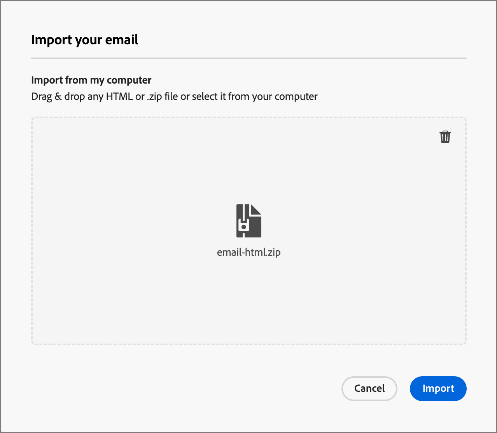
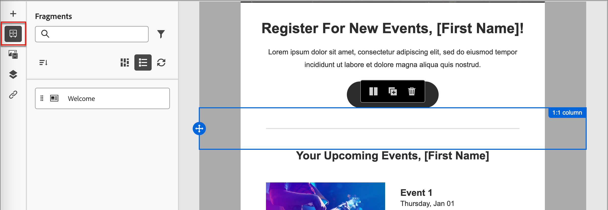

# Inhaltserstellung in E-Mails

[!DNL Adobe Journey Optimizer B2B Prime] bietet der E-Mail-Design-Bereich eine visuelle Arbeitsfläche, auf der Marketing-Experten E-Mails erstellen. Die E-Mail-Design-Tools im linken und oberen Bereich (Strukturen, Inhaltskomponenten, Vorlagen, Fragmente usw.) unterstützen die Erstellung von Grund auf per Drag-and-Drop. Sie können auch mit einer Vorlage beginnen, unformatierte HTML einfügen oder Nachrichten aus wiederverwendbaren visuellen Fragmenten zusammenstellen.

>[!IMPORTANT]
>
>Informationen zum Einrichten von Subdomains, Authentifizierung, IP-Pools und E-Mail-Kanal-Konfigurationen durch Admins finden Sie unter [E](../start/email-deliverability.md)Mail-Zustellbarkeit und [E-Mail-Kanal-Konfiguration](../admin/email-channel-configuration.md).

[!DNL Journey Optimizer B2B Prime] ist jede E-Mail mit einer Aktion _[!UICONTROL E-Mail senden]_ innerhalb einer Personen-Journey verknüpft. Der vollständige Workflow vom Journey-Design bis zur E-Mail-Definition erfolgt in einem kontinuierlichen Erlebnis. Wenn Sie [ Knoten _E-Mail senden_ zu ](../marketing/action-nodes.md#add-an-action-node) Personen-Journey hinzufügen, klicken Sie auf **[!UICONTROL E-Mail erstellen]**, um den Vorgang zu starten. Zunächst definieren Sie die Aktionen und Inhaltseinstellungen für die E-Mail. Klicken Sie **[!UICONTROL E-Mail-]** bearbeiten), um den Design-Bereich für E-Mail-Inhalte zu starten, in dem Sie anhand der folgenden Optionen auswählen können, wie Sie Ihre E-Mail gestalten möchten:

* [Erstellen Sie Ihre E-Mail von Grund ](#design-from-scratch) mithilfe der visuellen Design-Oberfläche. Erstellen Sie die E-Mail-Layout-Komponente per Drag-and-Drop auf einer leeren Arbeitsfläche. Diese Methode eignet sich am besten zum Erstellen neuer Vorlagen oder einmaliger E-Mails.

* [Importieren Sie vorhandene HTML](#import-html-content)Inhalte in den Code-Editor oder arbeiten Sie nebeneinander mit der visuellen Arbeitsfläche.

* [Wählen Sie eine vorhandene ](#templates) aus einer Liste integrierter oder benutzerdefinierter E-Mail-Vorlagen aus. Diese Methode eignet sich am besten für wiederholbare E-Mail-Anwendungsfälle.

<!-- * Upload a design prototype (JPG, PNG, PDF, or Figma export) and have AI Assistant convert it into a responsive HTML email. (Image to HTML (Img2HTML) -->

{width="800" zoomable="yes"}

## E-Mail-Design-Tools {#email-design-tools}

* **Top-Symbolleiste** Speichern, Zurück, Zum Code-Editor wechseln, Steuerelemente in der Vorschau anzeigen.
* **Linker Bereich:** (Spalten-Layouts), Inhalte (Text, Schaltfläche, Bild, Trennlinie, Social, HTML), Fragmente, Vorlagen, Navigationsbaum (DOM-Stilhierarchie der E-Mail).
* **Arbeitsfläche zentrieren:** WYSIWYG-Editor mit Desktop- und Mobile-Vorschau.
* **Rechtes Bedienfeld** Einstellungen und Stile für die aktuell ausgewählte Komponente, einschließlich Inhaltseigenschaften, Hintergrund, Rahmen, Abstand und Personalisierung.

>[!BEGINSHADEBOX]

## Best Practices für das E-Mail-Design {#design-best-practices}

Die Befolgung der Best Practices für HTML und CSS hilft bei der Sicherstellung eines konsistenten Renderings auf allen E-Mail-Clients.

| Ansatz | Leitlinien |
| -------- | -------- |
| **Empfohlen** | Statische, tabellenbasierte Layouts ・ HTML-Tabellen und verschachtelte Tabellen ・ Vorlagenbreiten von 600-800 px ・ Einfaches Inline-CSS ・ Web-sichere Schriftarten |
| **Vorsicht bei der Anwendung** | Hintergrundbilder (eingeschränkte Client-Unterstützung) ・ Benutzerdefinierte Webschriftarten (immer eine Ersatzschriftart definieren) ・ Layouts mit mehr als 800 Pixel ・ Imagemaps |
| **Vermeiden** | JavaScript, iFrames oder Flash ・ Eingebettete Audio- oder Videodateien ・ HTML-Formulare ・ Div-basierte Layouts |

>[!NOTE]
>
>E-Mail-Inhalte müssen außerdem die entsprechenden Anforderungen an die digitale Barrierefreiheit erfüllen. Strukturüberschriften sind logisch, bieten alternativen Text für alle Bilder und überprüfen den Farbkontrast sowohl im hellen als auch im dunklen Modus.

>[!ENDSHADEBOX]

## Neugestaltung einer E-Mail von Grund auf {#design-from-scratch}

Verwenden Sie den visuellen Inhaltsdesignbereich, um die Struktur und den Inhalt der E-Mail zu definieren. Durch das Hinzufügen und Verschieben von Strukturkomponenten mit einfachen Drag-and-Drop-Aktionen können Sie das Layout und die Organisation des E-Mail-Inhalts innerhalb von Sekunden entwerfen.

1. Wählen Sie auf der _[!UICONTROL E]_ Mail gestalten“ die Option **[!UICONTROL Erstellen von neuen]**) aus.

<!-- 

1. In the _[!UICONTROL Create email]_ dialog, choose the type of email content that you want to author.

   * **[!UICONTROL Use Themes]** - Choose this option to create the email in _Theme mode_. In this mode, you can use a defined brand theme to streamline the content authoring process and make sure that the design aligns with defined standards.

   * **[!UICONTROL Manual Styling]** - Choose this option to create the email in _Manual mode_. In this mode, you manually set the styling for all structure and content components that you add to the blank canvas.

-->

1. [Struktur- und Inhaltskomponenten hinzufügen](#structure-content) auf der Arbeitsfläche.

1. [Links überprüfen und ](#preview-and-edit-linked-urls).

1. [Testen Sie die E-Mail](#check-and-test-the-email).

Wenn Sie mit dem Inhalt zufrieden sind, klicken Sie auf **[!UICONTROL Speichern]**.

## Vorhandenen HTML-Inhalt importieren {#import-html-content}

<!-- originally  from   /help/_includes/content-design-import.md but copied and revised to omit the part about Marketo Engage assets and AEM assets -->

Importierte Inhalte können:

* Eine HTML-Datei mit integriertem Stylesheet
* Eine ZIP-Datei, die eine HTML-Datei, das Stylesheet (.css) und Bilder enthält

  >[!NOTE]
  >
  >Die Dateistruktur des komprimierten Ordners ist freigestellt. Verweise müssen jedoch relativ sein und mit der Baumstruktur des ZIP-Ordners übereinstimmen. Die Bilder werden immer in das [Assets-Repository“ ](./digital-asset-management.md).

_So importieren Sie eine Datei mit HTML-Inhalt :_

1. Wählen Sie auf der Startseite des Designs die Option **[!UICONTROL HTML importieren]** aus.

1. Ziehen Sie die HTML- oder ZIP-Datei mit Ihrem HTML-Inhalt per Drag-and-Drop und klicken Sie auf **[!UICONTROL Importieren]**.

{width="500"}

>[!NOTE]
>
>Einen `<table>`-Tag als erste Ebene in einer HTML-Datei zu verwenden kann zum Verlust des Stils führen, einschließlich der Einstellungen für Hintergrund und Breite im Tag der obersten Ebene.

Sie können den importierten Inhalt nach Bedarf mit den visuellen E-Mail-Editor-Tools personalisieren.

## Vorlage auswählen {#templates}

Wenn Sie den E-Mail-Design-Bereich öffnen **[!UICONTROL verwenden Sie den Abschnitt]** Design-Vorlage auswählen“, um mit einer integrierten Beispielvorlage oder einer gespeicherten benutzerdefinierten Vorlage zu beginnen. Siehe [Verwenden einer Vorlage in einer E-Mail](./templates.md#use-in-journey) für den vollständigen Workflow.

>[!NOTE]
>
>Auf gespeicherte Vorlagen können Einstellungen für die Governance (Inhaltssperrung) auf eine oder mehrere Komponenten angewendet werden. Der visuelle Design-Bereich bietet Richtlinien zu gesperrten Komponenten, wenn Sie [E-Mail aus einer verwalteten Vorlage erstellen](./template-content-governance.md).

## Hinzufügen von Struktur und Content {#structure-content}

Verwenden Sie den visuellen E-Mail-Editor, um Ihre E-Mail-Nachricht zu erstellen. Fügen Sie eine Preheader -Struktur hinzu, strukturieren Sie das Layout mit Spalten und Trennlinien und füllen Sie diese Strukturen dann mit Inhaltskomponenten wie Bildern, Schaltflächen und Text. Sie können auch benutzerdefiniertes CSS für erweiterte Formatierungen anwenden und eine Vorschau davon anzeigen, wie das Design im dunklen Modus gerendert wird.

### Preheader festlegen {#preheader}

Der Preheader ist der Textabschnitt, der in der Vorschau des Posteingangs nach der Betreffzeile angezeigt wird. In [!DNL Journey Optimizer B2B Prime] wird der Preheader auf der visuellen Arbeitsfläche im E-Mail-Design-Bereich konfiguriert - nicht auf dem E-Mail-Eigenschaftenbildschirm neben der Betreffzeile.

Wenn **[!UICONTROL Hauptteil]** in der linken Navigationsstruktur ausgewählt ist, öffnen Sie das Bedienfeld **[!UICONTROL Einstellungen]** auf der rechten Seite.

Klicken Sie in den **[!UICONTROL Preheader]**-Textbereich und geben Sie Ihre Preheader-Kopie ein. Klicken Sie auf das Symbol _Personalisierung hinzufügen_ (  ), um Formatierungen und [Personalisierungs-Token](#personalize-content) nach Bedarf mithilfe der Rich-Text-Steuerelemente anzuwenden.

>[!TIP]
>
>Halten Sie den Preheader zwischen 40 und 100 Zeichen lang. Sie sollte die Betreffzeile ergänzen (nicht wiederholen) und dem Empfänger einen zusätzlichen Grund geben, die E-Mail zu öffnen.

### Dunkler Modus {#dark-mode}

Das Dark-Mode-Rendering wird über CSS- `prefers-color-scheme` Medienabfragen unterstützt. Die E-Mail-Design-Tools umfassen eine Vorschau des Dunkelmodus und Optionen zum Definieren benutzerdefinierter Stile für unterstützende E-Mail-Clients. So können Sie überprüfen, ob der Text lesbar bleibt, Logos sichtbar sind und Markenfarben einen dunklen Hintergrund aufweisen.

Ausführliche Anleitungen zur Vorschau, zur Konfiguration benutzerdefinierter Einstellungen für den Dunkelmodus, zur Unterstützung des E-Mail-Clients und zu Best Practices für Tests finden Sie unter [Dunkelmodus für E-Mail-Inhalte](./email-dark-mode.md).

### Hinzufügen von Struktur- und Inhaltskomponenten {#components}

Erstellen Sie Ihr E-Mail[Layout, indem Sie ](./structure-components.md)Strukturkomponenten“ und [Inhaltskomponenten](./content-components.md) zur Arbeitsfläche hinzufügen.

Ziehen Sie Elemente aus den Abschnitten **[!UICONTROL Strukturen]** und **[!UICONTROL Inhalte]** im linken Bereich und konfigurieren Sie dann jede Komponente auf den Registerkarten _[!UICONTROL Einstellungen]_ und _[!UICONTROL Stile]_ auf der rechten Seite.

### Hinzufügen von benutzerdefiniertem CSS {#custom-css}

Sie können benutzerdefiniertes CSS direkt im E-Mail-Design-Bereich hinzufügen, um erweiterte Stile zu ermöglichen, die über die standardmäßigen Komponenteneinstellungen hinausgehen. Es empfiehlt sich, diese Formatierung auf höchster Ebene hinzuzufügen, bevor Sie Inhaltskomponenten wie Bilder, Schaltflächen und Text einbeziehen.

Anweisungen[ Syntaxregeln und Fehlerbehebung finden Sie unter „Hinzufügen von benutzerdefiniertem ](./design-custom-css.md) für Ihre Inhalte“.

>[!NOTE]
>
>Wenn Ihre E-Mail-Nachricht mit einer [Vorlage mit gesperrtem Inhalt](./template-content-governance.md) erstellt wurde, können Sie Ihrem Inhalt kein benutzerdefiniertes CSS hinzufügen. Das Label der Schaltfläche ändert sich in **[!UICONTROL Benutzerdefiniertes CSS anzeigen]** und bereits im Inhalt vorhandene benutzerdefinierte CSS sind schreibgeschützt.

### Hinzufügen von Fragmenten {#visual-fragments}

Ein visuelles Fragment ist eine wiederverwendbare Design-Komponente, die von mehreren Inhalts-Assets in [!DNL Journey Optimizer B2B Prime] referenziert werden kann. Normalerweise handelt es sich dabei um einen Inhaltsblock, der vorab erstellt und schnell eingefügt werden kann, um das Authoring schneller und konsistenter zu machen.

Im folgenden Beispiel werden Schritte zum Hinzufügen von Fragmenten bei der Erstellung von Inhalten beschrieben.

1. Um die Fragmentliste zu öffnen, wählen Sie das Symbol _Fragmente_ aus ( ).

   Sie haben folgende Möglichkeiten:

   * Sortieren Sie die Liste.
   * Durchsuchen, Suchen oder Filtern der Liste.
   * Wechseln zwischen Miniatur- und Listenansicht.
   * Aktualisieren Sie die Liste, um die kürzlich erstellten Fragmente anzuzeigen.

   {width="700" zoomable="yes"}

1. Ziehen Sie eines der Fragmente per Drag-and-Drop in die Strukturkomponente.

   Der Editor rendert das Fragment innerhalb des Abschnitts/Elements der E-Mail-Struktur.

   Der Inhalt des Fragments wird innerhalb der Struktur dynamisch aktualisiert, um eine Vorschau der Darstellung des Fragments in Ihrer E-Mail anzuzeigen.

<!-- 
>[!BEGINSHADEBOX]

**Editable fields in customizable fragments**

A visual fragment can include editable fields that you can customize. Custom fields allow you to modify parameters when you incorporate the fragment into your content and create a tailored experience without affecting the original fragment. The fragment author can design the fragment for customization of text, image, and button components. If an included fragment contains components with editable fields, you can change the default values to customize it for your content.

1. Select the fragment component.

   The Settings displayed on the right include editable fields with the default values.

   {width="700" zoomable="yes"}   

1. Change any editable field as needed.

>[!ENDSHADEBOX]
-->

Nachdem die E-Mail gespeichert wurde, wird sie auf der Seite mit den Fragmentdetails angezeigt, wenn Sie die Registerkarte _[!UICONTROL Verwendet von]_ in der Zusammenfassung auswählen.

### Hinzufügen von Bild-Assets {#insert-image}

Wenn [!DNL Journey Optimizer B2B Prime] bereitgestellt wird, stehen die vorhandenen Marketo Design Studio-Assets im E-Mail-Design-Bereich zur Verfügung. Sie können diese Bilder direkt über die Asset-Auswahl durchsuchen und in Ihre E-Mails einfügen.

>[!IMPORTANT]
>
>Die Asset-Verfügbarkeit in [!DNL Journey Optimizer B2B Prime] basiert auf einer **Kopie** Assets aus Marketo Design Studio. Das Ändern von Assets in Marketo Engage nach der ersten Kopie wird **nicht** in [!DNL Journey Optimizer B2B Prime] angezeigt. Sie können Bild-Assets auch direkt aus dem visuellen Design-Bereich oder aus der [Assets-Bibliothek hochladen](./digital-asset-management.md).

Unterstützte Bilddateitypen:

* **Vollständig unterstützt** (in der Auswahl sichtbar, inline einbettbar): JPG, PNG, GIF, WebP.
* **Zugänglich mit**: SVG (mit einer Warnung, dass einige E-Mail-Clients SVG nicht rendern).
* **In dieser Beta-Version nicht unterstützt:** TIFF, PDF, DOCX, XLSX, PPTX, CSS, JS, HTML, TXT, Binärdateien, PSD, AI, INDD.

Wählen Sie im Bereich „Design für visuelle Inhalte“ das Symbol _Assets_ ( Symbol) in der linken Navigationsleiste. Über den Asset-Wähler können Sie direkt Assets auswählen, die in der Assets-Bibliothek gespeichert sind.

* Fügen Sie ein neues Asset hinzu, indem Sie das Bild-Asset per Drag-and-Drop in eine Strukturkomponente ziehen.

  {width="800" zoomable="yes"}

* Ersetzen Sie ein vorhandenes Bild-Asset, indem Sie es auf der Arbeitsfläche auswählen und in den **[!UICONTROL -Tools auf]** Asset auswählen“ klicken.

  {width="600" zoomable="yes"}

Weitere Informationen zur Verwendung von Assets finden Sie unter [_Verwenden von Assets für die Inhaltserstellung_](./digital-asset-management.md#assets-authoring).

### Navigieren in den Ebenen, Einstellungen und Stilen {#navigation-layers}

Verwenden Sie den Navigationsbaum, um Komponenten und Spalten auszuwählen und dann ihre Einstellungen und Stile im rechten Bedienfeld anzupassen. Siehe [Navigationsbaum](./structure-components.md#navigation-tree).

### Personalisieren von Inhalten {#personalize-content}

[!DNL Journey Optimizer B2B Prime] verwendet die Handlebars-Syntax für die Personalisierung. Token werden zum Zeitpunkt des Versands durch Werte aus den Profildaten jedes Empfängers ersetzt. Es gibt mehrere Stellen, an denen Sie die Personalisierung in einer E-Mail verwenden können:

* **Betreffzeile** - Häufigster Personalisierungspunkt.
* **Preheader** - auf der visuellen Arbeitsfläche festgelegt; unterstützt Profilattribut-Token.
* **E-Mail-Text** - Vornamen und andere Profilattribute, die inline eingefügt wurden.
* **Schaltflächen-URLs** — Parameter für das Anhängen pro Empfänger.

>[!NOTE]
>
>In dieser Beta-Version sind im Personalization-Editor nur Profilattribute verfügbar.

_Personalisierung hinzufügen :_

1. Klicken Sie im E-Mail-Design-Bereich (oder auf der Seite mit den E-Mail-Eigenschaften für die Betreffzeile) auf das Feld, in das Sie ein Token einfügen möchten.
1. Klicken Sie auf _Symbol_ Personalisieren ), um ein Personalisierungs-Token zu verwenden.
1. Durchsuchen Sie im Personalisierungsdialog die Schemastruktur auf der linken Seite. Profilattribute (Vorname, Nachname, E-Mail, Stellenbezeichnung und andere Profilfelder) werden aufgelistet.
1. Attribut auswählen. Der Editor fügt den entsprechenden Handlebars-Ausdruck ein, z. B. `{{profile.firstName}}`.
1. Fügen Sie einen Fallback-Wert hinzu, um fehlende Daten zu verarbeiten: `{{profile.firstName | default: "there"}}`.
1. Klicken Sie **[!UICONTROL Bestätigen]** oder **[!UICONTROL Einfügen]**. Der Ausdruck wird inline im Feld angezeigt.

+++Häufige {#personalization-patterns} für Personalisierungsmuster

Verwenden Sie Handlebars-Ausdrücke wie den folgenden (Personalisierung verwendet dieselbe Syntax, die unter &quot;[ von Inhalten“ beschrieben ](#personalize-content)):

* `{{profile.lastName}}` - Fügen Sie den Nachnamen der Empfängerin bzw. des Empfängers ein.
* `{{profile.jobTitle}}` - Referenzieren Sie die Stellenbezeichnung des Empfängers in der Textkörper-Kopie.
* `{{profile.firstName}}, ready to take the next step?` - Kombinieren Sie Token und statischen Text inline.

Für eine Grußformel mit Vorname und einem Fallback, wenn der Wert fehlt, verwenden Sie den `default` Helper, wie in den vorherigen Personalisierungsschritten gezeigt (z. B. Vorname mit `"there"`).

+++

+++Handlebars-Helper {#handlebars-helpers}

Über `default` hinaus enthält der Personalisierungseditor integrierte Handlebars-Helfer für bedingte Logik, Textumwandlung und Datumsformatierung. Verwenden Sie den Funktions-Browser des Editors, um verfügbare Helper zu erkunden und sie mit der richtigen Syntax einzufügen.

>[!TIP]
>
>Geben Sie im E-Mail-Design-Bereich `{{` direkt in ein beliebiges Textfeld ein, um eine Dropdown-Liste mit automatischer Inline-Vervollständigung mit verfügbaren Profilattributen zu erstellen. Es ist nicht erforderlich, das vollständige Personalisierungsdialogfeld für Schnelleinfügungen zu öffnen.

+++

+++{#ai-personalization} für KI-unterstützte Ausdrücke

Der KI-Assistent im Personalisierungseditor kann Handlebars-Ausdrücke aus einer einfachen Beschreibung generieren, die Funktion eines vorhandenen Ausdrucks erklären und potenzielle Probleme identifizieren. Verwenden Sie sie, um die Erstellung von Ausdrücken zu beschleunigen, insbesondere für bedingte Logik oder Helper zur Datumsformatierung.

+++

Weitere Informationen zu den Tools und der Syntax des Ausdruckseditors finden Sie unter [Personalization-Ausdrücke](./personalization-expressions.md).

### Verknüpftes URL-Tracking bearbeiten {#preview-and-edit-linked-urls}

{{$include /help/_includes/content-design-links.md}}

## Überprüfen und Testen der E-Mail {#check-and-test-the-email}

Verwenden Sie vor dem Speichern die Steuerelemente Vorschau für Desktops und Mobilgeräte in der Symbolleiste des E-Mail-Designs, um das E-Mail-Layout zu überprüfen. Wechseln Sie in die Vorschau des Dunkelmodus, um die Lesbarkeit und den Kontrast zu überprüfen (siehe [Dunkelmodus für E-Mail-Inhalte](./email-dark-mode.md)).

Testprofile, [!UICONTROL Inhalt simulieren] und Testversand-Workflows sind in dieser Beta-Version nicht verfügbar. Siehe [Aktuelle Einschränkungen](../marketing/email-channel.md#limitations) in der Übersicht zum E-Mail-Kanal.

Überprüfen Sie [Validieren von E-Mail](#validation) auf Warnungen, die vor dem Journey der Aktivierung aufgelöst werden müssen.

## Validieren von E-Mail-Inhalten {#validation}

Bevor Ihr Journey aktiviert werden kann, muss der E-Mail-Inhalt gültig sein. [!DNL Journey Optimizer B2B Prime] zeigt Warnhinweise auf Inhaltsebene für die E-Mail-Adresse und die Journey-Arbeitsfläche. In diesem Abschnitt werden die Warnhinweise beschrieben, die möglicherweise angezeigt werden, und wie Sie sie beheben können.

### Allgemeine Inhaltswarnungen {#content-alerts}

| Warnhinweis | Bedeutung | Beheben von Problemen |
| ----- | ------------- | -------------- |
| **Betreffzeile fehlt** | Das Feld Betreffzeile ist leer. | Öffnen Sie die E-Mail und geben Sie eine Betreffzeile auf der Registerkarte **[!UICONTROL Inhalt]** ein. Personalization-Token sind zulässig, das Feld darf jedoch nicht leer sein. |
| **E-Mail-Text ist leer** | Die Arbeitsfläche im E-Mail-Design-Bereich enthält keinen Inhalt. | Klicken Sie auf **[!UICONTROL E-Mail-Text bearbeiten]**, um den E-Mail-Design-Bereich zu öffnen. Ziehen Sie mindestens eine Struktur - und eine Inhaltskomponente auf die Arbeitsfläche und klicken Sie dann auf Speichern . |
| **Kanalkonfiguration nicht ausgewählt** | Für den E-Mail-Knoten wurde keine E-Mail-Kanalkonfiguration ausgewählt. | Wählen Sie auf der Registerkarte **[!UICONTROL Aktionen]** eine aktive **[!UICONTROL E-Mail-Kanalkonfiguration]**. |
| **Kanalkonfiguration gelöscht** | Die zuvor ausgewählte Kanalkonfiguration wurde gelöscht oder ist nicht mehr aktiv. | Wählen Sie auf der Registerkarte **[!UICONTROL Aktionen]** eine andere aktive **[!UICONTROL E-Mail-Kanalkonfiguration]** aus. Wenn keine verfügbar sind, muss ein Administrator eine in der Konfiguration des E-[-Kanals erstellen oder ](../admin/email-channel-configuration.md). |
| **E-Mail-Größe überschreitet 100 KB** | Die Gesamtgröße der E-Mails (HTML, Inline-CSS, kodierte Inhalte) ist größer als die Obergrenze von 100 KB für Best Practices beim ISP. | Verringern der E-Mail-Größe: Ersetzen Sie große Inline-Bilder durch extern gehostete Bilder aus Marketo Design Studio, entfernen Sie nicht verwendetes Inline-CSS und vereinfachen Sie verschachtelte Strukturen. |
| **Nicht aufgelöstes Personalisierungs-Token** | Ein Handlebars-Token verweist auf ein Profilattribut ohne Fallback, und bei einigen Empfängern kann das Attribut fehlen. | Fügen Sie ein Fallback mit dem Handlebars-`default`-Helper hinzu, wie in [Personalisieren von Inhalten](#personalize-content) beschrieben. Alternativ können Sie die Journey-Zielgruppe auf Profile beschränken, bei denen das Attribut garantiert ist. |
| **Bild nicht geladen** | Eine Bildkomponente verweist auf ein Asset, das nicht mehr verfügbar ist. | Klicken Sie auf das Bild, öffnen Sie die Asset-Auswahl und wählen Sie das Asset erneut aus der Assets-Bibliothek aus. |
