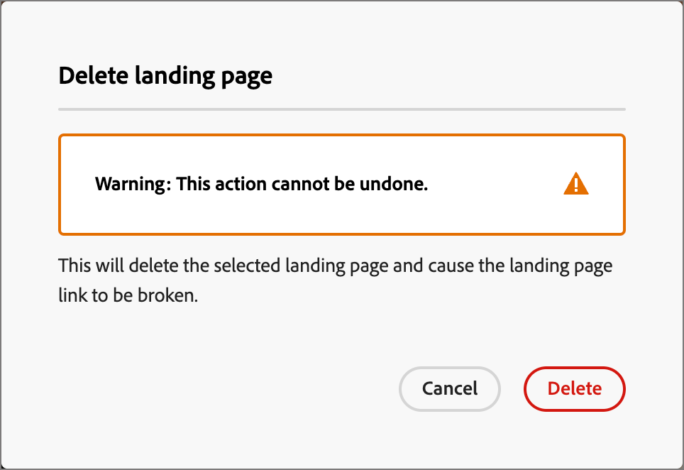
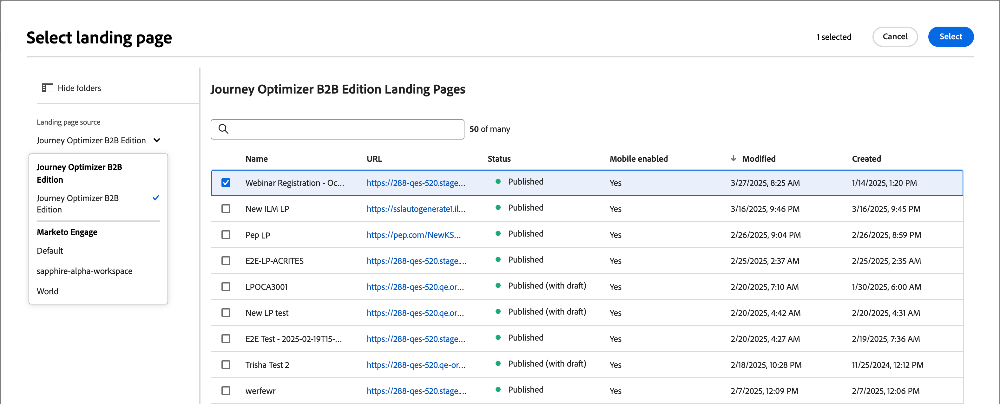

# Landingpages

Eine Landingpage ist eine eigenständige Web-Seite, auf der Sie Kontakte und Kunden leiten können, nachdem sie auf ein verknüpftes Element in einer E-Mail, SMS-Nachricht oder einem beliebigen digitalen Ort geklickt haben. Sie können diese Seiten in Ihre Journey einbinden, damit Ihre Interessenten und Kunden Ihre Nachrichten im Internet sehen und in Ihren Journey vorankommen.

Häufige Anwendungsfälle für Landingpages:

* Bereitstellen von Opt-in- oder Opt-out-Kampagnen für Marketing-Nachrichten oder einen bestimmten Service. Verwenden Sie einen Link in einer E-Mail oder einer anderen Kommunikation zu einer Zielliste.
* Sammeln Sie das Einverständnis, bevor Sie Nachrichten senden, und senden Sie eine Bestätigungs-E-Mail beim Opt-in oder Opt-out.
* Profildaten (progressive Profilerstellung, Voreinstellungen, Registrierungen und ähnliche Szenarien) mithilfe von Formularen auf Landingpages erfassen oder aktualisieren.
* Personen zu kampagnenspezifischen Informationen weiterleiten, die für Ihre Journey-Orchestrierung entwickelt wurden.
* Personen zu einem speziellen Web-Formular umleiten, ohne eine externe Seite außerhalb von [!DNL Journey Optimizer B2B Prime] zu erstellen.

## Workflow für Landingpages {#workflow}

Um Mitglieder einer Journey-Zielgruppe zu einer definierten Web-Seite weiterzuleiten, wenn sie auf einen bestimmten Link klicken, erstellen Sie eine Landingpage in [!DNL Journey Optimizer B2B Prime]:

1. [Seite erstellen](./landing-pages-create-publish.md#create-landing-page) - Wählen Sie eine Voreinstellung aus, richten Sie die Primärseite ein und fügen Sie alle erforderlichen Unterseiten hinzu.
1. [Landingpage-Inhalt gestalten](./landing-page-design.md) - Erstellen Sie den Seiteninhalt mithilfe visueller Design-Komponenten per Drag-and-Drop.
1. [Landingpage testen](./landing-pages-create-publish.md#test-landing-page) - Vorschau der Seite und Testformularverhalten.
1. [Landingpage veröffentlichen](./landing-pages-create-publish.md#publish-landing-page) - Veröffentlichen, um die Seite live und für Verknüpfungen verfügbar zu machen.
1. [Link zur Seite von Ihrem Journey aus](#link-to-landing-page) - Fügen Sie die Landingpage-URL zu einer E-Mail-, SMS- oder Journey-Aktion hinzu, damit die Empfänger sie erreichen können.

Sie können beispielsweise Landingpages erstellen und gestalten, um Ihre Benutzer zu Online-Informationen zu führen. Die Seite könnte ein Formular enthalten, über das der Empfänger Ihre Nachrichten abmelden oder abmelden kann. Oder es kann eine Möglichkeit sein, eine wiederkehrende Kommunikation wie einen Newsletter zu abonnieren.

## Zugreifen auf und Verwalten von Landingpages {#access-manage-landing-pages}

Um auf Landingpages in [!DNL Journey Optimizer B2B Prime] zuzugreifen, gehen Sie zur linken Navigation und erweitern Sie **[!UICONTROL Content-Management]**. Wählen Sie dann **[!UICONTROL Landingpages]** aus. Diese Aktion zeigt eine Liste aller in der Instanz erstellten Landingpages an.

{width="800" zoomable="yes"}

Die Liste ist nach der Spalte _[!UICONTROL Geändert]_ sortiert, wobei die zuletzt aktualisierten Elemente oben stehen. Klicken Sie auf den Spaltentitel, um zwischen aufsteigender und absteigender Reihenfolge zu wechseln.

### Filtern der Landingpage-Liste {#filter-list}

Um nach einer Landingpage anhand des Namens zu suchen, geben Sie eine Textzeichenfolge in die Suchleiste für eine Übereinstimmung ein. Klicken Sie auf _Filter_-Symbol (  ), um die verfügbaren Filteroptionen anzuzeigen und die Einstellungen zu ändern, um die angezeigten Elemente entsprechend Ihren angegebenen Kriterien zu filtern.

{width="800" zoomable="yes"}

<!-- 
This is going away? ### Customize the column display

Customize the columns that you want to display in the table by clicking the _Customize table_ icon (  ) at the top right. 

In the dialog, select the columns to display and click **[!UICONTROL Apply]**.

{width="300"} 
-->

### Status und Lebenszyklus der Landingpage {#landing-page-status}

Der Landingpage-Status bestimmt, ob Links in Ihren E-Mail- und SMS-Inhalten verfügbar sind und welche Änderungen Sie daran vornehmen können.

| Status | Beschreibung |
| -------------------- | ----------- |
| Entwurf | Wenn Sie eine Landingpage erstellen, befindet sie sich im Status Entwurf . Er bleibt in diesem Status, bis Sie den visuellen Inhalt definieren oder bearbeiten und bis Sie ihn als gehostete Seite veröffentlichen. Verfügbare Aktionen: <ul><li>Name oder Beschreibung bearbeiten</li><li>Link-URL bearbeiten</li><li>Bearbeiten im visuellen Design-Bereich</li><li>Veröffentlichen</li><li>Duplizieren</li><li>Löschen</li></ul> |
| Veröffentlicht | Wenn Sie eine Landingpage veröffentlichen, wird sie auf der [!DNL Journey Optimizer B2B Prime]-Instanz gehostet und steht dann zur Verknüpfung in E-Mail- oder SMS-Nachrichteninhalten zur Verfügung. Verfügbare Aktionen: <ul><li>Name oder Beschreibung bearbeiten</li><li>Link-URL bearbeiten</li><li>Link im Inhalt von E-Mail- oder SMS-Nachrichten hinzufügen</li><li>Versionsentwurf erstellen</li><li>Duplizieren</li><li>Löschen</li></ul> |
| Mit Entwurf veröffentlicht | Wenn Sie einen Entwurf aus einer veröffentlichten Landingpage erstellen, bleibt die veröffentlichte Version erhalten, und der Entwurfsinhalt kann im visuellen Design-Bereich geändert werden. Wenn Sie die Entwurfsversion veröffentlichen, ersetzt sie die aktuell veröffentlichte Version, und der Inhalt wird auf der gehosteten Seite aktualisiert. Verfügbare Aktionen: <ul><li>Name oder Beschreibung bearbeiten</li><li>Link-URL bearbeiten</li><li>Link im Inhalt von E-Mail- oder SMS-Nachrichten hinzufügen</li><li>Bearbeiten der Entwurfsversion im visuellen Entwurfsbereich</li><li>Entwurfsversion veröffentlichen</li><li>Duplizieren</li><li>Löschen (löscht beide Versionen)</li><li>Entwurf verwerfen (kehrt zum Status „Veröffentlicht“ zurück)</li></ul> |

{zoomable="yes"}

## Bearbeiten einer Landingpage {#edit-landing-page}

Änderungen an einer Landingpage hängen vom aktuellen Status ab:

* Wenn sich eine Landingpage im Status **_Entwurf_** befindet, können Sie alle zugehörigen Details, die URL und den visuellen Inhalt bearbeiten.
* Wenn sich eine Landingpage im Status **_Veröffentlicht_** befindet, können Sie die Beschreibung bearbeiten, nicht jedoch den Namen. Um den visuellen Inhalt zu ändern, müssen Sie eine Entwurfsversion der Seite erstellen.
* Wenn sich eine Landingpage im Status **_Veröffentlicht mit Entwurf_** befindet, ist die Bearbeitung der Details auf die Beschreibung beschränkt. Sie können auch den visuellen Inhalt für die Entwurfsversion bearbeiten.

>[!BEGINTABS]

>[!TAB Entwurf]

1. Klicken Sie auf der _[!UICONTROL Landingpages]_ auf den Namen der Landingpage, um sie zu öffnen.

   Eine Vorschau des visuellen Inhalts mit den Details der Landingpage wird auf der rechten Seite angezeigt.

1. Ändern Sie alle Details, z. B. Namen und Beschreibung.

   {width="700" zoomable="yes"}

1. Um Änderungen am Inhalt im visuellen Design-Bereich vorzunehmen, klicken Sie auf **[!UICONTROL Landingpage bearbeiten]**.

   Verwenden Sie bei Bedarf visuelle Design-Tools:

   * [Hinzufügen von Struktur und Inhalten](./landing-page-design.md#structure-content-landing-page)
   * [Hinzufügen von Assets](./landing-page-design.md#add-assets)
   * [Navigieren in den Ebenen, Einstellungen und Stilen](./landing-page-design.md#navigate-layers-settings-styles)
   * [Personalisieren von Inhalten](./landing-page-design.md#personalize-content)
   * [Verknüpftes URL-Tracking bearbeiten](./landing-page-design.md#linked-url-tracking)

1. Klicken Sie **[!UICONTROL Speichern]** oder **[!UICONTROL Speichern und schließen]** um zu den Landingpage-Details zurückzukehren.

1. Wenn die Seite Ihren Kriterien entspricht und Sie sie zur Anzeige bereitstellen möchten, klicken Sie auf **[!UICONTROL Veröffentlichen]**.

>[!TAB Veröffentlicht]

1. Klicken Sie auf der _[!UICONTROL Landingpages]_ auf den Seitennamen, um die Seite zu öffnen.

   Eine Vorschau des visuellen Inhalts mit den Details der Landingpage wird auf der rechten Seite angezeigt.

1. Ändern Sie bei Bedarf die Beschreibung.

   Für eine veröffentlichte Landingpage können alle anderen Details nicht geändert werden.

1. Wenn Sie den Inhalt aktualisieren möchten, klicken Sie auf **[!UICONTROL rechten Seite auf]** Landingpage bearbeiten“.

   Klicken Sie **[!UICONTROL Dialogfeld auf]** Entwurfsversion erstellen“, um die Entwurfsversion im visuellen Entwurfsbereich zu öffnen.

   Verwenden Sie bei Bedarf visuelle Design-Tools:

   * [Hinzufügen von Struktur und Inhalten](./landing-page-design.md#structure-content-landing-page)
   * [Hinzufügen von Assets](./landing-page-design.md#add-assets)
   * [Navigieren in den Ebenen, Einstellungen und Stilen](./landing-page-design.md#navigate-layers-settings-styles)
   * [Personalisieren von Inhalten](./landing-page-design.md#personalize-content)
   * [Verknüpftes URL-Tracking bearbeiten](./landing-page-design.md#linked-url-tracking)

1. Klicken Sie **[!UICONTROL Speichern]** oder **[!UICONTROL Speichern und schließen]** um zu den Landingpage-Details zurückzukehren.

1. Wenn die Landingpage Ihren Kriterien entspricht und Sie die Änderungen auf der veröffentlichten Seite verfügbar machen möchten, klicken Sie auf **[!UICONTROL Veröffentlichen]**.

   Wenn Sie die Entwurfsversion veröffentlichen, ersetzt sie die aktuell veröffentlichte Version, und der Inhalt wird für die Seiten-URL aktualisiert.

>[!TAB Veröffentlicht mit Entwurf]

Beim Öffnen der Landingpage wird die Entwurfsversion angezeigt. Mit den Registerkarten oben im Vorschaubereich können Sie die Anzeige zwischen der veröffentlichten und der Entwurfsversion wechseln. Die Entwurfsaktionen und -details werden auf der rechten Seite angezeigt.

{width="700" zoomable="yes"}

_Inhalt aktualisieren :_

1. Klicken **[!UICONTROL oben]** auf „Landingpage bearbeiten“. Verwenden Sie bei Bedarf visuelle Design-Tools:

   * [Hinzufügen von Struktur und Inhalten](./landing-page-design.md#structure-content-landing-page)
   * [Hinzufügen von Assets](./landing-page-design.md#add-assets)
   * [Navigieren in den Ebenen, Einstellungen und Stilen](./landing-page-design.md#navigate-layers-settings-styles)
   * [Personalisieren von Inhalten](./landing-page-design.md#personalize-content)
   * [Verknüpftes URL-Tracking bearbeiten](./landing-page-design.md#linked-url-tracking)

1. Klicken Sie **[!UICONTROL Speichern]** oder **[!UICONTROL Speichern und schließen]** um zu den Landingpage-Details zurückzukehren.

1. Wenn die Entwurfsseite Ihren Kriterien entspricht und Sie die Änderungen verfügbar machen möchten, klicken Sie auf **[!UICONTROL Veröffentlichen]**.

   Wenn Sie die Entwurfsversion veröffentlichen, ersetzt sie die aktuelle veröffentlichte Version, und der Inhalt wird auf der gehosteten Seite aktualisiert.

>[!ENDTABS]

## Duplizieren einer Landingpage {#duplicate-landing-page}

Sie können eine Landingpage mit einer der folgenden Methoden duplizieren:

* Klicken Sie auf der _[!UICONTROL Landingpage]_ auf das Symbol _Mehr_ (**…**) klicken Sie neben dem Namen der Landingpage auf **[!UICONTROL Duplizieren]**.
* Klicken Sie oben rechts auf der Detailseite der Landingpage auf **[!UICONTROL … Mehr]** und wählen Sie **[!UICONTROL Duplizieren]**.

{width="600" zoomable="yes"}

Geben Sie im Dialogfeld einen nützlichen Namen (eindeutig) und eine Beschreibung (optional) ein. Klicken Sie **[!UICONTROL Duplizieren]**, um die Aktion abzuschließen.

{width="350"}

Die duplizierte (neue) Seite wird dann in der Liste _Landingpages_ angezeigt.

## Löschen einer Landingpage {#delete-landing-page}

Sie können eine Landingpage mit einer der folgenden Methoden löschen:

* Klicken Sie auf der _[!UICONTROL Landingpage]_ auf das Symbol _Mehr_ (**…**) klicken Sie neben dem Namen der Landingpage auf **[!UICONTROL Löschen]**.
* Klicken Sie oben rechts auf der Detailseite der Landingpage auf **[!UICONTROL … Weitere]** und wählen Sie **[!UICONTROL Löschen]**.

Diese Aktion öffnet ein Bestätigungsdialogfeld. Sie können den Vorgang abbrechen, indem Sie auf **[!UICONTROL Abbrechen]** klicken oder auf **[!UICONTROL Löschen]** klicken, um den Löschvorgang zu bestätigen.

{width="400"}

## Link zu einer Landingpage {#link-to-landing-page}

Als Marketing-Experte oder Kreativschaffender, der E-Mail-, Fragment- und Seiteninhalte erstellt, können Sie Links zu den veröffentlichten (Live-)Landingpages einbetten, die in Ihrer [!DNL Journey Optimizer B2B Prime] erstellt werden.

1. Wählen Sie beim Arbeiten im visuellen Design für ein Fragment, eine E-Mail, eine Landingpage oder eine Vorlage einen Textauszug, eine Schaltflächenkomponente oder eine Bildkomponente für den Link aus.

   Die **[!UICONTROL Link]**-Optionen werden im rechten Bedienfeld angezeigt.

1. Wählen Sie für **[!UICONTROL Option]** Typ“ die Option **[!UICONTROL Landingpage]**.

   {width="700" zoomable="yes"}

1. Klicken Sie für die **[!UICONTROL Landingpage]**-Option auf das Symbol _Seite auswählen_ (  ).

1. Legen Sie im Dialogfeld „Landingpage auswählen **[!UICONTROL als]** **[!UICONTROL Journey Optimizer B2B edition]** fest, aktivieren Sie das Kontrollkästchen für die Landingpage in der Liste der veröffentlichten Seiten und klicken Sie auf **[!UICONTROL Auswählen]**.

   {width="600" zoomable="yes"}

1. Wählen Sie für **[!UICONTROL Option]** das Verhalten des Link-Ziels aus:

   * **[!UICONTROL None]** - Öffnet den Link mit dem Standardverhalten des Browsers.
   * **[!UICONTROL Leer]** - Öffnet den Link in einem neuen Fenster oder in einer neuen Registerkarte.
   * **[!UICONTROL Self]** - Öffnet den Link im selben Frame.
   * **[!UICONTROL Parent]** - Öffnet den Link im übergeordneten Frame.
   * **[!UICONTROL Oben]** - Öffnet den Link im gesamten Fenster.

1. (Nur Text-Link) Wenn Sie den verknüpften Text unterstreichen möchten, aktivieren Sie das Kontrollkästchen **[!UICONTROL Link unterstreichen]**.

   Sie können zusätzliche Stile für den Link-Text festlegen, einschließlich der Link-Farbe, indem Sie die Registerkarte **[!UICONTROL Stile]** im rechten Bedienfeld auswählen.
