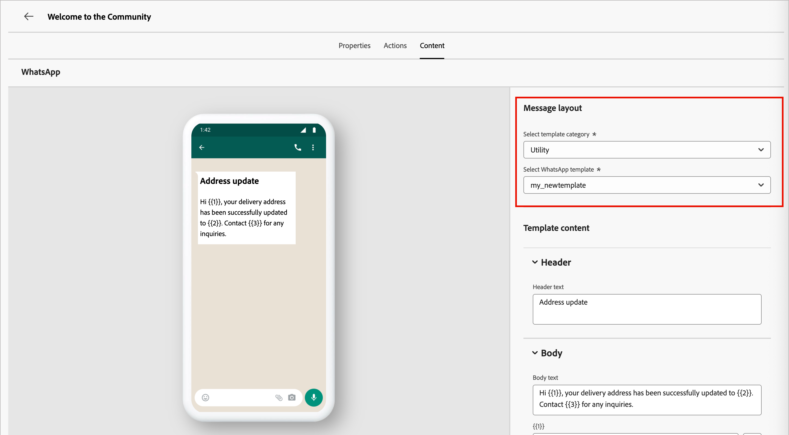

# WhatsApp-Authoring

Verwenden Sie [!DNL Adobe Journey Optimizer B2B Prime], um WhatsApp-Nachrichten an Personen auf ihren Mobilgeräten zu senden. Sie können Nachrichten mithilfe genehmigter Meta-Nachrichtenvorlagen im WhatsApp-Editor erstellen, personalisieren und in der Vorschau anzeigen.

Bevor Sie WhatsApp-Nachrichten für Personen-Journey erstellen, stellen Sie sicher, dass Sie in den Einstellungen [Administrator](../admin/configuration-channels-whatsapp.md) einen _[!UICONTROL WhatsApp-Kanal]_ haben.

>[!NOTE]
>
>In _werden nur_ Outbound-)WhatsApp-Nachrichtenelemente unterstützt[!DNL Journey Optimizer B2B Prime].

+++ Unterstützte Nachrichtenelemente und call-to-action-Optionen

Verwenden Sie die Tabellen in diesem Abschnitt als Referenz für ausgehende WhatsApp-Inhalte, die Sie in genehmigte Meta-Vorlagen aufnehmen können, und für interaktive Schaltflächen, die Sie zu Nachrichten hinzufügen können.

In der folgenden Tabelle sind unterstützte Nachrichtenelemente und ihre Anforderungen zusammengefasst.

| Nachrichtenelement | Beschreibung |
| - | - |
| Kopfzeilen | Optionaler Text, der über dem Nachrichtentext angezeigt wird. |
| Text | Unterstützt dynamische Inhalte durch Parameter. |
| Bilder (JPEG, PNG) | Müssen im 8-Bit-RGB- oder -RGBA-Format vorliegen und kleiner als 5 MB sein. |
| Videos | Muss 3GPP oder MP4 sein, unter 16 MB und von URL gehostet. |
| Audio | Nur für Antwortnachrichten verfügbar. Muss im AAC-, AMR-, MP3-, MP4 Audio- oder OGG-Format vorliegen, über eine URL gehostet werden und kleiner als 16 MB sein. |
| Dokumente | Muss unter 100 MB groß sein, auf einer URL gehostet werden und eines der folgenden Formate aufweisen: `.txt`, `.xls`/`.xlsx`, `.doc`/`.docx`, `.ppt`/`.pptx` oder `.pdf`. |
| Textkörper | Unterstützt dynamische Inhalte durch Parameter. |
| Fußzeilentext | Unterstützt dynamische Inhalte durch Parameter. |

In der folgenden Tabelle sind die call-to-action-Schaltflächentypen und ihr Verhalten in der Nachricht aufgeführt.

| Call to action | Beschreibung |
| - | - |
| Besuchen einer Website | Es ist nur eine Schaltfläche zulässig, einschließlich Variablenparametern. |
| Anruf über WhatsApp | Stellt eine Schaltfläche bereit, mit der ein WhatsApp-Chat mit der angegebenen Telefonnummer direkt von der Nachricht aus geöffnet wird. |
| Anrufen einer Telefonnummer | Stellt eine Schaltfläche bereit, mit der ein Telefonanruf an die angegebene Nummer gestartet wird, wenn die Benutzenden darauf tippen. |

+++

## Hinzufügen einer WhatsApp-Aktion auf einer Personen-Journey {#add-whatsapp-journey-action}

>[!IMPORTANT]
>
>**Einverständnisverwaltung per WhatsApp**: Gemäß den Richtlinien und geltenden Vorschriften von Meta dürfen alle WhatsApp-Marketing-Nachrichten nur an Empfänger gesendet werden, die sich für den Erhalt von Nachrichten entschieden haben. Empfänger von WhatsApp können sich jederzeit per Opt-out-Keyword abmelden. Opt-out-Antworten werden automatisch berücksichtigt und die entsprechenden Profile werden aus zukünftigen Marketing-Nachrichten-Audiences entfernt.

Sie können den WhatsApp-Nachrichtenversand auf einer Personen-Journey einrichten, wenn Sie [einen Knoten _[!UICONTROL Aktion durchführen]_ hinzufügen](../marketing/action-nodes.md) und **[!UICONTROL WhatsApp senden]** aus der Aktionsliste auswählen.

## Erstellen der WhatsApp-Nachricht {#create-whatsapp-message}

1. Klicken Sie unten im Bedienfeld _[!UICONTROL Aktion ausführen]_ auf **[!UICONTROL WhatsApp erstellen]**.

1. Geben Sie im Dialogfeld einen eindeutigen **[!UICONTROL Namen]** (erforderlich) und **[!UICONTROL Beschreibung]** (optional) für die WhatsApp-Nachricht ein.

   {width="400"}

1. Klicken Sie auf **[!UICONTROL Erstellen]**.

   Der _WhatsApp-Design-Bereich_ wird geöffnet, in dem Sie die WhatsApp-Aktionen definieren und den Inhalt für den Nachrichtenversand erstellen können.

### Auswählen der Aktionskonfiguration {#select-actions-configuration}

1. Wählen _im WhatsApp-_ die Registerkarte **[!UICONTROL Aktionen]** aus.

1. Wählen Sie für **[!UICONTROL WhatsApp]** Konfiguration die Konfiguration aus, die die Marketing-Aktionen und die Einstellungen für den Nachrichtenversand für Ihre Anforderungen unterstützt.

   {width="700" zoomable="yes"}

1. Klicken Sie **[!UICONTROL Inhalt bearbeiten]**, um mit den Nachrichtenparametern und dem Text fortzufahren.

### Nachrichtenvorlage auswählen {#select-message-template}

WhatsApp-Nachrichten werden mit vorab genehmigten Nachrichtenvorlagen von Ihrem Meta WhatsApp Business-Konto gesendet. **Vorlagen müssen von Meta überprüft und genehmigt werden** bevor sie in [!DNL Journey Optimizer B2B Prime] verwendet werden können. Wenden Sie sich an Ihren [!DNL Meta Business Manager]-Kontoadministrator, um Vorlagen zu verwalten und zur Genehmigung einzureichen.

1. Wählen **[!UICONTROL für „Vorlagenkategorie]**&quot; eine der folgenden Optionen:

   * Marketing
   * Dienstprogramm
   * Authentifizierung

1. Wählen **[!UICONTROL unter „WhatsApp-]** auswählen“ eine genehmigte Vorlage für das konfigurierte Geschäftskonto aus.

   Der Vorlageninhalt wird im Nachrichten-Editor geladen und zeigt die Vorlagenstruktur und alle für die Personalisierung verfügbaren Variablenfelder an.

   {width="700" zoomable="yes"}

   Das System organisiert Vorlagen nach Kategorie (_Marketing_, _Dienstprogramm_ und _Authentifizierung_) und Status. Nur **_genehmigte_** Vorlagen sind zur Auswahl verfügbar. Weitere Informationen zum Erstellen von WhatsApp-Vorlagen finden Sie unter [_Erstellen von Nachrichtenvorlagen für Ihr WhatsApp Business-Konto_](https://www.facebook.com/business/help/2055875911147364?id=2129163877102343) in der Dokumentation zu Meta.

### Bild-URL {#image-urls}

Wenn Ihre Vorlage Bilder enthält, verwenden Sie das Feld **[!UICONTROL Bild-URL]**, um Medien-URLs hinzuzufügen, um alle Platzhalter in Ihrer Vorlage zu ersetzen. Die Vorlagenmedien von Meta sind nur Platzhalter. Damit Bilder, Audio oder Video korrekt angezeigt werden, müssen Sie externe URLs aus Adobe Experience Manager oder anderen Quellen verwenden.

### Nachrichteninhalt personalisieren {#personalize-message-content}

Genehmigte WhatsApp-Vorlagen können variable Platzhalter enthalten, die Sie mithilfe von Profildaten oder dynamischen Werten definieren.

Klicken Sie für jedes in der Vorlage angezeigte Variablenfeld auf das _Personalisieren_-Symbol (  ) neben dem Feld.

{width="700" zoomable="yes"}

Das Dialogfeld bietet Zugriff auf Personen- und System-Token. Sowohl standardmäßige als auch benutzerdefinierte Token sind enthalten. Sie können die _Suche_ verwenden, um das benötigte Token zu finden, oder durch die Ordnerstruktur navigieren, um eines der Token zu finden und auszuwählen.

Wenn Ihre Personalisierungs-Token definiert sind, klicken Sie auf **[!UICONTROL Speichern]**, um Änderungen zu speichern und zum Hauptarbeitsbereich der WhatsApp-Nachricht zurückzukehren.
