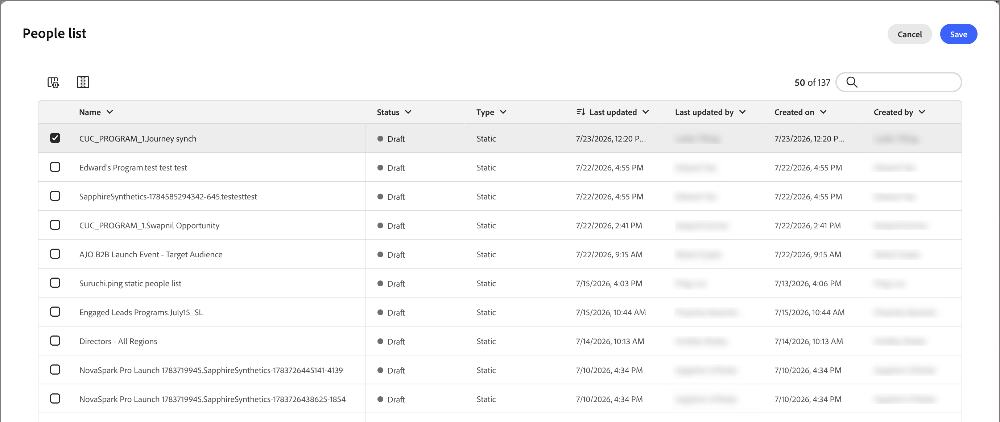
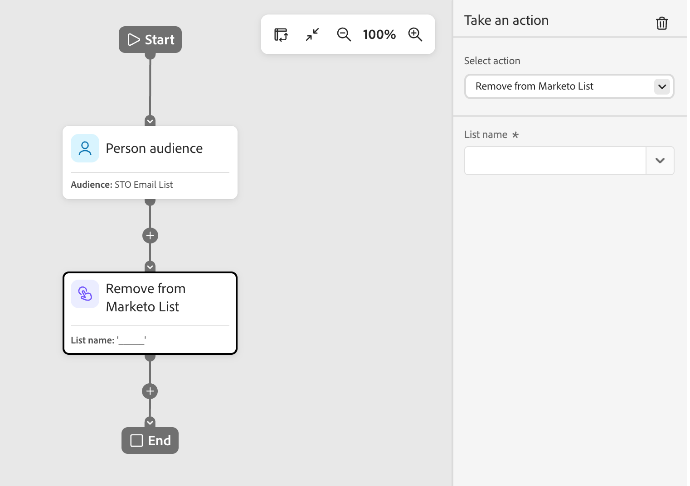

# Durchführen eines Aktionsknotens

Verwenden Sie auf einer Personen-Journey eine Aktion für Personen, wenn Sie eine Änderung auf alle Personen im Knotenpfad anwenden möchten.

## Aktionen und Einschränkungen {#actions}

| Aktion | Begrenzungen |
| ------ | ----------- |
| **[!UICONTROL Für Ziel aktivieren]** | <li>Statische Liste auswählen oder erstellen <li>Wenn die Liste kein aktiviertes Ziel hat, aktivieren Sie die Liste für ein oder mehrere Ziele |
| **[!UICONTROL Person zum Journey hinzufügen]** | <li>Geplante oder Live-Journey auswählen <li>Zielgruppenkriterien der Ziel-Journey werden nicht angewendet |
| **[!UICONTROL Zu Liste hinzufügen]** | <li>Erstellen einer neuen statischen Liste oder Auswählen einer vorhandenen Liste |
| **[!UICONTROL Zu Marketo-Liste hinzufügen]** | <li>Auswählen einer statischen Liste in Marketo Engage |
| **[!UICONTROL Ändern des Datenwerts]** | <li>Personenattribut auswählen <li>Neuen Wert festlegen |
| **[!UICONTROL Programmdaten ändern]** | <li>Programmattribut auswählen <li>Neuen Wert festlegen |
| **[!UICONTROL Programmstatus ändern]** | <li>Programm auswählen<li>Neuen Status auswählen |
| **[!UICONTROL Aus Liste entfernen]** | <li>Statische Liste auswählen <li>Überspringt eine Person, wenn sie kein aktuelles Mitglied ist |
| **[!UICONTROL Aus Marketo-Liste entfernen]** | <li>Auswählen einer statischen Liste in Marketo Engage <li>Überspringt eine Person, wenn sie kein aktuelles Mitglied ist |
| **[!UICONTROL Person von Journey entfernen]** | <li>Live-Journey auswählen <li>Überspringt die Person, wenn sie kein Mitglied der Ziel-Journey ist |
| **[!UICONTROL Marketo-Kampagne anfordern]** | <li>Marketo Engage-Kampagne auswählen |
| **[!UICONTROL E-Mail senden]** | <li>Erstellen, Bearbeiten oder Verwenden einer KI-personalisierten E-Mail <li>Optimierung des Versandzeitpunkts (optional) |
| **[!UICONTROL WhatsApp senden]** | <li>WhatsApp-Nachricht auswählen |

## Aktionsknoten hinzufügen {#add-an-action-node}

1. Navigieren Sie zur Journey-Arbeitsfläche.

1. Klicken Sie auf das Pluszeichen ( **+** ) auf einem Pfad und wählen Sie **[!UICONTROL Aktion ausführen]**.

   {width="200"}

1. Wählen Sie in den Knoteneigenschaften auf der rechten Seite eine Aktion aus der Liste aus und legen Sie beliebige Werte für die Aktion fest.

+++Für Ziel aktivieren

Mit dieser Aktion können Sie Personen zu einer statischen Liste hinzufügen und diese Liste direkt von Ihrem Journey aus für ein Ziel aktivieren. Sie können eine bestehende statische Liste verwenden oder eine speziell für die Journey erstellen.

>[!PREREQUISITES]
>
>Sie müssen mindestens ein [konfiguriertes Ziel](../audiences/destinations.md) für Ihre [!DNL Journey Optimizer B2B Prime]-Sandbox haben, bevor Sie einen Journey-Knoten _Für Ziel aktivieren_ einrichten.

{width="450"}

Wählen **[!UICONTROL unter „Zu Liste]**&quot; eine der folgenden Optionen:

* **[!UICONTROL Erstellen]** - Erstellen Sie eine neue statische Liste und fügen Sie Personen hinzu. Die Liste ist sofort unter &quot;**[!UICONTROL &quot;]**.

  Wählen Sie ein übergeordnetes Programm für die Liste aus und geben Sie einen **[!UICONTROL Namen]** (erforderlich) und **[!UICONTROL Beschreibung]** (optional) ein. Klicken Sie **[!UICONTROL Erstellen]**, um die neue Liste für den Knoten hinzuzufügen.

  {width="375"}

* **[!UICONTROL Auswählen]** - Wählen Sie eine vorhandene statische Liste aus, in der Sie Personen hinzufügen möchten, die den Knoten erreichen.

  Aktivieren Sie das Kontrollkästchen für die vorhandene statische Liste und klicken Sie auf **[!UICONTROL Speichern]**.

  {width="700" zoomable="yes"}

Jeder, der den Knoten erreicht, wird der ausgewählten statischen Liste hinzugefügt, die Aktion ist jedoch erst abgeschlossen, wenn die Liste für ein Ziel aktiviert wird:

* Wenn die ausgewählte Liste bereits aktiviert ist, werden ihre Ziele unter **[!UICONTROL Ziele]** angezeigt und die Aktion ist bereit.
* Andernfalls wird die Meldung _Mindestens ein Ziel ist erforderlich_ angezeigt. Klicken Sie **[!UICONTROL Liste für Ziel aktivieren]** wählen Sie das Ziel aus und klicken Sie auf **[!UICONTROL Speichern]**. Klicken **[!UICONTROL im]** auf „Aktivieren“.

{width="600" zoomable="yes"}

Nach Abschluss der Aktivierung wird das Ziel unter **[!UICONTROL Ziele]** angezeigt und die Aktion ist bereit. Sie können die Liste bei Bedarf für weitere Ziele aktivieren.

Jeder, der den Knoten erreicht, wird der ausgewählten statischen Liste hinzugefügt, die für das ausgewählte Ziel aktiviert wird, sodass er zu dieser Zielgruppe und wiederum zu jeder Kampagne, die von der Zielgruppe befüllt wird, hinzugefügt wird.

+++

+++[!UICONTROL Person zum Journey hinzufügen]

Verwenden Sie diese Aktion, um Personen zu anderen geplanten oder Live-Journey hinzuzufügen. Personen, die durch diese Aktion hinzugefügt wurden, werden sofort zur Audience der Ziel-Journey hinzugefügt; die Audience-Kriterien der Ziel-Journey werden nicht angewendet.

{width="450"}

+++

+++[!UICONTROL Zu Liste hinzufügen]

Mit dieser Aktion können Sie Personen zu einer statischen Liste in Journey Optimizer B2B Prime hinzufügen.

{width="450"}

Wählen Sie eine der folgenden Optionen:

* **[!UICONTROL Erstellen]** - Erstellen Sie ein neues statisches Listen-Asset und fügen Sie Personen hinzu. Die Liste ist sofort für die Verwendung durch andere Assets in Journey Optimizer B2B Prime verfügbar.
* **[!UICONTROL Auswählen]** - Wählen Sie ein vorhandenes statisches Listen-Asset aus, dem Sie Personen hinzufügen möchten, die den Knoten erreichen.

+++

+++[!UICONTROL Zu Marketo-Liste hinzufügen]

Mit dieser Aktion können Sie Personen zu einer statischen Liste in Marketo Engage hinzufügen.

{width="450"}

+++

+++[!UICONTROL Ändern des Datenwerts]

Verwenden Sie diese Aktion, um den Wert eines Attributs in einem Personendatensatz zu aktualisieren. Wählen Sie das Attribut aus und legen Sie den neuen Wert fest.

>[!TIP]
>
>Um den Wert eines Attributs zu löschen, setzen Sie den Wert auf `NULL`.

{width="450"}

+++

+++[!UICONTROL Programmdaten ändern]

Verwenden Sie diese Aktion, um den Wert eines Programmattributs zu aktualisieren. Wählen Sie das Programmattribut aus und legen Sie den neuen Wert fest.

{width="450"}

+++

+++[!UICONTROL Programmstatus ändern]

Verwenden Sie diese Aktion, um den Status einer Person in einem Marketo Engage-Programm zu ändern. Wählen Sie das Programm und dann den neuen Status aus.

{width="450"}

+++

+++[!UICONTROL Aus Liste entfernen]

Verwenden Sie diese Aktion, um Personen aus einer statischen Liste in Journey Optimizer B2B Prime zu entfernen. Wenn eine Person derzeit nicht in der Liste aufgeführt ist, wird die Aktion für diese Person übersprungen.

{width="450"}

+++

+++[!UICONTROL Aus Marketo-Liste entfernen]

Mit dieser Aktion können Sie Personen aus einer statischen Liste in Marketo Engage entfernen. Wenn eine Person derzeit nicht in der Liste aufgeführt ist, wird die Aktion für diese Person übersprungen.

{width="450"}

+++

+++[!UICONTROL Person von Journey entfernen]

Verwenden Sie diese Aktion, um Personen aus anderen Live-Personen-Journey zu entfernen. Die Person wird sofort von der Ziel-Journey entfernt und es werden keine weiteren Aktionen darauf durchgeführt. Wenn eine Person derzeit nicht Mitglied der Ziel-Journey ist, wird die Aktion für diese Person übersprungen.

{width="450"}

+++

+++[!UICONTROL Marketo-Kampagne anfordern]

Mit dieser Aktion können Sie Personen zu einer Anfragekampagne in einer verbundenen Marketo Engage-Instanz hinzufügen. Wählen Sie die Marketo Engage-Kampagne aus, die Sie anfordern möchten.

{width="450"}

+++

+++[!UICONTROL E-Mail senden]

Verwenden Sie diese Aktion, um eine E-Mail an angemeldete Personen zu senden. Personen, die sich abgemeldet, auf der Blockierungsliste aufgeführt, per E-Mail suspendiert oder Marketing ausgesetzt haben, überspringen diese Aktion.

{width="450"}

Sie können eine E-Mail erstellen, eine vorhandene E-Mail bearbeiten oder eine mit KI personalisierte E-Mail verwenden. Informationen zum Erstellen und Bearbeiten von E-Mails finden Sie unter [E-Mail-Kanal](./email-channel.md).

Sie können die [Optimierung des Versandzeitpunkts](./email-send-time-optimization.md) verwenden, um den Zeitpunkt des E-Mail-Versands zu personalisieren, indem Sie vorhersagen, wann jedes Profil mit der größten Wahrscheinlichkeit interagieren wird.

+++

+++[!UICONTROL WhatsApp senden]

Verwenden Sie diese Aktion, um eine WhatsApp-Nachricht zu senden. Sie können WhatsApp-Nachrichten im visuellen Design erstellen, personalisieren und in der Vorschau anzeigen (siehe [WhatsApp-Authoring](../content/whatsapp-authoring.md)).

{width="450"}

+++
