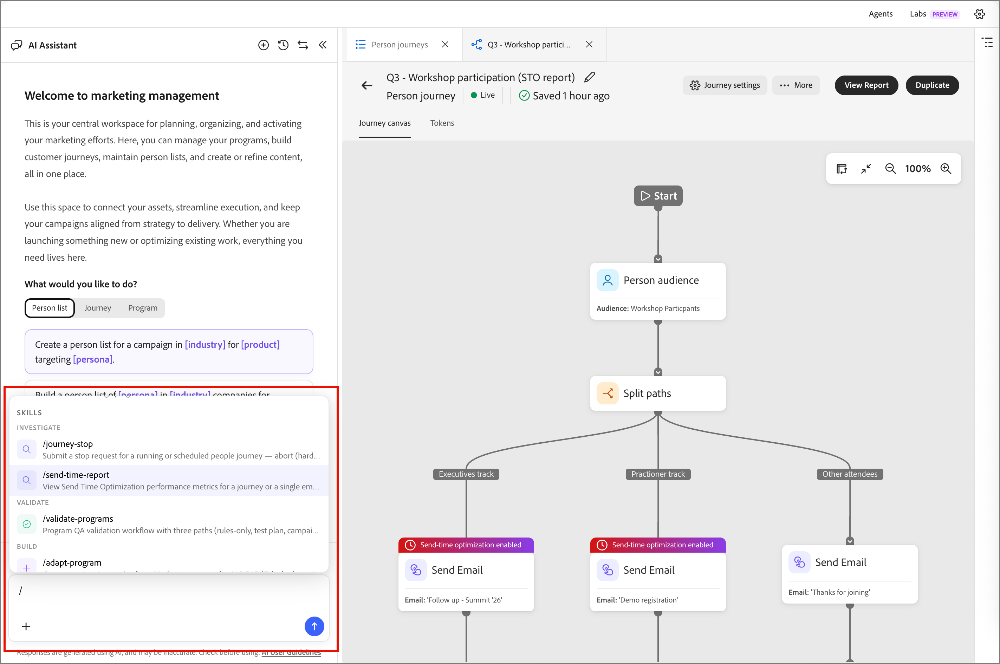

# Optimierung des E-Mail-Versandzeitpunkts

Verwenden Sie die Funktion „Optimierung des Versandzeitpunkts (STO)“, um den Versandzeitpunkt von E-Mails für [Personen-Journey](./person-journeys.md) zu personalisieren, indem Sie vorhersagen, wann jedes Profil am ehesten interagieren wird. Anstelle einer festen Versandzeit verwendet STO historische E-Mail-Interaktionssignale, um den Versand für jeden Empfänger zum optimalen Zeitpunkt zu planen und so die Interaktion insgesamt zu verbessern.

STO analysiert die historischen Interaktionen jedes Profils mithilfe eines großen Sprachmodells. Er sagt potenzielle Versandzeitpunkte voraus und stuft sie ein, und plant dann den Versand zum Zeitpunkt, der im Optimierungsfenster am höchsten rangiert.

Leistungseinblicke wie Nutzung, Interaktionssteigerung und STO-Vergleiche mit Nicht-STO-Vergleichen sind über Abfragen in natürlicher Sprache im KI-Assistenten verfügbar.

>[!BEGINSHADEBOX]

Es sind viele **_zukünftige Verbesserungen_** für STO geplant:

* Globale STOP-Konfiguration im Bereich _[!UICONTROL Admin]_
* STO-Aktivierung auf Journey-Ebene
* Konfigurierbare Test-/Kontrollaufteilungen

>[!ENDSHADEBOX]

## Konfiguration {#configuration}

Sie können die Sendezeitoptimierung konfigurieren, wenn Sie [&#x200B; Journey eine _[!UICONTROL Aktion durchführen]_-Knoten &#x200B;](./action-nodes.md) Person hinzufügen und die Aktion **[!UICONTROL E-Mail senden]** auswählen.

1. Wählen Sie den Aktionsknoten _E-Mail senden_ Journey aus.

1. Aktivieren Sie in den Knoteneigenschaften auf der rechten Seite die Option **[!UICONTROL Sendezeitoptimierung]** .

   {width="450" zoomable="no"}

1. Um das Fenster und die Testverteilung festzulegen, legen Sie die STO-Optionen fest:

   * **[!UICONTROL Senden innerhalb der nächsten]** - Dieser Wert bestimmt das Optimierungsfenster (in Tagen), das den Zeitraum angibt, in dem E-Mails zugestellt werden können. Ein Webinar, das beispielsweise in fünf Tagen stattfindet, kann vier oder fünf Tage dauern. STO wählt für jedes Profil in diesem Fenster die beste prognostizierte Versandzeit aus.

   * **STO / Feste Verteilung** - STO erstellt automatisch eine _Test- und Kontrollaufteilung_ um die geeigneten Profile zwischen optimierten und festen Versandzeiten zu unterteilen. Die Aufspaltung ermöglicht einen direkten Leistungsvergleich. (Es sind zukünftige Verbesserungen geplant, um benutzerdefinierte Aufspaltungsprozentsätze zuzulassen.)

   >[!NOTE]
   >
   >Profile mit einem starken Interaktionsverlauf werden gleichmäßig in Kontroll- und Testgruppen aufgeteilt, um die STO-Wirkung zu messen. Um statistisch verlässliche Ergebnisse zu gewährleisten, ist die Aufteilung zwischen STO und Nicht-STO zwischen 30 % und 70 % beschränkt. Dadurch wird verhindert, dass kleinere Kohorten die Ergebnisse verfälschen, und es werden aussagekräftige Vergleiche sichergestellt.

1. Direkt nach dem Knoten _[!UICONTROL E-Mail senden]_ [fügen Sie einen _Warten_-Knoten hinzu](./wait-nodes.md).

   Auf eine STO-aktivierte E-Mail-Aktion muss sofort ein Warteknoten folgen. Durch Hinzufügen dieses Knotens wird sichergestellt, dass Profile im Journey bleiben, bis das vollständige Optimierungsfenster gelöscht ist und alle STO-Sendungen abgeschlossen sind. Wenn Sie diesen Knoten auslassen, kennzeichnet das System die Konfiguration als ungültig.

1. Nachdem Sie den Rest der Personen-Journey abgeschlossen haben, fahren Sie mit [Veröffentlichen](./person-journeys.md#publish) fort.

## Berichterstellung {#reporting}

STO-Leistungsdaten sind über den [KI-Assistenten](../agents/chat-interface.md) verfügbar, der die `send-time-report` Kenntnisse verwendet. Sie können einen Bericht auf Journey-Ebene anzeigen, der alle E-Mail-Knoten zusammenfasst, oder für eine bestimmte E-Mail-Aktion einen Drilldown zu einem Bericht auf Knotenebene durchführen.

Der Bericht zeigt die einzelnen E-Mail-Knoten auf der Journey an und gibt an, ob STO dafür aktiviert ist. Außerdem wird ein tabellarischer Vergleich zwischen STO-aktivierten und Nicht-STO-E-Mails angezeigt, sodass Sie die Interaktionssteigerung auswerten können.

### STO-Bericht generieren {#generate-sto-report}

Es gibt drei Möglichkeiten, einen STO-Bericht mit dem KI-Assistenten zu generieren:

**Verwenden Sie den Schrägstrich**

1. Geben Sie im Bedienfeld KI-Assistent `/` ein, um die Liste der verfügbaren Fähigkeiten anzuzeigen.
1. Wählen Sie **[!UICONTROL Sendezeitbericht]** aus der Liste aus und klicken Sie auf den Nach-oben-Pfeil, um die Abfrage zu senden.

   {width="700" zoomable="yes"}

   Wenn eine Journey im Editor geöffnet ist, verwendet der KI-Assistent sie automatisch als Kontext. Andernfalls fordert Sie der Assistent auf, die Journey anzugeben.

   Der KI-Assistent lädt den Bericht und zeigt eine Zusammenfassungskarte an.

1. Klicken Sie **[!UICONTROL Bericht öffnen]**, um den vollständigen Bericht mit Details auf Knotenebene anzuzeigen.

**Auf einen E-Mail-Knoten klicken**

1. Klicken Sie auf der Journey-Arbeitsfläche auf den Knoten **[!UICONTROL E-Mail senden]**.

1. Fragen Sie im Bedienfeld KI-Assistent nach dem STO-Bericht.

   Da der Knoten ausgewählt ist, verwendet ihn der KI-Assistent als Kontext und gibt einen Bericht zurück, der nur für diesen Knoten gilt.

   Der Bericht wird geladen und eine Zusammenfassungskarte wird angezeigt.

1. Klicken Sie **[!UICONTROL Bericht öffnen]**, um den vollständigen Bericht anzuzeigen.

**Abfrage in natürlicher Sprache**

1. Geben Sie im KI-Assistentenfeld eine Anfrage ein, z. B _„Geben Sie mir den STO-Bericht für [Journey-Name]_.

   Der Assistent interpretiert die Anfrage, lädt die `send-time-report`, generiert den Bericht und zeigt eine Übersichtskarte an.

1. Klicken Sie **[!UICONTROL Bericht öffnen]**, um den vollständigen Bericht anzuzeigen.

### Anzeigen der E-Mail-Berichtsdaten {#sto-report-data}

Sie können das Bedienfeld KI-Assistent verkleinern, um die Größe des angezeigten Berichts zu erhöhen, oder scrollen, um die volle Breite zu sehen.

{width="700" zoomable="yes"}

Klicken Sie in _[!UICONTROL Spalte]_ Details **[!UICONTROL auf STO-Ergebnisse anzeigen]** um ein Popup-Fenster zu öffnen. Das Fenster bietet E-Mail _Datenvisualisierungen für_ Leistungsvergleich _(Sendezeitverteilung_ und _Datenintegrität_.

{width="500" zoomable="yes"}
