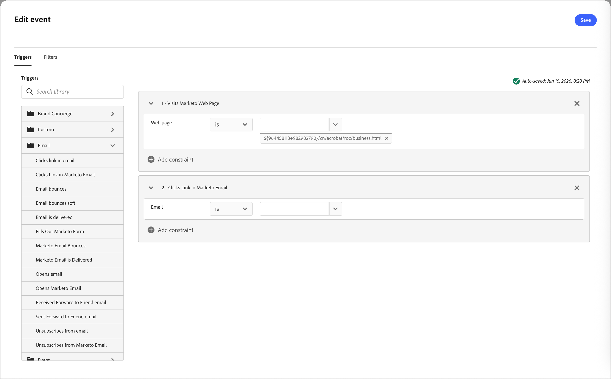

# Überwachen eines Ereignisknotens

Fügen Sie den Knoten _Auf ein Ereignis warten_ hinzu, um Ihre Zielgruppe beim Eintreten eines Ereignisses zum nächsten Schritt auf dem Journey zu bewegen.

## Ereignis-Trigger {#event-triggers}

Liste von PM abrufen

## Ereignisfilter {#event-filters}

Aktualisierte Liste von PM abrufen

| Filter | Beschreibung |
| ------- | ----------- |
| Aktivitätsverlauf > E-Mail | E-Mail-Aktivitäten basierend auf Bedingungen, die mithilfe einer oder mehrerer ausgewählter E-Mail-Nachrichten ausgewertet werden: <li>Link in E-Mail angeklickt <li>Hat E-Mail geöffnet |
| Aktivitätsverlauf > Datenwert geändert | Für ein ausgewähltes Personenattribut wurde ein Wert geändert. Zu diesen Änderungstypen gehören: <li>Neuer Wert <li>Vorheriger Wert <li>Grund <li>Quelle <li>Datum der Aktivität <li> Min. Häufigkeit |

## Ereignisknoten hinzufügen {#add-event-node}

1. Navigieren Sie zur Journey-Arbeitsfläche.

1. Klicken Sie auf das Pluszeichen ( **+** ) in einem Pfad und wählen Sie **[!UICONTROL Auf ein Ereignis überwachen]**.

   {width="200"}

1. Klicken Sie in den Knoteneigenschaften auf der rechten Seite **[!UICONTROL Ereigniskriterien hinzufügen]**.

1. Fügen Sie im _[!UICONTROL Ereignis bearbeiten]_ die Ereignisse zum Trigger hinzu.

   {width="600" zoomable="yes"}

1. (Optional) Wählen Sie **[!UICONTROL Dialogfeld die Registerkarte]** Filter“ aus und fügen Sie Filterkriterien für die Trigger hinzu.

1. Klicken Sie **[!UICONTROL Ereignis bearbeiten]** und definieren Sie Details für das Ereignis.

   {width="600" zoomable="yes"}

1. Klicken Sie auf **[!UICONTROL Speichern]**.

<!--
1. If needed, set the **[!UICONTROL Timeout]** option to limit the time period to listen for the event.

   >[!NOTE]
   >
   >The journey ends after a timeout unless you define a timeout path, where you can add other nodes.

   Enable the **[!UICONTROL Timeout]** option and select the duration for which the journey waits for an event to occur before it times out.

   You can choose to end the path here or take a different course of action by setting another path. To create a new path in the journey where you can add actions and events applicable to accounts when the event does not occur, select the **[!UICONTROL Set timeout path]** check box.

   {width="700" zoomable="yes"}
-->

>[!NOTE]
>
>Die Zeitüberschreitungsfunktion für das Überwachen eines Ereignisknotens funktioniert derzeit nicht. Es ist für eine spätere Version geplant.
