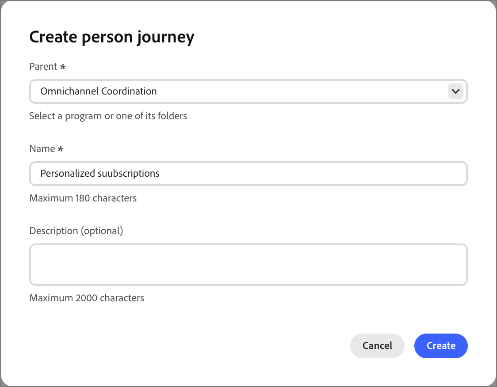
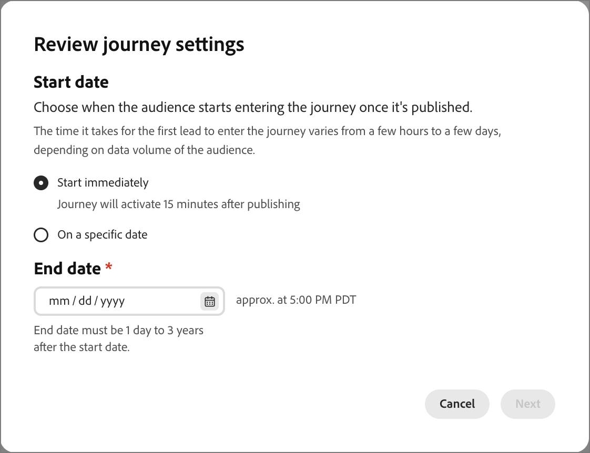
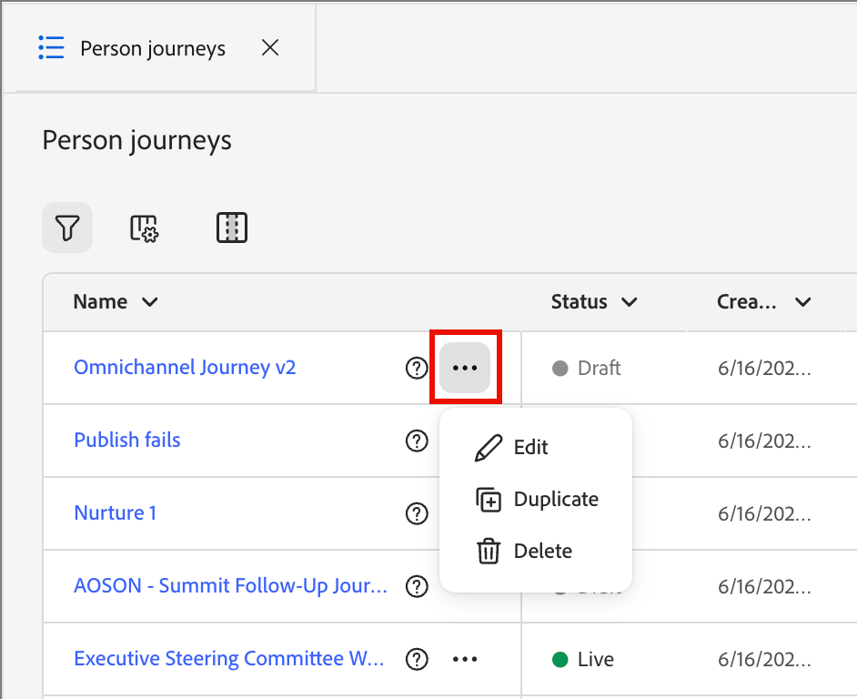

# Personen-Journeys

In der [!DNL Adobe Journey Optimizer B2B Edition Prime] sind Personen-Journey automatisierte, mehrstufige Lead-basierte Marketing-Pläne, die personalisierte Erlebnisse kanalübergreifend orchestrieren. Diese Journey verwenden Marketo Engage-Daten, um diese Marketing-Pläne als Reaktion auf Interaktionen, Geschäftsereignisse oder geplante Kampagnen auszuführen.

>[!NOTE]
>
>Jede Journey befindet sich innerhalb eines definierten [Programms](./programs.md). Vor der Erstellung einer Journey muss mindestens ein Programm als übergeordnetes Programm vorhanden sein.

_So erstellen Sie eine neue Personen-Journey :_

1. Erstellen Sie die Personen-Journey.
1. Fügen Sie die Knoten hinzu und definieren Sie den Journey-Ablauf auf der Journey-Arbeitsfläche.
1. [Veröffentlichen der Journey](#publish-a-journey).

## Zugreifen auf und Durchsuchen von Journey-Personen {#access-and-browse-person-journeys}

1. Erweitern Sie in der linken Navigation **[!UICONTROL Marketing-Verwaltung]**.

1. Wählen Sie rechts in der **[!UICONTROL Marketing]**-Ressourcenliste **[!UICONTROL Personen-Journey]** aus.

   Die _Personen-Journey_ Liste wird als Registerkartenseite im Hauptarbeitsbereich angezeigt.

   Um die angezeigte Liste nach Namen zu filtern _können Sie oben in der Liste_ Text in das Tool „Suchen“ eingeben.

   {width="800" zoomable="yes"}

1. Verwenden Sie die Listen-Tools, um die angezeigte Liste anzupassen:

   * Klicken Sie auf _Symbol_ FilternFiltersymbol), um die Liste nach Status zu filtern.
   * Klicken Sie auf _Tabelle anpassen_ (  ), um die angezeigten Spalten zu steuern.
   * Klicken Sie auf _Symbol „Spalten zurücksetzen_ (  ), um die Spaltenbreiten zurückzusetzen.

### Journey von Listenspalten {#journey-list-columns}

Die Listenseite Journey enthält die folgenden Spalten:

* [!UICONTROL Name] (klicken Sie auf den Namen, um die Journey-Arbeitsfläche zur Bearbeitung zu öffnen)
* [!UICONTROL Status]
* [!UICONTROL Erstellungsdatum]
* [!UICONTROL Erstellt von]
* [!UICONTROL Letzte Aktualisierung]
* [!UICONTROL Zuletzt aktualisiert von]
* [!UICONTROL Veröffentlicht auf]
* [!UICONTROL Veröffentlicht von]
* [!UICONTROL Startdatum]
* [!UICONTROL Enddatum]

Sie können die Liste nach _[!UICONTROL Status]_, _[!UICONTROL Erstellungsdatum]_ oder _[!UICONTROL Letzte Aktualisierung)]_, indem Sie auf die Spaltenüberschrift klicken. Sie können die Begrenzungen der Überschriften erfassen und ziehen, um die angezeigten Spaltenbreiten zu ändern. Aktivieren _oder deaktivieren Sie im Dialogfeld_ Tabelle anpassen“ die Kontrollkästchen und klicken Sie auf **[!UICONTROL Übernehmen]**.

### Journey-Status {#journey-status}

Der Status einer Journey kann sich entsprechend den von Ihnen durchgeführten Aktionen ändern. Je nach Status einer Journey stehen bestimmte Aktionen rechts in der Kopfzeile zur Verfügung.

| Status | Beschreibung | Verfügbare Aktionen |
| ------ | ----------- | ----------------- |
| _&#x200B;**Entwurf**&#x200B;_ | Eine unveröffentlichte Journey, die bearbeitet werden kann. | [Veröffentlichen](#publish-a-journey), [Duplizieren](#duplicate-a-journey), [Löschen](#delete-a-journey) |
| _&#x200B;**Live**&#x200B;_ | Der Journey-Status ändert sich von _Entwurf_ zu _Live_, wenn Sie eine Journey veröffentlichen. In diesem Status kann sie nicht mehr bearbeitet werden. | [Duplicate](#duplicate-a-journey), [Close to new entries](#close-to-new-entries), [Abort](#abort-a-journey) |
| _&#x200B;**Für neue Eintritte geschlossen**&#x200B;_ | Der Journey-Status ändert sich von _Live_ zu _Geschlossen zu neuen Einträgen_ wenn Sie im Journey-Header auf **[!UICONTROL Für neue Einträge schließen]** klicken. | [Duplizieren](#duplicate-a-journey), [Abbrechen](#abort-a-journey) |
| _&#x200B;**Abgebrochen**&#x200B;_ | Der Journey-Status ändert sich von _Live_ oder _Für neue Eintritte geschlossen_, wenn Sie eine Journey abbrechen. Eine abgebrochene Journey kann nicht neu gestartet werden. | [Duplizieren](#duplicate-a-journey), [Löschen](#delete-a-journey) |
| _&#x200B;**Beendet**&#x200B;_ | Wenn alle Personen-Zielgruppenmitglieder auf einer Journey die Journey abschließen, ändert sich der Status von _Live_ oder _Geschlossen zu neuen Einträgen_ zu _Beendet_. | [Duplizieren](#duplicate-a-journey), [Löschen](#delete-a-journey) |

## Erstellen einer Personen-Journey {#create-a-person-journey}

1. Klicken **[!UICONTROL oben rechts]** der Journey-Liste auf &quot;Journey erstellen“.

1. Wählen Sie im Dialogfeld das **[!UICONTROL Parent]**-Programm für die Personen-Journey aus.

1. Geben Sie einen eindeutigen **[!UICONTROL Name]** (erforderlich) und **[!UICONTROL Beschreibung]** (optional) ein.

   {width="400"}

1. Klicken Sie auf **[!UICONTROL Erstellen]**.

   Die Journey-Arbeitsfläche wird mit dem Zielgruppenknoten Person geöffnet.

   {width="600" zoomable="yes"}

### Journey-Header {#journey-header}

Die Kopfzeile jeder Journey-Arbeitsfläche enthält den Journey-Namen, den Status und den Zeitplan.

{width="600" zoomable="yes"}

* Klicken Sie auf _Bearbeiten_-Symbol (  ), um den Journey-Namen oder die Beschreibungsinformationen zu ändern.
* Klicken Sie auf **[!UICONTROL Journey-Einstellungen]**, um den Journey-Start und die Wiederholung zu ändern.
* Klicken Sie auf **[!UICONTROL … Mehr]** Zum Anwenden einer Journey-Aktion oder Aktivieren/Deaktivieren der [Journey-Traffic-Steuerung](./journey-traffic-control.md) und erneuten Eingabe.
* Wenn alle Fehler behoben sind und Sie die Journey aktivieren möchten, klicken Sie auf &quot;**[!UICONTROL &quot;]**.

### Journey-Design {#journey-design}

Die _Journey-Arbeitsfläche_ ist der zentrale Bereich im Journey-Arbeitsbereich. Hier können Sie Journey-Knoten hinzufügen und konfigurieren. Klicken Sie auf einen Knoten, um seine Eigenschaften im Bedienfeld rechts neben dem Layout zu öffnen und sie entsprechend Ihrem Design festzulegen. Eine Personen-Journey beginnt immer mit einem [_[!UICONTROL Personen-Zielgruppe &#x200B;]_-](./person-audience-node.md), in dem Sie die Eingabe für die Journey definieren können.

Nachdem Sie eine Personen-Journey erstellt und die Personen-Audience definiert haben, erstellen Sie die Journey mithilfe von -Knoten. Die Journey-Arbeitsfläche bietet einen visuellen Design-Bereich, in dem Sie Ihre mehrstufigen B2B-Marketing-Anwendungsfälle erstellen können, indem Sie die folgenden Knotentypen verwenden, um die Journey zu erstellen:

* [Durchführen einer Aktion](./action-nodes.md)
* [Auf ein Ereignis lauschen](./listen-for-event-nodes.md)
* [Warten](./wait-nodes.md)
* [Pfade aufteilen](./split-merge-paths-nodes.md)
* [Nächster bester Pfad](./next-best-path.md)
* [Pfade zusammenführen](./split-merge-paths-nodes.md)

## Journey-Verwaltung {#journey-management}

Öffnen Sie die Journey-Liste, um den Journey-Status zu überprüfen, Änderungen vorzunehmen und Maßnahmen zu ergreifen.

### Journey-Aktionen {#journey-actions}

Die Journey-Listenseite enthält alle Journey von Personen in Ihrer Journey Optimizer B2B Prime-Instanz. Auf der Listenseite können Sie eine Reihe von Aktionen auf eine Journey anwenden.

#### Veröffentlichen einer Journey {#publish}

Sie können eine Journey veröffentlichen, wenn keine Blocker-Fehler vorliegen. Nach der Veröffentlichung ändert sich der Journey-Status in _Live_. Wenn der Journey Fehler aufweist, ist **[!UICONTROL Schaltfläche]** Veröffentlichen“ mit der `Resolve errors before publishing` abgeblendet.

1. Öffnen Sie die Entwurfs-Journey über die Liste _[!UICONTROL Personen-Journey]_ .

1. Klicken Sie oben rechts auf der Journey-Arbeitsfläche auf &quot;**[!UICONTROL &quot;]**.

1. Legen Sie _[!UICONTROL Dialogfeld &quot;Journey-Einstellungen überprüfen]_ die Journey-Startoptionen fest.

   Wenn Sie bereits einen Zeitplan in den **[!UICONTROL Journey-Einstellungen definiert haben]** überprüfen Sie die Einstellungen.

   Wenn Sie die Journey-Aktivierung festlegen müssen, wählen Sie einen Zeitplantyp aus:

   * Um die Journey zum Zeitpunkt der Veröffentlichung zu aktivieren, wählen Sie **[!UICONTROL Sofort]**.
   * Um die Journey für ein Datum in der Zukunft zu aktivieren, wählen Sie **[!UICONTROL An einem bestimmten Datum]** und klicken Sie auf das _Kalender_-Symbol, um das Datum auszuwählen.

1. Geben Sie bei Bedarf das **[!UICONTROL Enddatum]** für die Journey an.

   {width="400" zoomable="no"}

   Sie kann maximal drei Jahre vom Startdatum entfernt sein. Dieses Feld ist für die Veröffentlichung erforderlich.

1. Klicken Sie auf **[!UICONTROL Weiter]**.

1. Klicken Sie im Bestätigungsdialogfeld auf **[!UICONTROL Veröffentlichen]**.

#### Abbruch einer Journey {#abort-a-journey}

Wenn Sie eine Live-Journey oder eine Journey, die für ein künftiges Startdatum geplant ist, abbrechen (stoppen), stoppen Personen auf der Journey sofort ihren Fortschritt, und es kann kein weiterer Journey-Eintritt erfolgen. Eine abgebrochene Journey kann nicht neu gestartet werden.

1. Öffnen Sie die Journey über die Liste _[!UICONTROL Personen-Journey]_.

1. Klicken Sie auf **[!UICONTROL … Mehr]** oben rechts und wählen Sie **[!UICONTROL Abbrechen]**.

   {width="600" zoomable="yes"}

1. Klicken Sie im Bestätigungsdialogfeld auf **[!UICONTROL Abbrechen]**.

#### Schließen für neue Eintritte {#close-to-new-entries}

Wenn Sie eine Live-Journey für neue Einträge schließen, setzen Personen, die sich derzeit auf der Journey befinden, ihren Pfad auf dieser Journey fort, und es kann kein weiterer Journey-Eintritt erfolgen. Eine geschlossene Journey kann nicht neu gestartet werden. Sie können eine geschlossene Journey duplizieren.

1. Öffnen Sie die Journey über die Liste _[!UICONTROL Personen-Journey]_.

1. Klicken Sie auf **[!UICONTROL … Mehr]** oben rechts und wählen Sie **[!UICONTROL Für neue Einträge schließen]**.

1. Klicken Sie im Bestätigungsdialogfeld auf **[!UICONTROL Für neue Einträge schließen]**.

#### Duplizieren einer Journey {#duplicate-a-journey}

Die Aktion „Duplizieren“ ähnelt einer Klonfunktion, wobei eine duplizierte Journey aber keine erstellten Journey-Inhalts-Assets enthält. Sie können die Details für die Journey duplizieren, oder nur ein einfaches Skelett der Fluss- und Pfadstruktur.

1. Klicken Sie in der _[!UICONTROL Personen]_ Journey _Liste auf das Symbol Mehr_ ( **…** ) neben dem Namen der Journey und wählen Sie **[!UICONTROL Duplizieren]**.

   {width="400"}

   Abhängig vom Status der Journey können Sie über die Journey-Details oder die Journey-Arbeitsfläche auch auf die Duplikataktion zugreifen:

   * Klicken Sie für eine Entwurfs-Journey auf **[!UICONTROL … Mehr]** oben rechts und wählen Sie **[!UICONTROL Duplizieren]**.
   * Klicken Sie bei Journeys mit anderen Status oben rechts auf **[!UICONTROL Duplizieren]**.

1. Wählen Sie im Dialogfeld das **[!UICONTROL Parent]**-Programm für die duplizierte Journey aus.

1. Geben Sie einen eindeutigen **[!UICONTROL Name]** (erforderlich) und **[!UICONTROL Beschreibung]** (optional) ein.

   Standardmäßig verwendet das Dialogfeld den Namen der Ursprungs-Journey, an die `_copy` angehängt ist. Geben Sie bei Bedarf einen anderen eindeutigen Namen für die Journey ein.

   {width="370"}

1. Wählen Sie den **[!UICONTROL Typ]** der Duplizierung:

   * **[!UICONTROL Duplizierung von Teilinhalten]**: Verwenden Sie diesen Typ, um alles in der Journey zu kopieren, ausgenommen alle erstellten E-Mails bzw. SMS-Nachrichten. Knoten, die auf eine Marketo Engage-E-Mail oder -SMS verweisen, sind vollständig intakt.

   * **[!UICONTROL Ohne Details duplizieren]** - Verwenden Sie diesen Typ, um nur die Knotenstruktur und die Pfade zu kopieren. Alle Knoteneinstellungen und Pfadbedingungen sind nicht definiert (Standard), sodass Sie den grundlegenden Fluss mit unterschiedlichen Einstellungen für Zielgruppen, Aktionen und Pfadsegmentierungen wiederverwenden können. Für alle Warteknoten wird der Standardwert von fünf Tagen verwendet.

1. Klicken Sie auf **[!UICONTROL Duplizieren]**.

   Die duplizierte Journey wird auf der Journey-Arbeitsfläche geöffnet, wo Sie die Details festlegen und nach Bedarf Journey-Inhalte erstellen können.

#### Löschen einer Journey {#delete-a-journey}

Verwenden Sie die Aktion „Löschen“, um eine Journey dauerhaft zu löschen. Live-Journey oder Journey, die für ein künftiges Startdatum geplant sind, können nicht gelöscht werden.

>[!WARNING]
>
>Das Löschen einer Journey ist dauerhaft und kann nicht rückgängig gemacht werden.

1. Klicken Sie in der _[!UICONTROL Personen]_ Journey _Liste auf das Symbol Mehr_ ( **…** ) neben dem Namen der Journey und wählen Sie **[!UICONTROL Löschen]**.

   Je nach Status der Journey können Sie auch über den Journey-Header auf die Löschaktion zugreifen:

   * Klicken Sie für eine Entwurfs-Journey auf **[!UICONTROL … Mehr]** oben rechts und wählen Sie **[!UICONTROL Löschen]**.
   * Klicken Sie bei anderen Journeys mit anderen Status wie _Abgeschlossen_ oder _Abgebrochen_ oben rechts auf **[!UICONTROL Löschen]**.

1. Klicken Sie im Bestätigungsdialog auf **[!UICONTROL Löschen]**.
