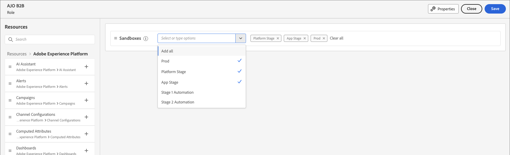

# Benutzerzugriff und Berechtigungen

Nachdem die Bereitstellung abgeschlossen und Sandboxes gebunden sind, führen Sie die folgenden Schritte aus, um Ihrem Team und Ihren Benutzenden Zugriff auf Adobe Journey Optimizer B2B edition zu gewähren.

1. [Erstellen eines Adobe Journey Optimizer B2B edition-Produktprofils](#ajo-b2b-profile) in der Admin Console (nur einmaliges/erstes Setup).
1. [Hinzufügen einer Benutzergruppe](#add-user-group) in der Admin Console.
1. [Bearbeiten von integrierten Rollen](#edit-roles-for-product-permissions) oder [Erstellen einer benutzerdefinierten Rolle](#create-a-custom-role) mit Berechtigungen für Journey Optimizer B2B edition in Adobe Experience Platform.
1. [Hinzufügen von ](#add-users-to-a-role) oder [Gruppen](#add-user-groups-to-a-role) zu Rollen in Adobe Experience Platform.

Als Admin können Sie diese Aufgaben in der Adobe Admin Console ausführen, die ein zentraler Ort für die Verwaltung Ihrer Adobe-Produktlizenzen und Benutzenden ist. In der Admin Console können Sie Benutzende an einem zentralen Ort anstatt in Ihren individuellen Lösungen erstellen und verwalten. Weitere Informationen zu den Funktionen und Leistungsmerkmalen von finden Sie auf der Seite Übersicht über Admin Console .

## Die Admin Console aufrufen

Bevor Sie die Admin Console zum Verwalten von Benutzenden in Ihrem Team verwenden können, müssen Sie sicherstellen, dass Sie auf die Admin Console zugreifen können und über die entsprechenden Berechtigungen verfügen.

1. Als System-Admin sollten Sie im Rahmen des Onboarding-Prozesses mehrere E-Mails von Adobe erhalten.

   Suchen Sie nach der Begrüßungs-E-Mail mit Informationen zum Namen der Organisation, auf die Sie Zugriff erhalten haben.

1. Klicken Sie auf **[!UICONTROL Link]** Erste Schritte“ in Ihrer Begrüßungs-E-Mail, um zur Admin Console zu navigieren.

   Wenn Sie die E-Mail nicht finden können, öffnen Sie einen Browser unter [https://adminconsole.adobe.com](https://adminconsole.adobe.com) direkt zur Admin Console.

1. Melden Sie sich mit Ihrer Adobe ID an.

   Nach erfolgreicher Anmeldung sehen Sie die _Übersicht_ der Adobe Admin Console.

1. Wenn Sie Zugriff auf mehrere Organisationen haben, stellen Sie sicher, dass Sie sich bei der richtigen Organisation angemeldet haben.

   Um Ihre Organisation zu ändern, klicken Sie oben rechts auf den Organisationsnamen und wählen Sie die Organisation aus, auf die Sie Zugriff benötigen.

1. Wählen Sie **[!UICONTROL Administratoren]** auf der Karte _[!UICONTROL Benutzer]_ aus, um zu überprüfen, ob Sie ein Systemadministrator sind.

   {width="800" zoomable="yes"}

1. Suchen Sie durch Eingabe Ihrer Adobe ID-E-Mail-Adresse, Ihres Benutzernamens, Vor- oder Nachnamens.

   * Wenn Ihr Zugriff richtig konfiguriert ist, gibt die Suche Ihren Datensatz zurück.

   * Wenn in der Spalte **[!UICONTROL ADMINISTRATORROLLE]** der Wert &quot;`System`&quot; angezeigt wird, bedeutet dies, dass Sie (oder die angezeigte Person) System-Admin sind.

## Erstellen des Adobe Journey Optimizer B2B edition-Produktprofils {#ajo-b2b-profile}

Wenn Sie Benutzenden Zugriff auf eine Adobe-Lösung gewähren, möchten Sie ihnen nicht unbedingt uneingeschränkten Zugriff gewähren. Produktprofile ermöglichen es jeder Lösung, über eigene Benutzerberechtigungen zu verfügen. Verwenden Sie die Admin Console, um Produktprofile zuzuweisen.

Weitere Informationen zur Verwendung von Produktprofilen für Benutzerberechtigungen finden Sie unter [_Verwalten von Produktprofilen für Unternehmensbenutzer_](https://helpx.adobe.com/de/enterprise/using/manage-product-profiles.html){target="_blank"} in der Dokumentation zu Admin Console.

{width="30"} Ein Systemadministrator oder Adobe Journey Optimizer B2B edition-Produktadministrator kann die folgenden Schritte ausführen.

1. Anmelden bei [https://adminconsole.adobe.com](https://adminconsole.adobe.com).

1. Wählen Sie die Registerkarte **[!UICONTROL Produkte]** aus.

1. Öffnen Sie die Adobe Journey Optimizer B2B edition-Instanz, der Sie das Profil hinzufügen möchten, und klicken Sie auf **[!UICONTROL Neues Profil]**.

   {width="600" zoomable="yes"}

1. Geben Sie einen Produktprofilnamen ein, z. B. _B2B-Benutzer_.

1. Klicken Sie **[!UICONTROL Weiter]** und dann **[!UICONTROL Speichern]**.

## Hinzufügen einer Benutzergruppe {#add-user-group}

Eine Benutzergruppe ist eine Sammlung von Benutzern, denen ein gemeinsamer Berechtigungssatz gewährt wird. Sie können Benutzer in Ihrer Benutzergruppe hinzufügen oder entfernen. Die Gruppenberechtigungen bleiben unverändert, während die Benutzer innerhalb der Gruppe wechseln.

Weitere Informationen dazu, wie Benutzergruppen zum Verwalten von Berechtigungen verwendet werden, finden Sie unter [Verwalten von Benutzergruppen](https://helpx.adobe.com/de/enterprise/using/user-groups.html){target="_blank"} in der Dokumentation zu Admin Console.

{width="30"} Ein Systemadministrator kann die folgenden Schritte ausführen.

1. Anmelden bei [https://adminconsole.adobe.com](https://adminconsole.adobe.com).

1. Wählen Sie die **[!UICONTROL Benutzer]** aus.

1. Wählen **[!UICONTROL Benutzergruppen]** im linken Navigationsbereich aus.

1. Klicken **[!UICONTROL oben]** auf „Neue Benutzergruppe“.

1. Geben Sie einen Namen für die Benutzergruppe ein, z. B. _B2B-Journey-Benutzer_ und klicken Sie auf **[!UICONTROL Speichern]**.

   {width="600" zoomable="yes"}

## Benutzer zur neuen Gruppe hinzufügen {#add-users}

Informationen zur Benutzerverwaltung finden Sie unter [_Adobe Admin Console-Benutzer_](https://helpx.adobe.com/de/enterprise/using/users.html){target="_blank"} in der Dokumentation zu Admin Console.

{width="30"} Ein System- oder Produktadministrator kann die folgenden Schritte ausführen. Ein Produktadministrator kann nur Benutzer hinzufügen, die bereits in seiner Organisation vorhanden sind.

1. Navigieren Sie zu [https://adminconsole.adobe.com](https://adminconsole.adobe.com).

1. Klicken _[!UICONTROL unter &quot;]_&quot; auf **[!UICONTROL Benutzer hinzufügen]**.

1. Fügen Sie jeden Benutzer hinzu:

   * Geben Sie die E-Mail-Adresse, den Vornamen und den Nachnamen des Benutzers ein.

     {width="600" zoomable="yes"}

   * Klicken Sie **[!UICONTROL „Benutzergruppen]** auf **+**.

   * Wählen Sie die zuvor erstellte Benutzergruppe aus.

   * Klicken Sie auf **[!UICONTROL Übernehmen]**.

1. Klicken Sie auf **[!UICONTROL Speichern]**.

## Produktprofil zuweisen {#assign-profile}

>[!IMPORTANT]
>
>Fügen Sie beim Konfigurieren von Benutzergruppen immer Benutzer zur Gruppe hinzu, bevor Sie das Produktprofil der Gruppe zuweisen. Wenn Sie ein Produktprofil einer leeren Benutzergruppe zuweisen und danach Benutzer hinzufügen, wird der Zugriff nicht korrekt weitergegeben. Um sicherzustellen, dass Berechtigungen angewendet werden, füllen Sie die Benutzergruppe zuerst mit Mitgliedern und weisen Sie dann die Produktprofile zu.

{width="30"} Ein Produktadministrator kann die folgenden Schritte ausführen.

1. Klicken Sie auf die Benutzergruppe, der Sie Benutzer hinzugefügt haben.

1. Wählen Sie die Registerkarte **[!UICONTROL Zugewiesene Produktprofile]** und klicken Sie auf **[!UICONTROL Profil zuweisen]**.

1. Klicken Sie auf **+** und fügen Sie jede Instanz der folgenden Produkte hinzu:

   * [!UICONTROL Adobe Journey Optimizer B2B edition - Benutzerprofil]
   * [!UICONTROL Adobe Experience Platform - AEP-default-all-users]
   * [!UICONTROL Adobe Experience Platform-Datenerfassung - Standardzugriff auf die Datenerfassung für alle]
   * [!UICONTROL Adobe Experience Platform - Standardzugriff auf alle Produktionsumgebungen]

   {width="600" zoomable="yes"}

1. Klicken Sie auf **[!UICONTROL Speichern]**.

## Rollen für Produktberechtigungen bearbeiten {#edit-roles-for-product-permissions}

Berechtigungen sind Einzelrechte, mit denen Sie die einem Produktprofil zugewiesenen Berechtigungen definieren können. Jede Berechtigung wird unter einer Funktion wie Journey oder Einkaufsgruppen gruppiert, die Funktionen in Journey Optimizer B2B edition repräsentiert.

Im _Berechtigungen_ von Adobe Experience Platform können Admins Benutzerrollen und Zugriffsrichtlinien definieren, um Zugriffsberechtigungen für Funktionen und Objekte innerhalb einer Produktanwendung zu verwalten. In dieser App können Sie Rollen erstellen und verwalten sowie die gewünschten Ressourcenberechtigungen für diese Rollen zuweisen. Mit Berechtigungen können Sie auch die Sandboxes und die Benutzer verwalten, die einer bestimmten Rolle zugeordnet sind.

Weitere Informationen zu Rollenberechtigungen in Experience Platform finden Sie unter [Verwalten von Berechtigungen für eine Rolle](https://experienceleague.adobe.com/en/docs/experience-platform/access-control/abac/permissions-ui/permissions){target="_blank"} in der Dokumentation zu Experience Platform.

<!--

### B2B product permissions {#b2b-product-permissions}

The following permissions govern access to Journey Optimizer B2B Edition capabilities:

| Category | Description | Permissions |
| -------- | ----------- | ---------- |
| B2B Account Lists | Configure, manage, view, and publish permissions for B2B account lists. These permissions include actions such as add, remove, import, and delete accounts from account lists. | <li>Manage B2B Account Lists |
| B2B Admin Configurations | Configure, manage, and view permissions for B2B administrative configurations. These permissions include digital asset management connections, asset repositories, and events. | <li>Manage B2B Admin Configurations |
| B2B Assets | Configure, manage, and view permissions for B2B assets. These permissions include emails, SMS, landing pages, fragments, templates, and images. | <li>Manage B2B Assets <li>Manage B2B Templates <li>Manage B2B Fragments <li>Manage B2B Emails |
| B2B Buying Groups | Configure, manage, and view permissions for B2B buying groups. These permissions include solution interests, roles templates, and buying group status. | <li>Manage B2B Buying Groups <li>Manage B2B Solution Interests <li>Manage B2B Role Templates <li>Manage B2B Stages <li>View B2B Buying Groups |
| B2B Channel Configurations | Configure, manage, and view permissions for B2B channel configurations. These permissions include settings for communication limits, API credentials, and security settings. | <li>Manage B2B Channels Configurations |
| B2B Dashboards | Configure and view permissions for B2B dashboards. These permissions include account engagement, buying group stages, surging accounts, and contact coverage. | <li>View B2B Engagement Dashboard |
| B2B Journeys | Configure, manage, view, and publish permissions for B2B journeys. These permissions include account and person actions, event listeners, and split paths. | <li>Manage B2B Account Journeys |
| Journey Optimizer Rules | Access and configure frequency rules (communication limits). These permissions should be limited to product administrators. | <li>View Frequency Rules <li>Manage Frequency Rules |
-->

### Integrierte B2B-Rollen {#b2b-built-in-roles}

Wenn Ihr Unternehmen Journey Optimizer B2B edition bereitgestellt hat, verfügt Experience Platform über eine Reihe integrierter (standardmäßiger) Rollen, mit denen Sie den Zugriff auf die Produktfunktionen verwalten können:

| Rolle | Berechtigungen |
| ---- | ----------- |
| B2B Journey Manager | <li>B2B-Journey verwalten <li>Verwalten von B2B-Einkaufsgruppen <li>Verwalten von B2B-Kontolisten <li>Dashboard für B2B-Interaktionen anzeigen <li>Dashboard für B2B-Insights anzeigen |
| B2B-Kanal-Manager | <li>Verwalten von B2B-Assets <li>B2B-Vorlagen verwalten <li>Verwalten von B2B-Fragmenten |
| B2B-Systemadministrator | <li>Verwalten von B2B-Kanal-Konfigurationen <li>Verwalten von B2B-Admin-Konfigurationen |
| B2B-Verkaufsbenutzer | <li>Dashboard für B2B-Interaktionen anzeigen <li>B2B-Einkaufsgruppen anzeigen <li>Zugriff auf CRM-interne Einblicke |

### Rollenberechtigungen bearbeiten {#edit-role-permissions}

Für integrierte oder benutzerdefinierte Rollen können Sie sich jederzeit entscheiden, Berechtigungen hinzuzufügen oder zu löschen. Wenn Sie eine standardmäßige oder benutzerdefinierte Rolle ändern, wirkt sich dies auf jeden Benutzer aus, der dieser Rolle zugewiesen ist.

Im folgenden Beispiel möchten Sie Berechtigungen im Zusammenhang mit der B2B-Journey-Ressource für Benutzer hinzufügen, die der Rolle B2B-Kanal-Manager zugewiesen sind. Durch diese Änderung können Benutzende für diese Rolle auch Account-Journey verwalten.

>[!NOTE]
>
>Ein Admin Console-Systemadministrator kann die folgenden Schritte ausführen.

_So ändern Sie die Berechtigungen für eine Rolle :_

1. Navigieren Sie zu [experience.adobe.com](https://experience.adobe.com/).

1. Wählen Sie im Bedienfeld _[!UICONTROL Schnellzugriff]_ die Option **[!UICONTROL Berechtigungen]** aus.

   >[!NOTE]
   >
   >Wenn „Berechtigungen _[!UICONTROL nicht angezeigt wird]_ müssen Sie möglicherweise auf **[!UICONTROL Alle anzeigen]** klicken und diese aus den verfügbaren Programmen auswählen.

   {width="700" zoomable="yes"}

1. Wählen **[!UICONTROL Rollen]** im linken Navigationsbereich aus.

1. Klicken Sie auf den **_B2B-Kanal_** Manager-Rollennamen.

1. Klicken Sie auf der Detailseite oben **[!UICONTROL auf]** Bearbeiten“.

   {width="700" zoomable="yes"}

   Im Rolleneditor wird im Menü _[!UICONTROL Ressourcen]_ die Liste der Ressourcen angezeigt, die für die Produkte Experience Cloud - Plattformgestützte Anwendungen gelten.

   Sie können im Suchwerkzeug _B2B_ eingeben, um die Liste nach den B2B-Produktberechtigungen zu filtern.

1. Klicken Sie auf _Hinzufügen_-Symbol (**+**) für die Ressource B2B-Journey .

   {width="700" zoomable="yes"}

1. Wählen Sie auf der _[!UICONTROL B2B-Journey]_ Berechtigungskarte **[!UICONTROL B2B-Konto-Journey verwalten]** aus.

1. Klicken Sie auf **[!UICONTROL Speichern]**.

   <!-- {width="700" zoomable="yes"} -->

1. Klicken Sie **[!UICONTROL Schließen]**, um zur Detailseite zurückzukehren.

### Benutzer zu einer Rolle hinzufügen {#add-users-to-a-role}

{width="30"} Ein Systemadministrator oder AEP-Produktadministrator kann die folgenden Schritte ausführen.

1. Öffnen Sie die Rollendetails und wählen Sie die Registerkarte **[!UICONTROL Benutzer]** aus.

   Auf dieser Registerkarte wird eine Liste aller Benutzer angezeigt, die der Rolle zugewiesen wurden.

1. Klicken Sie **[!UICONTROL Benutzer hinzufügen]**.

   {width="700" zoomable="yes"}

1. Suchen Sie im _[!UICONTROL Benutzer hinzufügen]_ die Benutzer, die Sie der Rolle hinzufügen möchten, und wählen Sie sie aus.

   * Sie können das Suchwerkzeug verwenden, um die Benutzerliste zu filtern.

   * Aktivieren Sie das Kontrollkästchen für jeden Benutzer.

   {width="600" zoomable="yes"}

1. Klicken Sie **[!UICONTROL Speichern]**, wenn Sie alle Benutzenden ausgewählt haben, die Sie hinzufügen möchten.

### Hinzufügen von Benutzergruppen zu einer Rolle {#add-user-groups-to-a-role}

Informationen zur Benutzerverwaltung finden Sie unter [_Adobe Admin Console-Benutzer_](https://helpx.adobe.com/de/enterprise/using/users.html){target="_blank"} in der Dokumentation zu Admin Console.

{width="30"} Ein Systemadministrator oder AEP-Produktadministrator kann die folgenden Schritte ausführen.

1. Öffnen Sie die Rollendetails und wählen Sie die Registerkarte **[!UICONTROL Benutzergruppen]** aus.

   Auf dieser Registerkarte wird eine Liste aller Benutzergruppen angezeigt, die der Rolle zugewiesen sind.

1. Klicken Sie **[!UICONTROL Gruppen hinzufügen]**.

   {width="700" zoomable="yes"}

1. Suchen Sie im _[!UICONTROL Gruppen hinzufügen]_ die Gruppen, die Sie der Rolle hinzufügen möchten, und wählen Sie sie aus.

   * Sie können das Suchwerkzeug verwenden, um die Liste der Benutzergruppen zu filtern.

   * Aktivieren Sie das Kontrollkästchen für jede Benutzergruppe.

   {width="600" zoomable="yes"}

1. Klicken Sie **[!UICONTROL Speichern]**, wenn Sie alle Gruppen ausgewählt haben, die Sie hinzufügen möchten.

## Erstellen einer benutzerdefinierten Rolle {#create-a-custom-role}

{width="30"} Ein Systemadministrator oder AEP-Produktadministrator kann die folgenden Schritte ausführen.

1. Wählen Sie **[!UICONTROL linken Navigationsbereich die Option]** Rollen“ und dann **[!UICONTROL Rolle erstellen]** aus.

1. Geben _[!UICONTROL im Dialogfeld Neue Rolle erstellen]_ einen Namen für die Rolle ein, z. B. _B2B-Marketer_ und eine Beschreibung (optional).

1. Klicken Sie auf **[!UICONTROL Bestätigen]**.

1. Wählen Sie Ihre Sandboxes aus.

   {width="700" zoomable="yes"}

1. B2B-Produktberechtigungen hinzufügen:

   <!-- To determine which product capabilities that you want for the role, refer to the list of [B2B product permissions](#b2b-product-permissions). -->

   Suchen Sie in der _[!UICONTROL Ressourcen]_-Liste auf der linken Seite die B2B-Elemente und klicken Sie auf das _Hinzufügen_-Symbol (**+**), um jedes Attribut hinzuzufügen, das Sie für die Rolle aktivieren möchten.

   Sie können im Suchwerkzeug _B2B_ eingeben, um die Liste nach den B2B-Produktberechtigungen zu filtern.

   {width="700" zoomable="yes"}

1. Klicken **[!UICONTROL oben]** auf „Speichern“.

1. Gehen Sie zu den Rollendetails und wählen Sie die Registerkarte **[!UICONTROL Benutzergruppen]** aus.

1. Klicken Sie **[!UICONTROL Gruppen hinzufügen]**.

   {width="700" zoomable="yes"}

1. Aktivieren Sie das Kontrollkästchen neben der Benutzergruppe, die Sie zuvor in der Admin Console erstellt haben.

1. Klicken Sie auf **[!UICONTROL Speichern]**.

Ihre benutzerdefinierte Rolle ist konfiguriert, und Benutzerinnen und Benutzer in der zugewiesenen Gruppe können jetzt auf die von Ihnen ausgewählten Journey Optimizer B2B edition-Funktionen zugreifen.
