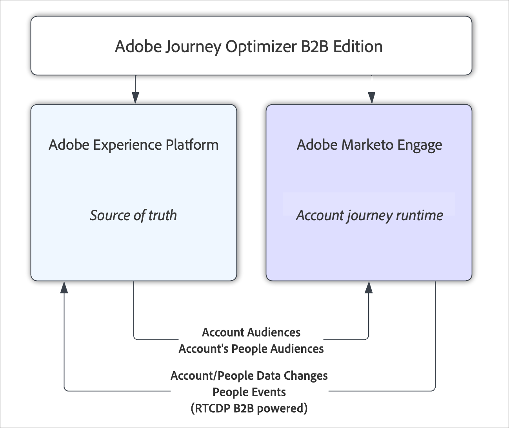

# Adobe Journey Optimizer B2B Edition – Überblick

Mit Adobe Journey Optimizer B2B Edition können Sie Konto- und Käufergruppen-Journeys mithilfe der integrierten generativen KI und einer branchenführenden Automatisierung koordinieren, um die Nachfrage nach spezifischen Angeboten mithilfe Marketing-qualifizierter Käufergruppen zu maximieren.

## Konto-Journeys mit Käufergruppen

Beim Vergleich der Account-Journey mit den Journey-Funktionen in Marketo Engage und Adobe Journey Optimizer Standard besteht der Hauptunterschied darin, dass Account-Journey Konten über den Journey verschieben, nicht über Personen. Eine Person, die einem Konto zugeordnet ist, weist in der Regel einen nicht-linearen Verlauf auf, der auf dem Fortschreiten des Kontos durch die Journey basiert, und nicht auf ihren individuellen Aktionen. Wenn sich beispielsweise ein Account in einer frühen Phase des Kauf-Journey befindet, werden in der Regel Informationen zu allgemeinen Lösungsmöglichkeiten oder -funktionen gesendet. Im weiteren Verlauf des Kaufprozesses werden die Inhalte zielgerichteter auf bestimmte Angebote oder andere Artikel ausgerichtet, die auf den Abschluss eines Verkaufs abzielen. Nach dem Kauf der Lösung ändern sich die Informationen erneut, um Anleitungen, Best Practices oder Informationen über bevorstehende Ereignisse oder Inhalte über zusätzliche Upsells bereitzustellen. Selbst wenn eine Person nicht mit Inhalten der frühen Phase interagiert hat, können Sie sie basierend auf den Aktionen anderer in ihrem Konto oder ihrer Einkaufsgruppe in die aktuelle Phase weiterleiten.

## Allgemeine Architektur

Adobe Journey Optimizer B2B Edition verwendet _Kontozielgruppen_ und _Personenzielgruppen_ aus Adobe Experience Platform, um eine Konto-Journey anzutreiben, die innerhalb von Marketo Engage ausgeführt wird. Experience Platform ist immer die Hauptquelle für diese Daten, aber die Ausführung und Verarbeitung der Account-Journey erfolgt innerhalb der B2B-Marketing-Infrastruktur von Marketo Engage. Durch die Orchestrierung werden Daten nahezu in Echtzeit über den vorhandenen Quell-Connector von Marketo Engage – Adobe Real-Time CDP B2B Edition an Experience Platform zurückgegeben, der Datenänderungen von Marketo Engage an Experience Platform streamt.

{width="500" zoomable="yes"}

>[!NOTE]
>
>Überprüfen Sie Ihre Lizenzberechtigungen und die entsprechende [Produktbeschreibung](https://helpx.adobe.com/de/legal/product-descriptions/adobe-journey-optimizer-b2b.html){target="_blank"} auf Leitlinien für die Leistung und statische Einschränkungen.

### Abonnementmodell

Ein Paar Experience Platform (AEP)-Sandboxes mit einem Marketo Engage _Munchkin_-Abonnement definiert ein Journey Optimizer B2B edition-Abonnement. Es ist nicht möglich, ein einzelnes Marketo Engage-Abonnement mit mehr als einer AEP-Sandbox zu kombinieren. Wenn Sie dagegen entscheiden, ein bestehendes Marketo Engage-Abonnement mit Journey Optimizer B2B Edition zu kombinieren, erhalten Sie ein neues, leeres Marketo Engage-Abonnement zur Verwendung mit Journey Optimizer B2B Edition.

Experience Platform bietet eine einheitliche Ansicht der Daten von Marketo Engage-Instanzen und angehängten CRM-Systemen, damit diese Daten mithilfe einer Account-Journey verarbeitet werden können.

### Vorgänge in der Konto-Journey

Konto-Journeys werden in Journey Optimizer B2B Edition erstellt und in der Marketo Engage-Instanz gespeichert, die mit dem Abonnement verknüpft ist. Obwohl sie im Marketo Engage-Datenspeicher gespeichert sind, sind sie nicht in der Marketo Engage-Benutzeroberfläche sichtbar und nur in Journey Optimizer B2B edition verwendbar.

Eine Konto-Journey beginnt immer mit der Auswahl eines Kontosegments, das als Kontozielgruppe für die Journey verwendet werden soll. Die Auswahl der Zielgruppe erfolgt über die standardmäßige Zielgruppenauswahlkomponente in Experience Platform. Anschließend können Marketing-Fachleute die Konto-Journey implementieren, indem sie die Pfade der Journey nach ihren eigenen Kriterien aufteilen (z. B. Kontokriterien, Personenkriterien oder Käufergruppenkriterien). In jeder Verzweigung können Aktionen zur Implementierung der Journey durchgeführt werden, z. B. das Senden einer E-Mail oder das Warten auf ein Ereignis.

Nachdem die Konto-Journey erstellt wurde, muss sie veröffentlicht werden. Zum Zeitpunkt der Veröffentlichung wird die Konto-Journey validiert und in eine Reihe von Marketo Engage-Kampagnen konvertiert, die das Journey-Erlebnis implementieren. Data Integration Services werden kontaktiert, um den Datenfluss zu starten, der wiederum die Journey-Vorgänge für das Konto startet. Der erste Schritt besteht darin, die Segmente für die Personen des Kontos zu erstellen.

### Datenfluss

Journey Optimizer B2B Edition verwendet die Real-Time CDP-Kontosegmentierung zum Definieren sowie zum Ausführen von Kontosegmenten und zugehörigen Kontopersonensegmenten, die für Journeys erforderlich sind. Wenn eine veröffentlichte Journey ausgeführt wird, können sich Daten über Personen und Konten ändern, und es werden Daten über die Personen erfasst, die mit der Journey interagieren. Journey Optimizer B2B edition nutzt den Marketo Engage-Quell-Connector für Real-Time CDP B2B edition, um Datenänderungen zurück an die Experience Platform-Sandbox zu übertragen, die die primäre Datenquelle ist.  Diese Daten werden nahezu in Echtzeit an AEP übermittelt.

Nur die vorhandenen Datentypen, die vom Quell-Connector von Marketo Engage unterstützt werden (Konten, Personen und Opportunitys), fließen zurück in Real-Time CDP. Das bedeutet, dass Daten zu Käufergruppen nicht an AEP übermittelt werden, sondern sich in der Marketo Engage-Instanz befinden, die vom Journey Optimizer B2B Edition-Abonnement verwendet wird.
