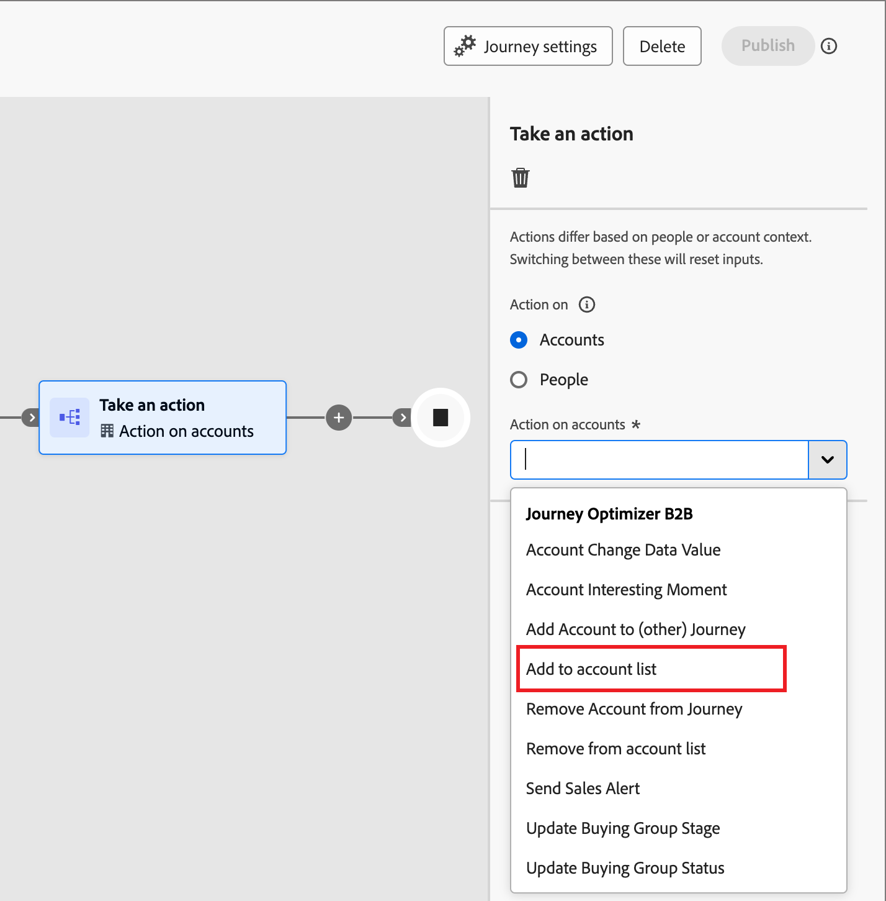

# Verwenden von Kontolisten in Journey und Programmen

Es gibt mehrere Möglichkeiten, Live (veröffentlichte)-Account-Listen in die Account-Journey zu integrieren.

## Konto-Zielgruppenknoten

Alle Account-Journey beginnen mit einem [_Account-Zielgruppe_-Knoten](../journeys/account-audience-nodes.md). Wenn Sie diesen Knoten so einstellen, dass er eine Kontenliste verwendet, durchlaufen die Mitgliederkonten die Journey, sobald sie live (veröffentlicht) geschaltet wird.

1. Wählen Sie die Option **[!UICONTROL Kontoliste]** für den _Kontozielgruppe_ Startknoten aus.

   {width="500"}

1. Klicken Sie **[!UICONTROL Kontoliste hinzufügen]**.

1. Aktivieren Sie das Kontrollkästchen für die Kontoliste und klicken Sie auf **[!UICONTROL Speichern]**.

   {width="600" zoomable="yes"}

## Aktionsknoten ausführen - Zum Konto hinzufügen

**_Nur statische Kontolisten_**

Fügen Sie innerhalb einer Konto-Journey Konten mithilfe eines [einer Aktion _-_ zu einer statischen Kontoliste ](../journeys/action-nodes.md).

Sie könnten beispielsweise einen Journey-Pfad haben, über den Sie eine E-Mail senden, und einige Konten führen als Antwortaktionen verschiedene Aktionen aus. Sie betrachten diese Aktivität als Qualifizierungspunkt auf der Journey. Mit der Qualifizierung können Sie sie zu einer Kontenliste hinzufügen, die als Zielgruppe für eine andere Journey mit einem anderen Verlauf für qualifizierte Konten verwendet wird.

>[!NOTE]
>
>Wenn sich zum Zeitpunkt der Ausführung des Knotens bereits ein Konto in der Liste befindet, wird die Aktion ignoriert.

1. Wählen Sie die Option _[!UICONTROL Aktion auf]_ **[!UICONTROL Konten]** aus.

1. Wählen Sie _[!UICONTROL Aktion für Konten]_ die Option **[!UICONTROL Zur Kontoliste hinzufügen]** aus.

   {width="500"}

1. Wählen **[!UICONTROL unter „Live-]**-Kontoliste auswählen“ die Kontoliste aus, der Sie Konten hinzufügen möchten.

   {width="500"}

## Aktionsknoten ausführen - Aus Konto entfernen

**_Nur statische Kontolisten_**

Entfernen Sie auf einer Konto-Journey Konten mithilfe des Knotens [Aktion ausführen _aus_ statischen ](../journeys/action-nodes.md).

Sie könnten beispielsweise einen Journey-Pfad haben, über den Sie eine E-Mail senden, und einige Konten führen als Antwortaktionen verschiedene Aktionen aus. Sie betrachten diese Aktivität als Qualifizierungspunkt auf der Journey. Mit dieser Qualifizierung möchten Sie sie aus einer Kontenliste entfernen, die als Audience für eine andere Journey verwendet wird, die zusätzliche E-Mails sendet, damit Sie Ihre Qualifizierungskommunikationen nicht duplizieren.

>[!NOTE]
>
>Wenn sich ein Konto nicht in der Liste befindet, aus der es entfernt werden soll, wird die Aktion ignoriert.

1. Wählen Sie die Option _[!UICONTROL Aktion auf]_ **[!UICONTROL Konten]** aus.

1. Wählen Sie _[!UICONTROL Aktion für Konten]_ die Option **[!UICONTROL Aus Kontoliste entfernen]** aus.

   {width="500"}

1. Wählen **[!UICONTROL unter „Live-]**-Kontoliste auswählen“ die Kontoliste aus, aus der Sie Konten entfernen möchten.

   {width="500"}

## Marketo Engage-Programm - Liste der Mitglieder eines Kontos

Als Marketing-Experte können Sie Programme in Marketo Engage für Personen unterdrücken, die Teil der Kontolisten in Journey Optimizer B2B edition sind.

In der Marketo Engage-Instanz, die mit Journey Optimizer B2B edition verbunden ist, können Sie den Filter _[!UICONTROL Mitglied der]_) in Ihren Smart Lists verwenden, um diese Leads entsprechend Ihrer Kampagnenstrategie zu identifizieren. Weitere Informationen zu Smart-Listen finden Sie in der [Dokumentation zu Marketo Engage](https://experienceleague.adobe.com/en/docs/marketo/using/product-docs/core-marketo-concepts/smart-lists-and-static-lists/understanding-smart-lists){target="_blank"}.

### Hinzufügen des Filters zu einer Smart-Liste

1. Wählen Sie in Marketo Engage eine Kampagne aus und klicken Sie auf die Registerkarte **[!UICONTROL Smart-Liste]**.

1. Geben Sie in der rechts angezeigten Filterliste `Member` ein und suchen Sie den Filter **[!UICONTROL Mitglied der Kontenliste]**.

1. Ziehen Sie den Filter auf die Arbeitsfläche Smart List .

1. Legen Sie auf der Arbeitsfläche „Smart List **[!UICONTROL den Listenwert]** Mitglied des Kontos“ fest.

   Klicken Sie auf den Abwärtspfeil, um alle Kontolisten anzuzeigen, oder geben Sie einen Teil des Namens der Kontoliste ein, um die benötigte Kontoliste zu finden.

   {width="800" zoomable="yes"}

1. Fügen Sie im Kampagnenfluss den Schritt **[!UICONTROL Zu Liste hinzufügen]** hinzu und wählen Sie die Liste aus, in die Sie die Personen aus der Journey Optimizer B2B edition-Kontoliste einfügen möchten.

   Siehe _[Hinzufügen eines Flussschritts zu einer Smart-Kampagne](https://experienceleague.adobe.com/en/docs/marketo/using/product-docs/core-marketo-concepts/smart-campaigns/flow-actions/add-a-flow-step-to-a-smart-campaign){target="_blank"}_ in der Marketo Engage-Dokumentation , um detaillierte Informationen zum Hinzufügen von Schritten zu einem Fluss zu erhalten.

### Mitglieder überprüfen

Nach der Ausführung des Flusses können Sie die Liste der Personen anzeigen, die in der Liste aufgeführt sind. Öffnen Sie die Liste und wählen Sie die Registerkarte Personen aus.

{width="800" zoomable="yes"}
