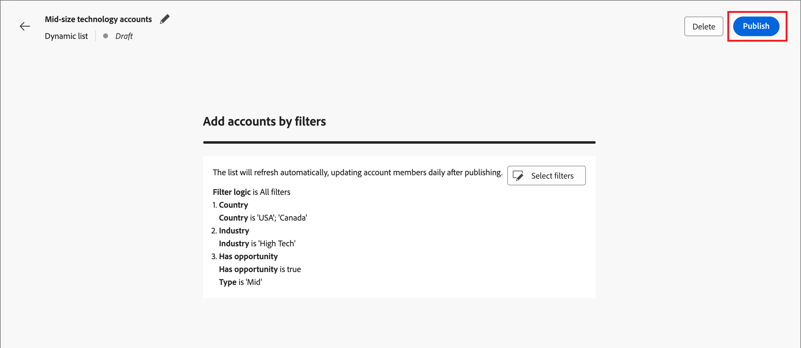

# Kontolisten

In Journey Optimizer B2B edition ist eine Kontenliste eine Sammlung benannter Konten, die Marketing-Experten für die gezielte Journey-Orchestrierung verwenden können. Eine Account-Liste kann benannte Accounts nach Ihren definierten Kriterien wie Branche, Standort oder Größe des Unternehmens auswählen. Es gibt zwei Arten von Kontolisten:

* **Statisch** - Bei einer statischen Kontoliste ändert sich die Liste nur, wenn Sie die Konten hinzufügen. Sie können Konten manuell hinzufügen, indem Sie einen Filtersatz anwenden, um die Liste auf der Grundlage der aktuellen Kontodaten zu füllen, oder Konten über eine Konto-Journey hinzufügen und entfernen.
* **Dynamisch** - Mit einer dynamischen Kontenliste definieren Sie einen Filtersatz, mit dem die Liste automatisch kuratiert wird. Das System verwendet diesen Filtersatz, um Konten entsprechend den Änderungen in den Kontoinformationen hinzuzufügen und zu entfernen. Diese Listenverwaltung ähnelt der [Zielgruppensegmentierung in Real-time Customer Data Platform](https://experienceleague.adobe.com/en/docs/experience-platform/rtcdp/segmentation/b2b){target="_blank"}.

Wenn sich eine Kontoliste im _Live_-Status (veröffentlicht) befindet, ist sie für die [Verwendung in Account-Journey- und Marketo Engage-Programmen](./account-lists-journeys.md) verfügbar.

>[!NOTE]
>
>Account-Listen nutzen Account-Daten aus Marketo Engage, um Account-Segmente und -Listen zu erstellen. Wenn also ein Kontosegment aus Adobe Experience Platform nicht aktiv mit Marketo Engage synchronisiert wird, sind Konten in diesem Experience Platform-Segment möglicherweise nicht in Journey Optimizer B2B edition-Kontolisten verfügbar. Anschließend können Personen aus Konten in Experience Platform-Segmenten, die nicht mit Marketo Engage synchronisiert sind, nicht in die Anzahl der Personenmitgliedschaften einbezogen oder in Trigger-Ereignissen gezählt werden.

## Zugreifen auf und Durchsuchen von Kontolisten

Erweitern Sie in der linken Navigation **[!UICONTROL Konten]** und klicken Sie auf **[!UICONTROL Kontolisten]**.

{width="800" zoomable="yes"}

Die angezeigte _[!UICONTROL Kontolisten]_ enthält die folgenden Spalten:

* [!UICONTROL Name] (klicken Sie auf den Namen der Kontoliste, um die Details anzuzeigen)
* [!UICONTROL Status]
* [!UICONTROL Typ]
* [!UICONTROL Zuletzt aktualisiert am]
* [!UICONTROL Zuletzt aktualisiert von]
* [!UICONTROL Erstellungsdatum]
* [!UICONTROL Erstellt von]

Diese Tabelle bietet die Möglichkeit, nach Namen zu suchen. Die Sortierfunktion ist derzeit nicht verfügbar.

Sie können die angezeigte Tabelle anpassen, indem Sie auf das Symbol _Spalteneinstellungen_ (  ) in der oberen rechten Ecke klicken und die Kontrollkästchen aktivieren oder deaktivieren.

{width="300"}

Um die Beschreibung einer Kontoliste anzuzeigen, klicken Sie auf das Symbol _Informationen_ (  ) neben dem Namen.

## Erstellen einer Kontoliste

Wenn Sie eine Kontoliste erstellen, definieren Sie einen Satz von Filtern, um die Liste zu generieren. Sie können damit beispielsweise eine Liste von Konten generieren, bei denen die Branche das Gesundheitswesen ist und der Umsatz über 100 Millionen Dollar beträgt.

1. Klicken Sie _[!UICONTROL der Seite]_ Kontolisten“ oben rechts auf **Seite auf** Kontoliste erstellen“.

   {width="700" zoomable="yes"}

1. Geben _[!UICONTROL im Dialogfeld Kontoliste erstellen]_ einen eindeutigen **[!UICONTROL Name]** (erforderlich) und einen **[!UICONTROL Beschreibung]** (optional) ein.

1. Wählen Sie den _[!UICONTROL Typ]_ für die Kontoliste aus **[!UICONTROL Statisch]** oder **[!UICONTROL Dynamisch]**.

   {width="380"}

1. Klicken Sie auf **[!UICONTROL Erstellen]**.

   Eine neue Liste mit statischen Konten wird mit einer leeren Liste von Konten geöffnet. Eine neue Liste dynamischer Konten wird mit dem Bedienfeld _[!UICONTROL Konten nach Filter hinzufügen]_ auf der Seite geöffnet.

## Hinzufügen von Konten zur Kontoliste

Für eine statische Liste können Sie mit der Veröffentlichung der leeren Kontoliste fortfahren und Konten über eine Konto-Journey hinzufügen. Sie können Konten auch manuell hinzufügen, indem Sie einen Filtersatz anwenden, bevor Sie ihn veröffentlichen.

Für eine dynamische Kontoliste müssen Sie vor der Veröffentlichung den Filtersatz hinzufügen, mit dem Sie die Liste automatisch verwalten möchten.

>[!BEGINTABS]

>[!TAB Statische Kontoliste]

Nachdem Sie die Liste der statischen Konten erstellt haben, können Sie sie durch Anwenden eines Filtersatzes auffüllen. Sie können auch einen Filtersatz anwenden, um Konten zu einer statischen Kontoliste hinzuzufügen, nachdem sie veröffentlicht wurde (_Live_).

>[!NOTE]
>
>Wenn Sie möchten, dass die Kontoliste als leer beginnt, wählen Sie keine Filter aus und veröffentlichen Sie einfach die Kontoliste. Es ist nützlich, mit einer leeren Liste zu beginnen, wenn Sie planen, Mitglieder über eine Konto-Journey-Aktion hinzuzufügen (siehe [Aktionsknoten ausführen - Zum Konto hinzufügen](#take-an-action-node---add-to-account)).

1. Klicken Sie auf **[!UICONTROL Konten hinzufügen]**.

   {width="700" zoomable="yes"}

   Sie können auf diese Funktion in der leeren Listenseite oder oben rechts zugreifen.

1. Fügen Sie im Dialogfeld _[!UICONTROL Konten nach Filter hinzufügen]_ im Menü **[!UICONTROL Kontofilter]** die Attribute und Aktivitäten hinzu, die Sie zum Erstellen des Filtersatzes verwenden möchten:

   Die Filter werden in Kategorieordnern verschachtelt. Sie können jeden Ordner erweitern und durch die Listen der verfügbaren Filter scrollen. Oder verwenden Sie das _Suchen_-Tool oben, um den benötigten Filter zu finden.

   * Ziehen Sie den Filter aus dem linken Menü in den Bereich für die Filterdefinition.
   * Füllen Sie die Definition für die Übereinstimmungsbewertung aus.
   * Wiederholen Sie diese Aktionen für jeden Filter, den Sie einbeziehen möchten.

     {width="700" zoomable="yes"}

   * Sie können Ihre Bedingungen anpassen, indem Sie oben die **[!UICONTROL Filterlogik]** anwenden. Sie können festlegen, ob alle Attributbedingungen oder eine beliebige Bedingung erfüllt werden sollen.

     {width="450"}

1. Wenn der Filtersatz und die Logik abgeschlossen sind, klicken Sie auf **[!UICONTROL Konten]**.

   Der Populationsprozess kann einige Zeit in Anspruch nehmen, je nach der Anzahl der auszuwertenden und auszufüllenden Konten (die Größe Ihrer Datenbank und die ausgewählten Filterkriterien). Es kann bis zu zwei Stunden dauern, bis Konten in Ihrer Liste ausgefüllt sind.

Sie können mit der Veröffentlichung der Liste fortfahren, um sie für das Hinzufügen und Entfernen von Aktionen auf einer Konto-Journey verfügbar zu machen.

>[!TAB Dynamische Kontoliste]

Nachdem Sie eine dynamische Kontoliste erstellt haben, definieren Sie den Filtersatz, mit dem die Liste (Konten hinzufügen/entfernen) verwaltet wird, wenn sie _Live_ (veröffentlicht) ist. Sie können keine Konten über die Konto-Journey hinzufügen/entfernen, aber es ist eine veröffentlichte dynamische Kontoliste für den Zielgruppenknoten des Startkontos verfügbar.

1. Klicken Sie **[!UICONTROL Filter auswählen]**.

   {width="700" zoomable="yes"}

1. Fügen Sie im Dialogfeld _[!UICONTROL Konten nach Filter hinzufügen]_ im Menü **[!UICONTROL Kontofilter]** die Attribute und Sonderfilter hinzu, die Sie zum Erstellen des Filtersatzes verwenden möchten:

   Die Filter werden in Kategorieordnern verschachtelt. Sie können jeden Ordner erweitern und durch die Listen der verfügbaren Filter scrollen. Oder verwenden Sie das _Suchen_-Tool oben, um den benötigten Filter zu finden.

   * Ziehen Sie den Filter aus dem linken Menü in den Bereich für die Filterdefinition.
   * Füllen Sie die Definition für die Übereinstimmungsbewertung aus.
   * Wiederholen Sie diese Aktionen für jeden Filter, den Sie einbeziehen möchten.

     {width="700" zoomable="yes"}

   * Sie können Ihre Bedingungen anpassen, indem Sie oben die **[!UICONTROL Filterlogik]** anwenden. Sie können festlegen, ob alle Attributbedingungen oder eine beliebige Bedingung erfüllt werden sollen.

     {width="450"}

1. Klicken Sie nach Abschluss des Filtersatzes und der Logik auf **[!UICONTROL Fertig]**.

   Wenn Sie mit dem Filtersatz zufrieden sind, können Sie mit dem Schritt [Liste veröffentlichen](#publish-an-account-list) fortfahren, um sie für den ersten [Konto-Zielgruppenknoten](#account-audience-node) auf einer Konto-Journey verfügbar zu machen.

   >[!NOTE]
   >
   >Sie können die Filter für eine dynamische Kontoliste nicht aktualisieren, nachdem die Liste veröffentlicht wurde.

   Der Populationsprozess kann einige Zeit in Anspruch nehmen, je nach der Anzahl der auszuwertenden und auszufüllenden Konten (die Größe Ihrer Datenbank und die ausgewählten Filterkriterien). Es kann bis zu zwei Stunden dauern, bis Konten in Ihrer Liste ausgefüllt sind.

>[!ENDTABS]

## Kontoliste veröffentlichen

Sie können mit dem Veröffentlichen einer Kontoliste fortfahren, sobald der Filtersatz abgeschlossen ist.

>[!BEGINTABS]

>[!TAB Statische Kontoliste]

1. Klicken **[!UICONTROL oben]** auf „Veröffentlichen“.

   {width="700" zoomable="yes"}

1. Klicken Sie im Dialogfeld _[!UICONTROL Statische Kontoliste veröffentlichen]_ zur Bestätigung auf **[!UICONTROL Veröffentlichen]**.

   {width="400"}

Der Status der statischen Kontoliste ändert sich in _[!UICONTROL Live]_ und sie ist für die [Verwendung auf einer Konto-Journey) ](#account-list-usage-in-account-journeys).

>[!TAB Dynamische Kontoliste]

Sie können mit dem Veröffentlichen einer dynamischen Kontoliste fortfahren, sobald der Filtersatz abgeschlossen ist. Nachdem sich die Kontenliste im Status Live befindet, kann sie in einem Journey-Knoten der Kontenzielgruppe ausgewählt werden.

1. Klicken **[!UICONTROL oben]** auf „Veröffentlichen“.

   {width="700" zoomable="yes"}

1. Klicken Sie im Dialogfeld _[!UICONTROL Dynamische Kontoliste veröffentlichen]_ zur Bestätigung auf **[!UICONTROL Veröffentlichen]**.

   {width="400"}

Der Status der dynamischen Kontenliste ändert sich in _[!UICONTROL Live]_ und sie kann auf [ Konto-Journey verwendet ](#account-list-usage-in-account-journeys).

>[!ENDTABS]
