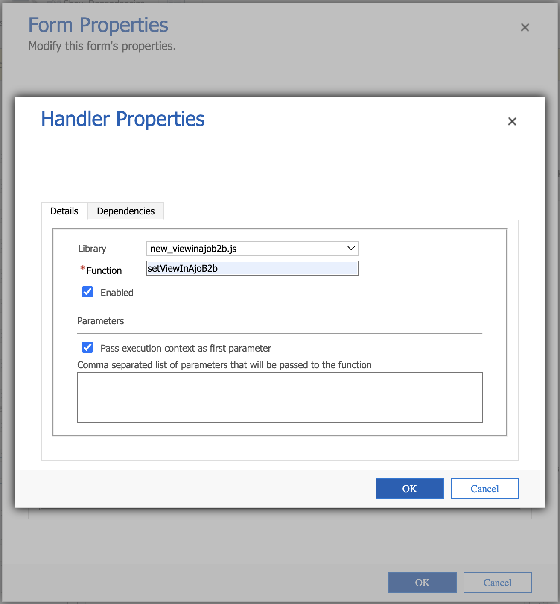
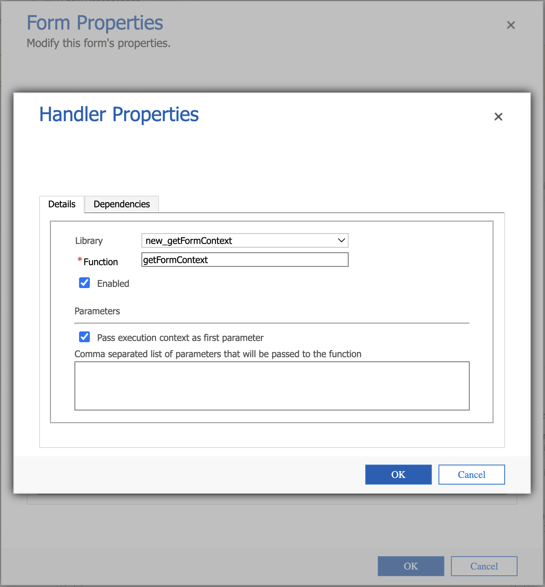

# In-CRM-Zugriff auf Detailseiten

Mit Adobe Journey Optimizer B2B edition können Mitglieder des Vertriebsteams und Account Manager direkt über ihr CRM-Tool (Customer Relationship Management) wie Salesforce oder Microsoft Dynamics auf detaillierte Seiten für Konto- und Kaufgruppeninformationen zugreifen. Mit dieser Integration können Vertriebsmitarbeiter schnell auf Echtzeit-Konto- und Einkaufsgruppeneinblicke zugreifen, wie z. B. den Interaktionsverlauf, Absichtssignale und KI-generierte Empfehlungen. Diese Fähigkeit ermöglicht dem Vertriebsteam eine schnellere Kontaktaufnahme, eine intelligentere Priorisierung und eine bessere Abstimmung mit dem Marketing.

Damit Mitglieder des Vertriebsteams die Seiten [Kontodetails](account-details.md) und [Personendetails“ in Journey Optimizer B2B edition aus dem CRM anzeigen können](person-details.md) kann der Salesforce- oder Dynamics-Administrator einen Journey Optimizer B2B edition-Link aus der Konto-, Kontakt- oder Lead-Ansicht hinzufügen.

Wenn ein Mitglied des Vertriebsteams den Link von der CRM-Instanz verwendet, sollte die Sandbox _Prod_ sein, und die IMS-Organisation wird gemäß der folgenden geordneten Logik bestimmt:

1. Die letzte Organisation, auf die der Benutzer zugegriffen hat
1. Die erste in der Liste mit einer alphabetischen Sortierung
1. Die in den Voreinstellungen ausgewählte Organisation

## Salesforce-Links

Ein Salesforce-Administrator mit der Berechtigung _Programm anpassen_ kann den Link im Konto-, Kontakt- oder Lead-Layout konfigurieren. Über konfigurierte Links können Vertriebsbenutzer auf die entsprechende Kontodetails- oder Personendetailseite in Adobe Journey Optimizer B2B edition zugreifen.

Fügen Sie in Salesforce den benutzerdefinierten Link als Schaltfläche, Hyperlink oder verknüpftes Symbol hinzu und passen Sie ihn entsprechend den Voreinstellungen Ihres Teams an.

{width="800" zoomable="yes"}

Detaillierte Informationen zum Hinzufügen eines benutzerspezifischen Links in Salesforce finden Sie unter [Benutzerdefinierte Schaltflächen und Links definieren](https://help.salesforce.com/s/articleView?id=platform.defining_custom_links.htm&type=5) in der Dokumentation zu Salesforce.

Wenn Sie die Ziel-URL für den Link definieren, können Sie das Konto-, Kontakt- oder Lead-Layout verwenden und mit der entsprechenden Detailseite in Journey Optimizer B2B edition verknüpfen:

* **Konto** - `https://experience.adobe.com/#/journey-optimizer-b2b/accounts/crm/account/[18-character ID of account]`

* **Kontakt** - `https://experience.adobe.com/#/journey-optimizer-b2b/accounts/crm/contact/[18-character ID of contact]`

* **Lead** - `https://experience.adobe.com/#/journey-optimizer-b2b/accounts/crm/lead/[18-character ID of lead]`

Verwenden Sie das `Account` -Objekt, um die 18-stellige ID des Kontos abzurufen, z. B. `CASESAFEID(Account.Id)` oder `CASESAFEID(Id)`.

**_Examples:_**

+++Feldlink

1. Navigieren Sie in Salesforce **[!UICONTROL Setup]** > **[!UICONTROL Objektmanager]** > **[!UICONTROL Konto]**/**[!UICONTROL Kontakt]**/**[!UICONTROL Lead]** > **[!UICONTROL Felder und Beziehungen]**.
1. Klicken Sie auf **[!UICONTROL Neu]**, um ein Formelfeld (Text) zu erstellen und es einem _Konto_, _Kontakt_ oder _Lead_-Layout hinzuzufügen.

   Für die Formel verwenden Sie die folgenden Beispiele als Anleitung.

   **_Text-Hyperlink:_**

   * Konto - `HYPERLINK("https://experience.adobe.com/#/journey-optimizer-b2b/accounts/crm/account/" & CASESAFEID(Id), "View in AJO B2B")`
   * Kontakt - `HYPERLINK("https://experience.adobe.com/#/journey-optimizer-b2b/accounts/crm/contact/" & CASESAFEID(Id), "View in AJO B2B")`
   * Lead - `HYPERLINK("https://experience.adobe.com/#/journey-optimizer-b2b/accounts/crm/lead/" & CASESAFEID(Id), "View in AJO B2B")`

   **_icon-Hyperlink:_**

   * Konto - `HYPERLINK("https://experience.adobe.com/#/journey-optimizer-b2b/accounts/crm/account/" & CASESAFEID(Id), IMAGE("https://cdn.experience.adobe.net/assets/HeroIcons.6620f5dc.svg#AdobeExperienceSubCloud", "View in AJO B2B", 24, 24))`
   * Kontakt - `HYPERLINK("https://experience.adobe.com/#/journey-optimizer-b2b/accounts/crm/contact/" & CASESAFEID(Id), IMAGE("https://cdn.experience.adobe.net/assets/HeroIcons.6620f5dc.svg#AdobeExperienceSubCloud", "View in AJO B2B", 24, 24))`
   * Kontakt - `HYPERLINK("https://experience.adobe.com/#/journey-optimizer-b2b/accounts/crm/lead/" & CASESAFEID(Id), IMAGE("https://cdn.experience.adobe.net/assets/HeroIcons.6620f5dc.svg#AdobeExperienceSubCloud", "View in AJO B2B", 24, 24))`

   {width="800" zoomable="yes"}

1. Aktualisieren Sie die Seite, damit die Layout-Änderungen angezeigt werden. Wechseln Sie zu **[!UICONTROL Profil]** und wählen Sie unter &quot;**[!UICONTROL &quot; eine andere Option]**.

   {width="450" zoomable="yes"}

+++

+++Link zur Detailseite

1. Wechseln Sie in Salesforce **[!UICONTROL Setup]** > **[!UICONTROL Objektmanager]** > **[!UICONTROL Konto]**/**[!UICONTROL Kontakt]**/**[!UICONTROL Lead]** > **[!UICONTROL Schaltflächen, Links und Aktionen]**.
1. Klicken Sie **[!UICONTROL Neue Schaltfläche oder Link]** oben rechts und erstellen Sie den Link für die Detailseite.

   Für die Formel verwenden Sie die folgenden Beispiele als Anleitung.

   * Konto - `{!URLFOR("https://experience.adobe.com/#/journey-optimizer-b2b/accounts/crm/account/" & CASESAFEID(Account.Id), null)}`
   * Kontakt - `{!URLFOR("https://experience.adobe.com/#/journey-optimizer-b2b/accounts/crm/contact/" & CASESAFEID(Contact.Id), null)}`
   * Lead - `{!URLFOR("https://experience.adobe.com/#/journey-optimizer-b2b/accounts/crm/lead/" & CASESAFEID(Lead.Id), null)}`

   {width="800" zoomable="yes"}

1. Navigieren Sie **[!UICONTROL Seitenlayouts]** im linken Navigationsbereich.

1. Ziehen Sie den Link aus **[!UICONTROL Benutzerdefinierte Links]** und legen Sie ihn im Abschnitt _Benutzerdefinierte Links_ im Layout ab.

+++

+++Schaltfläche Detailseite“

1. Wechseln Sie in Salesforce **[!UICONTROL Setup]** > **[!UICONTROL Objektmanager]** > **[!UICONTROL Konto]**/**[!UICONTROL Kontakt]**/**[!UICONTROL Lead]** > **[!UICONTROL Schaltflächen, Links und Aktionen]**.
1. Klicken Sie **[!UICONTROL Neue Schaltfläche oder Link]** oben rechts und erstellen Sie die Schaltfläche Detailseite .

   Wählen Sie für **[!UICONTROL Anzeigetyp]** die Option **[!UICONTROL Seitenlink]**.

   Für die Formel verwenden Sie die folgenden Beispiele als Anleitung.

   * Konto - `{!URLFOR("https://experience.adobe.com/#/journey-optimizer-b2b/accounts/crm/account/" & CASESAFEID(Account.Id), null)}`
   * Kontakt - `{!URLFOR("https://experience.adobe.com/#/journey-optimizer-b2b/accounts/crm/contact/" & CASESAFEID(Contact.Id), null)}`
   * Lead - `{!URLFOR("https://experience.adobe.com/#/journey-optimizer-b2b/accounts/crm/lead/" & CASESAFEID(Lead.Id), null)}`

   {width="800" zoomable="yes"}

1. Navigieren Sie **[!UICONTROL Seitenlayouts]** im linken Navigationsbereich.

1. Ziehen Sie die Schaltfläche aus **[!UICONTROL Mobile- und Lightning]** Aktionen und legen Sie sie im Abschnitt **[!UICONTROL Salesforce Mobile- und Lightning]** Erlebnisaktionen im Layout ab.

   {width="800" zoomable="yes"}

+++

## Microsoft Dynamics-Links

Ein Dynamics-Entwickler kann die Konto-, Kontakt- oder Lead-Entität erweitern, um ein Verknüpfungsfeld hinzuzufügen. Über konfigurierte Links können Vertriebsbenutzer auf die entsprechende Kontodetails- oder Personendetailseite in Adobe Journey Optimizer B2B edition zugreifen.

Fügen Sie den benutzerspezifischen Link als Schaltfläche, Hyperlink oder verknüpftes Verknüpfungssymbol hinzu und passen Sie ihn entsprechend den Voreinstellungen Ihres Teams an.

{width="800" zoomable="yes"}

Verwenden Sie Power Apps, um modellgesteuerte Apps von Microsoft anzupassen, z. B. Dynamics-Komponenten. Ausführliche Informationen zur Verwendung von Power Apps zum Hinzufügen eines benutzerdefinierten Links in Dynamics finden Sie in der [PowerApps-Dokumentation](https://learn.microsoft.com/en-us/power-apps/maker/model-driven-apps/create-edit-web-resources).

Wenn Sie die Ziel-URL für den Link definieren, können Sie die Konto-, Kontakt- oder Lead-Ansicht verwenden und sie mit der entsprechenden Detailseite in Journey Optimizer B2B edition verknüpfen:

* **Konto** - `https://experience.adobe.com/#/journey-optimizer-b2b/accounts/crm/account/[Account ID]`

* **Kontakt** - `https://experience.adobe.com/#/journey-optimizer-b2b/accounts/crm/contact/[Contact ID]`

* **Lead** - `https://experience.adobe.com/#/journey-optimizer-b2b/accounts/crm/lead/[Lead ID]`

**_Examples:_**

+++URL-Feld

Mit dieser Aufgabensequenz können Sie den benutzerdefinierten Link als URL-Feld hinzufügen:

**1: Lösungsfeld konfigurieren**

1. Wechseln Sie **[!UICONTROL Erweiterte Einstellungen]** > **[!UICONTROL System anpassen]** und wählen Sie die Registerkarte **[!UICONTROL Lösung]** aus.
1. Wählen Sie **[!UICONTROL Entitäten]** > **[!UICONTROL Konto]**/**[!UICONTROL Kontakt]**/**[!UICONTROL Lead]** > **[!UICONTROL Felder]**.
1. Klicken Sie **[!UICONTROL Neu]** und konfigurieren Sie das neue Feld.

   {width="800" zoomable="yes"}

1. Speichern Sie die Feldkonfiguration.
1. Wählen Sie auf der _[!UICONTROL Lösung]_ die Option **[!UICONTROL Web-Ressourcen]** aus.
1. Klicken Sie **[!UICONTROL Neu]** und konfigurieren Sie die folgende Skript (JScript)-Webressource:

   ```js
   function setViewInAjoB2b(executionContext) {
    var url = "https://experience.adobe.com/#/journey-optimizer-b2b/accounts/crm";
   
    var formContext = executionContext.getFormContext();
   
    // Get the entity ID (GUID)
    var id = formContext.data.entity.getId();
   
    // Get the entity type (account, lead, contact)
    var type = formContext.data.entity.getEntityName().toLowerCase();
   
    if (id && type) {
        // Remove curly braces
        id = id.replace(/[{}]/g, "").toLowerCase();
   
        // Set the value in the custom field (Ensure this field exists on the form)
        formContext.getAttribute("new_viewinajob2b").setValue(url + "/" + type + "/" + id);
       }
   }
   ```

   {width="800" zoomable="yes"}

1. Klicken Sie oben auf der Seite auf **[!UICONTROL SPEICHERN]** und dann auf **[!UICONTROL VERÖFFENTLICHEN]**.

**2 - Formular konfigurieren**

1. Wählen Sie auf der Registerkarte _Lösung_ die Option **[!UICONTROL Entitäten]** > **[!UICONTROL Konto]**/**[!UICONTROL Kontakt]**/**[!UICONTROL Lead]** > **[!UICONTROL Forms]** > **[!UICONTROL Account]**/**[!UICONTROL Contact]**/**[!UICONTROL Lead]**.
1. Ziehen Sie das neue Feld, das Sie in der ersten Aufgabe erstellt haben, aus **[!UICONTROL Feld-Explorer]** in den Abschnitt **[!UICONTROL Zusammenfassung]**.

   {width="800" zoomable="yes"}

1. Doppelklicken Sie auf das Feld im Abschnitt _Zusammenfassung_ und konfigurieren Sie dessen Eigenschaften.

   {width="800" zoomable="yes"}

   Wenn die Konfiguration der Eigenschaft abgeschlossen ist, klicken Sie auf **[!UICONTROL OK]**.

1. Klicken Sie oben auf der Seite im Menüband auf **[!UICONTROL Speichern]** und dann auf **[!UICONTROL Veröffentlichen]**.

**3: Hinzufügen der JS-Web-Ressource zu den Formularbibliotheken**

1. Klicken Sie oben auf _[!UICONTROL Registerkarte]_ Startseite“ auf **[!UICONTROL Formulareigenschaften]**.
1. Klicken Sie auf **[!UICONTROL Hinzufügen]**.

   {width="500" zoomable="yes"}

1. Suchen Sie die Ressource, wählen Sie sie aus und klicken Sie auf **[!UICONTROL Hinzufügen]**.

   {width="500" zoomable="yes"}

1. Klicken Sie bei ausgewählter hinzugefügter Ressource **[!UICONTROL Hinzufügen]** unter _[!UICONTROL Ereignishandler]_.
1. Fügen Sie die Funktion `setViewInAjoB2b` in **[!UICONTROL Ereignishandler“]**.
1. Wenn die Funktion in der Liste _[!UICONTROL Ereignishandler]_ ausgewählt ist, legen Sie **[!UICONTROL Control]** auf `Form` und **[!UICONTROL Event]** auf `OnLoad` fest.

   {width="500" zoomable="yes"}

1. Klicken Sie auf **[!UICONTROL OK]**.

1. Klicken Sie oben auf der _[!UICONTROL Startseite]_ auf **[!UICONTROL Speichern]** und dann auf **[!UICONTROL Veröffentlichen]**.

**4 - Link überprüfen**

Um den Link zu überprüfen, überprüfen Sie die Konto-, Kontakt- oder Lead-Ansicht in Dynamics.

{width="500" zoomable="yes"}

Wenn der Link nicht angezeigt wird, versuchen Sie, auf der Dynamics-Startseite unter **[!UICONTROL Kunden]** zu Konten, Kontakte oder Leads zu wechseln. Gehen Sie dann zurück zur jeweiligen Konto-, Kontakt- oder Lead-Ansicht. Sie können auch versuchen, sich abzumelden und erneut anzumelden.

+++

+++HTML-Webressource

Führen Sie diese Aufgabensequenz aus, um den benutzerdefinierten Link als HTML-Web-Ressource hinzuzufügen:

>[!NOTE]
>
>Dieses Beispiel hängt davon ab, wie Dynamics Web-Seiten-Ressourcen verwendet.

**1: Konfigurieren der Web-Ressourcen der Lösung**

1. Wechseln Sie **[!UICONTROL Erweiterte Einstellungen]** > **[!UICONTROL System anpassen]** und wählen Sie die Registerkarte **[!UICONTROL Lösung]** aus.

1. Wählen Sie auf der _[!UICONTROL Lösung]_ die Option **[!UICONTROL Web-Ressourcen]** aus.

1. Klicken Sie **[!UICONTROL Neu]** und konfigurieren Sie die folgende Skript (JScript)-Webressource mit der folgenden Funktion:

   ```js
   function getFormContext(executionContext) {
       window.top["formContext"] = executionContext.getFormContext();
   }
   ```

   {width="800" zoomable="yes"}

1. Klicken Sie auf **[!UICONTROL Neu]**, um eine weitere Web-Ressource zu erstellen und eine Web-Ressource (HTML) mit der folgenden HTML zu konfigurieren:

   ```html
   <html>
   <head>
       <script>
       function onLoad(){
           // Adobe URL
           var url = "https://experience.adobe.com/#/journey-optimizer-b2b/accounts/crm";
   
           // Get the entity ID (GUID)
           var id = window.top.formContext.data.entity.getId();
   
           // Get the entity type (account, lead, contact)
           var type = window.top.formContext.data.entity.getEntityName().toLowerCase();
   
           if (id && type) {
               // Remove curly braces
               id = id.replace(/[{}]/g, "").toLowerCase();
               var url = url + "/" + type + "/" + id;
   
               // Find the hyperlink and set the href value
               var link = document.getElementById("link");
               link.href = url;
           }
       }
       </script>
   </head>
   <body onload="onLoad()" style="margin-left: 0;">
       <a id="link" style="text-decoration: none; font-family: sans-serif; font-size: 13px;" target="_blank">
           
           <span style="vertical-align: middle;">View in AJOB2B</span>
       </a>
   </body>
   </html>
   ```

1. Klicken Sie oben auf der Seite auf **[!UICONTROL SPEICHERN]** und dann auf **[!UICONTROL VERÖFFENTLICHEN]**.

**2: Hinzufügen der JS-Web-Ressourcen zu den Formularbibliotheken**

1. Wählen Sie auf der Registerkarte _Lösung_ die Option **[!UICONTROL Entitäten]** > **[!UICONTROL Konto]**/**[!UICONTROL Kontakt]**/**[!UICONTROL Lead]** > **[!UICONTROL Forms]** > **[!UICONTROL Account]**/**[!UICONTROL Contact]**/**[!UICONTROL Lead]**.

1. Klicken Sie oben auf _Registerkarte_ Startseite“ auf **[!UICONTROL Formulareigenschaften]**.

1. Klicken Sie auf **[!UICONTROL Hinzufügen]**.

1. Suchen Sie die von Ihnen erstellte JScript-Webressource (`new_getFormContext`), wählen Sie sie aus und klicken Sie auf **[!UICONTROL Hinzufügen]**.

   {width="500" zoomable="yes"}

1. Klicken Sie bei ausgewählter hinzugefügter Ressource **[!UICONTROL Hinzufügen]** unter _[!UICONTROL Ereignishandler]_.
1. Fügen Sie die Funktion `getFormContext` in **[!UICONTROL Ereignishandler“]**.
1. Wenn die Funktion in der Liste _[!UICONTROL Ereignishandler]_ ausgewählt ist, legen Sie **[!UICONTROL Control]** auf `Form` und **[!UICONTROL Event]** auf `OnLoad` fest.

   {width="500" zoomable="yes"}

1. Klicken Sie auf **[!UICONTROL OK]**.

1. Klicken Sie oben auf der _[!UICONTROL Startseite]_ auf **[!UICONTROL Speichern]** und dann auf **[!UICONTROL Veröffentlichen]**.

**3: Formular konfigurieren**

1. Wählen Sie auf der **[!UICONTROL STARTSEITE]** für das Konto-, Kontakt- oder Lead-Formular **[!UICONTROL Hauptteil]** (zum Erstellen der verknüpften Ressource im _Zusammenfassungs_-Abschnitt) oder **[!UICONTROL Kopfzeile]** (zum Erstellen im Kopfzeilenmenü).

   {width="500" zoomable="yes"}

1. Wählen Sie oben die **[!UICONTROL EINFÜGEN]** und klicken Sie auf **[!UICONTROL Web-Ressource]**.

1. Fügen Sie die von Ihnen erstellte Web-Ressource ein und konfigurieren Sie die Eigenschaften.

   {width="500" zoomable="yes"}

   Siehe die [Power Apps-Dokumentation](https://learn.microsoft.com/en-us/power-apps/maker/model-driven-apps/web-resource-properties-legacy) für detaillierte Informationen zu Eigenschaften und Formatierung von Web-Ressourcen.

1. Klicken Sie auf **[!UICONTROL OK]**.

   Wenn Sie eine Textkörper-/Zusammenfassungs-Platzierung für die Web-Ressource ausgewählt haben, wird sie im Formular-Layout angezeigt.

   {width="800" zoomable="yes"}

1. Klicken Sie oben auf der _[!UICONTROL Startseite]_ auf **[!UICONTROL Speichern]** und dann auf **[!UICONTROL Veröffentlichen]**.

**4 - Link überprüfen**

Um den Link zu überprüfen, überprüfen Sie die Konto-, Kontakt- oder Lead-Ansicht in Dynamics.

{width="500" zoomable="yes"}

Wenn der Link nicht angezeigt wird, versuchen Sie, auf der Dynamics-Startseite unter **[!UICONTROL Kunden]** zu Konten, Kontakte oder Leads zu wechseln. Gehen Sie dann zurück zur jeweiligen Konto-, Kontakt- oder Lead-Ansicht. Sie können auch versuchen, sich abzumelden und erneut anzumelden.

+++
