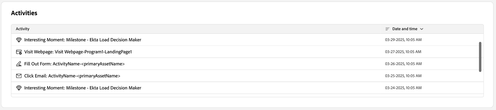

# Personendetails

Wenn Sie in Journey Optimizer B2B edition von einer beliebigen Stelle aus auf einen Personennamen klicken, wird die Seite mit den Personendetails angezeigt. Diese Seite enthält nützliche Informationen über die Person, die mit einem Konto oder einer Einkaufsgruppe verknüpft ist, einschließlich einer Zusammenfassung der Highlight- und Intent-Daten zur generativen KI (falls konfiguriert). <!-- There are also [actions](#person-actions) that you can execute for the person. -->

{width="800" zoomable="yes"}

Sie können auf diese Seite zugreifen, indem Sie auf einen Namen klicken[ der im Intelligenten Dashboard ](../dashboards/intelligent-dashboard.md), auf [Seite mit den Kaufgruppendetails](../buying-groups/buying-group-details.md) oder auf [Kontodetailseite](./account-details.md).

Die Seite „Personendetails“ besteht aus den folgenden vier Abschnitten:

## Personenübersicht

{zoomable="yes"}

Der Abschnitt „Personenübersicht“ oben auf der Seite enthält die folgenden Informationen:

* Name
* Titel
* E-Mail
* Telefonnummer
* Interaktionsbewertung
* Zusammenfassung

## Aktivitäten

In diesem Abschnitt finden Sie eine Liste der letzten E-Mail-, Web-, Formular- und interessanten Momente, die mit der Person verbunden sind (bis zu 20). Die Elemente werden als Aktivitätstyp mit Datum und Uhrzeit aufgelistet.

{width="700" zoomable="yes"}

## Gruppen auf der Basis des Interaktionswerts kaufen

Dieser Abschnitt enthält Einkaufsgruppen, in denen die Person Mitglied ist und nach dem Interaktionswert sortiert ist. Jede Karte enthält die folgenden Informationen zur Einkaufsgruppe:

* Name - Klicken Sie auf den Namen, um die [Einkaufsgruppendetails“ ](../buying-groups/buying-group-details.md) öffnen.
* Interaktionsbewertung
* Vollständigkeitsbewertung
* Phase
* Mitglieder

{width="700" zoomable="yes"}

## Absichtsdaten

In Journey Optimizer B2B edition sagt das Modell der Absichtserkennung eine Lösung/ein Produkt von Interesse mit ausreichend hoher Zuverlässigkeit basierend auf der Aktivität einer Person voraus. Außerdem werden die Aktivitäten anderer Account-Co-Mitglieder sowie getaggte Inhalte genutzt. Die Absicht einer Person kann als die Wahrscheinlichkeit interpretiert werden, dass sie Interesse an einem Produkt hat.

{{intent-data-note}}

{width="700" zoomable="yes"}

* Absichtsebenen
* Arten von Intent-Signalen - Schlüsselwörter, Produkt und Lösung

<!-- ## Person actions -->
