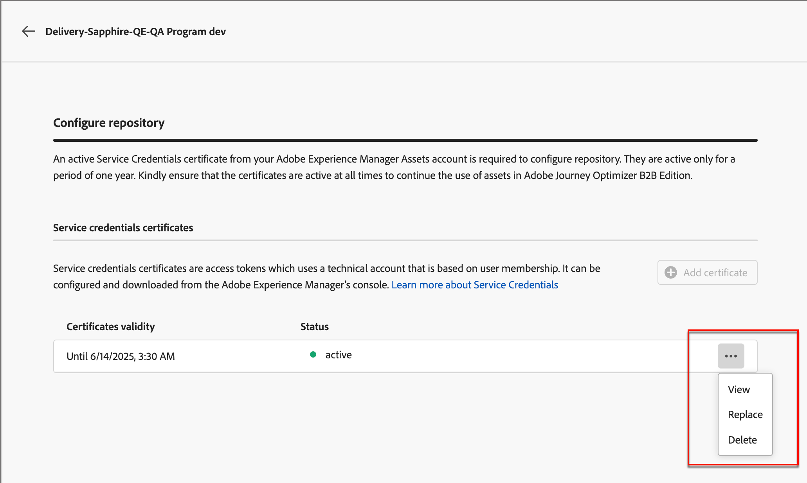
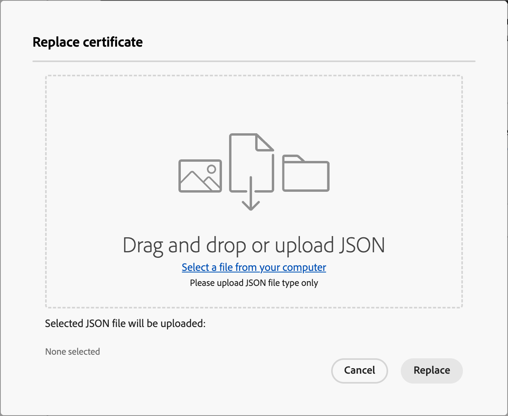

# Konfigurieren von Experience Manager Asset-Repositorys

[!DNL Adobe Journey Optimizer B2B Edition] lässt sich mit [!DNL Adobe Experience Manager Assets as a Cloud Service] integrieren und ermöglicht die Verwendung von Assets in Ihrem E-Mail-Inhalt. Es sorgt für Transparenz durch den Austausch von Informationen mit [!DNL Experience Manager Assets]. Konfigurieren Sie die zu [!DNL Adobe Experience Assets] Verbindung, um diese Funktion zu aktivieren.

Adobe Experience Manager Cloud Manager ist in Programme unterteilt und jedes Programm verfügt über mehrere Umgebungen und Repositorys ([Weitere Informationen](https://experienceleague.adobe.com/en/docs/experience-manager-cloud-service/content/implementing/using-cloud-manager/programs/program-types){target="_blank"}). Wenn Sie Adobe Experience Manager Assets in Adobe Journey Optimizer B2B edition konfigurieren, richten Sie Verbindungen zu jedem Repository ein, das Sie für den Zugriff auf digitale Assets verwenden möchten.

{{aem-assets-licensing-note}}

## Voraussetzungen

* Generieren von Service-Anmeldeinformationen für die gewünschte Umgebung auf der AEM Headless-Developer Console ([Weitere Informationen](https://experienceleague.adobe.com/en/docs/experience-manager-learn/getting-started-with-aem-headless/authentication/service-credentials#generate-service-credentials){target="_blank"})
* Beschaffen Sie sich die Zertifikate, die für die Verbindung benötigt werden. Als Best Practice hat es sich bewährt, sicherzustellen, dass die Zertifikate mindestens sechs Monate vor ihrem Ablauf verbleiben. Die Zertifikate laufen alle 365 Tage ab.
* Adobe Journey Optimizer B2B edition unterstützt den Zugriff auf jeweils eine Digital Asset Management-Quelle. Stellen Sie vor dem Wechsel sicher, dass die erforderlichen Assets in Adobe Experience Manager verfügbar sind.

>[!IMPORTANT]
>
>Die Dienstanmeldeinformationen sind in Ordnung und enthalten einen privaten Schlüssel. Diese Anmeldeinformationen müssen gemäß den IT- und Sicherheitsrichtlinien Ihres Unternehmens gespeichert, verwaltet und aufgerufen werden.

## Hinzufügen einer Repository-Verbindung

1. Wählen Sie in der linken Navigation **[!UICONTROL Administration]** > **[!UICONTROL Konfiguration]** aus.

1. Klicken Sie im Zwischenbereich **&#x200B;**&#x200B;Assets.

   {width="700" zoomable="yes"}

<!--   The default digital asset management option is configured as `Adobe Marketo Engage`.
-->
Von hier aus können Sie die Verbindungen zu jedem AEM-Umgebungs-Repository einzeln konfigurieren.

1. Klicken Sie im Feld _[!UICONTROL Adobe Experience Manager Assets]_ auf den Pfeil neben **[!UICONTROL Repository konfigurieren]** und wählen Sie das Repository aus.

   {width="500"}

1. Klicken Sie **[!UICONTROL Zertifikat hinzufügen]** und verwenden Sie die Dialogwerkzeuge, um die Datei hochzuladen.

   Sie können eine JSON-Datei hochladen, indem Sie sie in das Dialogfeld ziehen. Sie können auch auf den Link klicken, um eine Datei in Ihrem System zu suchen und auszuwählen.

   {width="500"}

   Nach dem Hochladen wird das Zertifikat unten angezeigt.

   >[!NOTE]
   >
   >Wenn eine ungültige Datei verwendet wird, wird im Dialogfeld unten ein Fehler angezeigt.

   Klicken Sie **[!UICONTROL Hinzufügen]**, um das Zertifikat abzuschließen.

1. Klicken Sie auf den Pfeil nach hinten (←), um zur Hauptkonfigurationsseite zurückzukehren.

   Das konfigurierte Repository wird in der Tabelle unter dem Auswahlbereich angezeigt. Sie können ein weiteres Repository hinzufügen, indem Sie die Schritte 3-4 wiederholen.

   {width="600" zoomable="yes"}

Wenn Sie die Konfiguration der Repositorys abgeschlossen haben, können die Team-Mitglieder die [!DNL Adobe Experience Manager Assets] beim Erstellen von Inhalten auswählen.

>[!NOTE]
>
>Adobe Journey Optimizer B2B edition unterstützt den Zugriff auf jeweils eine Digital Asset Management-Quelle beim Erstellen von Inhalten. 

## Ersetzen eines Zertifikats

Zertifikate laufen alle 365 Tage ab dem Erstellungsdatum ab. Um sicherzustellen, dass Ihr Team weiterhin auf Assets zugreifen kann, ersetzen Sie das Zertifikat, bevor es abläuft.

>[!NOTE]
>
>[!DNL Adobe Journey Optimizer B2B Edition] kommuniziert mit [!DNL Experience Manager Assets], um Nutzungsinformationen zu erhalten. Die Verbindung muss aktiv bleiben, um eine zuverlässige Synchronisierung der Nutzungsdaten zu gewährleisten und Datendiskrepanzen zu vermeiden. Admins erhalten Benachrichtigungen über ablaufende Zertifikate über die In-App-Benachrichtigungen. Ablaufdaten werden auch im Unterabschnitt _Assets_ des Bereichs _[!UICONTROL Administration]_ angezeigt.

1. Suchen Sie auf der Seite „Digital Asset Management“ die Liste der konfigurierten Repositorys.

1. Klicken Sie auf das gewünschte Repository, um das Zertifikat zu ersetzen.

1. Klicken Sie auf das Symbol mit den Auslassungspunkten (**…**) für die Zertifikatdatei, um die Optionen für die Aktionen anzuzeigen.

   {width="600" zoomable="yes"}

1. Wählen Sie **[!UICONTROL Ersetzen]**, um das Dialogfeld für den Datei-Upload zu öffnen.

1. Laden Sie eine Datei hoch, indem Sie sie entweder auf das Dialogfeld ziehen oder den Link verwenden. Stellen Sie sicher, dass die Datei vom Typ JSON ist.

   {width="500"}

1. Klicken Sie **[!UICONTROL Ersetzen]**, um den Upload zu bestätigen.

## Anzeigen eines Zertifikats

Sie können die JSON-Zertifikatdatei anzeigen, die mit der Repository-Verbindung verknüpft ist.

1. Suchen Sie auf der Seite „Digital Asset Management“ die Liste der konfigurierten Repositorys.

1. Klicken Sie auf das verbundene Repository.

1. Klicken Sie auf das Symbol mit den Auslassungspunkten (**…**) für die Zertifikatdatei, um die Optionen für die Aktionen anzuzeigen.

1. Wählen Sie **[!UICONTROL Ansicht]**.

   {width="600"}

1. Klicken Sie auf **[!UICONTROL Schließen]**, um zur Seite „Repository konfigurieren“ zurückzukehren.

## Löschen einer Repository-Verbindung

Durch das Löschen eines Repositorys wird der Benutzerzugriff auf die Experience Manager Assets-Umgebung in Journey Optimizer B2B edition entfernt.

1. Suchen Sie auf _[!UICONTROL Seite „Digital Asset]_&quot; die Liste der konfigurierten Asset-Repositorys.

1. Klicken Sie auf den gewünschten Repository-Namen, um die Verbindung zu bearbeiten.

1. Klicken Sie auf das Symbol mit den Auslassungspunkten (**…**) für die Zertifikatdatei, um die Optionen für die Aktionen anzuzeigen.

1. Wählen Sie **[!UICONTROL Löschen]**.

1. Klicken Sie im Bestätigungsdialog auf **[!UICONTROL Löschen]**.
<!--

## Switch back to Adobe Marketo Engage Assets

Select Adobe Marketo Engage digital asset management in the Assets section.

After the confirmation, the Adobe Marketo Engage assets library is available for users.
-->
