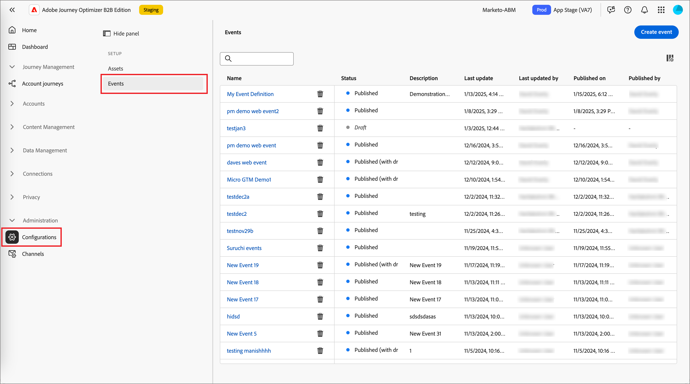
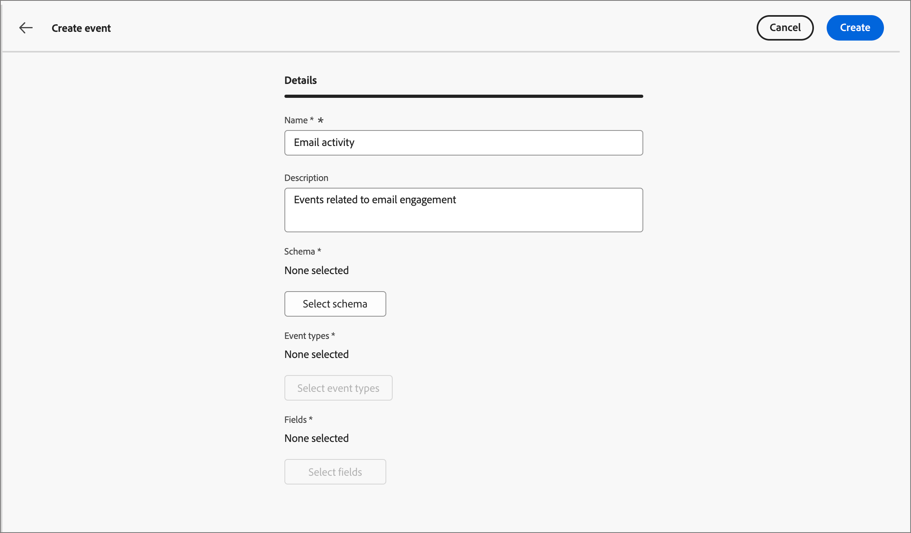
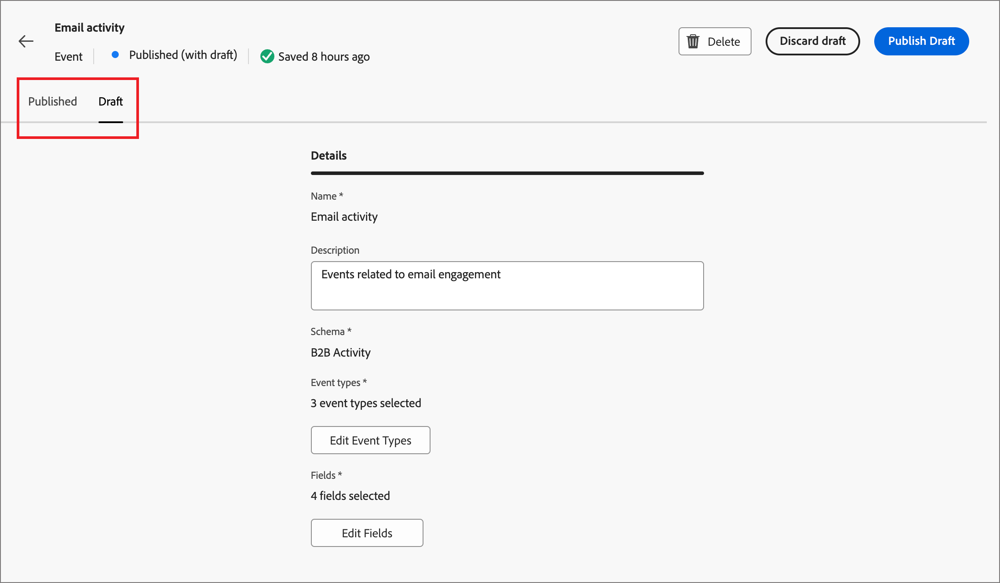

# Konfigurieren von Experience Platform-Ereignisdefinitionen

Admins können Adobe Experience Platform (AEP)-basierte Ereignisdefinitionen konfigurieren, mit denen Marketing-Experten Account-Journey erstellen können, die auf [AEP Experience Events](https://experienceleague.adobe.com/en/docs/experience-platform/xdm/classes/experienceevent) reagieren.

{width="30"} [Video ansehen - Übersicht](#overview-video)

Die Verwendung von AEP-Erlebnisereignissen in Account Journey ist ein zweistufiger Prozess:

1. Erstellen und veröffentlichen Sie eine AEP-Ereignisdefinition.

2. Fügen Sie auf einer Konto-Journey den Knoten _Auf ein Ereignis_) hinzu und [ Sie eine AEP-Ereignisdefinition als Personenereignis ](../journeys/listen-for-event-nodes.md#listen-for-an-experience-event).

Für jede Ereignisdefinition sind die folgenden Experience Platform-Eingaben erforderlich:

* **_Schema_** - XDM-Schema, das die Datenstruktur des Erlebnisereignisses definiert. Sie muss auf einem Erlebnisereignis basieren und profilaktiviert sein.

  >[!NOTE]
  >
  >Stimmen Sie sich mit Ihrem Engineering-Team ab, um sicherzustellen, dass die erforderlichen Schemata definiert werden. [Erstellen von XDM](https://experienceleague.adobe.com/de/docs/experience-platform/xdm/schema/composition)Schemata ist ein komplexer Prozess, der von Dateningenieuren auf der Grundlage von Anwendungsfallanforderungen in Ihrem Unternehmen durchgeführt wird.

* **_Ereignistypen_** - XDM ExperienceEvent eventType (maximal 20 pro Ereignisdefinition).

* **_Felder_** - XDM-Felder, die im Schema vorhanden sind (maximal 20 pro Ereignisdefinition)

* **_Name_** - Ein eindeutiger Name für die Ereignisdefinition.

* **_Beschreibung_** - Eine Beschreibung für die Ereignisdefinition.

## Einschränkungen und Leitplanken

Beachten Sie beim Erstellen und Verwalten Ihrer Ereignisdefinitionen zur Erfüllung Ihrer Unternehmensziele Folgendes:

* Journey Optimizer B2B edition unterstützt maximal 50 Ereignisdefinitionen.

* Account-Journey können auf AEP-Erlebnisereignisse warten, die über AEP-Streaming-Funktionen wie Web-SDK oder HTTP-API aufgenommen werden.

* Nur eine AEP-Ereignisdefinition kann ein kombiniertes Schema und eine Reihe von Ereignistypen verwenden. Wenn Sie eine Ereignisdefinition mit einem Schema (z. B. `My Schema`) und einem Ereignistyp (z. B. `Web Webpagedetails Page Views`) erstellen, kann keine andere Ereignisdefinition die Kombination aus `My Schema` und `Web Webpagedetails Page Views` verwenden.

* Eine Ereignisdefinition kann auf mehr als einer Konto-Journey verwendet werden.

* AEP-Erlebnisereignisse können zu Entscheidungszwecken auf einer Konto-Journey verwendet werden, werden jedoch nicht beibehalten. Daher kann kein bisheriger Datensatz von AEP-Erlebnisereignissen innerhalb von Journey Optimizer B2B edition genutzt werden.

* Die Einschränkungen für _Datum der Aktivität_ und _Mindestanzahl von_) werden nicht unterstützt.

* Nach der Veröffentlichung einer Ereignisdefinition können das Schema und der Name nicht mehr geändert werden. Sie können jedoch Ereignistypen und -felder hinzufügen, indem Sie eine Entwurfsversion erstellen und sie erneut veröffentlichen.

* Ereignisdefinitionen, die in veröffentlichten Journey verwendet werden, können nicht gelöscht werden.

## Zugreifen auf und Verwalten von Ereignisdefinitionen

1. Wählen Sie in der linken Navigation **[!UICONTROL Administration]** > **[!UICONTROL Konfiguration]** aus.

1. Klicken Sie **[!UICONTROL Zwischenbereich]** Ereignisse“, um die Liste der Ereignisdefinitionen anzuzeigen.

   Auf dieser Seite können Sie Ereignisdefinitionen [Erstellen](#create-an-event-definition), [Veröffentlichen](#publish-an-event-defintion), [Bearbeiten](#publish-an-event-defintion) und [Löschen](#delete-an-event-definition).

   {width="800" zoomable="yes"}

   Die Tabelle wird nach der Spalte _[!UICONTROL Geändert]_ sortiert, wobei die zuletzt aktualisierten Definitionen standardmäßig oben stehen.<!-- Click the column title to change between ascending and descending.-->

1. Um auf die Details für eine Ereignisdefinition zuzugreifen, klicken Sie auf den Namen.

### Status und Lebenszyklus der Ereignisdefinition

In der Liste _[!UICONTROL Ereignisdefinitionen]_ gibt die Spalte **[!UICONTROL Status]** den aktuellen Status für jede Definition an. Der Status bestimmt, ob in den Account-Journey verfügbar ist und welche Änderungen Sie daran vornehmen können.

| Status | Beschreibung |
| -------------------- | ----------- |
| Entwurf | Wenn Sie eine Ereignisdefinition erstellen, befindet sie sich im Entwurfsstatus. Er bleibt in diesem Status, bis Sie ihn zur Verwendung in den Journey des Kontos veröffentlichen. Verfügbare Aktionen: <ul><li>Alle Details bearbeiten<li>Veröffentlichen<li>Löschen |
| Veröffentlicht | Wenn Sie eine Ereignisdefinition veröffentlichen, wird sie zur Verwendung in Account-Journey verfügbar. Die Details können nicht geändert werden. Verfügbare Aktionen: <ul><li>Verfügbar für _Lauschen auf ein Ereignis_ Journey-Knoten<li>Entwurfsversion erstellen<li>Löschen (wenn nicht in Gebrauch) |
| Veröffentlicht (mit Entwurf) | Wenn Sie einen Entwurf aus einer veröffentlichten Ereignisdefinition erstellen, bleibt die veröffentlichte Version für die Verwendung in Account-Journey verfügbar, und die Entwurfsversion kann geändert werden. Wenn Sie die Entwurfsversion veröffentlichen, ersetzt sie die aktuelle veröffentlichte Version, und die Ereignisdefinition wird für Account-Journey aktualisiert, in denen sie noch nicht ausgeführt wird. Verfügbare Aktionen: <ul><li>Alle Details bearbeiten<li>Entwurfsversion veröffentlichen<li>Entwurfsversion verwerfen<li>Löschen (wenn nicht in Gebrauch) |

{zoomable="yes"}

### Filtern der Ereignisdefinitionsliste

Um nach einer Ereignisdefinition anhand des Namens zu suchen, geben Sie eine Textzeichenfolge in die Suchleiste für eine Übereinstimmung ein.

{width="700" zoomable="yes"}

## Erstellen einer Ereignisdefinition

1. Wählen Sie in der linken Navigation **[!UICONTROL Administration]** > **[!UICONTROL Konfiguration]** aus.

1. Klicken Sie **[!UICONTROL Zwischenbereich]** Ereignisse“, um die Liste der Ereignisdefinitionen anzuzeigen.

1. Klicken **[!UICONTROL oben]** auf „Ereignis erstellen“.

1. Geben Sie **[!UICONTROL Name]** (erforderlich) und **[!UICONTROL Beschreibung]** (optional) ein.

   {width="600" zoomable="yes"}

1. Legen Sie das **[!UICONTROL Schema]** für die Ereignisdefinition fest.

   Das von Ihnen ausgewählte Schema bestimmt die Felder, die der Definition hinzugefügt werden können und dann als Einschränkungen für einen Ereignisknoten _Lauschen_ auf einer Konto-Journey verfügbar sind.

   * Klicken Sie **[!UICONTROL Schema auswählen]**.
   * Wählen Sie im Dialogfeld ein Schema aus der Liste der auf Erlebnisereignissen basierenden Schemas aus.
   * Klicken Sie auf **[!UICONTROL Auswählen]**.

   {width="600" zoomable="yes"}

1. Wählen Sie die **[!UICONTROL Ereignistypen]** aus, die für die Ereignisdefinition verwendet werden sollen.

   Die [Ereignistypen](https://experienceleague.adobe.com/en/docs/experience-platform/xdm/classes/experienceevent#eventType) die Sie auswählen, bestimmen die Ereignisse, die als Einschränkungen für einen _Lauschen auf ein Ereignis_-Knoten auf einer Konto-Journey verfügbar sind.

   * Klicken Sie **[!UICONTROL Ereignistypen auswählen]**.
   * Wählen Sie im Dialogfeld einen oder mehrere Ereignistypen aus der Liste aus (maximal 20).
   * Klicken Sie auf **[!UICONTROL Auswählen]**.

   {width="600" zoomable="yes"}

1. Wählen Sie die **[!UICONTROL Felder]** aus, die für die Ereignisdefinition verwendet werden sollen.

   Die von Ihnen ausgewählten Felder bestimmen die Einschränkungen, die verfügbar sind, wenn das Ereignis für einen _Lauschen auf ein Ereignis_-Knoten auf einer Konto-Journey verwendet wird.

   >[!NOTE]
   >
   >Das `eventType` ist ein Pflichtfeld und wird automatisch ausgewählt.

   * Klicken Sie **[!UICONTROL Felder auswählen]**.
   * Wählen Sie im Dialogfeld ein oder mehrere Felder aus der Liste aus (maximal 20).
   * Klicken Sie auf **[!UICONTROL Auswählen]**.

   {width="600" zoomable="yes"}

1. Wenn das Schema, die Ereignistypen und die Felder abgeschlossen sind, klicken Sie auf **[!UICONTROL Erstellen]**.

   Bei der Erstellung wird die Listenseite angezeigt und das neue Ereignis befindet sich mit dem Status _Entwurf_ oben in der Liste.

   {width="700" zoomable="yes"}

## Ereignisdefinition veröffentlichen

Wenn Sie davon überzeugt sind, dass die Ereignisdefinition vollständig und Ihren Anforderungen entsprechend korrekt ist, können Sie sie veröffentlichen, um sie für die Verwendung in Account Journey verfügbar zu machen. Nachdem die Ereignisdefinition veröffentlicht wurde, können Sie eine Entwurfsversion erstellen, wenn Sie Änderungen daran vornehmen müssen. Sie können das Schema jedoch nicht ändern und nur Ereignistypen und -felder hinzufügen (Sie können diese nicht löschen).

1. Wählen Sie in der linken Navigation **[!UICONTROL Administration]** > **[!UICONTROL Konfiguration]** aus.

1. Klicken Sie **[!UICONTROL Zwischenbereich]** Ereignisse“, um die Liste der Ereignisdefinitionen anzuzeigen.

1. Klicken Sie in _[!UICONTROL Liste]_ Ereignisdefinitionen“ auf den Namen der Ereignisdefinition im Entwurf, um die Detailseite zu öffnen.

   {width="600" zoomable="yes"}

   Überprüfen Sie bei Bedarf die Einstellungen, bevor Sie veröffentlichen. Sie können [Entwurf bearbeiten](#edit-an-event-definition) wenn er nicht Ihren Anforderungen entspricht.

1. Klicken **[!UICONTROL oben]** auf „Veröffentlichen“.

1. Klicken Sie im Bestätigungsdialogfeld auf **[!UICONTROL Veröffentlichen]**.

   {width="300"}

   Der Status für die Ereignisdefinition ändert sich in _Veröffentlicht_ und ist jetzt [für die Verwendung in Account-Journey verfügbar](../journeys/listen-for-event-nodes.md#listen-for-an-experience-event).

   {width="700" zoomable="yes"}

## Ereignisdefinition bearbeiten

1. Wählen Sie in der linken Navigation **[!UICONTROL Administration]** > **[!UICONTROL Konfiguration]** aus.

1. Klicken Sie **[!UICONTROL Zwischenbereich]** Ereignisse“, um die Liste der Ereignisdefinitionen anzuzeigen.

   Änderungen an einer Ereignisdefinition hängen vom aktuellen Status ab:

   * Wenn sich eine Ereignisdefinition im Status _Entwurf_ befindet, können Sie alle zugehörigen Details bearbeiten.
   * Wenn sich eine Ereignisdefinition im Status _Veröffentlicht_ befindet, können Sie sie nicht bearbeiten. Sie können eine Entwurfsversion erstellen, die bearbeitet werden kann, und dann die veröffentlichte Version ersetzen.
   * Wenn sich eine Ereignisdefinition im Status _Veröffentlicht (mit Entwurf)_ befindet, können Sie die Entwurfsversion ändern (die Beschreibung bearbeiten und Ereignistypen und -felder hinzufügen).

   {width="700" zoomable="yes"}

1. Klicken Sie auf der _[!UICONTROL Ereignisdefinitionen]_ auf den Namen der Ereignisdefinition, um sie zu öffnen.

Führen Sie die Schritte entsprechend dem Status aus:

>[!BEGINTABS]

>[!TAB Entwurf]

1. Ändern Sie bei Bedarf alle Details der Ereignisdefinition.

   {width="600" zoomable="yes"}

   Befolgen Sie die gleichen Richtlinien wie beim [Erstellen einer Ereignisdefinition](#create-an-event-definition).

   Die Änderungen werden automatisch im Entwurf gespeichert.

1. Wenn die Ereignisdefinition Ihren Kriterien entspricht und Sie sie für Benutzerkonto-Journey verfügbar machen möchten, klicken Sie auf **[!UICONTROL Veröffentlichen]**.

1. Klicken Sie im Bestätigungsdialogfeld auf **[!UICONTROL Veröffentlichen]**.

   Der Status für die Ereignisdefinition ändert sich in _Veröffentlicht_ und ist jetzt für die Verwendung in Account Journey verfügbar.

>[!TAB Veröffentlicht]

1. Um die Ereignisdefinition zu aktualisieren, klicken **[!UICONTROL oben rechts auf]** Entwurfsversion erstellen“.

   {width="600" zoomable="yes"}

1. Klicken Sie im Bestätigungsdialogfeld auf **[!UICONTROL Entwurf erstellen]**, um die Entwurfsversion zu öffnen.

   {width="300"}

   Diese Aktion erstellt die Entwurfsversion und kehrt zur Listenseite zurück, auf der sich die Ereignisdefinition jetzt im Status _Veröffentlicht (mit Entwurf)_ befindet.

1. Klicken Sie auf den Namen der Ereignisdefinition, um sie zu öffnen.

   Bei einer Ereignisdefinition _Veröffentlicht (mit Entwurf_ ist die Registerkarte _[!UICONTROL Veröffentlicht]_-Version standardmäßig ausgewählt.

1. Wählen Sie die Registerkarte **[!UICONTROL Entwurfsversion]** aus.

   {width="600" zoomable="yes"}

1. Ändern Sie nach Bedarf alle bearbeitbaren Details **[!UICONTROL Beschreibung]**, **[!UICONTROL Ereignistypen]** und **[!UICONTROL Felder]**.

   Befolgen Sie die gleichen Richtlinien wie beim [Erstellen einer Ereignisdefinition](#create-an-event-definition).

   Die Änderungen werden automatisch im Entwurf gespeichert.

1. Wenn die Ereignisdefinition im Entwurf Ihren Kriterien entspricht und Sie die aktuell veröffentlichte Version zur Verwendung in den Journey ersetzen möchten, klicken Sie auf **[!UICONTROL Entwurf veröffentlichen]**.

1. Klicken Sie im Bestätigungsdialogfeld auf **[!UICONTROL Veröffentlichen]**.

   {width="300"}

   Wenn Sie die Entwurfsversion veröffentlichen, ersetzt sie die aktuelle veröffentlichte Version, und die Ereignisdefinition wird für Account-Journey aktualisiert, in denen sie bereits verwendet, aber noch nicht ausgeführt wird.

>[!TAB Veröffentlicht (mit Entwurf)]

Wenn Sie eine Ereignisdefinition _Veröffentlicht (mit Entwurf)_ öffnen, ist die Registerkarte _[!UICONTROL Veröffentlichte]_ Version standardmäßig ausgewählt.

1. Wählen Sie die Registerkarte **[!UICONTROL Entwurfsversion]** aus.

   {width="600" zoomable="yes"}

1. Ändern Sie nach Bedarf alle bearbeitbaren Details **[!UICONTROL Beschreibung]**, **[!UICONTROL Ereignistypen]** und **[!UICONTROL Felder]**.

   Befolgen Sie die gleichen Richtlinien wie beim [Erstellen einer Ereignisdefinition](#create-an-event-definition).

   Die Änderungen werden automatisch im Entwurf gespeichert.

1. Wenn die Ereignisdefinition im Entwurf Ihren Kriterien entspricht und Sie die aktuell veröffentlichte Version zur Verwendung in den Journey ersetzen möchten, klicken Sie auf **[!UICONTROL Entwurf veröffentlichen]**.

1. Klicken Sie im Bestätigungsdialogfeld auf **[!UICONTROL Veröffentlichen]**.

   {width="300"}

   Wenn Sie die Entwurfsversion veröffentlichen, ersetzt sie die aktuelle veröffentlichte Version, und die Ereignisdefinition wird für Account-Journey aktualisiert, in denen sie bereits verwendet, aber noch nicht ausgeführt wird.

>[!ENDTABS]

## Löschen einer Ereignisdefinition

Sie können eine Ereignisdefinition löschen, wenn sie nicht von einer veröffentlichten Konto-Journey verwendet wird.

>[!CAUTION]
>
>Seien Sie bei dieser Aktion vorsichtig. Das Entfernen einer Ereignisdefinition kann nicht rückgängig gemacht werden.

1. Wählen Sie in der linken Navigation **[!UICONTROL Administration]** > **[!UICONTROL Konfiguration]** aus.

1. Klicken Sie **[!UICONTROL Zwischenbereich]** Ereignisse“, um die Liste der Ereignisdefinitionen anzuzeigen.

1. Suchen Sie die Ereignisdefinition in der Liste und klicken Sie auf _Löschen_ (  ) rechts neben dem Namen.

1. Klicken Sie im Bestätigungsdialogfeld auf **[!UICONTROL Löschen]**.

   {width="300"}

## Übersichtsvideo

>[!VIDEO](https://video.tv.adobe.com/v/3448637/?learn=on)