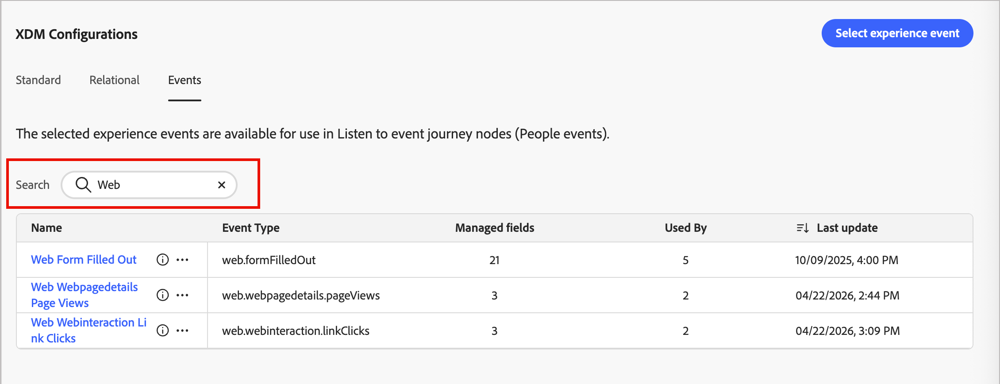
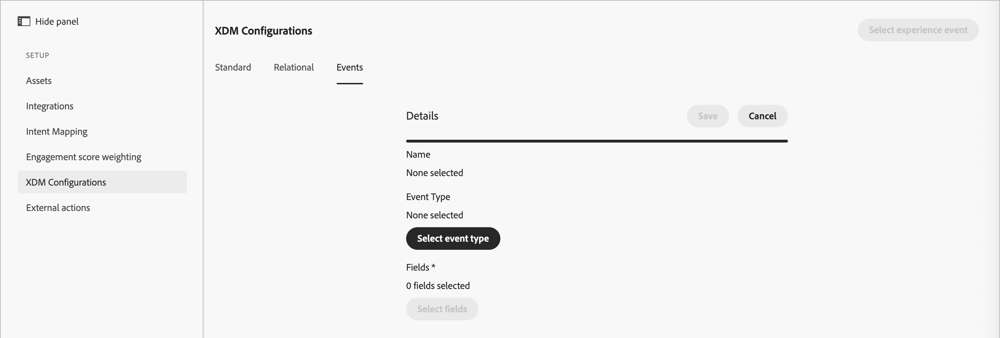

# Erlebnisereignisse und -felder auswählen

Admins können bestimmte [AEP-Erlebnisereignisse](https://experienceleague.adobe.com/en/docs/experience-platform/xdm/classes/experienceevent){target="_blank"} und deren zugehörige Felder im Vereinigungsschema für Erlebnisereignisse auswählen. Nach der Auswahl können Benutzende Entscheidungsregeln konfigurieren, die auf diese Erlebnisereignisse lauschen, um dynamische und zielgerichtete Kampagnenaktionen zu ermöglichen, die auf nahezu in Echtzeit erfassten Ereignisdaten basieren.

<!-- {width="30"} [Watch the video overview](#overview-video) -->

>[!PREREQUISITES]
>
>Für die Verwendung von Erlebnisereignissen und -feldern in Journey Optimizer B2B edition sind profilaktivierte Erlebnisereignisschemata erforderlich. Weitere Informationen finden Sie unter [Aktivieren von Echtzeit-Kundenprofilen](https://experienceleague.adobe.com/en/docs/platform-learn/getting-started-for-data-architects-and-data-engineers/enable-profiles){target="_blank"} in den Experience Platform-Tutorials.

Die Verwendung von AEP-Erlebnisereignissen in Journey ist ein zweistufiger Prozess:

1. Ein Administrator [fügt in den Journey Optimizer B2B edition-Konfigurationen AEP Experience ](#add-an-event) und -felder hinzu.

1. In einem Journey verwendet ein Marketer die konfigurierten Ereignisse auf eine dieser zwei Arten:

   * Fügt einen _Lauschen auf ein Ereignis_-Knoten hinzu und [wählt ein Erlebnisereignis aus](../journeys/listen-for-event-nodes.md#listen-for-an-experience-event) um den Fortschritt des Trigger-Journey basierend auf der Echtzeit-Ereignisaktivität während des Journey zu ermitteln.
   * Fügt den Knoten _Pfade nach Personen aufteilen_ hinzu und konfiguriert einen Pfad [Filtern nach einem Ereignis](../journeys/split-merge-paths-nodes.md#experience-event-history-filtering) aus dem Ordner **[!UICONTROL Ereignisverlauf]**.

>[!BEGINSHADEBOX]

## Richtlinien und Einschränkungen {#guidelines-and-limitations}

Beachten Sie bei der Auswahl von Ereignissen zur Erreichung Ihrer Unternehmensziele Folgendes:

* Sie können bis zu 50 Ereignisse und bis zu 100 Felder pro Ereignis auswählen.

* Journey können Erlebnisereignisse überwachen, die über Experience Platform-Streaming-Funktionen aufgenommen werden, z. B. Web-SDK oder HTTP-API.

* Historische Erlebnisereignisdaten werden für eine Person gesammelt, wenn das Ereignis in der Journey Optimizer B2B edition-Datenbank vorhanden ist. Für Personen, die bereits vorhanden sind, wenn ein Ereignistyp zum ersten Mal konfiguriert wird, beginnt die Aufstockung zum Zeitpunkt der Konfiguration. Bei neuen Personen beginnt die Akkumulation, wenn die Person zum ersten Mal hinzugefügt wird (ihre Vorgeschichte ist nicht rückwirkend verfügbar).

* Es gibt derzeit keinen Löschmechanismus für den akkumulierten Ereignisverlauf. Die Richtlinie zur langfristigen Aufbewahrung kann sich ändern.

* Wenn Sie ein Erlebnisereignis verwenden und die Journey veröffentlichen, können Sie weitere Felder hinzufügen, zuvor ausgewählte Felder jedoch nicht entfernen.

* Sie können ein Erlebnisereignis in mehreren Journey referenzieren oder es mehrmals auf derselben Journey verwenden.

>[!ENDSHADEBOX]

## Verwalten von Erlebnisereignissen {#manage-experience-events}

1. Wählen Sie in der linken Navigation **[!UICONTROL Administration]** > **[!UICONTROL Konfigurationen]**.

1. Klicken Sie **[!UICONTROL Zwischenbereich auf „XDM]** Konfigurationen“ und anschließend auf die Registerkarte **[!UICONTROL Ereignisse]**, um die Liste der verfügbaren Ereignisse anzuzeigen.

   {width="800" zoomable="yes"}

   Die Liste wird gemäß der Spalte _[!UICONTROL Letzte Aktualisierung]_ angezeigt, wobei die zuletzt aktualisierten Ereignisse standardmäßig oben stehen.

   Auf dieser Seite können Sie Ereignisse [Auswählen](#add-an-event) und [Bearbeiten](#edit-an-event) zur Verwendung in Journey auswählen.

   Um auf die Details für ein ausgewähltes Ereignis zuzugreifen, klicken Sie auf den Ereignisnamen.

### Filtern der Ereignisliste {#filter-the-event-list}

Geben Sie Text in das _[!UICONTROL Suchen]_-Feld ein, um die angezeigten Ereignisse nach einer Übereinstimmung mit dem Ereignisnamen zu filtern.

{width="600" zoomable="yes"}

### Ereignis hinzufügen {#add-an-event}

Um ein Erlebnisereignis für den Knoten _Lauschen auf ein Ereignis_ auf einer Journey verfügbar zu machen, wählen Sie das Ereignis und die unterstützten Felder aus.

1. Klicken **[!UICONTROL oben]** auf „Erlebnisereignis auswählen“.

   Die Seite mit den Ereignisdetails wird angezeigt. Auf dieser Seite können Sie den Ereignistyp und die Felder auswählen.

   {width="700" zoomable="yes"}

1. Wählen Sie den Ereignistyp.

   * Klicken Sie **[!UICONTROL Ereignistyp auswählen]**.

   * Wählen Sie im Dialogfeld den Ereignistyp aus.

     Filtern Sie _[!UICONTROL angezeigte Liste mithilfe]_ Felds „Suche“ nach Namen. Mit dem Schieberegler **[!UICONTROL Nur ausgewählte Felder anzeigen]** können Sie die aktuellen Auswahlen überprüfen.

     {width="450" zoomable="yes"}

   * Klicken Sie auf **[!UICONTROL Auswählen]**.

1. Wählen Sie ein oder mehrere Felder für den Ereignistyp aus.

   * Klicken Sie **[!UICONTROL Felder auswählen]**.

   * Wählen Sie im Dialogfeld die Felder aus, die Sie als Einschränkungen für übereinstimmende Ereignisse verwenden möchten.

     Filtern Sie _[!UICONTROL angezeigte Liste mithilfe]_ Felds „Suche“ nach Namen. Mit dem Schieberegler **[!UICONTROL Nur ausgewählte Felder anzeigen]** können Sie die aktuellen Auswahlen überprüfen.

     {width="450" zoomable="yes"}

   * Klicken Sie auf **[!UICONTROL Auswählen]**.

1. Klicken Sie auf der Seite mit den Ereignisdetails auf **[!UICONTROL Speichern]**.

Das gespeicherte Ereignis wird in der Liste auf der Registerkarte _[!UICONTROL Ereignisse]_ angezeigt.

### Ereignis bearbeiten {#edit-an-event}

Um die Felder zu ändern, bearbeiten Sie die Ereignisdetails.

1. Klicken Sie auf den Ereignisnamen oder auf das Symbol _Mehr Menü_ ( **…** ) und wählen Sie **[!UICONTROL Bearbeiten]**.

   {width="500" zoomable="yes"}

1. Klicken Sie auf **[!UICONTROL Felder bearbeiten]**, um das Dialogfeld _[!UICONTROL Felder auswählen]_ zu öffnen und weitere Felder hinzuzufügen.

   Sie können zuvor ausgewählte Felder nicht entfernen, nachdem eine Journey, die dieses Ereignis verwendet, veröffentlicht wurde.

1. Klicken Sie **[!UICONTROL Auswählen]**, um Ihre Auswahl zu speichern.

### Ereignis entfernen {#remove-an-event}

Um zu verhindern, dass ein Erlebnisereignis in einem Ereignisknoten _auf ein Ereignis_) auf einer Journey verwendet wird, entfernen Sie das Ereignis . Sie können ein Ereignis nicht entfernen, wenn es von einer Journey im _Geplant_, _Live_ oder _Beendet_ verwendet wird.

1. Klicken Sie auf das _Mehr_-Symbol ( **…** ) neben dem Ereignisnamen und wählen Sie **[!UICONTROL Entfernen]**.

1. Klicken Sie im Bestätigungsdialogfeld auf **[!UICONTROL Entfernen]**.

   {width="500" zoomable="yes"}

## Ereignisse und Felder {#events-and-fields}

[!DNL Journey Optimizer B2B Edition] werden bestimmte Aktivitäten auf Personenebene als Erlebnisereignisse [!DNL Experience Platform]. Diese Ereignisse werden in einem Systemdatensatz gespeichert, der das XDM-Erlebnisereignisschema verwendet und Journey-spezifische Feldergruppen enthält. Sie können diese Ereignisse in [!UICONTROL Journey Optimizer B2B edition] wie jedes andere Erlebnisereignis verwenden.

Jedes Ereignis zeigt einen definierten Satz von Feldern, die in Journey-Knoten (_eines Ereignisses)_ werden können (Ereignisentscheidung). Um zu bestimmen, welches Ereignis und welche Felder in diesen Journey-Knoten verwendet werden sollen, überprüfen Sie die verfügbaren Ereignistypen und ihre Felder:

### E-Mail gesendet {#email-sent}

Dieses Ereignis verfolgt, wann eine Marketing-E-Mail an eine Person gesendet wurde.

Ereignistyp: `directMarketing.emailSent`

+++Felder

| Anzeigename | Path |
| ------------ | ---- |
| Kennung | `_id` |
| Ereignistyp | `eventType` |
| Zeitstempel | `timestamp` |
| Personen-ID | `personID` |
| Personen-Quell-ID | `personKey.sourceID` |
| Quelltyp der Person | `personKey.sourceType` |
| ID der Quellinstanz der Person | `personKey.sourceInstanceID` |
| Ursprungsschlüssel der Person | `personKey.sourceKey` |
| E-Mail-Quell-ID | `directMarketing.emailSent.mailingKey.sourceID` |
| E-Mail-Quelltyp | `directMarketing.emailSent.mailingKey.sourceType` |
| E-Mail-Quellinstanz-ID | `directMarketing.emailSent.mailingKey.sourceInstanceID` |
| E-Mail-Quellschlüssel | `directMarketing.emailSent.mailingKey.sourceKey` |
| Mailing-Name | `directMarketing.emailSent.mailingName` |
| Journey-ID | `_experience.journeyOrchestration.stepEvents.journeyID` |
| Knoten-ID | `_experience.journeyOrchestration.stepEvents.nodeID` |

+++

### E-Mail übermittelt {#email-delivered}

Dieses Ereignis verfolgt, wann eine E-Mail erfolgreich an den E-Mail-Service einer Person zugestellt wurde.

Ereignistyp: `directMarketing.emailDelivered`

+++Felder

| Anzeigename | Path |
| ------------ | ---- |
| Kennung | `_id` |
| Ereignistyp | `eventType` |
| Zeitstempel | `timestamp` |
| Personen-ID | `personID` |
| Personen-Quell-ID | `personKey.sourceID` |
| Quelltyp der Person | `personKey.sourceType` |
| ID der Quellinstanz der Person | `personKey.sourceInstanceID` |
| Ursprungsschlüssel der Person | `personKey.sourceKey` |
| Mailingquellen-ID | `directMarketing.mailingKey.sourceID` |
| Quelltyp der E-Mail | `directMarketing.mailingKey.sourceType` |
| Quellinstanz-ID wird gesendet | `directMarketing.mailingKey.sourceInstanceID` |
| Quellschlüssel der E-Mail-Adresse | `directMarketing.mailingKey.sourceKey` |
| Mailing-Name | `directMarketing.mailingName` |
| Journey-ID | `_experience.journeyOrchestration.stepEvents.journeyID` |
| Knoten-ID | `_experience.journeyOrchestration.stepEvents.nodeID` |

+++

### E-Mail geöffnet {#email-opened}

Dieses Ereignis verfolgt, wann eine Person eine Marketing-E-Mail geöffnet hat.

Ereignistyp: `directMarketing.emailOpened`

+++Felder

| Anzeigename | Path |
| ------------ | ---- |
| Kennung | `_id` |
| Ereignistyp | `eventType` |
| Zeitstempel | `timestamp` |
| Personen-ID | `personID` |
| Personen-Quell-ID | `personKey.sourceID` |
| Quelltyp der Person | `personKey.sourceType` |
| ID der Quellinstanz der Person | `personKey.sourceInstanceID` |
| Ursprungsschlüssel der Person | `personKey.sourceKey` |
| Mailingquellen-ID | `directMarketing.mailingKey.sourceID` |
| Quelltyp der E-Mail | `directMarketing.mailingKey.sourceType` |
| Quellinstanz-ID wird gesendet | `directMarketing.mailingKey.sourceInstanceID` |
| Quellschlüssel der E-Mail-Adresse | `directMarketing.mailingKey.sourceKey` |
| Mailing-Name | `directMarketing.mailingName` |
| Ist ein mobiles Gerät | `device.isMobileDevice` |
| Gerätemodell | `device.model` |
| Benutzeragent | `environment.browserDetails.userAgent` |
| Betriebssystem | `environment.operatingSystem` |
| Journey-ID | `_experience.journeyOrchestration.stepEvents.journeyID` |
| Knoten-ID | `_experience.journeyOrchestration.stepEvents.nodeID` |

+++

### E-Mail angeklickt {#email-clicked}

Dieses Ereignis verfolgt, wann eine Person auf einen Link in einer Marketing-E-Mail geklickt hat.

Ereignistyp: `directMarketing.emailClicked`

+++Felder

| Anzeigename | Path |
| ------------ | ---- |
| Kennung | `_id` |
| Ereignistyp | `eventType` |
| Zeitstempel | `timestamp` |
| Personen-ID | `personID` |
| Personen-Quell-ID | `personKey.sourceID` |
| Quelltyp der Person | `personKey.sourceType` |
| ID der Quellinstanz der Person | `personKey.sourceInstanceID` |
| Ursprungsschlüssel der Person | `personKey.sourceKey` |
| Mailingquellen-ID | `directMarketing.mailingKey.sourceID` |
| Quelltyp der E-Mail | `directMarketing.mailingKey.sourceType` |
| Quellinstanz-ID wird gesendet | `directMarketing.mailingKey.sourceInstanceID` |
| Quellschlüssel der E-Mail-Adresse | `directMarketing.mailingKey.sourceKey` |
| Mailing-Name | `directMarketing.mailingName` |
| Link-URL | `directMarketing.linkURL` |
| Ist ein mobiles Gerät | `device.isMobileDevice` |
| Modell | `device.model` |
| Benutzeragent | `environment.browserDetails.userAgent` |
| Betriebssystem | `environment.operatingSystem` |
| Journey-ID | `_experience.journeyOrchestration.stepEvents.journeyID` |
| Knoten-ID | `_experience.journeyOrchestration.stepEvents.nodeID` |

+++

### E-Mail aufgrund eines Bounce-Ereignisses unzustellbar {#email-bounced}

Dieses Ereignis verfolgt, wann eine E-Mail an eine Person gebounct hat.

Ereignistyp: `directMarketing.emailBounced`

+++Felder

| Anzeigename | Path |
| ------------ | ---- |
| Kennung | `_id` |
| Ereignistyp | `eventType` |
| Zeitstempel | `timestamp` |
| Personen-ID | `personID` |
| Personen-Quell-ID | `personKey.sourceID` |
| Quelltyp der Person | `personKey.sourceType` |
| ID der Quellinstanz der Person | `personKey.sourceInstanceID` |
| Ursprungsschlüssel der Person | `personKey.sourceKey` |
| Mailingquellen-ID | `directMarketing.mailingKey.sourceID` |
| Quelltyp der E-Mail | `directMarketing.mailingKey.sourceType` |
| Quellinstanz-ID wird gesendet | `directMarketing.mailingKey.sourceInstanceID` |
| Quellschlüssel der E-Mail-Adresse | `directMarketing.mailingKey.sourceKey` |
| Mailing-Name | `directMarketing.mailingName` |
| E-Mail | `directMarketing.email` |
| E-Mail-Bounce-Code | `directMarketing.emailBouncedCode` |
| E-Mail-Bounce-Details | `directMarketing.emailBouncedDetails` |
| Journey-ID | `_experience.journeyOrchestration.stepEvents.journeyID` |
| Knoten-ID | `_experience.journeyOrchestration.stepEvents.nodeID` |

+++

### E-Mail nicht zugestellt (Soft Bounce) {#email-bounced-soft}

Dieses Ereignis verfolgt, wann eine E-Mail an eine Person Softbounce erzeugt.

Ereignistyp: `directMarketing.emailBouncedSoft`

+++Felder

| Anzeigename | Path |
| ------------ | ---- |
| Kennung | `_id` |
| Ereignistyp | `eventType` |
| Zeitstempel | `timestamp` |
| Personen-ID | `personID` |
| Personen-Quell-ID | `personKey.sourceID` |
| Quelltyp der Person | `personKey.sourceType` |
| ID der Quellinstanz der Person | `personKey.sourceInstanceID` |
| Ursprungsschlüssel der Person | `personKey.sourceKey` |
| Mailingquellen-ID | `directMarketing.mailingKey.sourceID` |
| Quelltyp der E-Mail | `directMarketing.mailingKey.sourceType` |
| Quellinstanz-ID wird gesendet | `directMarketing.mailingKey.sourceInstanceID` |
| Quellschlüssel der E-Mail-Adresse | `directMarketing.mailingKey.sourceKey` |
| Mailing-Name | `directMarketing.mailingName` |
| E-Mail | `directMarketing.email` |
| E-Mail-Bounce-Code | `directMarketing.emailBouncedCode` |
| E-Mail-Bounce-Details | `directMarketing.emailBouncedDetails` |
| Journey-ID | `_experience.journeyOrchestration.stepEvents.journeyID` |
| Knoten-ID | `_experience.journeyOrchestration.stepEvents.nodeID` |

+++

### E-Mail abbestellt {#email-unsubscribed}

Dieses Ereignis verfolgt, wann eine Person sich von einer Marketing-E-Mail abgemeldet hat.

Ereignistyp: `directMarketing.emailUnsubscribed`

+++Felder

| Anzeigename | Path |
| ------------ | ---- |
| Kennung | `_id` |
| Ereignistyp | `eventType` |
| Zeitstempel | `timestamp` |
| Personen-ID | `personID` |
| Personen-Quell-ID | `personKey.sourceID` |
| Quelltyp der Person | `personKey.sourceType` |
| ID der Quellinstanz der Person | `personKey.sourceInstanceID` |
| Ursprungsschlüssel der Person | `personKey.sourceKey` |
| Mailingquellen-ID | `directMarketing.mailingKey.sourceID` |
| Quelltyp der E-Mail | `directMarketing.mailingKey.sourceType` |
| Quellinstanz-ID wird gesendet | `directMarketing.mailingKey.sourceInstanceID` |
| Quellschlüssel der E-Mail-Adresse | `directMarketing.mailingKey.sourceKey` |
| Mailing-Name | `directMarketing.mailingName` |
| Journey-ID | `_experience.journeyOrchestration.stepEvents.journeyID` |
| Knoten-ID | `_experience.journeyOrchestration.stepEvents.nodeID` |

+++

### Seitenbesuch {#visit-web-page}

Dieser Ereignistyp ist die Standardmethode zum Markieren des Treffers als Seitenansicht.

Ereignistyp: `web.webpagedetails.pageViews`

+++Felder

| Anzeigename | Path |
| ------------ | ---- |
| Kennung | `_id` |
| Ereignistyp | `eventType` |
| Zeitstempel | `timestamp` |
| Personen-ID | `personID` |
| Personen-Quell-ID | `personKey.sourceID` |
| Quelltyp der Person | `personKey.sourceType` |
| ID der Quellinstanz der Person | `personKey.sourceInstanceID` |
| Ursprungsschlüssel der Person | `personKey.sourceKey` |
| Quellkennung der Webseite | `web.webPageDetails.webPageKey.sourceID` |
| Quelltyp der Web-Seite | `web.webPageDetails.webPageKey.sourceType` |
| Quellinstanz-ID der Web-Seite | `web.webPageDetails.webPageKey.sourceInstanceID` |
| Quellschlüssel der Webseite | `web.webPageDetails.webPageKey.sourceKey` |
| Name der Web-Seite | `web.webPageDetails.name` |
| Web-Seiten-URL | `web.webPageDetails.URL` |
| Web-Seiten-Abfrageparameter | `web.webPageDetails.queryParameters` |
| Webseiten-ID | `web.webPageDetails.webPageID` |
| Benutzeragent | `environment.browserDetails.userAgent` |
| Referrer-URL | `web.webReferrer.URL` |

+++

### Formular ausgefüllt {#form-filled-out}

Dieses Ereignis verfolgt, wann eine Person ein Formular auf einer Web-Seite ausgefüllt hat.

Ereignistyp: `web.formFilledOut`

+++Felder

| Anzeigename | Path |
| ------------ | ---- |
| Kennung | `_id` |
| Ereignistyp | `eventType` |
| Zeitstempel | `timestamp` |
| Personen-ID | `personID` |
| Personen-Quell-ID | `personKey.sourceID` |
| Quelltyp der Person | `personKey.sourceType` |
| ID der Quellinstanz der Person | `personKey.sourceInstanceID` |
| Ursprungsschlüssel der Person | `personKey.sourceKey` |
| Quellkennung des Webformulars | `web.fillOutForm.webFormKey.sourceID` |
| Quelltyp des Web-Formulars | `web.fillOutForm.webFormKey.sourceType` |
| Quellinstanz-ID des Web-Formulars | `web.fillOutForm.webFormKey.sourceInstanceID` |
| Quellschlüssel des Web-Formulars | `web.fillOutForm.webFormKey.sourceKey` |
| Web-Formular-ID | `web.fillOutForm.webFormID` |
| Name des Web-Formulars | `web.fillOutForm.webFormName` |
| Web-Seiten-Abfrageparameter | `web.webPageDetails.queryParameters` |
| Webseiten-ID | `web.webPageDetails.webPageID` |
| Benutzeragent | `environment.browserDetails.userAgent` |
| Referrer-URL | `web.webReferrer.URL` |

+++

### Weblink angeklickt {#web-link-clicked}

Das Ereignis signalisiert, dass die Web-SDK automatisch einen Link-Klick aufgezeichnet hat.

Ereignistyp: `web.webinteraction.linkClicks`

+++Felder

| Anzeigename | Path |
| ------------ | ---- |
| Kennung | `_id` |
| Ereignistyp | `eventType` |
| Zeitstempel | `timestamp` |
| Personen-ID | `personID` |
| Personen-Quell-ID | `personKey.sourceID` |
| Quelltyp der Person | `personKey.sourceType` |
| ID der Quellinstanz der Person | `personKey.sourceInstanceID` |
| Ursprungsschlüssel der Person | `personKey.sourceKey` |
| Quell-ID der Web-Interaktion | `web.webInteraction.webInteractionKey.sourceID` |
| Quelltyp für Web-Interaktion | `web.webInteraction.webInteractionKey.sourceType` |
| Quellinstanz-ID für Web-Interaktion | `web.webInteraction.webInteractionKey.sourceInstanceID` |
| Quellschlüssel der Web-Interaktion | `web.webInteraction.webInteractionKey.sourceKey` |
| Webinteraktions-Link-ID | `web.webInteraction.linkID` |
| Web Interaction Link URL | `web.webInteraction.linkURL` |
| Web-Seiten-Abfrageparameter | `web.webPageDetails.queryParameters` |
| Webseiten-ID | `web.webPageDetails.webPageID` |
| Benutzeragent | `environment.browserDetails.userAgent` |
| Referrer-URL | `web.webReferrer.URL` |

+++

### Interessanter Moment {#interesting-moment}

Dieses Ereignis verfolgt, wann ein interessanter Moment für eine Person aufgezeichnet wurde.

Ereignistyp: `leadOperation.interestingMoment`

+++Felder

| Anzeigename | Path |
| ------------ | ---- |
| Kennung | `_id` |
| Ereignistyp | `eventType` |
| Zeitstempel | `timestamp` |
| Personen-ID | `personID` |
| Personen-Quell-ID | `personKey.sourceID` |
| Quelltyp der Person | `personKey.sourceType` |
| ID der Quellinstanz der Person | `personKey.sourceInstanceID` |
| Ursprungsschlüssel der Person | `personKey.sourceKey` |
| Datum des Augenblicks | `leadOperation.interestingMoment.date` |
| Momentenbeschreibung | `leadOperation.interestingMoment.description` |
| Momentquelle | `leadOperation.interestingMoment.source` |
| Momenttyp | `leadOperation.interestingMoment.type` |
| Journey-ID | `_experience.journeyOrchestration.stepEvents.journeyID` |
| Knoten-ID | `_experience.journeyOrchestration.stepEvents.nodeID` |

+++

<!--
 ## Overview video

>[!VIDEO](https://video.tv.adobe.com/v/3448637/?learn=on) 
-->