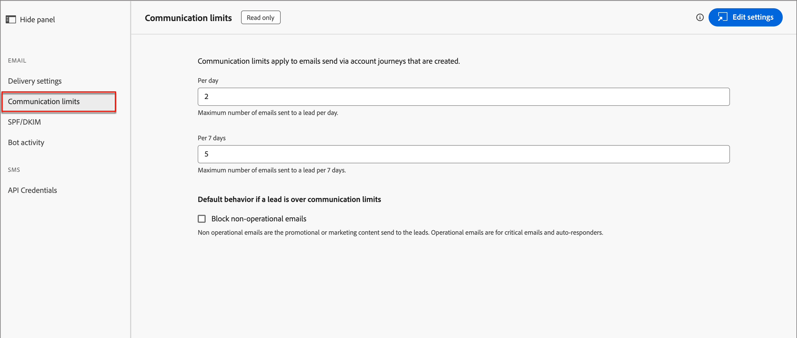

# E-Mail-Konfigurationen

Adobe Journey Optimizer B2B edition nutzt die Kanalfunktionen und das Ereignis-Tracking in Market Engage. Administratoren sollten sicherstellen, dass die Bereitstellungs- und Tracking-Konfigurationen vorhanden sind, um die Kanalbereitstellung für Marketingexperten zu ermöglichen. Informationen zu den Protokollen, die für den E-Mail-Versand und das Tracking über Marketo Engage erforderlich sind, finden Sie unter [Protokolle für das Tracking und die E-Mail-Bereitstellung](../start/email-protocols.md).

## Versandeinstellungen

Die Standard-E-Mail-Einstellungen werden verwendet, wenn Marketingexperten eine E-Mail in einer Konto-Journey erstellen. Um die E-Mail-Versandeinstellungen zu überprüfen, gehen Sie zu **[!UICONTROL Administration]** > **[!UICONTROL Kanäle]**. Wählen Sie unter _[!UICONTROL E-Mail]_ im Navigationsfenster **[!UICONTROL Versandeinstellungen]** aus.

{width="800" zoomable="yes"}

Die Einstellungen sind in Journey Optimizer B2B edition schreibgeschützt. Klicken Sie oben rechts auf **[!UICONTROL Einstellungen bearbeiten]** , um auf die Konfigurationsoptionen in der verbundenen Marketo Engage-Instanz zuzugreifen.

>[!NOTE]
>
>Um auf diese Einstellungen in Adobe Marketo Engage zugreifen und sie bearbeiten zu können, benötigen Sie Produktadministratorberechtigungen.

Wählen Sie jede der folgenden Registerkarten aus, um die aktuellen Einstellungen zu überprüfen.

### [!UICONTROL E-Mail-Header-Parameter] {#email-header}

Die E-Mail-Header-Parameter definieren die Standardwerte für Folgendes:

* **[!UICONTROL Von E-Mail]** - Die im Feld _Von_ im E-Mail-Header angegebene E-Mail-Adresse.

* **[!UICONTROL Von Titel]** - Der angezeigte Name für die E-Mail-Absenderadresse.

* **[!UICONTROL HTML abmelden]** - Die HTML (für unterstützte E-Mail-Clients), die in nicht operativen E-Mails angezeigt wird, um dem Empfänger Abmeldeaktionen zu erklären. Dieser Text und die Links werden am unteren Rand angehängt.

* **[!UICONTROL Text abmelden]** - Der Text, der in nicht operativen E-Mails angezeigt wird, um Abmeldeaktionen für den Empfänger zu erklären. Dieser Text und die Links werden am unteren Rand angehängt.

* **[!UICONTROL Als Web-Seite anzeigen HTML]** - Die HTML (für unterstützte E-Mail-Clients), die für _Als Web-Seite anzeigen_ verwendet wird, die einen Link bereitstellt, um eine E-Mail in einem Browser anzuzeigen.

* **[!UICONTROL Als Webseitentext anzeigen]** - Der für _Als Webseite anzeigen_ verwendete Text, der einen Link bereitstellt, um eine E-Mail in einem Browser anzuzeigen.

### [!UICONTROL Branding-Domänen] {#branding-domains}

Um die Branding-Domänen zu überprüfen, klicken Sie auf die Registerkarte **[!UICONTROL Branding-Domänen]** .

{width="700" zoomable="yes"}

Diese Einstellung definiert Ihre primäre Domäne für einen oder mehrere Marketo Engage-Arbeitsbereiche. Neue E-Mails verwenden diese Domäne als Standard, aber Marketing-Experten können sie pro E-Mail außer Kraft setzen. Weitere Informationen finden Sie in der [Marketo Engage-Dokumentation](https://experienceleague.adobe.com/en/docs/marketo/using/product-docs/administration/email-setup/add-multiple-branding-domains/edit-your-default-branding-domain){target="_blank"}.

>[!NOTE]
>
>Wenn Sie mehrere Marken aus Journey Optimizer B2B edition und der verbundenen Marketo Engage-Instanz vermarkten und möchten, dass jede über eigene Marken-Tracking-Links verfügt, können Sie eine zusätzliche Branding-Domäne hinzufügen. Weitere Informationen finden Sie in der [Marketo Engage-Dokumentation](https://experienceleague.adobe.com/en/docs/marketo/using/product-docs/administration/email-setup/add-multiple-branding-domains/add-an-additional-branding-domain){target="_blank"}.

### [!UICONTROL Benutzerdefinierte Kopfzeilenoptionen] {#custom-header-options}

Um die benutzerdefinierten Kopfzeilenoptionen zu überprüfen, klicken Sie auf die Registerkarte **[!UICONTROL Benutzerdefinierte Kopfzeilenoptionen]** .

{width="700" zoomable="yes"}

Wenn _[!UICONTROL Strikte Transport Security]_ aktiviert ist, wird sichergestellt, dass Tracking-Links über HTTPS bereitgestellt werden (nur für Abonnements mit Tracking-Links, die durch SSL gesichert sind).

## Kommunikationsbeschränkungen

Die Kommunikation begrenzt die Anzahl der E-Mails, die Ihr Unternehmen sendet. Es empfiehlt sich, Einschränkungen festzulegen, damit Sie Empfänger nicht mit zu vielen E-Mails aus Ihrer Organisation überfordern.

Um die aktuellen Einstellungen zu überprüfen, gehen Sie zu **[!UICONTROL Administration]** > **[!UICONTROL Kanäle]**. Wählen Sie unter _[!UICONTROL E-Mail]_ im Navigationsbereich **[!UICONTROL Kommunikationsbeschränkungen]** aus.

{width="700" zoomable="yes"}

Die Einstellungen sind in Journey Optimizer B2B edition schreibgeschützt. Klicken Sie oben rechts auf **[!UICONTROL Einstellungen bearbeiten]** , um auf die Konfigurationsoptionen in der verbundenen Marketo Engage-Instanz zuzugreifen.

>[!NOTE]
>
>Um auf diese Einstellungen in Adobe Marketo Engage zugreifen und sie bearbeiten zu können, benötigen Sie Produktadministratorberechtigungen.

Weitere Informationen zum Konfigurieren der Kommunikationsbeschränkungen finden Sie in der [Marketo Engage-Dokumentation](https://experienceleague.adobe.com/en/docs/marketo/using/product-docs/administration/email-setup/enable-communication-limits){target="_blank"}.

## SPF/DKIM

Verbessern Sie Ihre E-Mail-Versandraten, indem Sie SPF (Sender Policy Framework) und DKIM (Domain Keys Identified Mail) in Ihre DNS-Einstellungen integrieren. Mit diesen Technologien können Sie Ihren Empfängern versichern, dass Ihre E-Mails keine Spam sind. Um zu verhindern, dass die Spam-Filter der Empfänger E-Mails ablehnen, müssen SPF und DKIM für Ihre Domains eingerichtet sein.

Um die aktuellen Einstellungen zu überprüfen, gehen Sie zu **[!UICONTROL Administration]** > **[!UICONTROL Kanäle]**. Wählen Sie unter &quot;_[!UICONTROL E-Mail]_&quot;im Navigationsfenster **[!UICONTROL SPF/DKIM]**&quot;.

{width="700" zoomable="yes"}

Die Einstellungen sind in Journey Optimizer B2B edition schreibgeschützt. Klicken Sie oben rechts auf **[!UICONTROL Einstellungen bearbeiten]** , um auf die Konfigurationsoptionen in der verbundenen Marketo Engage-Instanz zuzugreifen.

>[!NOTE]
>
>Um auf diese Einstellungen in Adobe Marketo Engage zugreifen und sie bearbeiten zu können, benötigen Sie Produktadministratorberechtigungen.

### SPF-Einrichtung

Der Netzwerkadministrator sollte Ihren DNS-Einträgen die folgende Zeile hinzufügen:

`[domain] IN TXT v=spf1 mx ip4:[corpIP] include:mktomail.com ~all`

Ersetzen Sie in diesem Eintrag `[domain]` durch die primäre Domäne Ihrer Website (z. B. `company.com`) und `[corpIP]` durch die IP-Adresse Ihres Unternehmens-E-Mail-Servers (z. B. `255.255.255.255`). Wenn Sie E-Mails von mehreren Domänen über Marketo Engage senden, fügen Sie diesen Eintrag für jede Domäne in einer einzigen Zeile hinzu.

Wenn Sie bereits einen SPF-Eintrag in Ihrem DNS-Eintrag haben, fügen Sie Folgendes hinzu:

`include:mktomail.com`

### DKIM-Setup

DKIM ist ein Authentifizierungsprotokoll, das von E-Mail-Empfängern zur Validierung des Absenders der E-Mail-Nachricht verwendet wird. E-Mails werden oft besser an den Posteingang gesendet, da der Empfänger sicher sein kann, dass es sich nicht um eine Fälschung handelt.

Wenn der öffentliche Schlüssel in Ihrem DNS-Eintrag aktiviert ist und die sendende Domain in der verbundenen Marketo Engage-Instanz aktiviert ist, wird für Ihre ausgehenden Nachrichten eine benutzerdefinierte DKIM-Signatur verwendet. Die benutzerdefinierte DKIM-Signatur enthält eine verschlüsselte digitale Signatur mit jeder gesendeten E-Mail. Die Empfänger können dann die digitale Signatur entschlüsseln, indem sie den _öffentlichen Schlüssel_ im DNS Ihrer sendenden Domain suchen. Wenn der Schlüssel in der E-Mail mit dem Schlüssel im DNS-Eintrag übereinstimmt, akzeptiert der E-Mail-Empfangs-Server eher die per Marketo Engage gesendete E-Mail.

Weitere Informationen zum Konfigurieren einer benutzerdefinierten DKIM-Signatur für den E-Mail-Versand finden Sie in der [Marketo Engage-Dokumentation](https://experienceleague.adobe.com/en/docs/marketo/using/product-docs/email-marketing/deliverability/set-up-a-custom-dkim-signature){target="_blank"}.

## Bot-Aktivität

Die E-Mail-Bot-Aktivität kann fälschlicherweise die Öffnung Ihrer E-Mail und die Klickdaten erhöhen.

Marketo Engage verwendet zwei Methoden zur Bestätigung der Bot-Aktivität:

* **Übereinstimmung mit der IAB-Liste (Interactive Advertising Bureau)** - Aktivitäten, die mit irgendetwas in der IAB-UA/IP-Liste (User Agent/IP-Adresse) übereinstimmen, werden als Bots markiert.

* **Übereinstimmung mit dem Nähe-Muster** - Wenn zwei oder mehr Aktivitäten gleichzeitig stattfinden (innerhalb einer Sekunde), werden sie als Bots identifiziert. Diese Methode berücksichtigt die folgenden Attribute zum Vergleich:

   * Lead-ID (sollte identisch sein)
   * E-Mail-Asset (sollte identisch sein)
   * Link-Klick oder E-Mail-Öffnung
   * Zeitdifferenz (sollte weniger als eine Sekunde betragen)

Bei E-Mail-Link-Klick- und E-Mail-Öffnungs-Aktivitäten werden neue Attribute mit den folgenden Werten aufgefüllt:

* Aktivitäten, die als Bots identifiziert werden, haben _Bot Activity_ als `True` und _Bot Activity Pattern_ als identifiziertes Muster/Methode.
* Aktivitäten, die als nicht &quot;Bots&quot;gekennzeichnet sind, haben _Bot Activity_ als `False` und _Bot Activity Pattern_ als `N/A`.
* Aktivitäten, die vor der Einführung der Attribute stattfinden, haben _Bot Activity_ als leer (null) und _Bot Activity Pattern_ als leer (null).

Um die aktuellen Einstellungen zu überprüfen, gehen Sie zu **[!UICONTROL Administration]** > **[!UICONTROL Kanäle]**. Wählen Sie unter &quot;_[!UICONTROL E-Mail]_&quot;im Navigationsbereich **[!UICONTROL Bot-Aktivität]** aus.

{width="700" zoomable="yes"}

Die Einstellungen sind in Journey Optimizer B2B edition schreibgeschützt. Klicken Sie oben rechts auf **[!UICONTROL Einstellungen bearbeiten]** , um auf die Konfigurationsoptionen in der verbundenen Marketo Engage-Instanz zuzugreifen.

>[!NOTE]
>
>Um auf diese Einstellungen in Adobe Marketo Engage zugreifen und sie bearbeiten zu können, benötigen Sie Produktadministratorberechtigungen.

Weitere Informationen zum Konfigurieren der Bot-Aktivitätsoptionen finden Sie in der [Marketo Engage-Dokumentation](https://experienceleague.adobe.com/en/docs/marketo/using/product-docs/administration/email-setup/filtering-email-bot-activity#select-filter-type){target="_blank"}.
