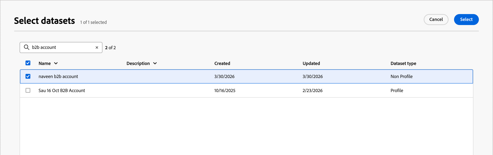

# Forms-Konfigurationen

Bevor Marketer Formulare [erstellen und veröffentlichen](../content/forms.md) um sie auf ihren Landingpages zu verwenden, muss ein Produktadministrator eine oder mehrere dedizierte Voreinstellungen erstellen. Jede Vorgabe definiert den Verbindungsendpunkt, der zum Senden der Formularübermittlungsdaten verwendet wird, und den Datensatz, der zum Speichern der erfassten Daten verwendet wird.

Wenn Daten auf dem Streaming-Endpunkt landen, werden sie mit den Datensatzinformationen verknüpft. Mithilfe der generierten Quell-/Zielverbindungen und des Quellflusses werden die Daten dann in den Datensatz übertragen.

>[!BEGINSHADEBOX]

## Voraussetzungen

Um Web-Formulare verwenden zu können, müssen mindestens eine _&#x200B;**HTTP-API-Streaming-Verbindung**&#x200B;_ in Adobe Experience Platform definiert sein. Stellen Sie sicher, dass jede Verbindung, die Sie verwenden möchten, die folgenden Anforderungen erfüllt:

* Datentyp muss auf XDM festgelegt sein (nicht auf Rohdaten)
* Authentifizierung muss deaktiviert sein (nicht authentifizierte Verbindung)

Detaillierte Informationen zum Erstellen von Streaming-Quellverbindungen finden Sie in der [_Experience Platform-Dokumentation_](https://experienceleague.adobe.com/de/docs/experience-platform/sources/ui-tutorials/create/streaming/http).

Die Forms-Kanalkonfiguration in Journey Optimizer B2B edition erfordert die folgenden [Berechtigungen](../admin/user-management.md#b2b-product-permissions):

* _[!UICONTROL B2B-Kanalkonfigurationen]_ > _[!UICONTROL Forms-Vorgaben anzeigen]_ - Erforderlich, um Formularvorgabenkonfigurationen anzuzeigen.
* _[!UICONTROL B2B-Kanalkonfigurationen]_ > _[!UICONTROL Forms-Voreinstellungen verwalten]_ - Erforderlich zum Erstellen, Aktualisieren und Löschen von Konfigurationen für Formularvorgaben.
* _[!UICONTROL B2B-Kanalkonfigurationen]_ > _[!UICONTROL Forms-Vorgaben veröffentlichen]_ - Erforderlich zum Veröffentlichen von Formularvorgabenkonfigurationen.

>[!ENDSHADEBOX]

## Konfigurationsrichtlinien für Formularvorgaben

Beim Erstellen einer Voreinstellung:

* Sie können mit verschiedenen Kombinationen aus Datensätzen und Streaming-Verbindungen unterschiedliche Voreinstellungen einrichten.

* Sie können denselben Datensatz oder dieselbe Streaming-Verbindung über mehrere Voreinstellungen hinweg wiederverwenden.

* Jede Streaming-Verbindung generiert automatisch Ressourcen, z. B.:

   * _Quellverbindung_: Woher die Daten stammen.
   * _Zielverbindung_: Wo die Daten gespeichert oder genutzt werden.
   * _Source-Fluss_ - die Pipeline, die Daten von der Quellverbindung nach Experience Platform verschiebt. Es übernimmt die Zuordnung, Umwandlung und Validierung.

## Erstellen einer Formularvoreinstellung

1. Navigieren Sie in der linken Navigation zu **[!UICONTROL Administration]** > **[!UICONTROL Kanäle]**.

1. Wählen _[!UICONTROL im]_ unter „Formulareinstellungen“ die Option **[!UICONTROL Formularvorgaben]** aus.

   {width="800" zoomable="yes"}

1. Klicken Sie auf **[!UICONTROL Formularvoreinstellung erstellen]**.

1. Geben Sie einen eindeutigen **[!UICONTROL Namen]** (erforderlich) und einen **[!UICONTROL Beschreibung]** (optional) für die Konfiguration ein.

   >[!NOTE]
   >
   >Namen müssen mit einem Buchstaben (A-Z) beginnen und dürfen nur alphanumerische Zeichen enthalten. Sie können auch die Zeichen Unterstrich `_`, Punkt `.` und Bindestrich `-`.

1. Wählen Sie die **[!UICONTROL Streaming-Verbindung]** aus.

   Diese Verbindung ist der Streaming-Endpunkt, der zum Senden der Daten verwendet wird, wenn ein Web-Viewer ein Formular sendet. Wenn die erforderliche Streaming-Verbindung nicht in der Liste angezeigt wird, überprüfen Sie, ob die Anforderungen erfüllt sind.

1. Klicken Sie auf das _Datensatz auswählen_ (  ), um einen Datensatz mit dem Formular zu verknüpfen.

   Der Datensatz ist der Ort, an dem die Formularantworten gespeichert und dargestellt werden. Sie können eine Textzeichenfolge eingeben, um nach einem bestimmten Datensatz zu suchen, oder ihn aus der Liste auswählen.

   {width="500" zoomable="yes"}

   >[!NOTE]
   >
   >Derzeit stehen nur profilaktivierte und nicht profilaktivierte [Adobe Experience Platform-Datensätze](https://experienceleague.adobe.com/de/docs/experience-platform/catalog/datasets/overview) zur Auswahl. Es kann jeweils nur ein Datensatz ausgewählt werden. Systemdatensätze können nicht zum Speichern von Formulardaten verwendet werden.

   Aktivieren Sie das Kontrollkästchen für den Datensatz und klicken Sie auf **[!UICONTROL Auswählen]**.

1. Klicken Sie **[!UICONTROL Als Entwurf speichern]**.

## Veröffentlichen einer Formularvorgabe

1. Klicken Sie auf den Namen der Formularvorgabe, um die Konfigurationsseite zu öffnen.

   Sie können bei Bedarf Anpassungen am Entwurf vornehmen.

1. Klicken Sie auf **[!UICONTROL Veröffentlichen]**.

   Wenn die Formularvorgabe mit dem Status _Veröffentlicht_ aufgeführt wird, kann sie für die Formularerstellung verwendet werden.
