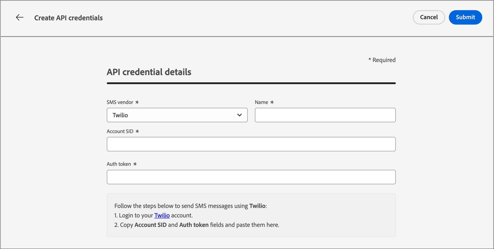

# SMS-Konfigurationen

Adobe Journey Optimizer B2B edition sendet Textnachrichten über SMS-Dienstleister (oder SMS-Gateway-Anbieter). Bevor Sie Ihre SMS-Nachricht erstellen, konfigurieren Sie Ihren Dienstleister über die Einstellungen _Administrator_.

## SMS-Gateway-Dienstanbieter

Adobe Journey Optimizer B2B edition kann derzeit mit Drittanbietern integriert werden, die Textnachrichten-Services unabhängig anbieten. Unterstützte Anbieter für Textnachrichten sind Sinch, Twilio und Infobip.

Bevor Sie einen SMS-Kanal in Adobe Journey Optimizer B2B edition konfigurieren, müssen Sie ein Konto bei einem dieser Provider erstellen, um Ihr API-Token und Ihre Service-ID zu erhalten. Diese Anmeldeinformationen werden benötigt, um die Verbindung zwischen Adobe Journey Optimizer B2B edition und dem entsprechenden Anbieter zu konfigurieren.

>[!IMPORTANT]
>
>Ihre Nutzung von Textnachrichten-Services unterliegt zusätzlichen Bedingungen des jeweiligen Anbieters. Als Drittanbieterlösungen sind Sinch, Twilio und Infobip für Adobe Journey Optimizer B2B edition-Anwender über eine Integration verfügbar. Adobe kontrolliert keine Produkte von Drittanbietern und ist nicht für diese verantwortlich. Wenden Sie sich bei Problemen oder Anfragen zur Unterstützung im Zusammenhang mit den Textnachrichten-Services (SMS) an Ihren Provider.

## Überprüfen einer vorhandenen SMS-API-Konfiguration

>[!NOTE]
>
>Die beschriebenen Einstellungen sind nur für Benutzer mit SMS-Administratorrechten zugänglich.

1. Erweitern Sie in der linken Navigation den Abschnitt **[!UICONTROL Administrator]** und klicken Sie auf **[!UICONTROL Kanäle]**.

   {width="800" zoomable="yes"}

1. Wählen Sie im Navigationsbereich die Option **[!UICONTROL API-Anmeldeinformationen]** aus.

   Auf der Seite werden die verfügbaren API-Konfigurationen für Ihre Instanz aufgelistet.

1. Klicken Sie bei Bedarf auf _Filter_-Symbol (  ) und wählen Sie Optionen aus, um die Liste der vom SMS-Dienstleister oder Ersteller konfigurierten API-Anmeldeinformationen anzuzeigen.

   {width="600" zoomable="yes"}

## Erstellen neuer API-Anmeldeinformationen für einen SMS-Dienstleister

>[!BEGINTABS]

>[!TAB Sinch]

_So konfigurieren Sie Sinch als SMS-Provider mit Adobe Journey Optimizer B2B edition:_

1. Erweitern Sie in der linken Navigation den Abschnitt **[!UICONTROL Administrator]** und klicken Sie auf **[!UICONTROL Konfiguration]**.

1. Klicken Sie **[!UICONTROL oben rechts in der Liste]** API-Anmeldeinformationen“ auf _[!UICONTROL Neue API-]_ erstellen“.

1. Konfigurieren Sie Ihre SMS-API-Anmeldedaten:

   {width="500"}

   * **[!UICONTROL SMS-Anbieter]** - Wählen Sie `Sinch` als SMS-Anbieter.

   * **[!UICONTROL Name]** - Geben Sie einen Namen für Ihre API-Anmeldeinformationen ein.

   * **[!UICONTROL Service-]** und **[!UICONTROL API-Token]** - Greifen Sie über Ihr Sinch-Konto auf die API-Seite zu (Ihre Anmeldedaten finden Sie auf der Registerkarte „SMS„).

   Weitere Informationen zum Auffinden dieser Informationen für Ihr Sinch-Konto finden Sie in der [Sinch-Entwicklerdokumentation](https://developers.sinch.com/docs/sms/getting-started/#2-get-credentials)

1. Klicken Sie **[!UICONTROL Senden]** wenn die Konfigurationsdetails Ihrer API-Anmeldeinformationen abgeschlossen sind.

>[!TAB Twilio]

_So konfigurieren Sie Twilio als SMS-Provider mit Adobe Journey Optimizer B2B edition:_

1. Erweitern Sie in der linken Navigation den Abschnitt **[!UICONTROL Administrator]** und klicken Sie auf **[!UICONTROL Konfiguration]**.

1. Klicken Sie **[!UICONTROL oben rechts in der Liste]** API-Anmeldeinformationen“ auf _[!UICONTROL Neue API-]_ erstellen“.

1. Konfigurieren Sie Ihre SMS-API-Anmeldedaten:

   {width="500"}

   * **[!UICONTROL SMS-Anbieter]** - Wählen Sie `Twilio` als SMS-Anbieter.

   * **[!UICONTROL Name]** - Geben Sie einen Namen für Ihre API-Berechtigungsdefinition ein.

   * **[!UICONTROL Konto-SID]** und **[!UICONTROL Authentifizierungs-Token]** - Rufen Sie den Bereich _Kontoinformationen_ Ihrer Twilio Console-Dashboard-Seite auf. Dort finden Sie Ihre Anmeldedaten.

   Weitere Informationen dazu, wie Sie diese Informationen für Ihr Twilio-Konto finden, finden Sie im [Twilio-Hilfezentrum](https://help.twilio.com/articles/14726256820123-What-is-a-Twilio-Account-SID-and-where-can-I-find-it-).

1. Klicken **[!UICONTROL oben rechts]** der Seite auf „Senden“, wenn die Konfigurationsdetails Ihrer API-Anmeldeinformationen abgeschlossen sind.

>[!TAB Infobip]

_So konfigurieren Sie Infobip als SMS-Provider mit Adobe Journey Optimizer B2B edition:_

1. Erweitern Sie in der linken Navigation den Abschnitt **[!UICONTROL Administrator]** und klicken Sie auf **[!UICONTROL Konfiguration]**.

1. Klicken Sie **[!UICONTROL oben rechts in der Liste]** API-Anmeldeinformationen“ auf _[!UICONTROL Neue API-]_ erstellen“.

1. Konfigurieren Sie Ihre SMS-API-Anmeldedaten:

   {width="500"}

   * **[!UICONTROL SMS-Anbieter]** - Wählen Sie `Infobip` als SMS-Anbieter.

   * **[!UICONTROL Name]** - Geben Sie einen Namen für Ihre API-Berechtigungsdefinition ein.

   * **[!UICONTROL API-Basis]** URL und **[!UICONTROL API-Schlüssel]** - Rufen Sie die Startseite Ihrer Web-Oberfläche oder die Seite zur Verwaltung von API-Schlüsseln für Ihr Infobip-Konto auf. Dort finden Sie Ihre Anmeldedaten.

   Weitere Informationen zum Auffinden dieser Informationen für Ihr Infobip-Konto finden Sie in der [Infobip-Dokumentation](https://www.infobip.com/docs/api/_blank).

1. Klicken **[!UICONTROL oben rechts]** der Seite auf „Senden“, wenn die Konfigurationsdetails Ihrer API-Anmeldeinformationen abgeschlossen sind.

>[!ENDTABS]

Wenn Sie auf _[!UICONTROL Senden]_ klicken, werden die Anmeldeinformationen sofort validiert und gespeichert, wodurch Sie zur Auflistungsseite _[!UICONTROL API]_ weitergeleitet werden. Wenn die übermittelten Anmeldeinformationen ungültig sind, zeigt das System auf der Listenseite eine Fehlermeldung an. In diesem Fall können Sie die Konfiguration abbrechen oder aktualisieren und erneut senden.
