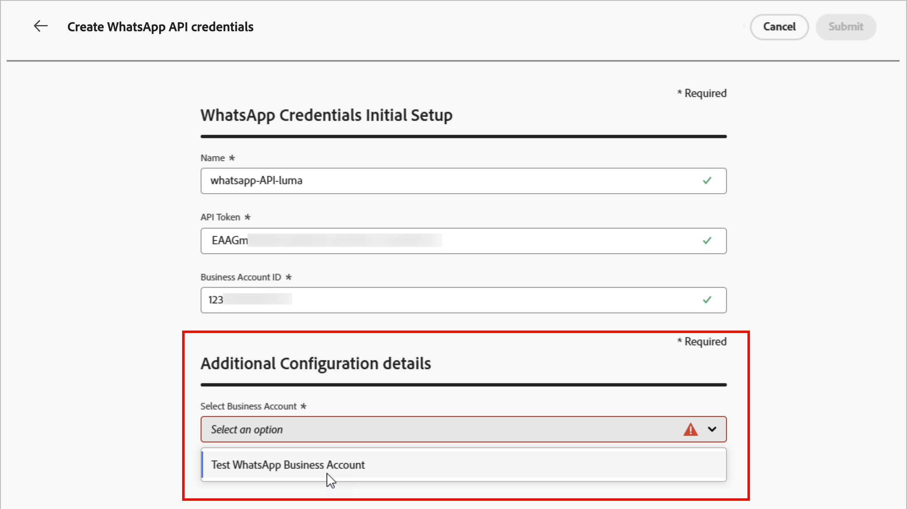

# Einrichtung des WhatsApp-Kanals

Adobe Journey Optimizer B2B edition sendet WhatsApp-Nachrichten über die Cloud-API von Meta. Bevor Marketer WhatsApp-Nachrichten für Account-Journeys erstellen können, muss ein Produktadministrator einen WhatsApp-Kanal konfigurieren.

## Voraussetzungen

Bevor Sie den WhatsApp-Kanal konfigurieren, stellen Sie sicher, dass Sie Folgendes haben:

* [Ein Meta Business Manager-Konto](https://business.facebook.com/)
* [Ein WhatsApp Business-Konto mit einem verifizierten Absendernamen und einer Telefonnummer](https://developers.facebook.com/docs/whatsapp/overview/business-accounts/)
* [Ein Meta-Benutzerautorisierungs-Token mit den entsprechenden Berechtigungen](https://developers.facebook.com/blog/post/2022/12/05/auth-tokens/)
* [Genehmigte Nachrichtenvorlagen in Ihrem WhatsApp Business-Konto](https://developers.facebook.com/docs/whatsapp/message-templates/guidelines/)

>[!IMPORTANT]
>
>Ihre Nutzung der WhatsApp Messaging Services unterliegt den Nutzungsbedingungen von Meta. Durch den Zugriff auf WhatsApp-Nachrichten über Journey Optimizer B2B edition bestätigen Sie, dass Sie die [Meta WhatsApp-Geschäftsrichtlinien überprüft haben und damit einverstanden sind](https://www.whatsapp.com/legal/business-policy/).

## Einschränkungen {#limitations}

Für den WhatsApp-Kanal gelten die folgenden Einschränkungen:

* Adobe Journey Optimizer B2B edition ist **nicht HIPAA-kompatibel und nicht HIPAA-fähig**. Darüber hinaus werden Drittanbieter nicht von der Adobe-BAA abgedeckt. Kundinnen und Kunden sind für ihre Compliance und Anbietervalidierung selbst verantwortlich.

* Automatisierte oder vordefinierte Antwortnachrichten werden noch nicht unterstützt.

* Seit April 2025 hat Meta vorübergehend den Versand aller Nachrichten aus Marketing-Vorlagen an WhatsApp-Benutzer mit einer US-Telefonnummer (einer Nummer bestehend aus einer +1-Wählnummer und einer US-Ortsvorwahl) ausgesetzt. [Weitere Informationen finden Sie in der Dokumentation zu Meta](https://developers.facebook.com/documentation/business-messaging/whatsapp/templates/marketing-templates/per-user-limits/)

* Die native Integrationsfunktion ermöglicht keine Integration mit einem Business Service Provider (BSP) eines Drittanbieters.

## Abschließen der Kanalkonfiguration

Bevor Sie Ihre WhatsApp-Nachricht senden, müssen Sie Ihre Journey Optimizer B2B edition-Umgebung konfigurieren und mit Ihrem WhatsApp-Konto verbinden.

Führen Sie die folgenden Aufgaben aus:

1. [Erstellen der WhatsApp-API-Anmeldedaten](#create-whatsapp-api-credentials)
1. [Hinzufügen der WhatsApp-Webhooks](#configure-webhooks)
1. [Erstellen der WhatsApp-Kanalkonfiguration](#create-channel-configuration)

### Erstellen von WhatsApp-API-Anmeldedaten

>[!NOTE]
>
>Auf die beschriebenen Einstellungen können nur Benutzer mit Administratorrechten zugreifen.

1. Erweitern Sie in der linken Navigation den Abschnitt **[!UICONTROL Administration]** und klicken Sie auf **[!UICONTROL Kanäle]**.

1. Erweitern Sie im Bedienfeld **[!UICONTROL WhatsApp-Einstellungen]** und wählen Sie **[!UICONTROL API-Anmeldeinformationen]** aus.

   {width="800" zoomable="yes"}

1. Klicken **[!UICONTROL oben rechts auf]** Neue API-Anmeldeinformationen erstellen“.

1. Konfigurieren Sie Ihre API-Anmeldedaten, wie unten beschrieben:

   * **[!UICONTROL Name]** - Geben Sie einen eindeutigen Namen für die Anmeldeinformationen ein.
   * **[!UICONTROL API-Token]** - Geben Sie Ihr API-Token ein. Weitere Informationen finden Sie in der [Dokumentation zu Meta](https://developers.facebook.com/blog/post/2022/12/05/auth-tokens/).
   * **[!UICONTROL Geschäftskonto-ID]** - Geben Sie die eindeutige Nummer Ihres Geschäftsportfolios ein. Weitere Informationen finden Sie in der [Dokumentation zu Meta](https://www.facebook.com/business/help/1181250022022158?id=180505742745347).

   {width="500" zoomable="yes"}

1. Klicken Sie auf **[!UICONTROL Fortfahren]**.

1. Wählen Sie das **[!UICONTROL WhatsApp Business-Konto]**, mit dem Sie eine Verbindung zu Ihren WhatsApp-API-Anmeldeinformationen herstellen möchten.

   {width="500" zoomable="yes"}

1. Wählen Sie den **[!UICONTROL Absendernamen]** für den Versand von WhatsApp-Nachrichten aus.

   Die Telefonnummerneinstellungen werden automatisch ausgefüllt:

   * **Qualitätsbewertung** - spiegelt das Kunden-Feedback für Nachrichten wider, die in den letzten 24 Stunden gesendet wurden.
      * Grün: hohe Qualität
      * Gelb: mittlere Qualität
      * Rot: geringe Qualität

     Weitere Informationen finden Sie unter [_Qualitätsbewertung_](https://www.facebook.com/business/help/766346674749731#) in der Dokumentation zu Meta.

   * **Durchsatz** - gibt die Rate an, mit der Ihre Telefonnummer Nachrichten senden kann.

1. Wenn Sie die Konfiguration Ihrer API-Anmeldedaten abgeschlossen haben, klicken Sie auf **[!UICONTROL Senden]**.

Wenn Sie auf _[!UICONTROL Senden]_ klicken, werden die Anmeldeinformationen sofort validiert und gespeichert, wodurch Sie zur Auflistungsseite _[!UICONTROL API]_ weitergeleitet werden.

Wenn die gesendeten Anmeldeinformationen ungültig sind, zeigt das System eine HTTP 500-Fehlermeldung an. In diesem Fall können Sie die Konfiguration abbrechen oder aktualisieren und erneut senden.

+++Fehlerbehebung bei HTTP 500

Wenn beim Konfigurieren der WhatsApp-API-Anmeldedaten ein HTTP-500-Fehler auftritt, führen Sie die folgenden Schritte zur Fehlerbehebung aus:

1. Überprüfen Sie Ihre Adobe-Berechtigungen : Vergewissern Sie sich, dass für Ihr Unternehmen die Berechtigung _cjm_ whatsapp_ bereitgestellt wurde. Ohne diese Berechtigung kann der WhatsApp-Kanal nicht konfiguriert werden.

1. Validieren der Felder für das Geschäftskonto : Stellen Sie sicher, dass alle Pflichtfelder korrekt sind:

   * API-Token - Muss ein gültiges [Meta-Zugriffstoken mit entsprechenden Berechtigungen sein](https://developers.facebook.com/blog/post/2022/12/05/auth-tokens/).
   * Business Account ID - Muss genau mit Ihrer [Meta Business Account ID](https://www.facebook.com/business/help/1181250022022158?id=180505742745347) übereinstimmen.

1. Testen Sie die Anmeldeinformationen extern - Überprüfen Sie Ihre Anmeldeinformationen direkt mit der Meta-API, um zu bestätigen, ob das Problem mit den Anmeldeinformationen oder mit der Handhabung der Journey Optimizer B2B edition-Anmeldeinformationen zusammenhängt.

<!-- 1. Enable advanced logging - To identify internal server or authentication misconfigurations, enable advanced logs in your Journey Optimizer B2B Edition environment to provide detailed information about the API call failures. 
do we have advanced logs? How are they enabled?-->

1. Adobe kontaktieren - Wenn die Umgebung und die Berechtigungen bestätigt wurden, der HTTP 500-Fehler jedoch weiterhin auftritt, bitte den Adobe-Support kontaktieren.

+++

### Hinzufügen der WhatsApp-Webhooks {#configure-webhooks}

>[!CONTEXTUALHELP]
>id="ajo_b2b_admin-whatsapp-webhook-inbound-keyword-category"
>title="Kategorie des eingehenden Keywords"
>abstract="<b>Opt-in</b>: Sendet Ihre definierte automatische Antwort, wenn Benutzende ein Abonnement abschließen.  <b>Opt-out</b>: Sendet Ihre definierte automatische Antwort, wenn Benutzende ihr Abonnement kündigen.  <b>Hilfe</b>: Sendet Ihre definierte automatische Antwort, wenn Benutzende Hilfe oder Support anfordern.  <b>Standard</b>: sendet Ihre automatische Fallback-Antwort, wenn keine Schlüsselwörter übereinstimmen."

>[!CONTEXTUALHELP]
>id="ajo_b2b_admin_whatsapp-webhook-inbound-keyword"
>title="Eingeben von Keywords"
>abstract="Sie können Keywords zum Auslösen spezifischer automatischer Antworten basierend auf den Nachrichten von Benutzenden definieren. Bei Schlüsselwörtern wird nicht zwischen Groß- und Kleinschreibung unterschieden (Stopp und STOP werden gleich behandelt)."

>[!CONTEXTUALHELP]
>id="ajo_b2b_admin-whatsapp-webhook-webhook-url"
>title="Callback-URL"
>abstract="Die Validierungsanfrage und Webhook-Benachrichtigungen für dieses Objekt werden an die angegebene URL gesendet."

>[!CONTEXTUALHELP]
>id="ajo_b2b_admin-whatsapp-webhook-verify-token"
>title="Verifizierungs-Token"
>abstract="Das Token, das Meta zurückgibt, um die Callback-URL während des Verifizierungsprozesses zu bestätigen und zu überprüfen."

Webhooks ermöglichen es Journey Optimizer B2B edition, eingehende Nachrichten, Einverständnisantworten und Versandbenachrichtigungen von Ihrem WhatsApp Business-Konto zu empfangen. Konfigurieren Sie Webhooks, um eine ordnungsgemäße Einverständnisverwaltung und Nachrichtenverfolgung sicherzustellen.

>[!NOTE]
>
>Ohne angegebene Opt-in- oder Opt-out-Keywords sind standardmäßige Einverständnisnachrichten nicht aktiviert.

Wenn die WhatsApp-API-Anmeldeinformationen erfolgreich erstellt wurden, können Sie die Webhooks konfigurieren.

1. Wählen Sie im Navigationsbereich die Option **[!UICONTROL WhatsApp Webhooks]** aus.

1. Klicken Sie **[!UICONTROL Webhook erstellen]**.

1. Geben Sie **[!UICONTROL Webhook-]** einen „Namen“ ein.

1. Wählen **[!UICONTROL für &quot;]**&quot; die (in der vorherigen Aufgabe erstellten) API-Anmeldeinformationen aus, die mit dem Webhook verknüpft werden sollen.

1. Wählen Sie für **[!UICONTROL Kategorie „Eingehendes Keyword]** eine Kategorie aus, um Keywords und die Antwortnachricht zu definieren:

   * **[!UICONTROL Opt-in]** - Benutzende müssen aktiv zustimmen, WhatsApp-Nachrichten zu erhalten, die oft über Formulare auf Ihrer Website oder in Ihrer App verwaltet werden.
   * **[!UICONTROL Opt-out]** - Konfigurieren Sie Ihren Webhook so, dass er auf Ausdrücke wie `Stop` oder `No Message` wartet, um Benutzer automatisch als Opt-out zu markieren.
   * **[!UICONTROL Hilfe]** - Ermöglicht es automatisierten Systemen, zu erkennen, wann ein Benutzer `HELP` (oder ähnliche Schlüsselwörter wie `Unknown`) sendet, und automatisch mit bestimmten Informationen zu antworten, z. B. Dienstanweisungen.
   * **[!UICONTROL Standard]** - Verarbeiten Sie eingehende Nachrichten, die nicht mit speziell definierten Schlüsselwörtern übereinstimmen. Sie dient als Fallback-Kategorie, um Tracking-Ereignisse (z. B. Öffnungen und Versandberichte) in Adobe Experience Platform-Datensätzen zu ermöglichen.

   Wenn Sie die Keyword-Kategorie auswählen, werden die Standard-Keywords ausgefüllt.

1. Für **[!UICONTROL Keyword eingeben]** können Sie ein benutzerdefiniertes Keyword eingeben und auf _Hinzufügen_ klicken ( **+** ).

   Sie können mehrere Keywords pro Kategorie hinzufügen.

   >[!NOTE]
   >
   >Bei Schlüsselwörtern wird nicht zwischen Groß- und Kleinschreibung unterschieden (`stop` und `STOP` werden gleich behandelt).

1. Geben Sie die **[!UICONTROL Antwortnachricht]** ein, die automatisch gesendet werden soll, wenn eine empfangene Nachricht einem Schlüsselwort in dieser Kategorie entspricht.

   {width="500" zoomable="yes"}

1. Klicken Sie für jede zusätzliche Schlüsselwortkategorie, die Sie konfigurieren möchten, oben rechts auf _Hinzufügen_ (**+**) und wiederholen Sie die Schritte 5 bis 7.

1. Klicken Sie **[!UICONTROL Senden]**, um die Webhook-Konfiguration zu speichern.

### Token und URL kopieren

Nachdem der Webhook gesendet wurde, können Sie die Token- und URL-Werte abrufen und in Meta registrieren.

1. Klicken Sie in der **[!UICONTROL WhatsApp]** Webhooks“ auf das Symbol „BearbeitenBearbeiten)“ für den von Ihnen erstellten Webhook.

1. Kopieren Sie die Werte **[!UICONTROL Verifizierungstoken]** und **[!UICONTROL Webhook-URL]**.

   {width="500" zoomable="yes"}

1. Navigieren Sie im [Meta for Developers](https://developers.facebook.com/)Portal zu Ihren WhatsApp-Anwendungseinstellungen und konfigurieren Sie den Webhook mithilfe der von Ihnen kopierten Werte.

### Kanalkonfiguration erstellen {#create-channel-configuration}

Eine Kanalkonfiguration definiert die Versandeinstellungen, die beim Senden von WhatsApp-Nachrichten von einem Journey-Aktionsknoten verwendet werden.

1. Wählen Sie im Navigationsbereich unter _[!UICONTROL Allgemeine Einstellungen]_ die Option **[!UICONTROL Kanalkonfigurationen]** aus.

   {width="600" zoomable="yes"}

1. Klicken **[!UICONTROL oben]** auf „Kanalkonfiguration erstellen“.

1. Geben Sie einen **[!UICONTROL Name]** und **[!UICONTROL Beschreibung]** (optional) für die Konfiguration ein.

   >[!NOTE]
   >
   >Der Name muss mit einem Buchstaben (A-Z) beginnen und darf nur alphanumerische Zeichen, Unterstriche (`_`), Punkte (`.`) und Bindestriche (`-`) enthalten.

1. Wählen **[!UICONTROL für &quot;]** auswählen“ `WhatsApp`.

<!-- 1. For **[!UICONTROL Marketing action]**, select one or more marketing actions to associate consent policies with this configuration.

   Make sure to include all applicable marketing actions to ensure compliance with customer preferences.

   All consent policies associated with a selected marketing action are automatically leveraged in order to respect the preferences of your customers. For example, any WhatsApp message using that configuration in a journey is only sent to the profiles who have consented to receive WhatsApp messages from you. Profiles who have not consented to receive these communications are excluded. -->

1. Wählen _[!UICONTROL unter „WhatsApp]_ Einstellungen“ die **[!UICONTROL WhatsApp-Konfiguration]** (API-Anmeldeinformationen) aus, die Sie in der vorherigen Aufgabe erstellt haben.

1. Geben Sie die **[!UICONTROL Absender-Telefonnummer]** ein, die für den Nachrichtenversand verwendet werden soll.

   {width="500" zoomable="yes"}

1. (Derzeit nicht für Journey Optimizer B2B edition anwendbar) Wählen Sie für das **[!UICONTROL WhatsApp-Ausführungsfeld]** das Profilattribut aus, das als vorrangige Telefonnummer verwendet werden soll, wenn für eine Empfängerin oder einen Empfänger mehrere Telefonnummern verfügbar sind.

1. Klicken Sie **[!UICONTROL Senden]**, um die Konfiguration zu speichern, oder **[!UICONTROL Als Entwurf speichern]**, um sie abzuschließen und zu einem späteren Zeitpunkt zu übermitteln.

Die Konfiguration wird zunächst mit dem Status _Verarbeitung_ angezeigt, während die Validierungsprüfungen ausgeführt werden. Wenn alle Prüfungen erfolgreich sind, ändert sich der Status in **_Aktiv_** und die Konfiguration kann ausgewählt werden, wenn Marketing-Experten WhatsApp-Nachrichten in Journey-Aktionen erstellen.
