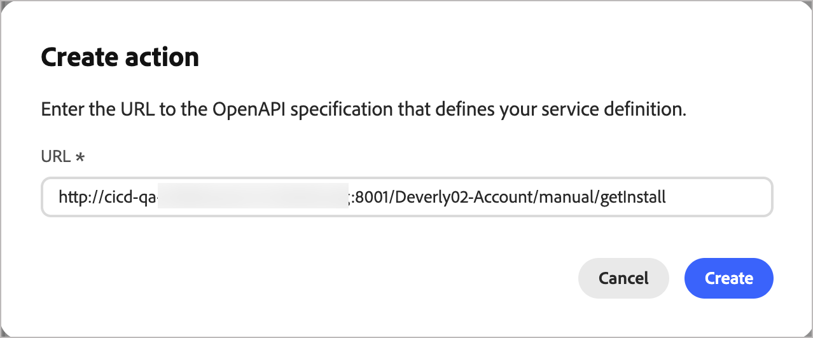

# Konfiguration externer Aktionen

Mit externen Aktionen können Account-Journey in Journey Optimizer B2B edition eine Verbindung zu externen Systemen direkt über die Journey-Arbeitsfläche herstellen. Wenn eine Konto-Zielgruppe einen externen Aktionsknoten erreicht, führt das System einen asynchronen ausgehenden Aufruf an einen konfigurierten externen Service durch und übergibt Zielgruppenattributdaten für Konten, Personen oder beides. Der externe Service verarbeitet die Daten und antwortet mithilfe eines Callbacks, wobei Zielgruppendaten und Metadaten zurückgegeben werden, die zur Anleitung der Journey-Ausführung verwendet werden können.

Diese Funktion unterstützt zwei Journey-Knotentypen:

* **Externe Aktion** - Ruft einen externen Service auf und fährt über einen einzelnen ausgehenden Pfad fort. Ideal für &quot;_-and-Forget_-Integrationen, z. B. das Aktualisieren eines CRM-Eintrags oder das Auslösen einer nachgelagerten Benachrichtigung.
* **Externe Aufspaltungspfade** - Ruft einen externen Service auf und bewertet die Antwort auf Routing-Konten entlang eines von mehreren definierten Pfaden.

>[!NOTE]
>
>Externe Aktionsdienste werden nur für Account-Journey unterstützt. Diese Knotentypen stehen Personen-Journey nicht zur Verfügung.

## Implementierungsübersicht

Die Einrichtung von Maßnahmen im Außenbereich erfordert eine Koordinierung der drei folgenden Rollen:

| | Rolle | Aufgabe |
| ---- | ---- | ---- |
| 1 | Entwickler | [Implementieren und veröffentlichen Sie den externen Service](#implement-service) |
| 2 | Administrator | [Konfigurieren der Aktion in Journey Optimizer B2B edition](#configure-action) |
| 3 | Marketer | [Hinzufügen eines externen Knotens zu einer Konto-Journey](#add-journey-node) |

## Implementieren des externen Services {#implement-service}

Der Entwickler muss einen öffentlich zugänglichen Webservice erstellen und veröffentlichen, der der [Adobe Journey Optimizer B2B edition External Actions Service Provider Interface](https://developer.adobe.com/journey-optimizer-b2b-apis/) entspricht.

>[!NOTE]
>
>Die Rückruffunktion erfordert ein Bearer-Token. Rufen Sie dies ab, indem Sie [OAuth-Server-zu-Server-Anmeldedaten in Adobe Developer Console](https://developer.adobe.com/developer-console/docs/guides/authentication/ServerToServerAuthentication/implementation) für Ihre IMS-Organisation einrichten.

Nachdem der Service live ist, geben Sie die URL für die OpenAPI-Spezifikation und die Authentifizierungsdaten an den Produktadministrator weiter, der für die Konfiguration der Aktion verantwortlich ist.

## Konfigurieren der Aktion {#configure-action}

Eine Aktion muss konfiguriert und aktiviert werden, bevor sie von Marketing-Experten auf einer Journey verwendet werden kann. Aktionen werden im Status _Entwurf_ erstellt und Ihre Änderungen werden automatisch gespeichert. Er bleibt als Entwurf erhalten, bis Sie ihn aktivieren.

>[!PREREQUISITES]
>
>Rufen Sie die URL zur OpenAPI-Spezifikation und die Authentifizierungsberechtigungen vom Entwickler ab, bevor Sie die Konfiguration hinzufügen.
>
>Um eine externe Aktion zu definieren und zu aktivieren, benötigen Sie die _[!UICONTROL B2B-Admin-Konfigurationen verwalten]_ [Produktberechtigung](./user-management.md#b2b-product-permissions).

1. Navigieren Sie **[!UICONTROL Administration]** > **[!UICONTROL Konfigurationen]**.

1. Klicken Sie **[!UICONTROL Zwischenbereich auf]** Externe Aktionen“.

   {width="800" zoomable="yes"}

1. Klicken **[!UICONTROL oben]** auf „Aktion erstellen“.

1. Geben Sie die URL zur OpenAPI-Spezifikation für Ihren externen Service ein und klicken Sie auf **[!UICONTROL Erstellen]**.

   {width="500"}

   Der externe Dienst muss live und erreichbar sein, damit dieser Schritt erfolgreich ist. Wenn ein Validierungsfehler auftritt, wird im Dialogfeld eine Meldung angezeigt, die den Fehler beschreibt, und ein Vorschlag zur Behebung des Fehlers. Weitere Informationen finden Sie unter [_Fehlerbehebung_](#troubleshooting).

1. Wenn die URL erfolgreich aufgelöst wird, überprüfen Sie die **[!UICONTROL Service-Details]**.

   Die Service-Details werden direkt aus der OpenAPI-Spezifikation gelesen, wenn die Aktion erstellt wird. Sie können diese Eigenschaften nach der Erstellung in der Konfiguration nicht mehr ändern.

   | Eigenschaft | Beschreibung | OpenAPI-Spezifikations-Eigenschaft |
   | -------- | ----------- | --------------------- |
   | [!UICONTROL Name] | Name der Aktion | `info.title` |
   | [!UICONTROL Beschreibung] | Beschreibung der Aktion | `info.description` |
   | [!UICONTROL URL] | URL zur OpenAPI-Spezifikation, die den externen Service definiert | `servers.url` |

1. Geben Sie die **[!UICONTROL Authentifizierung]**-Anmeldeinformationen für den externen Dienst (`components.securitySchemes`) ein.

   >[!NOTE]
   >
   >Die angezeigten Felder für die Berechtigung hängen vom Authentifizierungsmechanismus ab, der im externen Service definiert wurde. Unterstützte Typen sind API-Schlüssel, OAuth2 und HTTP-Standardauthentifizierung.

   {width="600" zoomable="yes"}

   Sie können die Anmeldeinformationen nach Bedarf ändern, wenn sich die konfigurierte Aktion im Status _Entwurf_ oder _Aktiv_ befindet.

1. Klicken Sie auf **[!UICONTROL Weiter]**.

1. Legen Sie die **[!UICONTROL Konfigurationen]**-Eigenschaften fest, um festzulegen, wie die Aktion Daten mit dem externen Service austauscht.

   >[!NOTE]
   >
   >Eigenschaften, die als _statisch_ gekennzeichnet sind, können zum Zeitpunkt der Konfiguration nicht aktualisiert werden und basieren auf der Service-Definition.

   * **[!UICONTROL Action type]** (_static_) - Der unterstützte Journey-Knotentyp:

      * [!UICONTROL Externe Maßnahmen] (`enableSplitPath` = false)
      * [!UICONTROL Aufspaltungspfad für externe Aktionen] (`enableSplitPath` = true)

     Sie können den Aktionstyp nach der Erstellung der Aktionskonfiguration nicht ändern.

   * **[!UICONTROL Accessors]** (_static_) - (Nur Pfad für aufgeteilte externe Aktionen) Die Variablen, die vom externen Service zurückgegeben werden, sind als Pfadbedingungen in einem externen aufgeteilten Pfadknoten verfügbar. (`invocationPayloadDef.accessorsMetadata`)

   * **[!UICONTROL Journey-Kontext]** (_static_) - Der Umfang der Zielgruppendaten, die in der Anfrage gesendet werden (`supportedEntityType`):

      * [!UICONTROL Konto] - Sendet nur Konten

      * [!UICONTROL Personen] - Sendet nur Personen

      * [!UICONTROL Personen im Konto] - Sendet Konten und kontobezogene Personen

   * **[!UICONTROL Ausgehende Felder]** - Ordnen Sie jedes Feld in der Tabelle einem [XDM-Feld“ &#x200B;](../admin/xdm-field-management.md). Diese Felder werden im Anfragetext an den externen Service gesendet. Eigenschaften der Dienstdefinition: `invocationPayloadDef.accountFields`, `invocationPayloadDef.fields`.

     {width="600" zoomable="yes"}

   * **[!UICONTROL Eingehende Felder]** - Ordnen Sie jedes Feld in der Tabelle einem ([&#x200B; XDM-Feld) &#x200B;](../admin/xdm-field-management.md#updatable-fields). Diese Felder werden aus der Antwort des externen Services ausgefüllt. Eigenschaften der Dienstdefinition: `callbackPayloadDef.accountFields`, `callbackPayloadDef.fields`. Nach der Erstellung aktualisierbar.

   * **[!UICONTROL Kopfzeilenparameter]** - Geben Sie einen Wert für jede Zeile ein, die als HTTP-Kopfzeile in der Anfrage übergeben werden soll. Service-Definitionseigenschaft: `invocationPayloadDef.headers`.

   * **[!UICONTROL Zeitüberschreitung]** - Geben Sie die Anzahl der Minuten ein, die gewartet werden soll, bis der externe Service den Callback aufruft, bevor die Anfrage als fehlgeschlagen betrachtet wird. Service-Definitionseigenschaft: `timeout`.

   * **[!UICONTROL Globale Attribute]** - Geben Sie einen Wert für jede Zeile ein, die als statisches Feld in den Anfragetext aufgenommen werden soll. Service-Definitionseigenschaft: `invocationPayloadDef.globalAttributes`.

     {width="600" zoomable="yes"}

1. Klicken Sie auf _Rückwärtspfeil_, um zur Liste zurückzukehren und die Aktion in einem _Entwurf_ zu belassen.

   Oder klicken Sie auf **[!UICONTROL Aktivieren]**, um die Aktionskonfiguration in den Status _Aktiv_ zu ändern. Die konfigurierte externe Aktion muss aktiv sein, um sie für die Verwendung in Account Journey verfügbar zu machen.

### Fehlerbehebung {#troubleshooting}

Wenn Sie die URL zur OpenAPI-Spezifikation für Ihren externen Service eingeben und auf **[!UICONTROL Erstellen]** klicken, führt das System eine Validierung des Services durch. Wenn ein Fehler auftritt, wird im Dialogfeld eine Meldung zur Beschreibung des Fehlers angezeigt.

{width="600" zoomable="yes"}

>[!NOTE]
>
>Viele der folgenden Fehler erfordern, dass Sie mit dem Entwickler zusammenarbeiten, der den öffentlich zugänglichen Webservice erstellt und veröffentlicht hat, um dies zu beheben.

#### Details zu Validierungsfehlern

| Angezeigter Fehler | Warum es passiert ist | Vorgehensweise |
|---|---|---|
| `This URL is already used by another external action` | Diese Spezifikations-URL ist bereits für eine andere Aktion in Ihrer Organisation registriert. | Verwenden Sie eine andere Spezifikations-URL oder löschen Sie die vorhandene Aktion, die sie bereits verwendet. |
| `An action with this name already exists` | Der `info.title` in Ihrer Spezifikation entspricht einer bereits vorhandenen Aktion | Ändern Sie den Titel im Feld `info.title` Ihrer Spezifikation in etwas Eindeutiges. |
| `Duplicate operation ID found in the specification` | Zwei oder mehr Vorgänge in Ihrer Spezifikation verwenden dieselbe `operationId`. | Geben Sie jedem Vorgang eine eindeutige `operationId`. |
| `Field in the specification exceeds the maximum allowed length` | Ein Textfeld in Ihrer Spezifikation (z. B. ein Titel oder eine Beschreibung) ist zu lang. | Kürzen Sie das gekennzeichnete Feld. |
| `The entity type value is invalid` | Eine Adobe-spezifische `x-` für den Entitätstyp hat einen nicht erkannten Wert | Korrigieren Sie den Entitätstyp auf einen unterstützten Wert. Die gültigen Optionen finden [&#x200B; in &#x200B;](https://developer.adobe.com/journey-optimizer-b2b-apis/) Entwicklerdokumentation . |
| `The provided document is not a valid OpenAPI specification` | Die Spezifikation kann nicht strukturell analysiert werden. | Validieren Sie Ihre Spezifikation anhand des OpenAPI 3.0-Schemas und beheben Sie etwaige Probleme. |
| `Required OpenAPI field is missing` | Ein erforderliches OpenAPI-Standardfeld fehlt (z. B. `info` oder `paths`). | Fügen Sie das fehlende Feld hinzu. |
| `Required endpoint is missing from the specification` | Ein Endpunkt, den Adobe Journey Optimizer B2B edition erfordert, ist nicht in Ihrer Spezifikation definiert. | Fügen Sie den erforderlichen Endpunkt hinzu. In der [Entwicklerdokumentation](https://developer.adobe.com/journey-optimizer-b2b-apis/) finden Sie Informationen dazu, welche Endpunkte benötigt werden. |
| `Required extension field is missing` | In Ihrer Spezifikation fehlt ein erforderliches Adobe `x-`-Erweiterungsfeld. | Fügen Sie das fehlende Erweiterungsfeld hinzu, wie in der Dokumentation beschrieben. |
| `Security schemes are missing from the specification` | Für Ihre Spezifikation sind keine `securitySchemes` unter `components` definiert. | Definieren Sie mindestens ein Sicherheitsschema. |
| `Multiple authentication types are not supported` | Ihre Spezifikation definiert mehr als ein Authentifizierungsschema. | Aktualisieren Sie Ihre -Spezifikation, um einen einzigen Authentifizierungstyp zu verwenden. |
| `The authentication type is not supported` | Der von Ihnen verwendete Sicherheitsschematyp (z. B. `oauth2` oder `openIdConnect`) wird nicht unterstützt. | Wechseln Sie zu einem unterstützten Authentifizierungstyp. Die unterstützten Optionen finden Sie in der Entwicklerdokumentation . |
| `The OpenAPI version is not supported` | Versionskonflikt auf Spezifikationsebene | Aktualisieren Sie Ihre Spezifikation für die Verwendung von OpenAPI 3.0.x. |
| `An unexpected error occurred` | In Ihrer Spezifikation wurde ein nicht klassifiziertes Problem gefunden. | Überprüfen Sie Ihre Spezifikation auf ungewöhnliche Elemente und versuchen Sie es erneut. Wenn der Fehler weiterhin auftritt, wenden Sie sich an den Support. |

<!--
## Errors you'll see if something goes wrong with the request itself

This error appears below the URL field (not in the alert banner) and means there was a network problem or an unexpected server response — not a problem with your URL or spec.

| What you'll see | Why it happened | What to do |
|---|---|---|
| `Failed to create external action. Please try again.` | A network error occurred or the server returned an unexpected response | Check your connection and try again. If it keeps happening, contact support |
-->

## Hinzufügen eines externen Knotens zu einer Journey {#add-journey-node}

Nachdem eine Aktion aktiviert wurde, können Marketing-Fachleute einen _[!UICONTROL Externe Aktion]_ oder _[!UICONTROL Externer Aufspaltungspfad]_-Knoten zu jeder Konto-Journey hinzufügen. Informationen zum Hinzufügen und Verwenden dieser Knoten auf der Arbeitsfläche der Konto-Journey finden Sie unter [Externe Knoten](../journeys/external-nodes.md).
