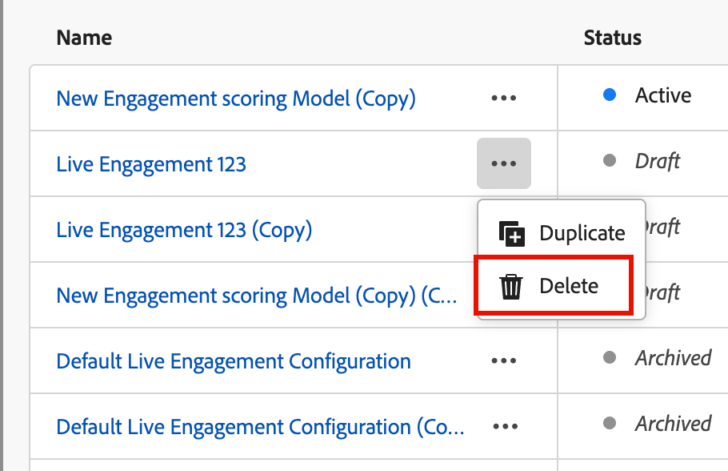

# Konfigurieren der benutzerdefinierten Gewichtung der Interaktionswerte

Ein [Score für die Einkaufsgruppeninteraktion](../buying-groups/engagement-scores.md) spiegelt den Grad der Interaktion wider, indem er verschiedene Aktivitäten auswertet, die für Mitglieder der Einkaufsgruppe aufgezeichnet wurden. Mit der benutzerdefinierten Score-Gewichtung können Marketing-Operations-Teams ihre eigenen Modelle für die Gewichtung der Aktivitäten definieren. Ein benutzerdefiniertes Scoring-Modell liefert eine genauere Darstellung Ihrer Pipeline, indem es die Verhaltensweisen priorisiert, die die Kaufabsicht in Ihrem Verkaufsprozess am genauesten signalisieren.

Als Administrator können Sie mehrere Interaktionsbewertungsmodelle für Ihre Organisation definieren, aber immer kann nur ein Modell aktiv sein. Sie definieren ein Score-Modell anhand der Gewichtung, die auf jede Interaktions-Scoring-Aktivität angewendet wird.

>[!PREREQUISITES]
>
>Um ein Gewichtungsmodell für den Interaktionswert zu definieren und zu aktivieren, benötigen Sie die Berechtigung _[!UICONTROL B2B-Admin-Konfigurationen verwalten]_ [Produktberechtigung](./user-management.md#b2b-product-permissions).

## Zugriff auf die Gewichtungsmodelle für Interaktionsbewertungen

Öffnen Sie die Liste _[!UICONTROL Interaktionsbewertung]_, um aktive, Entwurfs- und archivierte Modelle anzuzeigen:

1. Wählen Sie in der linken Navigation **[!UICONTROL Administration]** > **[!UICONTROL Konfigurationen]**.

1. Klicken Sie **[!UICONTROL Zwischenbereich auf]** Engagement Score-Gewichtung“, um die Liste der Scoring-Modelle anzuzeigen.

   Auf dieser Seite können Sie [Interaktionsbewertungsmodelle erstellen (duplizieren](#create-an-engagement-score-model), [aktivieren](#activate-a-score-model) und [bearbeiten](#change-the-engagement-weighting-settings).

   {width="800" zoomable="yes"}

   Die Liste zeigt die zuletzt aktualisierten Modelle oben an (sortiert nach _[!UICONTROL Zuletzt aktualisiert]_) und bietet die Möglichkeit, nach (_[!UICONTROL )]_.

   Sie können die angezeigte Tabelle anpassen, indem Sie auf das Symbol _Spalteneinstellungen_ (  ) in der oberen rechten Ecke klicken und die Kontrollkästchen für die Spalten aktivieren oder deaktivieren.

   {width="300"}

1. Um auf die Details für ein Interaktionsbewertungsmodell zuzugreifen, klicken Sie auf den Namen.

### Standard-Bewertungsmodell

Das System erstellt ein erstes Interaktionsbewertungsmodell mit dem Namen _Aktivitätsgewichtungsmodell 1_. Der Modellstatus und die Interaktionsaktivitäten hängen von der Datenarchitektur Ihrer [!DNL Journey Optimizer B2B Edition] ab:

* **Vereinfachte Architektur** (Beta) - Wenn Ihre Umgebung die [vereinfachte ](../simplified-architecture.md)) verwendet, basieren die Interaktionsaktivitäten auf standardmäßigen und benutzerdefinierten Experience Platform-Ereignissen. Die Gewichtungen für alle Aktivitäten sind standardmäßig 0.

  {width="600" zoomable="yes"}

* **Standardarchitektur** - Wenn Ihre Umgebung die Standardarchitektur verwendet, ist die verbundene [!DNL Marketo Engage]-Instanz die Quelle für die Interaktionsaktivitätsdaten. Das Standardmodell ist aktiv, bis Sie eine benutzerdefinierte Version erstellen und aktivieren.

  {width="600" zoomable="yes"}

Wenn Sie ein benutzerdefiniertes Modell aktivieren, ändert sich das aktive Modell in den Status _Archiviert_. Wenn Sie sich entscheiden, zum standardmäßigen Interaktionsbewertungsmodell zurückzukehren, können Sie das ursprüngliche Standardmodell duplizieren und dann aktivieren oder es als Ausgangspunkt für ein anderes benutzerdefiniertes Modell verwenden.

### Löschen eines Entwurfsmodells

Sie können ein Entwurfs-Interaktionsbewertungsmodell löschen, wenn Sie es in Zukunft nicht aktivieren möchten. Klicken Sie auf das _Mehr_ Menü (***…***) neben dem Namen des Entwurfs-Bewertungsmodells in der Liste und wählen Sie **[!UICONTROL Löschen]**.

{width="350"}

Klicken Sie im Bestätigungsdialog auf **[!UICONTROL Löschen]**.

## Erstellen eines benutzerdefinierten Interaktions-Bewertungsmodells

Um ein benutzerdefiniertes Interaktionsbewertungsmodell zu erstellen, duplizieren Sie das Standardmodell oder ein anderes bereits erstelltes benutzerdefiniertes Modell. Sie können das aktuelle _Aktiv_-Modell, ein _Entwurf_-Modell oder ein _Archiviert_-Modell duplizieren. Bearbeiten Sie dann das doppelte Modell entsprechend Ihren Anforderungen.

1. Klicken Sie auf den Modellnamen, um die Seite mit den Modelldetails zu öffnen, und klicken **[!UICONTROL oben]** auf „Duplizieren“.

   {width="600" zoomable="yes"}

   Sie können auch auf das Symbol _Mehr Menü_ (***…***) neben dem Namen des Bewertungsmodells in der Liste klicken und **[!UICONTROL Duplizieren]** auswählen.

   {width="325"}

1. Geben _im Dialogfeld &quot;_&quot; einen eindeutigen Namen für das duplizierte Modell ein und klicken Sie auf **[!UICONTROL Duplizieren]**.

   {width="500"}

   Das duplizierte Modell wird in der Liste mit dem Status _Entwurf_ angezeigt. Klicken Sie auf den Namen, um die Details des Bewertungsmodells zu öffnen und Ihre Änderungen vorzunehmen.

### Ändern der Einstellungen für die Interaktionsgewichtung

Die Gewichtungseinstellungen definieren die Bänder, die Sie jeder Aktivität im Modell zuweisen können. Sie können die Bands ändern, um die Strategien Ihres Unternehmens zur Bewertung der Interaktion widerzuspiegeln. Sie können beispielsweise die _&quot;_&quot; auf einen Wert von 65 anpassen, wenn Sie den normalen Aktivitäten einen höheren Wert zuweisen möchten. Sie können auch ein Gewichtungsband hinzufügen, das Aktivitäten erfasst, die zwischen &quot;_&quot;_ &quot;_&quot;_. In diesem Fall können Sie ein Band hinzufügen und es mit &quot;_&quot;_ und einen Gewichtungsbandwert von 75 zuweisen.

1. Klicken Sie auf der Detailseite des Score **[!UICONTROL Modells oben auf]** Einstellungen für Interaktionsgewichtung“.

   {width="600" zoomable="yes"}

1. Passen Sie für jedes Gewichtsband den Namen oder die Werte Ihren Anforderungen entsprechend an:

   * Ändern Sie den Namen im Feld _[!UICONTROL Gewichtungsband]_.
   * Einen neuen Wert eingeben. Sie können auch auf **&amp;plus;** oder **−** klicken, um den Wert zu erhöhen oder zu verringern.

   {width="500"}

1. Fügen Sie bei Bedarf ein weiteres Gewichtsband hinzu:

   Klicken Sie unten **[!UICONTROL der Liste auf]**+ Gewichtungsband hinzufügen . Durch diese Aktion wird ein leeres Gewichtungsband am Ende der Liste eingefügt.

   Geben Sie den Namen ein und legen Sie den Wert für das Band fest. Stellen Sie sicher, dass Sie einen eindeutigen Namen und Wert verwenden.

1. Um ein Gewichtungsband zu entfernen, klicken Sie auf das Symbol _Löschen_ (  ) für die Zeile „Gewichtungsband“.

1. Wenn Ihre Änderungen abgeschlossen sind, klicken Sie auf **[!UICONTROL Speichern]**.

### Ändern der Aktivitätsgewichtung

Jedes Score-Modell enthält die vollständige Liste der unterstützten Interaktionsbewertungsaktivitäten.

+++Aktivitäten für eine vereinfachte Architektur

Das Standardmodell für die vereinfachte Architektur umfasst die von Experience Platform verfolgten Aktivitäten. Jede Aktivität hat eine Gewichtung von null (0) (nicht verwendet), bis Sie ihr eine Gewichtung zuweisen. Alle Aktivitäten haben auch eine maximale tägliche Häufigkeit von 20, die Sie nicht ändern können.

<table style="table-layout: fixed; width: 100%; border: 0;">
<tbody>
<tr style="border: 0;">
<td>
<ul><li>Advertising-Klicks </li><li>Advertising abgeschlossen </li><li>Advertising-Konversionen </li><li>Advertising Federated </li><li>Advertising - Erste Quartile </li><li>Advertising Impressions </li><li>Advertising-Mittelpunkte </li><li>Advertising startet </li><li>Advertising - Dritte Quartile </li><li>Advertising Time Played </li><li>Schließen der Anwendung </li><li>Anwendungsstart </li><li>Kampagnenkadenz für Interaktion ändern </li><li>Commerce BackOffice-Gutschrift ausgestellt </li><li>Commerce BackOffice-Bestellung storniert </li><li>Commerce BackOffice-Bestellung aufgegeben </li><li>Commerce BackOffice OrderItems </li><li>Commerce BackOffice-Versand abgeschlossen </li><li>Commerce Checkouts </li><li>Hinzufügen zur Commerce-Produktliste (Warenkorb) </li><li>Commerce-Produktliste (Warenkorb) wird geöffnet </li><li>Entfernungen aus der Commerce-Produktliste (Warenkorb) </li><li>Erneute Öffnungen der Commerce-Produktliste (Warenkorb) </li><li>Ansichten der Commerce-Produktliste (Warenkorb) </li><li>Commerce-Produktansichten </li><li>Commerce-Käufe </li><li>Commerce für später speichern </li><li>Schließen des Entscheidungsvorschlags </li><li>Anzeige der Entscheidungsvorschläge </li><li>Interaktion mit Entscheidungsvorschlägen </li></ul>
</td>
<td>
<ul><li>Entscheidungsvorschlag senden </li><li>Trigger für Entscheidungsvorschläge </li><li>Versandfeedback </li><li>Direkt-Marketing-E-Mail gebounct </li><li>Direkt-Marketing-E-Mail zurückgesendet Soft </li><li>Direkt-Marketing-E-Mail angeklickt </li><li>E-Mail für Direkt-Marketing zugestellt </li><li>Direkt-Marketing-E-Mail geöffnet </li><li>Direkt-Marketing-E-Mail gesendet </li><li>Direkt-Marketing-E-Mail abbestellt </li><li>In-App-Nachricht wurde verworfen </li><li>In-App-Nachricht wurde angezeigt </li><li>In-App-Nachricht wurde interagiert mit </li><li>Lead-Vorgang zu Kampagne hinzufügen </li><li>Webhook für Lead-Vorgangsaufrufe </li><li>Lead-Vorgang Kampagnenstrom ändern </li><li>Lead-Vorgang Lead konvertieren </li><li>Interessanter Moment für Lead-Vorgang </li><li>Lead-Vorgang Leads zusammenführen </li><li>Lead-Vorgang Neuer Lead </li><li>Umsatzschritt des Lead-Vorgangs geändert </li><li>Score für Lead-Vorgang geändert </li><li>Status des Lead-Vorgangs im Kampagnenfortschritt geändert </li></ul>
</td>
<td>
<ul><li>Lead-Vorgang zu Liste hinzufügen </li><li>Lead-Vorgang aus Liste entfernen </li><li>Speicherort-Ausgang </li><li>Medienaufruf abgeschlossen </li><li>Media AdBreakStart </li><li>Medienanzeige abschließen </li><li>Medienanzeige überspringen </li><li>Media AdStart </li><li>Änderung der Medienbitrate </li><li>MediapufferStart </li><li>Medienkapitel abgeschlossen </li><li>Medienkapitel überspringen </li><li>Medienkapitelstart </li><li>Benutzerdefiniertes Medien-Tracking </li><li>Heruntergeladene Medieninhalte </li><li>Medienfehler </li><li>Media PauseStart </li><li>Medien-Ping </li><li>Medienwiedergabe </li><li>Mediensitzung abgeschlossen </li><li>Ende der Mediensitzung </li><li>Start der Mediensitzung </li><li>Aktualisierung der Medienstatus </li><li>Nachrichten-Feedback </li><li>Rendern von Nachrichten </li><li>Nachrichten-Tracking </li><li>Opportunity-Ereignis Zur Opportunity hinzufügen </li><li>Opportunity-Ereignis Opportunity aktualisiert </li><li>Opportunity-Ereignis aus Opportunity entfernen </li><li>Push-Tracking-Anwendung geöffnet </li><li>Benutzerdefinierte Aktion für Push-Tracking </li><li>Webformular ausgefüllt </li><li>WebInteraction-Link-Klicks </li><li>WebPageDetails-Seitenansichten</li></ul>
</td>
</tbody>
</table>

+++

+++Aktivitäten für die Standardarchitektur

Das Standardmodell für die Standardarchitektur umfasst die [!DNL Marketo Engage] verfolgten Aktivitäten mit zugehöriger Standardgewichtung. Wenn Sie dieses Modell duplizieren, können Sie die Gewichtung entsprechend Ihren Anforderungen ändern. Die maximale tägliche Häufigkeit kann nicht geändert werden.

{{engagement-activities-me}}

+++

Legen Sie für jede Aktivität in der Liste den Wert fest, den Sie jeder Aktivitätsinstanz zuweisen möchten. Klicken Sie im Feld **[!UICONTROL Gewichtung]** auf den Abwärtspfeil und wählen Sie das in den Einstellungen für die Interaktionsgewichtung definierte Gewichtungsband aus.

{width="600" zoomable="yes"}

Wenn bei der Berechnung des Interaktionswerts keine Aktivität verwendet werden soll, legen Sie für die Gewichtung einen Wert von null (0) fest.

Ihre Änderungen werden automatisch gespeichert.

## Score-Modell aktivieren

Wenn Sie ein Entwurfsbewertungsmodell aktivieren, ersetzt es das derzeit aktive Modell. Das aktuell aktive Modell wird automatisch archiviert.

1. Öffnen Sie ein Bewertungsmodell für einen Entwurf, um die Detailseite anzuzeigen.

1. Klicken Sie auf **[!UICONTROL Aktivieren]**.

1. Klicken Sie im Bestätigungsdialogfeld auf **[!UICONTROL Aktivieren]**.

   {width="400"}
