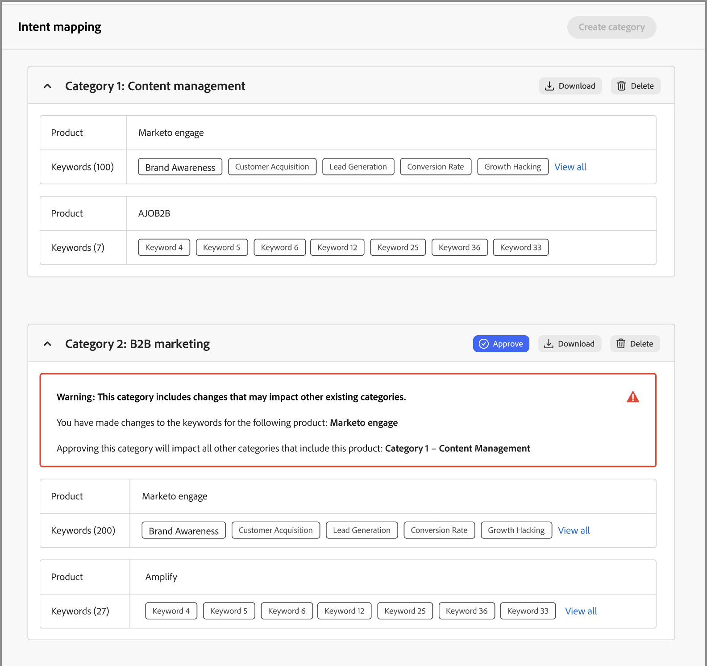

# Absichtsdaten

In Journey Optimizer B2B edition sagt das Modell der Absichtserkennung basierend auf der Aktivität eines Leads eine Lösung/ein Produkt von Interesse mit ausreichend hoher Zuverlässigkeit voraus. Außerdem werden die Aktivitäten anderer Account-Co-Mitglieder sowie getaggte Inhalte genutzt. Die Absicht einer Person kann als die Wahrscheinlichkeit interpretiert werden, dass sie Interesse an einem Produkt hat.

* Absichtsebenen - Verfügbar auf bekannter Lead-, Konto- und Einkaufsgruppenebene.
* Arten von Intent-Signalen - Schlüsselwörter, Produkt und Lösung

Die Absichtsdaten werden auf der Seite [_Intelligent Dashboard_](../dashboards/intelligent-dashboard.md), [_Kontodetails_, &#x200B;](../accounts/account-details.md), [_Einkaufsgruppendetails_ und &#x200B;](../buying-groups/buying-group-details.md) [_Personendetails_ verwendet](../accounts/person-details.md).

{width="700" zoomable="yes"}

## Vorbereiten der Intent-Mapping-Daten

Um diese Funktion zu aktivieren, erstellen Sie eine Tabelle, z. B. eine Microsoft Excel-Datei, wobei Sie mithilfe von Registerkarten die Intent-Taxonomie definieren. Die gesamte Tabelle wird als eine Kategorie hochgeladen, die mehrere Produkte enthalten kann, und jedes Produkt kann mehrere Keywords enthalten. Verwenden Sie die folgenden Definitionen für Ihr Intent Mapping-Arbeitsblatt für jede Kategorie, die Sie definieren möchten:

* Name des Arbeitsblatts = _Kategoriename_
* Jede Registerkarte = Ihr Produktname
* Jede Registerkarte enthält eine Spalte = Produktschlüsselwörter (maximal 150)

Sie können eine Excel-Datei herunterladen, die als Vorlage zur Vorbereitung Ihrer Zuordnungsdaten verwendet werden soll. Herunterladen der Vorlage:

1. Wählen Sie in der linken Navigation **[!UICONTROL Administration]** > **[!UICONTROL Konfiguration]** aus.

1. Klicken Sie **[!UICONTROL Zwischenbereich auf]** Intent Mapping“.

1. Klicken Sie **[!UICONTROL Kategorie erstellen]**.

1. Klicken Sie im Dialogfeld auf den Link **[!UICONTROL Dateivorlage herunterladen]**.

   {width="500"}

1. Klicken Sie **[!UICONTROL Abbrechen]**.

   Sie können zum Hochladen der vorbereiteten Datei zurückkehren, wenn sie abgeschlossen ist.

1. Verwenden Sie die Vorlage, um Ihre Intent-Mapping-Daten zu definieren:

   * Benennen Sie die Datei um, damit Ihr Kategoriename, z. B. _skalierter Personalization, widergespiegelt_.
   * Benennen Sie jede Registerkarte entsprechend Ihren Produktnamen um, z. B. _Journey Optimizer B2B_, _Marketo Engage_ und _Experience Manager_.
   * Fügen Sie die Produktschlüsselwörter für jede Registerkarte hinzu, z. B _B2B-Marketing_, _Markenerkennung_ und _Lead-_.

   {width="600" zoomable="yes"}

## Kategoriedatei hochladen

Wenn Ihre Tabelle fertig ist, kehren Sie zur Konfigurationsseite _[!UICONTROL Intent Mapping]_ zurück und laden Sie die Datei hoch.

1. Klicken Sie **[!UICONTROL Kategorie erstellen]**.

1. Ziehen Sie die Datei per Drag-and _[!UICONTROL Drop in das Dialogfeld „Dateien hochladen]_ oder klicken Sie auf **[!UICONTROL Datei auswählen]**, um die Datei auf Ihrem System zu suchen und auszuwählen.

1. Klicken Sie auf **[!UICONTROL Weiter]**.

   Die Vorverarbeitung führt das Clustern ähnlicher Schlüsselwörter durch, wodurch die Absichtserkennung verbessert und eine Keyword-Verdünnung vermieden wird. Sobald diese Vorverarbeitung abgeschlossen ist (je nach Daten bis zu 15 Minuten), wird eine Pulsmeldung angezeigt.

   {width="500"}

   Das Ergebnis wird auf der Seite _Intent Mapping_ angezeigt.

   {width="600" zoomable="yes"}

## Kategorie genehmigen oder ablehnen

Überprüfen Sie die Kategorieliste und klicken Sie auf **[!UICONTROL Genehmigen]**, um die Schlüsselwörter für die Verwendung auf den Seiten „Intelligentes Dashboard“, „Kontodetails“, „Einkaufsgruppendetails“ und „Personendetails“ zu aktivieren. Klicken Sie **[!UICONTROL Alle anzeigen]**, um die vollständige Liste für jedes Produkt anzuzeigen, oder klicken Sie auf **[!UICONTROL Herunterladen]**, um die vollständige Liste als Excel-Datei anzuzeigen.

Wenn Sie mit der Liste nicht zufrieden sind, können Sie auf **[!UICONTROL Löschen]** klicken, um die Kategorie zu entfernen. Sie können dann Anpassungen an Ihrer Tabellenkalkulationsdatei vornehmen, bevor Sie den Upload-Prozess erneut starten, um diese Kategorie zu definieren.

>[!IMPORTANT]
>
>Sie müssen die neue Kategorie genehmigen oder ablehnen (löschen), bevor Sie eine weitere Kategorie hinzufügen oder eine Kategorie bearbeiten können.

Wenn Sie eine weitere Kategorie hinzufügen und sich ihre Taxonomie auf eine vorhandene Kategorie auswirken würde, wird eine Warnung angezeigt. Beachten Sie diese Auswirkungen, wenn Sie die Kategorie genehmigen oder ablehnen. Die Zuordnung von Produkt zu Keyword sollte für alle Kategorien gleich sein, wenn das Produkt in mehr als einer Kategorie verwendet wird.

{width="600" zoomable="yes"}
