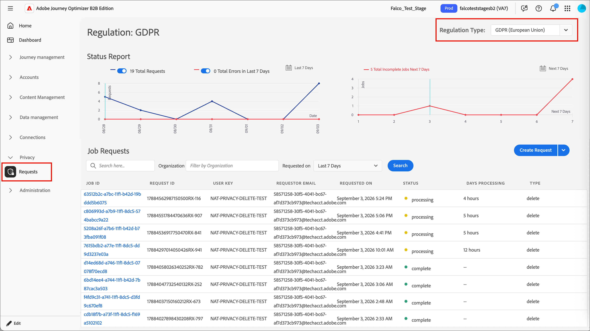

# Datenschutzverwaltung {#privacy-management}

[Adobe Experience Platform Privacy Service &#x200B;](https://experienceleague.adobe.com/de/docs/experience-platform/privacy/home){target="_blank"} stellt eine RESTful-API und eine Benutzeroberfläche bereit, die Sie bei der Verwaltung von Kundendatenanfragen unterstützen. Mit [!DNL Adobe Privacy Service] können Sie Anfragen für den Zugriff auf und die Löschung von personenbezogenen oder vertraulichen Kundendaten aus Adobe CX Enterprise-Anwendungen stellen, was die automatische Einhaltung gesetzlicher und unternehmensinterner Datenschutzbestimmungen erleichtert.

[!DNL Adobe Journey Optimizer B2B Edition] bietet diese Datenschutztools, mit denen Sie die globalen Datenschutzanforderungen erfüllen können. Verwenden Sie [!DNL Privacy Service], um Zugriffs- und Löschanfragen für Daten, die [!DNL Journey Optimizer B2B Edition] erfasst und speichert, zu senden und zu verwalten.

Sie können einzelne Anfragen zum Zugreifen auf und Löschen von Verbraucherdaten aus [!DNL Adobe Journey Optimizer B2B Edition] auf zwei Arten senden:

* Die [!DNL Privacy Service] Benutzeroberfläche
* Die [!DNL Privacy Service]-API

## Unterstützte Datenschutzbestimmungen {#regulations}

[!DNL Journey Optimizer B2B Edition] Datenschutztools helfen Ihnen bei der Einhaltung der Vorschriften durch [!DNL Privacy Service]. Jede Verordnung gilt, wenn Sie Daten für Personen speichern, die in der zugehörigen Region wohnen.

Eine aktuelle Liste der unterstützten Richtlinien finden Sie unter [_Übersicht über Datenschutzbestimmungen_](https://experienceleague.adobe.com/de/docs/experience-platform/privacy/regulations/overview){target="_blank"} in der Dokumentation zu Privacy Service.

## Anfragetypen {#access-and-delete-requests}

[!DNL Journey Optimizer B2B Edition] unterstützt zwei Arten von Datenschutzanfragen:

* **Datenzugriff** - Eine Person kann eine Bestätigung darüber anfordern, dass ihre personenbezogenen Daten verarbeitet werden, und eine kostenlose elektronische Kopie dieser Daten erhalten.
* **Datenlöschung** - Wird auch als _Recht auf Vergessenwerden“ bezeichnet_ kann eine Person verlangen, dass Sie ihre personenbezogenen Daten löschen und die weitere Verarbeitung einstellen.

## Anzeigen und Verwalten von Datenschutzanfragen {#view-manage-requests}

>[!BEGINSHADEBOX]

 Für diese Schritte sind das Produktprofil [!DNL Privacy Service] und die folgenden [Berechtigungen für die zugewiesene Benutzerrolle in Experience Platform&quot; &#x200B;](./user-management.md):

* **[!UICONTROL Privacy Service-Berechtigungen]** - `Privacy Read Permission` und `Privacy Write Permission`
* **[!UICONTROL Data Governance]** - `View Privacy Console`

Weitere [_finden Sie unter „Verwalten von Berechtigungen_](https://experienceleague.adobe.com/de/docs/experience-platform/privacy/permissions){target="_blank"} Privacy Service&quot; im [!DNL Privacy Service].

>[!ENDSHADEBOX]

Um Datenschutzanfrageaufträge in [!DNL Journey Optimizer B2B Edition] anzuzeigen, erweitern Sie **[!UICONTROL Datenschutz]** und wählen Sie **[!UICONTROL Anfragen]**.

Verwenden Sie die Option **[!UICONTROL Regulierungstyp]** oben rechts, um die angezeigte Seite für die Vorschrift zu ändern, für die Sie Aufträge verwalten oder Anfragen senden möchten.

{width="800" zoomable="yes"}

### Anfrage senden {#submit-a-request}

1. Wählen Sie **[!UICONTROL Anfrage erstellen]** aus.

1. Wählen Sie für **[!UICONTROL Vorgangstyp]** den Anfragetyp aus:

   * **[!UICONTROL Zugriff]**

     Wenn Sie eine **_Zugriffsanfrage“ senden_** die [!DNL Journey Optimizer B2B Edition] enthält, gibt [!DNL Privacy Service] zurück:

     * [!DNL Marketo Engage] mit dem Lead verknüpfte Aktivität.
     * [!DNL Journey Optimizer B2B Edition] mit der Person oder dem Konto verknüpfte Aktivität.

   * **[!UICONTROL Löschen]**

     Wenn Sie eine **DELETE**-Anfrage für [!DNL Marketo Engage] und [!DNL Journey Optimizer B2B Edition] senden, werden die folgenden Datensätze entfernt:

     * Der zugehörige Lead in [!DNL Marketo Engage].
     * In [!DNL Journey Optimizer B2B Edition] erstellte Personen- und Kontoaufzeichnungen.
     * KI-Assistent-Gesprächsverlauf, der auf die personenbezogenen Daten der Person verweist.

1. Wählen Sie **[!UICONTROL Produkte]** die Option **[!UICONTROL Marketo]**.

   {width="450" zoomable="yes"}

   Diese Auswahl enthält Daten aus [!DNL Journey Optimizer B2B Edition] und Ihrer [!DNL Marketo Engage].

1. Scrollen Sie zum unteren Rand des Dialogfelds und geben Sie die E-Mail-Adresse der Person ein, auf deren Daten Sie zugreifen oder sie löschen möchten.

1. Um die Anfrage zu senden, wählen Sie **[!UICONTROL Erstellen]** aus.

   [!DNL Privacy Service] gibt eine Anfrage-ID zurück, mit der Sie den Status Ihrer Anfrage überprüfen können.

### API-Anfragen {#api-requests}

Sie können Datenschutzanfragen auch über die [!DNL Privacy Service]-API senden. Eine allgemeine API-Referenz finden Sie in der [Privacy Service-API-Dokumentation](https://developer.adobe.com/experience-platform-apis/references/privacy-service){target="_blank"}.

>[!PREREQUISITES]
>
>Sammeln Sie die folgenden Informationen, bevor Sie eine Anfrage senden:
>
>* Die IMS-Organisations-ID für Ihr Unternehmen (eine 24-stellige alphanumerische Zeichenfolge, die auf `@AdobeOrg` endet). Wenden Sie sich unter `gdprsupport@adobe.com` an den Adobe-Support, wenn Sie Ihre IMS-Organisations-ID nicht kennen.
>* Die E-Mail-Adresse der Person, auf deren Daten Sie zugreifen oder sie löschen möchten.

Verwenden Sie die folgenden Feldwerte in Ihrer Anfrage:

| Feld | Wert |
|---|---|
| `companyContexts.namespace` | `imsOrgID` |
| `companyContexts.value` | Ihre IMS-Organisations-ID |
| `users.action` | `access` oder `delete` |
| `users.userIDs.namespace` | `Email` |
| `include` | `marketo`, um sowohl [!DNL Journey Optimizer B2B Edition]- als auch [!DNL Marketo Engage] einzuschließen |
| `regulation` | Beispiel: `ccpa` <br/>Einige Regulierungswerte ändern sich, sodass sie eine Bundesstaatsabkürzung enthalten (z. B. `ucpa_ut_usa`). Ältere Werte bleiben für einen Übergangszeitraum gültig. Die aktuelle Liste [&#x200B; Sie unter „Übersicht über &#x200B;](https://experienceleague.adobe.com/de/docs/experience-platform/privacy/regulations/overview){target="_blank"}&quot;, bevor Sie Integrationen mit diesen Werten erstellen. |

Im folgenden Beispiel wird eine DSGVO-Löschanfrage mit [!DNL Journey Optimizer B2B Edition] Daten gesendet.

```json
{
  "companyContexts": [
    {
      "namespace": "imsOrgID",
      "value": "1231659F56A68A8B7F000101@AdobeOrg"
    }
  ],
  "users": [
    {
      "action": ["delete"],
      "userIDs": [
        {
          "namespace": "Email",
          "type": "standard",
          "value": "john.doe@adobe.com"
        }
      ]
    }
  ],
  "include": ["marketo"],
  "regulation": "gdpr"
}
```

[!DNL Privacy Service] gibt eine Antwort ähnlich der folgenden zurück.

```json
{
  "requestId": "16331241037112570RX-245",
  "totalRecords": 1,
  "jobs": [
    {
      "jobId": "997b01e3-9568-402c-904b-b4e60a437875",
      "customer": {
        "user": {
          "action": ["delete"],
          "userIDs": [
            {
              "namespace": "Email",
              "value": "john.doe@adobe.com",
              "type": "standard",
              "namespaceId": 6,
              "isDeletedClientSide": false
            }
          ]
        }
      }
    }
  ]
}
```
