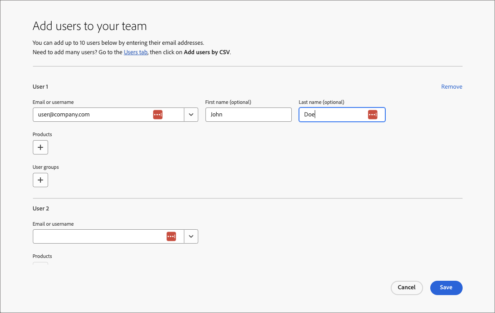

# Benutzerverwaltung

Nachdem die Bereitstellung abgeschlossen und die Sandboxes gebunden sind, führen Sie die folgenden Schritte aus, um Ihrem Team und Ihren Benutzern Zugriff auf Adobe Journey Optimizer B2B edition zu gewähren.

1. [Erstellen Sie ein Marketo Engage-Produktprofil](#marketo-engage-profile) in der Admin Console (nur neue Marketo Engage-Instanz).
1. [Erstellen Sie eine Benutzergruppe](#create-user-group) in der Admin Console.
1. [Erstellen Sie eine Rolle ](#create-role) in den AEP-Berechtigungen.
1. [Benutzer hinzufügen](#add-users) in der Admin Console.

Als Administrator können Sie diese Aufgaben in der Adobe Admin Console erledigen, einem zentralen Ort für die Verwaltung und Verwaltung Ihrer Adobe-Produktlizenzen und -Benutzer. In der Admin Console können Sie Benutzer an einem Ort erstellen und verwalten und nicht in Ihren einzelnen Lösungen. Weitere Informationen zu Funktionen und Funktionen finden Sie auf der Seite [Admin Console - Übersicht](https://helpx.adobe.com/de/enterprise/using/admin-console.html) .

## Die Admin Console aufrufen

Bevor Sie die Admin Console zum Verwalten von Benutzern in Ihrem Team verwenden können, müssen Sie sicherstellen, dass Sie auf die Admin Console zugreifen und über die entsprechenden Berechtigungen verfügen können.

1. Als Systemadministrator sollten Sie im Rahmen des Onboarding-Prozesses mehrere E-Mails von Adobe erhalten.

   Suchen Sie nach der Begrüßungs-E-Mail mit Informationen zum Organisationsnamen, auf den Sie Zugriff erhalten haben.

1. Klicken Sie in Ihrer Begrüßungs-E-Mail auf den Link **[!UICONTROL Erste Schritte]** , um zur Admin Console zu navigieren.

   Wenn Sie die E-Mail nicht finden können, öffnen Sie einen Browser direkt auf der Admin Console unter [https://adminconsole.adobe.com](https://adminconsole.adobe.com).

1. Melden Sie sich mit Ihrer Adobe ID an.

   Nach erfolgreicher Anmeldung sehen Sie die Seite _Überblick_ der Adobe Admin Console.

1. Wenn Sie Zugriff auf mehrere Organisationen haben, stellen Sie sicher, dass Sie sich bei der richtigen Organisation angemeldet haben.

   Um Ihre Organisation zu ändern, klicken Sie oben rechts auf den Namen der Organisation und wählen Sie die Organisation aus, auf die Sie Zugriff benötigen.

1. Wählen Sie **[!UICONTROL Administratoren]** auf der Karte _[!UICONTROL Benutzer]_ aus, um zu überprüfen, ob Sie Systemadministrator sind.

   {width="700" zoomable="yes"}

1. Suchen Sie nach Ihrer Adobe ID-E-Mail-, Benutzernamen-, Vor- oder Nachnamen.

   * Wenn Ihr Zugriff korrekt konfiguriert ist, gibt die Suche Ihren Datensatz zurück.

   * Wenn der Wert in der Spalte **[!UICONTROL ADMIN ROLE]** den Wert `System` anzeigt, wissen Sie, dass Sie (oder der angezeigte Benutzer) ein Systemadministrator sind.

## Marketo Engage-Produktprofil erstellen {#marketo-engage-profile}

Wenn Sie Benutzern Zugriff auf eine Adobe-Lösung gewähren, möchten Sie ihnen nicht unbedingt uneingeschränkten Zugriff gewähren. Produktprofile ermöglichen es jeder Lösung, über eigene Benutzerberechtigungen zu verfügen. Verwenden Sie die Admin Console, um Produktprofile zuzuweisen.

Weitere Informationen zur Verwendung von Produktprofilen für Benutzerberechtigungen finden Sie unter [Verwalten von Produktprofilen für Unternehmensbenutzer](https://helpx.adobe.com/de/enterprise/using/manage-product-profiles.html){target="_blank"} in der Dokumentation zur Admin Console.

>[!BEGINSHADEBOX]

Wenn Sie einen Benutzer zum Produktprofil &quot;Marketo Engage&quot;hinzufügen, werden diese anschließend zur Rolle _Standardbenutzer_ im Standardarbeitsbereich des Marketo Engage-Abonnements hinzugefügt. Mit dieser Rolle erhalten sie alle _Standardbenutzer_ -Berechtigungen für das Marketo Engage in diesem Arbeitsbereich. Derzeit müssen alle Journey Optimizer B2B edition-Benutzer Marketo Engage-Benutzer sein. Ein Marketo Engage-Administrator kann den Zugriff einschränken, indem er die Berechtigungen für die _Standardbenutzer_ -Rolle aktualisiert oder den Benutzer auf eine andere Marketo Engage-Benutzerrolle mit restriktiveren Berechtigungen verschiebt.

Weitere Informationen zum Verwalten dieser Berechtigungen innerhalb von Marketo Engage finden Sie unter [Verwalten von Benutzerrollen und Berechtigungen](https://experienceleague.adobe.com/en/docs/marketo/using/product-docs/administration/users-and-roles/managing-user-roles-and-permissions){target="_blank"} in der Marketo Engage-Dokumentation.

>[!ENDSHADEBOX]

>[!NOTE]
>
>Diese Schritte können von einem Admin Console-Systemadministrator oder Marketo Engage-Produktadministrator ausgeführt werden.

1. Melden Sie sich bei [https://adminconsole.adobe.com](https://adminconsole.adobe.com) an.

1. Wählen Sie die Registerkarte **[!UICONTROL Produkte]** aus.

1. Öffnen Sie die Instanz &quot;Market Engage&quot;, der Sie das Profil hinzufügen möchten, und klicken Sie auf Neues Profil.

   {width="700" zoomable="yes"}

1. Geben Sie einen Produktprofilnamen ein, z. B. _Standardbenutzer_.

1. Klicken Sie auf **Weiter** und dann auf **Speichern**.

## Benutzergruppe erstellen {#create-user-group}

Eine Benutzergruppe ist eine Sammlung von Benutzern, denen ein freigegebener Berechtigungssatz gewährt wird. Sie können Benutzer zu Ihrer Benutzergruppe hinzufügen oder daraus entfernen. Die Gruppenberechtigungen bleiben unverändert, während sich die Benutzer innerhalb der Gruppe ändern.

Weitere Informationen dazu, wie Benutzergruppen zum Verwalten von Berechtigungen verwendet werden, finden Sie unter [Verwalten von Benutzergruppen](https://helpx.adobe.com/de/enterprise/using/user-groups.html){target="_blank"} in der Dokumentation zur Admin Console.

>[!NOTE]
>
>Ein Admin Console-Systemadministrator kann diese Schritte ausführen.

1. Melden Sie sich bei [https://adminconsole.adobe.com](https://adminconsole.adobe.com) an.

1. Wählen Sie die Registerkarte **[!UICONTROL Benutzer]** aus.

1. Wählen Sie im linken Navigationsbereich **[!UICONTROL Benutzergruppen]** aus.

1. Klicken Sie oben rechts auf **[!UICONTROL Neue Benutzergruppe]** .

1. Geben Sie einen Namen für die Benutzergruppe ein, z. B. _Standardbenutzer_ und klicken Sie auf **[!UICONTROL Speichern]**.

1. Klicken Sie auf die soeben erstellte Benutzergruppe.

1. Wählen Sie die Registerkarte **[!UICONTROL Zugewiesene Produktprofile]** aus und klicken Sie auf **[!UICONTROL Profil zuweisen]**.

1. Klicken Sie auf **+** und fügen Sie jede Instanz der folgenden Produkte hinzu:

   * [!UICONTROL Marketo Engage]
   * [!UICONTROL Adobe Experience Platform - AEP-Default-All-Users]
   * [!UICONTROL Adobe Experience Platform – Datenerfassung]
   * [!UICONTROL Datenerfassung - Zugriff auf alle ]

   {width="700" zoomable="yes"}

1. Klicken Sie auf **[!UICONTROL Speichern]**.

## Rollen in AEP-Berechtigungen erstellen {#create-role}

Berechtigungen sind Einzelrechte, mit denen Sie die einem Produktprofil zugewiesenen Berechtigungen definieren können. Jede Berechtigung wird unter einer Funktion erfasst, z. B. Journey oder Einkaufsgruppen, die die verschiedenen Funktionen oder Objekte in Journey Optimizer B2B edition darstellt.

Im Bereich _Berechtigungen_ von Adobe Experience Platform können Administratoren Benutzerrollen und Zugriffsrichtlinien definieren, um Zugriffsberechtigungen für Funktionen und Objekte in einer Produktanwendung zu verwalten. In dieser App können Sie Rollen erstellen und verwalten sowie die gewünschten Ressourcenberechtigungen für diese Rollen zuweisen. Mit Berechtigungen können Sie auch die Bezeichnungen, Sandboxes und Benutzende verwalten, die einer bestimmten Rolle zugeordnet sind. 

Weitere Informationen finden Sie unter [Berechtigungen für eine Rolle verwalten](https://experienceleague.adobe.com/en/docs/experience-platform/access-control/abac/permissions-ui/permissions){target="_blank"} in der Experience Platform-Dokumentation.

>[!NOTE]
>
>Um die folgenden Schritte durchzuführen, müssen Sie Produktadministrator für Adobe Experience Platform sein.

1. Wechseln Sie zu [experience.adobe.com](https://experience.adobe.com/).

1. Wählen Sie im Bedienfeld _[!UICONTROL Schnellzugriff]_ die Option **[!UICONTROL Berechtigungen]** aus.

   >[!NOTE]
   >
   >Wenn Sie _[!UICONTROL Berechtigungen]_ nicht sehen, müssen Sie möglicherweise auf **[!UICONTROL Alle anzeigen]** klicken und diese aus den verfügbaren Anwendungen auswählen.

   {width="700" zoomable="yes"}

1. Wählen Sie **[!UICONTROL Rollen]** im linken Navigationsbereich und dann **[!UICONTROL Rolle erstellen]** aus.

1. Geben Sie im Dialogfeld _[!UICONTROL Neue Rolle erstellen]_ einen Namen für die Rolle ein, z. B. _AJO B2B_, und eine Beschreibung (optional).

1. Klicken Sie auf **[!UICONTROL Bestätigen]**.

1. Wählen Sie Ihre Sandboxes aus.

   {width="700" zoomable="yes"}

1. Fügen Sie die Profilberechtigungen hinzu:

   * Suchen Sie links in der Liste _[!UICONTROL Ressourcen]_ das Element **[!UICONTROL Profilverwaltung]** und klicken Sie auf das Pluszeichen (**+**), um das Attribut hinzuzufügen.

   * Fügen Sie für das -Attribut die folgenden Berechtigungen hinzu:
      * [!UICONTROL Anzeigen von Segmenten]
      * [!UICONTROL Segmente verwalten]
      * [!UICONTROL Profile anzeigen]
      * [!UICONTROL Profile verwalten]
      * [!UICONTROL B2B-Profil anzeigen]
      * [!UICONTROL B2B-Profil verwalten]

   {width="700" zoomable="yes"}

1. Klicken Sie oben rechts auf **[!UICONTROL Speichern]** .

1. Navigieren Sie zu den Rollendetails und wählen Sie die Registerkarte **[!UICONTROL Benutzergruppen]** aus.

1. Klicken Sie auf **[!UICONTROL Gruppen hinzufügen]**.

   {width="700" zoomable="yes"}

1. Aktivieren Sie das Kontrollkästchen neben der Benutzergruppe, die Sie zuvor in der Admin Console erstellt haben.

1. Klicken Sie auf **[!UICONTROL Speichern]**.

## Benutzer zur Gruppe in der Admin Console hinzufügen

>[!NOTE]
>
>Diese Schritte können von einem Admin Console-Systemadministrator oder einem Produktadministrator ausgeführt werden.

Informationen zur Benutzerverwaltung finden Sie unter [Admin Console-Benutzer](https://helpx.adobe.com/de/enterprise/using/user-groups.html) in der Dokumentation zur Admin Console.

1. Wechseln Sie zu [https://adminconsole.adobe.com](https://adminconsole.adobe.com).

1. Klicken Sie unter _[!UICONTROL Quick links]_ auf **[!UICONTROL Benutzer hinzufügen]**.

1. Fügen Sie jeden Benutzer hinzu:

   * Geben Sie die E-Mail-Adresse, den Vor- und Nachnamen des Benutzers ein.

     {width="600" zoomable="yes"}

   * Klicken Sie für **[!UICONTROL Benutzergruppen]** auf **+**.

   * Wählen Sie die zuvor erstellte Benutzergruppe aus.

   * Klicken Sie auf **[!UICONTROL Übernehmen]**.

1. Klicken Sie auf **[!UICONTROL Speichern]**.
