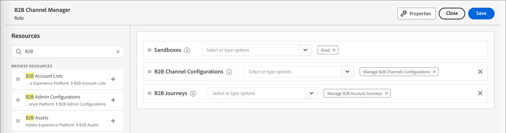

# Benutzerverwaltung

Nachdem die Bereitstellung abgeschlossen und Sandboxes gebunden sind, führen Sie die folgenden Schritte aus, um Ihrem Team und Ihren Benutzenden Zugriff auf Adobe Journey Optimizer B2B edition zu gewähren.

1. [Erstellen eines Marketo Engage-Produktprofils](#marketo-engage-profile) in der Admin Console (nur neue Marketo Engage-Instanz).
1. [Erstellen einer Benutzergruppe](#create-user-group) in der Admin Console.
<!-- 1. [Edit built-in roles](#edit-roles) or [create a custom role](#create-a-custom-role) with Journey Optimizer B2B Edition permissions. 
1. [Add users](#add-users) or [groups](#add-user-groups-to-a-role) to roles. -->

Als Admin können Sie diese Aufgaben in der Adobe Admin Console ausführen, die ein zentraler Ort für die Verwaltung Ihrer Adobe-Produktlizenzen und Benutzenden ist. In der Admin Console können Sie Benutzende an einem zentralen Ort anstatt in Ihren individuellen Lösungen erstellen und verwalten. Weitere Informationen zu den Funktionen und ](https://helpx.adobe.com/de/enterprise/using/admin-console.html) finden Sie auf der Seite [Übersicht über Admin Console .

## Die Admin Console aufrufen

Bevor Sie die Admin Console zum Verwalten von Benutzenden in Ihrem Team verwenden können, müssen Sie sicherstellen, dass Sie auf die Admin Console zugreifen können und über die entsprechenden Berechtigungen verfügen.

1. Als System-Admin sollten Sie im Rahmen des Onboarding-Prozesses mehrere E-Mails von Adobe erhalten.

   Suchen Sie nach der Begrüßungs-E-Mail mit Informationen zum Namen der Organisation, auf die Sie Zugriff erhalten haben.

1. Klicken Sie auf **[!UICONTROL Link]** Erste Schritte“ in Ihrer Begrüßungs-E-Mail, um zur Admin Console zu navigieren.

   Wenn Sie die E-Mail nicht finden können, öffnen Sie einen Browser unter [https://adminconsole.adobe.com](https://adminconsole.adobe.com) direkt zur Admin Console.

1. Melden Sie sich mit Ihrer Adobe ID an.

   Nach erfolgreicher Anmeldung sehen Sie die _Übersicht_ der Adobe Admin Console.

1. Wenn Sie Zugriff auf mehrere Organisationen haben, stellen Sie sicher, dass Sie sich bei der richtigen Organisation angemeldet haben.

   Um Ihre Organisation zu ändern, klicken Sie oben rechts auf den Organisationsnamen und wählen Sie die Organisation aus, auf die Sie Zugriff benötigen.

1. Wählen Sie **[!UICONTROL Administratoren]** auf der Karte _[!UICONTROL Benutzer]_ aus, um zu überprüfen, ob Sie ein Systemadministrator sind.

   {width="700" zoomable="yes"}

1. Suchen Sie durch Eingabe Ihrer Adobe ID-E-Mail-Adresse, Ihres Benutzernamens, Vor- oder Nachnamens.

   * Wenn Ihr Zugriff richtig konfiguriert ist, gibt die Suche Ihren Datensatz zurück.

   * Wenn in der Spalte **[!UICONTROL ADMINISTRATORROLLE]** der Wert &quot;`System`&quot; angezeigt wird, bedeutet dies, dass Sie (oder die angezeigte Person) System-Admin sind.

## Marketo Engage-Produktprofil erstellen {#marketo-engage-profile}

Wenn Sie Benutzenden Zugriff auf eine Adobe-Lösung gewähren, möchten Sie ihnen nicht unbedingt uneingeschränkten Zugriff gewähren. Produktprofile ermöglichen es jeder Lösung, über eigene Benutzerberechtigungen zu verfügen. Verwenden Sie die Admin Console, um Produktprofile zuzuweisen.

Weitere Informationen zur Verwendung von Produktprofilen für Benutzerberechtigungen finden Sie unter [Verwalten von Produktprofilen für Unternehmensbenutzer](https://helpx.adobe.com/de/enterprise/using/manage-product-profiles.html){target="_blank"} in der Dokumentation zu Admin Console.
<!--
>[!BEGINSHADEBOX]

When you add a user to the Marketo Engage product profile, they are subsequently added to the _Standard User_ role within the Default workspace of the Marketo Engage subscription. This role grants them all _Standard User_ permissions for Marketo Engage in that workspace. Currently, all Journey Optimizer B2B Edition users are required to be Marketo Engage users. A Marketo Engage administrator can restrict access by updating the permissions for the _Standard User_ role or by moving the user to a different Marketo Engage user role with more restrictive permissions.

For more information about managing these permissions within Marketo Engage, see [Managing User Roles and Permissions](https://experienceleague.adobe.com/en/docs/marketo/using/product-docs/administration/users-and-roles/managing-user-roles-and-permissions){target="_blank"} in the Marketo Engage documentation.

>[!ENDSHADEBOX]-->

{width="30"} Ein Systemadministrator oder Marketo Engage-Produktadministrator kann die folgenden Schritte ausführen.

1. Anmelden bei [https://adminconsole.adobe.com](https://adminconsole.adobe.com).

1. Wählen Sie die Registerkarte **[!UICONTROL Produkte]** aus.

1. Öffnen Sie die Marketo Engage-Instanz, der Sie das Profil hinzufügen möchten, und klicken Sie auf **[!UICONTROL Neues Profil]**.

   {width="700" zoomable="yes"}

1. Geben Sie einen Produktprofilnamen ein, z. B _„Standardbenutzer_.

1. Klicken Sie **Weiter** und dann **Speichern**.

## Erstellen einer Benutzergruppe {#create-user-group}

Eine Benutzergruppe ist eine Sammlung von Benutzern, denen ein gemeinsamer Berechtigungssatz gewährt wird. Sie können Benutzer in Ihrer Benutzergruppe hinzufügen oder entfernen. Die Gruppenberechtigungen bleiben unverändert, während die Benutzer innerhalb der Gruppe wechseln.

Weitere Informationen dazu, wie Benutzergruppen zum Verwalten von Berechtigungen verwendet werden, finden Sie unter [Verwalten von Benutzergruppen](https://helpx.adobe.com/de/enterprise/using/user-groups.html){target="_blank"} in der Dokumentation zu Admin Console.

{width="30"} Ein Systemadministrator kann die folgenden Schritte ausführen.

1. Anmelden bei [https://adminconsole.adobe.com](https://adminconsole.adobe.com).

1. Wählen Sie die **[!UICONTROL Benutzer]** aus.

1. Wählen **[!UICONTROL Benutzergruppen]** im linken Navigationsbereich aus.

1. Klicken **[!UICONTROL oben]** auf „Neue Benutzergruppe“.

1. Geben Sie einen Namen für die Benutzergruppe ein, z. B. _Standardbenutzer_ und klicken Sie auf **[!UICONTROL Speichern]**.

1. Klicken Sie auf die soeben erstellte Benutzergruppe.

1. Wählen Sie die Registerkarte **[!UICONTROL Zugewiesene Produktprofile]** und klicken Sie auf **[!UICONTROL Profil zuweisen]**.

1. Klicken Sie auf **+** und fügen Sie jede Instanz der folgenden Produkte hinzu:

   * [!UICONTROL Marketo Engage]
   * [!UICONTROL Adobe Experience Platform - AEP-default-all-users]
   * [!UICONTROL Adobe Experience Platform – Datenerfassung]
   * [!UICONTROL Zugriff auf alle Datenerfassungs-]

   {width="700" zoomable="yes"}

1. Klicken Sie auf **[!UICONTROL Speichern]**.

## Benutzer zu einer Gruppe hinzufügen

Informationen zur Benutzerverwaltung finden Sie unter [Admin Console-Benutzer](https://helpx.adobe.com/de/enterprise/using/user-groups.html) in der Dokumentation zu Admin Console.

{width="30"} Ein System- oder Produktadministrator kann die folgenden Schritte ausführen. Ein Produktadministrator kann nur Benutzer hinzufügen, die bereits in seiner Organisation vorhanden sind.

1. Navigieren Sie zu [https://adminconsole.adobe.com](https://adminconsole.adobe.com).

1. Klicken _[!UICONTROL unter &quot;]_&quot; auf **[!UICONTROL Benutzer hinzufügen]**.

1. Fügen Sie jeden Benutzer hinzu:

   * Geben Sie die E-Mail-Adresse, den Vornamen und den Nachnamen des Benutzers ein.

     {width="600" zoomable="yes"}

   * Klicken Sie **[!UICONTROL „Benutzergruppen]** auf **+**.

   * Wählen Sie die zuvor erstellte Benutzergruppe aus.

   * Klicken Sie auf **[!UICONTROL Übernehmen]**.

1. Klicken Sie auf **[!UICONTROL Speichern]**.

<!-- ## Edit roles for product permissions {#edit-roles}

Permissions are unitary rights that allow you to define the authorizations assigned to a product profile. Each permission is gathered under a capability, such as journeys or buying groups, which represents the different functionalities or objects in Journey Optimizer B2B Edition.

The _Permissions_ area of Adobe Experience Platform is where administrators can define user roles and access policies to manage access permissions for features and objects within a product application. In this app, you can create and manage roles, as well as assign the desired resource permissions for these roles. Permissions also allow you to manage the sandboxes and users associated with a specific role.

For more information about role permissions in Experience Platform, see [Manage permissions for a role](https://experienceleague.adobe.com/en/docs/experience-platform/access-control/abac/permissions-ui/permissions){target="_blank"} in the Experience Platform documentation.

### B2B product permissions

The following permissions govern access to Journey Optimizer B2B Edition capabilities:

| Category | Description | Permissions |
| -------- | ----------- | ---------- |
| B2B Account Lists | Configure, manage, view, and publish permissions for B2B account lists. These permissions include actions such as add, remove, import, and delete accounts from account lists. | <li>Manage B2B Account Lists |
| B2B Admin Configurations | Configure, manage, and view permissions for B2B administrative configurations. These permissions include digital asset management connections, asset repositories, and events. | <li>Manage B2B Admin Configurations |
| B2B Assets | Configure, manage, and view permissions for B2B assets. These permissions include emails, SMS, landing pages, fragments, templates, and images. | <li>Manage B2B Assets <li>Manage B2B Templates <li>Manage B2B Fragments|
| B2B Buying Groups | Configure, manage, and view permissions for B2B buying groups. These permissions include solution interests, roles templates, and buying group status. | <li>Manage B2B Buying Groups |
| B2B Channel Configurations | Configure, manage, and view permissions for B2B channel configurations. These permissions include settings for communication limits, API credentials, and security settings. | <li>Manage B2B Channels Configurations |
| B2B Dashboards |Configure and view permissions for B2B dashboards. These permissions include account engagement, buying group stages, surging accounts, and contact coverage. | <li>Manage B2B Dashboards |
| B2B Journeys | Configure manage, view, and publish permissions for B2B journeys. These permissions include account and person actions, event listeners, and split paths | <li>Manage B2B Journeys |

### B2B built-in roles

When your organization has the Journey Optimizer B2B Edition product provisioned, Experience Platform includes a set of built-in (default) roles that you can use to manage access to the product capabilities:

| Role | Permissions |
| ---- | ----------- |
| B2B Journey Manager | <li>Manage B2B Journeys <li>Manage B2B Buying Groups <li>Manage B2B Account Lists <li>View B2B Engagement Dashboard <li>View B2B Insights Dashboard |
| B2B Channel Manager | <li>Manage B2B Assets <li>Manage B2B Templates <li>Manage B2B Fragments |
| B2B System Administrator | <li>Manage B2B Channels Configurations <li>Manage B2B Admin Configurations |
| B2B Sales User | <li>View B2B Engagement Dashboard |

### Edit role permissions

For built-in or custom roles, you can decide at any time to add or delete permissions. If you modify a default or custom role, it impacts every user assigned to the role.

In the following example, you want to add permissions related to the B2B Journeys resource for users assigned to the B2B Channel Manager role. This change enables users for that role to manage account journeys also.

>[!NOTE]
>
>An Admin Console system administrator can perform these steps.

_To change the permissions for a role:_

1. Go to [experience.adobe.com](https://experience.adobe.com/).

1. In the _[!UICONTROL Quick access]_ panel, select **[!UICONTROL Permissions]**.

   >[!NOTE]
   >
   >If you don't see _[!UICONTROL Permissions]_, you may need to click **[!UICONTROL View all]** and select it from the available applications.

   {width="700" zoomable="yes"}

1. Select **[!UICONTROL Roles]** in the left navigation.

1. Click the **_B2B Channel Manager_** role name.

1. In the details page, click **[!UICONTROL Edit]** at the top right.

   {width="700" zoomable="yes"}

   In the role editor, the _[!UICONTROL Resources]_ menu displays the list of resources that apply to the Experience Cloud - Platform powered applications products.

   You can enter _B2B_ in the search tool to filter the list for the B2B product permissions. 
   
1. Click the _Add_ icon (**+**) for the B2B Journeys resource.

   {width="700" zoomable="yes"}

1. In the _[!UICONTROL B2B Journeys]_ permissions card, select **[!UICONTROL Manage B2B Account Journeys]**.

1. Click **[!UICONTROL Save]**.

   {width="700" zoomable="yes"}

1. Click **[!UICONTROL Close]** to return to the details page.

### Add users to a role

{width="30"} A system administrator or AEP product administrator can perform the following steps. 

1. Open the role details and select the **[!UICONTROL Users]** tab.

   This tab displays a list of all users assigned to the role.

1. Click **[!UICONTROL Add users]**.

   {width="700" zoomable="yes"}

1. In the _[!UICONTROL Add users]_ dialog, locate and select the users that you want to add to the role.

   * You can use the Search tool to filter the list of users. 

   * Select the checkbox for each user.

   {width="600" zoomable="yes"}

1. Click **[!UICONTROL Save]** when you have selected all the users that you want to add.

### Add user groups to a role

For information about user management, see [Admin Console users](https://helpx.adobe.com/enterprise/using/user-groups.html) in the Admin Console documentation.

{width="30"} A system administrator or AEP product administrator can perform the following steps. 

1. Open the role details and select the **[!UICONTROL User groups]** tab.

   This tab displays a list of all user groups assigned to the role. 

1. Click **[!UICONTROL Add Groups]**.

   {width="700" zoomable="yes"}

1. In the _[!UICONTROL Add groups]_ dialog, locate and select the groups that you want to add to the role.

   * You can use the Search tool to filter the list of user groups. 

   * Select the checkbox for each user group.

   {width="600" zoomable="yes"}

1. Click **[!UICONTROL Save]** when you have selected all the users that you want to add.

## Create a custom role

{width="30"} A system administrator or AEP product administrator can perform the following steps. 

1. Select **[!UICONTROL Roles]** in the left navigation and select **[!UICONTROL Create role]**.

1. In the _[!UICONTROL Create new role]_ dialog, enter a name for the role, such as _B2B Marketers_, and a description (optional).

1. Click **[!UICONTROL Confirm]**.

1. Select your sandboxes.

   {width="700" zoomable="yes"}

1. Add the profile permissions:

   * In the _[!UICONTROL Resources]_ list on the left, locate the **[!UICONTROL Profile Management]** item and click the _Add_ (**+**) icon to add the attribute.

   * For the attribute, add the following permissions:
      * [!UICONTROL View segments]
      * [!UICONTROL Manage segments]
      * [!UICONTROL View profiles]
      * [!UICONTROL Manage profiles]
      * [!UICONTROL View B2B profile]
      * [!UICONTROL Manage B2B profile]

   {width="700" zoomable="yes"}

1. Add B2B product permissions:

   Refer to the list of [B2B product permissions](#b2b-product-permissions) to determine which product capabilities that you want for the role.

   In the _[!UICONTROL Resources]_ list on the left, locate the **[!UICONTROL B2B]** items and click the _Add_ (**+**) icon to add each attribute that you want to enable for the role.

   You can enter _B2B_ in the search tool to filter the list for the B2B product permissions.

1. Click **[!UICONTROL Save]** at the top right.

1. Go to the role details and select the **[!UICONTROL User groups]** tab.

1. Click **[!UICONTROL Add Groups]**.

   {width="700" zoomable="yes"}

1. Select the checkbox next to the user group that you created previously in the Admin Console.

1. Click **[!UICONTROL Save]**.
-->