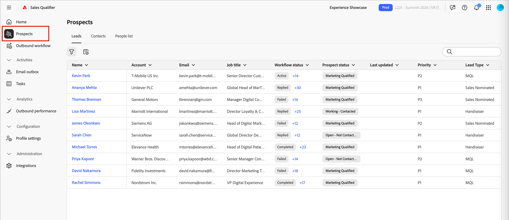
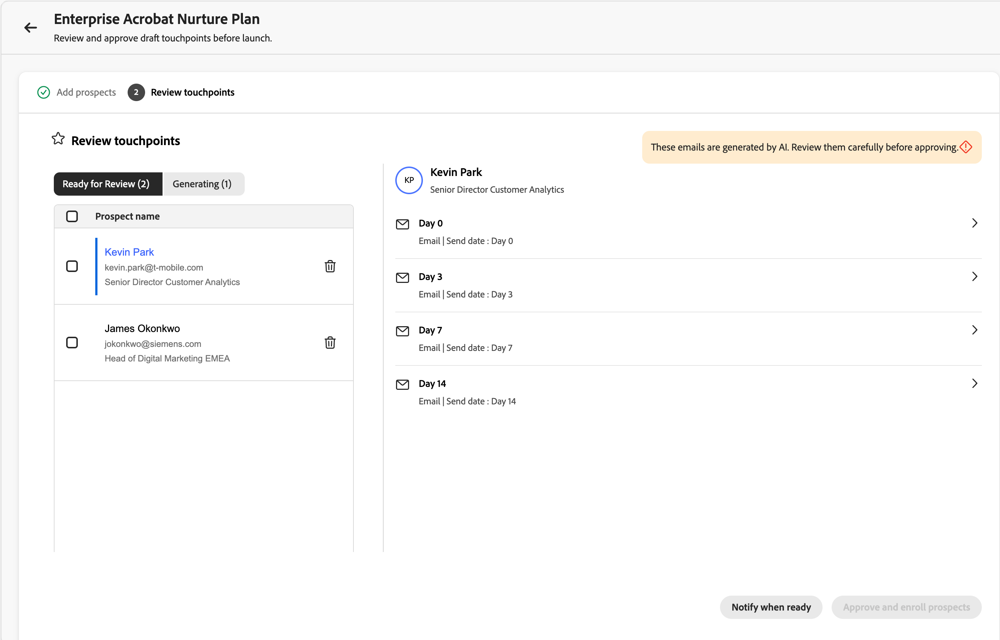

# Verkaufskennzeichner

Sales Qualifier ist eine KI-gesteuerte Anwendung, die Sie mit Adobe Journey Optimizer B2B edition verwenden können. Es implementiert die Account Qualification Agent und optimiert die Workflows für Business Development Representatives (BDRs). Sales Qualifier automatisiert Workflows für die Qualifizierung von Interessenten, Kontaktaufnahme und Käuferinteraktion über verschiedene Kanäle hinweg. Dies reduziert die manuelle BDR-Belastung und beschleunigt die Pipeline-Geschwindigkeit für B2B-Unternehmen.

BDRs können den Browser und die E-Mail-Plug-ins verwenden, um Business Intelligence direkt in CRMs oder Outlook aufzurufen. Im folgenden Video werden der Sales Qualifier und Account Qualification Agent kurz vorgestellt.

>[!VIDEO](https://video.tv.adobe.com/v/3476550)

## Programm-Startseite

Der Verkaufsqualifizierer ist in [!UICONTROL Journey Optimizer B2B edition] enthalten, aber es handelt sich um eine separate App innerhalb der Adobe Experience Platform.

{width="800" zoomable="yes"}

### Account Qualification Agent

Die Account Qualification Agent (AQA) ist das Herzstück des Sales Qualifier. Die AQA verwendet KI, um Ihre Konten zu lesen und festzustellen, welche für den nächsten Schritt bereit sind. Es unterstützt Sie bei der Recherche, beim Erstellen von E-Mails und beim CRM-informierten Kontext, wenn Ihr Unternehmen eine Verbindung zum CRM hergestellt hat (schreibgeschützt).

<!--
## Edit the left navigation bar

At the bottom left of the application, click the _Edit_ (  ) icon to control which elements are visible in the left navigation. You can also drag and drop them to reorder as you want.
-->

### Grundlegende Verwendung des Agenten

Adobe AI-Agenten verwenden _Abfragen in natürlicher Sprache_ was bedeutet, dass sie in der Textaufforderung dieselbe Sprache verwenden, wie Sie es bei Gesprächen mit einer Person tun würden. Je detaillierter Sie sind, desto besser sind die Ergebnisse.

Mit natürlicher Sprache können Sie den Agenten bitten:

* `Tell me the latest financial results of Bodea`
* `Tell me more about hiring at TechNova`
* `Tell me about the new AI features in Bodea LumaSecure4`

Iterieren Sie Ihre ausgehenden Workflows, indem Sie Ihre Eingabeaufforderungen verfeinern, um die benötigten Ergebnisse zu erhalten. Beispiel:

* _Entwerfen einer Folge-E-Mail aus dem Kontext wie Einkommensaufrufe oder Berichte._ Bis zu 120 Wörter. Betreffzeile: Fesselnd, mit einem Schlüsselthema. Einführung: Hook mit einem direkten Zitat aus Kontextquellen. Hauptteil: Verbinden Sie sich mit Problembereichen und Wertangeboten. CTA: Schließen Sie eine kurze Aufforderung zur weiteren Untersuchung ein.

* _Das Ziel dieser E-Mail ist es, ein Gespräch zu beginnen und Glaubwürdigkeit aufzubauen._ Entwerfen Sie eine E-Mail unter 120 Wörtern, die einen beratenden und einfühlsamen Ton hat. Achten Sie darauf, einen allzu vertrauten Ansatz oder Vertriebsansatz zu vermeiden und nicht die Phrasen „hoffen Sie, dass es Ihnen gut geht“, „nur einchecken“ oder „bitte“ zu verwenden.

### Produktzugriff und Benutzergruppen

Der Zugriff auf Funktionen des Verkaufsqualifizierers wird über Benutzergruppen in Adobe Admin Console verwaltet. Produktadministratoren müssen die entsprechenden Benutzergruppen einrichten, bevor Benutzer auf die Anwendung zugreifen können.

#### Produkt-Administratoren

Produktadministratoren, die Zugriff auf die Funktion [Integrationen](#integrations) benötigen, müssen Mitglieder der `Sales Qualifier Admins` Benutzergruppe sein.

1. Erstellen Sie in Adobe Admin Console eine Benutzergruppe mit dem Namen `Sales Qualifier Admins`.
1. Fügen Sie Benutzer hinzu, die CRM-Verbindungen und Wissensdatenbank-Einstellungen konfigurieren müssen.

#### Standard-BDR-Benutzer

Standard-BDR-Benutzer müssen Mitglieder der Benutzergruppe &quot;`Sales Qualifier users`&quot; sein, um auf den Kundenqualifizierer zugreifen zu können.

1. Erstellen Sie in Adobe Admin Console eine Benutzergruppe mit dem Namen `Sales Qualifier users`.
1. Weisen Sie der **das AEP-Profil** Standardproduktion - Alle Zugriffsrechte) zu.
1. Fügen Sie Benutzer zur Gruppe hinzu.

>[!NOTE]
>
>Die Namen der Benutzergruppen müssen genau mit denen übereinstimmen, die in den vorherigen Schritten gezeigt wurden.

## Prospects

Wählen Sie **[!UICONTROL linken Navigationsbereich]** Interessenten“ aus, um eine Liste aller Leads anzuzeigen, auf die Sie zugreifen können. Er bietet eine schnelle Prüfung von Dingen wie Lead-Status und letzte Aktivität.

{width="800" zoomable="yes"}

Klicken Sie auf _Filter_ , um die angezeigte Liste nach Lead-Status zu filtern.

## Ausgehende Workflows

>[!NOTE]
>
>Ausgehende Workflows, die von Produktadministratoren erstellt wurden, werden für alle Benutzenden in Ihrer Organisation freigegeben.

Ein _ausgehender Workflow_ ist die Struktur, die der Verkaufsqualifizierer zum Ausführen einer zielgesteuerten E-Mail-Sequenz verwendet. Sie definieren ein Kontaktziel und Zielgruppenkriterien, und die KI schlägt eine Multi-Touch-Kadenz vor und schreibt für jeden Interessenten personalisierten E-Mail-Inhalt. Sie überprüfen und genehmigen jede E-Mail, bevor die Registrierung die Sequenz aktiviert, sodass Nachrichten nur während des konfigurierten Fensters gesendet werden.

Ein ausgehender Workflow verbindet vier Elemente:

* **Ziel** - Das Ergebnis, das Sie aus der Öffentlichkeitsarbeit erwarten (z. B. die Buchung eines Discovery-Anrufs oder die Registrierung eines Fahrevents).
* **Zielgruppenfilter** - Bedingungen, die bestimmen, welche potenziellen Kunden infrage kommen.
* **Kadenz der Touchpoints** - Die geordnete Sequenz von Schritten, jeweils an einem geplanten Tag. Touchpoints können **E-**, **Telefonanrufe** oder **LinkedInMails** sein.
* **Personalisierter E-Mail** Inhalt: Für jeden E-Mail-Touchpoint entwirft die KI Inhalte mithilfe des Interessentenprofils, des Kontokontexts, des Interaktionsverlaufs und der neuesten Nachrichten.

Das Ziel bestimmt alles nachgelagerte: Die KI verwendet es, um Zielgruppenfilter vorzuschlagen, die Kadenz zu entwerfen, Touchpoint-Eingabeaufforderungen zu entwerfen und die Personalisierung für jede generierte E-Mail zu gestalten.

{width="800" zoomable="yes"}

### Schlüsselkonzepte

| Konzept | Beschreibung |
| --- | --- |
| **Workflow** | Eine wiederverwendbare ausgehende Aktivität, die durch ein Ziel, Zielgruppenbestimmungsfilter, Kadenz und Einstellungen definiert ist. |
| **Ziel** | Was die Öffentlichkeitsarbeit leisten sollte. |
| **Touchpoint** | Ein Schritt in der Sequenz (E-Mail, Telefonanruf oder LinkedInMail), geplant relativ zur Registrierung. |
| **Touchpoint-Eingabeaufforderung** | Anweisungen, die die KI beim Generieren von E-Mail-Textkörper und -Betreff für einen Interessenten befolgt - Ton, Länge, Fokus und call to action. |
| **Kadenz** | Die vollständige Sequenz von Touchpoints: wie viele, in welcher Reihenfolge und an welchen Tagen. |
| **Zielgruppenbestimmungsfilter** | Eine Bedingung, die den Workflow auf eine Untergruppe von potenziellen Kunden beschränkt. |
| **Entwurf** | Eine generierte E-Mail, die zur Überprüfung bereit, aber noch nicht genehmigt ist. |
| **Argumentation** | Die Erklärung der KI, wie sie eine bestimmte E-Mail geschrieben hat (welche Signale und Datenquellen sie verwendet hat). |
| **Enrollment** | Entwürfe eines Interessenten validieren , wodurch die Kadenz und die Warteschlangen der E-Mails aktiviert werden, die während des Versandfensters des Workflows gesendet werden sollen. |

In den folgenden Abschnitten wird der gesamte Lebenszyklus beschrieben: Erstellen eines Workflows im Assistenten, Überprüfen generierter E-Mails, Genehmigen von potenziellen Kunden und Verwalten von Workflows im Zeitverlauf.

### Erstellen eines ausgehenden Workflows

Der Workflow-Assistent umfasst fünf Schritte: **Ziel**, **Targeting**, **Touchpoints generieren**, **Einstellungen** und **Interessenten hinzufügen**. Jeder Schritt baut auf dem letzten auf; Ihr anfängliches Ziel formt jede nachfolgende Entscheidung.

1. Wählen Sie in der linken Navigation **[!UICONTROL Ausgehender Workflow]** aus.

1. Klicken **[!UICONTROL auf der Registerkarte]** Durchsuchen“ auf **[!UICONTROL + Workflow erstellen]** in der oberen rechten Ecke.

#### Schritt 1: Definieren Sie Ihr Ziel

Das Ziel ist der wichtigste Input: Es teilt der KI mit, wie der Erfolg aussieht, und verankert Targeting, Kadenz und E-Mail-Generierung.

1. Wählen Sie **[!UICONTROL Von Grund auf neu]**, um Ihr eigenes Ziel zu schreiben, oder **[!UICONTROL Von Vorlage starten]**, um eine gespeicherte Vorlage zu verwenden.

   {width="700" zoomable="yes"}

1. Wählen Sie eines der **[!UICONTROL empfohlenen Ziele]** als Ausgangspunkt oder geben Sie Ihr eigenes Ziel ein.

1. Klicken Sie **[!UICONTROL Weiter: Zielgruppenbestimmung]**.

Ziele funktionieren am besten, wenn sie ein **konkretes Ergebnis** und nicht nur ein Thema angeben. Beispielsweise bietet `Book a 15-minute discovery call with marketing leaders evaluating campaign automation` der KI mehr Möglichkeiten als `Promote campaign automation`.

#### Schritt 2: Zielgruppenbestimmungsfilter konfigurieren

Zielgruppenbestimmungsfilter definieren, welche potenziellen Kunden infrage kommen. Wenn Sie später Interessenten hinzufügen, werden nur die Interessenten in der Auswahlliste angezeigt, die diesen Filtern entsprechen.

1. Klicken Sie auf den Abwärtspfeil, um die Liste **[!UICONTROL Filter hinzufügen]** anzuzeigen und einen anzuwendenden Filter auszuwählen.

   {width="700" zoomable="yes"}

1. Legen Sie Werte für den Filter fest.

1. Fügen Sie weitere Filter hinzu, wenn Sie die Zielgruppe eingrenzen möchten.

   {width="600" zoomable="yes"}

1. Klicken Sie **[!UICONTROL Weiter: Touchpoints generieren]**.

#### Schritt 3: Erstellen und Überprüfen von Touchpoints

Nachdem das Targeting festgelegt wurde, erstellt die KI **_Kadenz_**: Sie analysiert Ihr Ziel und die Zielgruppenbestimmung, definiert die Touchpoint-Sequenz und schreibt für jeden Schritt eine **_Touchpoint_** Eingabeaufforderung. Es wird eine mehrstufige Kadenz für jeden Touchpoint an einem bestimmten Tag angezeigt. Die Kadenz kann E-Mail-, Telefonanruf- und LinkedInMail-Schritte mischen.

{width="700" zoomable="yes"}

Erweitern Sie einen E-Mail-Touchpoint, um die Eingabeaufforderung zu lesen. Diese Anleitung führt die KI beim Schreiben der E-Mails jedes Interessenten, einschließlich Ton, Länge, Fokus und call to action.

**Kadenz neu erzeugen**

Wenn die Kadenz nicht das ist, was Sie möchten, klicken Sie auf **[!UICONTROL Regenerieren]** und geben Sie eine Verfeinerungsanweisung ein. Beispiel:

* `Make it 3 touchpoints across 2 weeks`
* `Lead with an executive briefing offer in the first email`
* `Add a nurture touch focused on a relevant case study`

Die KI schreibt die gesamte Kadenz auf der Grundlage Ihrer Anweisungen um.

Um einen einzelnen E-Mail-Touchpoint anzupassen, ohne die gesamte Kadenz zu regenerieren, bearbeiten Sie den Aufforderungstext direkt in seinem Textbereich.

Wenn die Kadenz und die Eingabeaufforderungen nach rechts aussehen, klicken Sie auf **[!UICONTROL Weiter: Einstellungen]**.

Verfeinern von Touchpoint-Eingabeaufforderungen vor der Generierung pro Interessent: Diese Eingabeaufforderungen sind die Kernanweisungen, die die KI später für jeden Interessenten verwendet. Die hier verbrachte Zeit kann für alle generierten E-Mails skaliert werden.

#### Schritt 4: Workflow-Einstellungen konfigurieren

Der **Einstellungen** steuert, wie der Workflow ausgeführt wird.

{width="700" zoomable="yes"}

1. Überprüfen Sie den **[!UICONTROL Workflow-Namen]** und ändern Sie ihn, wenn Sie eine klarere Beschriftung wünschen.
1. Bestätigen **[!UICONTROL unter „Max. potenzielle]** pro Workflow“ die Obergrenze für die Anzahl der potenziellen Kunden, die der Workflow gleichzeitig verwalten kann.
1. Legen Sie das **[!UICONTROL Sendefenster]** für die Stunden fest, die ausgehende E-Mails senden dürfen.
1. Bestätigen Sie **[!UICONTROL Ausschluss-Link einschließen]** sodass jede E-Mail einen Ausschluss-Link enthalten kann.
1. Bestätigen Sie, dass **[!UICONTROL Zeitzone]** mit Ihrer Audience übereinstimmt.
1. Klicken Sie **[!UICONTROL Speichern und Interessenten hinzufügen]**.

#### Schritt 5: Interessenten hinzufügen und E-Mail-Generierung starten

Beim Speichern wird die Perspektivauswahl-Ansicht geöffnet, die bereits nach dem Targeting für Schritt 2 gefiltert wurde.

{width="700" zoomable="yes"}

1. Überprüfen Sie die Liste.

   Die Zeilen enthalten normalerweise den Namen des Interessenten, das Konto, die E-Mail-Adresse, die Stellenbezeichnung, den Interaktionsstatus und den Status des Interessenten.

1. Filter hier anpassen, wenn Sie die Liste erweitern oder eingrenzen müssen.
1. Wählen Sie Interessenten mithilfe der Kontrollkästchen aus.
1. Klicken Sie auf **[!UICONTROL Weiter: Touchpoints überprüfen]**, um mit der Erstellung **E** Mails für einzelne Interessenten zu beginnen.

Die KI generiert personalisierte E-Mails für jeden ausgewählten Interessenten **jeden E-Mail-Touchpoint** an der Kadenz. Telefon- und LinkedInMail-Touchpoints bleiben wie geplant in der Sequenz. Die Generierung kann im Hintergrund ausgeführt werden. Verwenden Sie **[!UICONTROL Bei Fertigstellung benachrichtigen]** wenn Sie andere Arbeiten fortsetzen möchten, während diese abgeschlossen sind.

Für jeden Interessenten kombiniert die KI jede Touchpoint-Eingabeaufforderung mit Interessenten-spezifischen Daten (Person, Konto, Interaktionsverlauf, aktuelle Nachrichten), um Betreffzeile und Text zu erstellen.

### Überprüfen und Verfeinern generierter E-Mails

Nach Abschluss der Generierung zeigt die Workflow-Detailansicht ein Banner zur Überprüfung von Entwürfen an. Eine Überprüfung ist erforderlich, und es wird nichts gesendet, bis Sie Ihre Genehmigung erteilen.

{width="700" zoomable="yes"}

1. Klicken Sie in der Workflow-Detailansicht **[!UICONTROL Banner auf]** Entwürfe überprüfen“.
1. Der Schritt **[!UICONTROL Touchpoints überprüfen]** umfasst zwei Registerkarten:
   * **[!UICONTROL Bereit für Überprüfung]** - E-Mails, deren Generierung abgeschlossen ist.
   * **[!UICONTROL Generating]** - E-Mails werden noch geschrieben.
1. Klicken Sie in der Liste der Interessenten auf der linken Seite auf einen Namen, um die Kontaktpunkte dieses Interessenten auf der rechten Seite zu laden.
1. Verwenden Sie den Pfeil (**>**) auf einem Touchpoint, um die gesamte Betreffzeile und den gesamten Textkörper zu erweitern und zu lesen.

#### Lesen der KI-Argumentation

Für jede generierte E **[!UICONTROL Mail wird unter]** erläutert, wie die KI diese Nachricht erstellt hat, einschließlich der Signale, Attribute und Quellen, die den Inhalt und call to action geprägt haben. Überprüfen Sie diese Informationen, um die Personalisierung vor der Genehmigung zu validieren.

{width="600" zoomable="yes"}

#### E-Mails direkt bearbeiten

Für kleine Bearbeitungen (Formulierung, Ton, ein einziger Satz):

1. Klicken Sie auf dem erweiterten Touchpoint auf das Symbol _Bearbeiten_, um den Editor zu öffnen.
1. Bearbeiten Sie die Betreffzeile oder den Text.
1. Klicken Sie auf **[!UICONTROL Speichern]**.

#### E-Mails mit KI verfeinern

Für größere Änderungen (Umstrukturierung, Verlagerung, Hervorhebung oder Umgestaltung der Nachricht) verwenden Sie **[!UICONTROL Mit KI generieren]**. Der KI-Agent schreibt die E-Mail neu, wobei der Personalisierungskontext beibehalten wird.

1. Klicken Sie im E-Mail-Editor auf **[!UICONTROL Mit KI generieren]**.

   {width="600" zoomable="yes"}

1. Geben Sie eine klare Anweisung ein, z. B.:
   * `Make it shorter and more direct. Keep it under 100 words.`
   * `Focus more on the prospect's role and how the solution helps them specifically.`
   * `Change the call-to-action to suggest a 15-minute introductory call instead.`
1. Überprüfen Sie die Revision und passen Sie sie bei Bedarf manuell an.
1. Klicken Sie auf **[!UICONTROL Speichern]**.

>[!TIP]
>
>Direkte Bearbeitungen passen zu Text und Ton. _[!UICONTROL Mit KI generieren]_ ist besser, wenn Sie die E-Mail sonst von Grund auf neu schreiben würden.

### Interessenten genehmigen und registrieren

Validierung aktiviert die Kadenz für einen Interessenten. Bis zur Genehmigung und Registrierung eines potenziellen Kunden sendet das System keine E-Mails an ihn.

1. Wählen Sie in der linken Liste die Interessenten aus, deren E-Mails Sie geprüft haben und senden möchten.
1. Klicken Sie **[!UICONTROL Interessenten genehmigen und registrieren]** (unten rechts).

{width="700" zoomable="yes"}

Genehmigte E-Mails werden während des Workflows **Sendefenster** in der konfigurierten **Zeitzone** an jedem geplanten Touchpoint-Tag relativ zur Registrierung gesendet. Interessenten, die Sie nicht genehmigen, verbleiben in **[!UICONTROL Bereit für Überprüfung]** bis Sie handeln. Nach der Genehmigung wird der Workflow entsprechend der von Ihnen definierten Kadenz ausgeführt.

### Verwalten vorhandener Workflows

Auf der Seite _[!UICONTROL Ausgehender Workflow]_ werden auf der Registerkarte **[!UICONTROL Durchsuchen]** alle Workflows aufgelistet. Jede Karte zeigt das Ziel, konfigurierte Touchpoints und Leistungsmetriken. Verwenden Sie diese Ansicht, um aktive Workflows zu überwachen, zu Entwürfen zurückzukehren, die noch überprüft werden müssen, oder einen Workflow zu öffnen, um weitere Interessenten hinzuzufügen.

### Best Practices für ausgehende Workflows

* **Investieren Sie in das Ziel.** Nachgelagertes Targeting, Kadenz und E-Mails werden alle zum Ziel zurückverfolgt. Konkrete, ergebnisorientierte Ziele übertreffen vage Ziele.
* **Touchpoint-Eingabeaufforderungen vor der Generierung pro Interessent abschließen.**** Nach der Massengenerierung werden Änderungen in der Regel einzeln für Interessenten vorgenommen.
* **Verwenden von Argumentation als Qualitätsprüfung.** Wenn das falsche Signal hervorgehoben wird - oder ein offensichtliches Signal fehlt - bearbeiten Sie die E-Mail oder besuchen Sie die Touchpoint-Eingabeaufforderung erneut und regenerieren Sie die Kadenz.
* **Passen Sie das Bearbeitungswerkzeug an die Änderung an.**** Direkte Bearbeitungen für Text und Ton; **[!UICONTROL Mit KI generieren]** für die Neustrukturierung oder Umgestaltung.
* **Genehmigen Sie nur das, was Sie geprüft haben.**** Erweitern Sie Touchpoints, lesen Sie den Inhalt und verfeinern Sie ihn vor der Registrierung nach Bedarf.

## E-Mail-Postausgang

Im Bedienfeld E-Mail-Postausgang werden alle automatisierten E-Mails aufgelistet, die Sie gesendet haben.

<!--
## Meeting bookings

This panel displays all meetings set up through automation.

## Chat inbox

This panel displays all your chat threads.


You can interact with clients, and see summaries for the contact and the thread so that you can quickly know where you are in the thread.

-->

## Aufgaben

Der Bereich _Aufgaben_ im Sales Qualifier bietet BDRs (Business Development Representatives) einen speziellen Raum zur Verwaltung und Verarbeitung ihrer ausgehenden Workflow-Aktionen. Die ausgehende Workflow-Engine generiert automatisch Aufgaben, die die spezifischen Aktionen darstellen, die ein BDR bei jedem Interessenten durchführen muss - Telefonanrufe, LinkedInMails und E-Mail-Überprüfungen.

Die Aufgabenverwaltung ist als **Verarbeitungswarteschlange“ konzipiert** nicht nur als Aufgabenliste. Sie können eine Aufgabe öffnen, eine Aktion ausführen, sie als abgeschlossen markieren und mit der nächsten fortfahren - und das alles, ohne die Seite zu verlassen.

Wählen Sie **[!UICONTROL Aufgaben]** in der linken Navigationsleiste aus, um die vollständige Aufgabenseite zu öffnen. Dies ist der primäre Arbeitsbereich für die Bearbeitung von Aufgaben, einzeln.

{width="800" zoomable="yes"}

<!--
**Homepage feed** - The homepage displays a running feed of your most urgent tasks, with overdue items at the top followed by today's tasks. Each item in the feed has an "Open" button that takes you directly to that task in the Tasks page with the detail panel already loaded.
-->

### Aufgabentypen

Alle Aufgaben sind an ausgehende Workflow-Schritte gebunden. Es gibt drei Typen:

**Telefonanruf** - Wird erstellt, wenn eine Workflow-Sequenz einen Telefonanrufschritt erreicht. Das Aufgabenbedienfeld zeigt vom Agenten generierte Tonpunkte und ein Feld Inline-Notizen zur Erfassung von Anrufnotizen an.

**LinkedInMail** - Wird erstellt, wenn eine Sequenz einen LinkedInMail-Schritt erreicht. Das Aufgabenbedienfeld zeigt vorgeschlagene InMail-Inhalte an, die Sie kopieren und außerhalb des Produkts versenden können.

**E-Mail-Überprüfung** - Wird erstellt, sobald das System die Generierung personalisierter E-Mails für einen in einem Workflow registrierten potenziellen Kunden abgeschlossen hat. Sie überprüfen und genehmigen die E-Mails, bevor der Ausgang für diesen potenziellen Kunden beginnt. Jeder Interessent erhält eine separate E-Mail-Prüfungsaufgabe. Wenn Sie zehn Interessenten für einen Workflow registrieren, werden nach Abschluss der Generierung bis zu 10 E-Mail-Prüfungsaufgaben angezeigt.

### Aufgabenverwaltung

Die Seite Aufgaben ist in zwei Bereiche unterteilt:

* **Links - Aufgabenliste:** Ihre Aufgabenwarteschlange, sortiert und gefiltert nach den ausgewählten Ansichts- und Sortiereinstellungen.
* **Rechts - Aufgabenarbeitsbereich:** Details für die ausgewählte Aufgabe, einschließlich Informationen zum Interessenten, Workflow-Kontext, aufgabenspezifischen Inhalten (Pitch Points, vorgeschlagene Kopie, E-Mail-Entwürfe) und Aktionssteuerelementen.

Wenn Sie eine Aufgabe im linken Bereich auswählen, werden deren Details in den rechten Bereich geladen, ohne die Seite zu verlassen.

#### Warteschlangensteuerung

Das Arbeitsfenster enthält Steuerelemente **Weiter** und **Zurück**, um Ihre Aufgabenwarteschlange nacheinander zu durchlaufen. Die Warteschlange berücksichtigt alle Sortier- und Filtereinstellungen, die Sie auf die Liste anwenden. Wenn Sie also überfällige Telefonanrufaufgaben nach Fälligkeitsdatum sortiert durcharbeiten, durchlaufen _Weiter_ und _Zurück_ genau dieses Set.

Wenn Sie eine Aufgabe als abgeschlossen markieren, wird das Bedienfeld automatisch zur nächsten Aufgabe in der Warteschlange weitergeleitet.

#### Hinweise

Für Telefonanrufe und LinkedInMail-Aufgaben steht im Arbeitsbereich ein Feld Inline-Notizen zur Verfügung. Notizen werden automatisch gespeichert, wenn Sie auf „Abwesend“ klicken, damit sie beim Navigieren zu einer anderen Aufgabe nicht verloren gehen, bevor Sie die aktuelle Aufgabe als abgeschlossen markieren.

#### Aufgabenaktionen

Verwenden Sie die folgenden Aktionen, um Ihre Aufgaben zu verwalten:

* **[!UICONTROL Als abgeschlossen markieren]** - Die primäre Aktion. Verwenden Sie diese Aktion, nachdem Sie die Aufgabe ausgeführt haben - den Aufruf durchgeführt, die InMail gesendet oder die E-Mails überprüft und genehmigt haben. Nach Abschluss wird die Aufgabe als **Abgeschlossen“ aufgezeichnet** die Warteschlange wird automatisch fortgesetzt.

* **[!UICONTROL Touchpoint überspringen]** - verfügbar über das Menü „Überlauf“ im Arbeitsbereich. Verwenden Sie diese Option, wenn Sie diesen Schritt nicht abschließen können, der Interessent jedoch eine gültige Zielgruppe im Workflow bleibt.
   * Der Interessent geht zum nächsten Schritt der Sequenz über. Zukünftige Aufgaben werden weiterhin planmäßig generiert.
   * Wählen Sie einen Grund aus: *Ungültige Kontaktinformationen*, *Fehlerhaftes Timing*, *Inhalt nicht relevant* oder *Sonstiges* (mit einem Freitext-Feld).
   * Der Aufgabenstatus wird auf **Übersprungen** festgelegt und mit dem Grund und dem Zeitstempel protokolliert.
   * Wenn dies der letzte Schritt im Workflow war, endet die Ausführung des Workflows des Interessenten. Die Aufgabe wird weiterhin als Übersprungen (nicht entfernt) protokolliert.

* **[!UICONTROL Aus Workflow entfernen]** - verfügbar über das Menü „Überlauf“ im Arbeitsbereich. Verwenden Sie diese Option, wenn der Interessent überhaupt nicht mehr in diesem Workflow enthalten sein sollte.

  Wenn Sie einen Interessenten aus einem Workflow entfernen:
   * Alle ausstehenden und zukünftigen Aufgaben für diesen potenziellen Kunden innerhalb dieses Workflows werden abgebrochen.
   * Der Registrierungsstatus des Interessenten ändert sich in **Von BDR entfernt**.
   * Wählen Sie einen Grund aus: *linke Firma*, *Duplizieren*, *Falsche Anpassung*, *Bereits konvertiert* oder *Sonstige* (mit einem Textfeld).
   * Ein Bestätigungsdialogfeld wird angezeigt: *„Diese Aktion löscht alle verbleibenden Touchpoints für [Interessent] in [Workflow-Name]. Fortfahren?“*
   * Der Aufgabenstatus wird auf &quot;**&quot;**. Alle abgebrochenen gleichrangigen Aufgaben sind ebenfalls mit **Entfernen** gekennzeichnet.

>[!NOTE]
>
>Ursachendaten für Überspringen und Entfernen informieren die Analyse, einschließlich Überspringrate nach Kanal, Entfernungsrate nach Workflow und Hauptgründe. Dies trägt zur Verbesserung der Workflow-Qualität bei und fließt in die Leistungsanalyse im Laufe der Zeit ein.

### Aufgabenstatus

Jede Aufgabe durchläuft die folgenden Status:

| Status | Beschreibung |
|---|---|
| **Ausstehend** | Erstellt, aber der vorherige Workflow-Schritt wurde noch nicht abgeschlossen. Nicht in der Aufgabenliste sichtbar. |
| **Künftig** | Der vorherige Schritt ist abgeschlossen, das Fälligkeitsdatum liegt jedoch in der Zukunft. Sichtbar und umsetzbar - Sie können sie frühzeitig abschließen, wenn der richtige Zeitpunkt gekommen ist. |
| **Öffnen** | Heute fällig. Sichtbar und umsetzbar. |
| **Überfällig** | Überfällig am, noch nicht abgeschlossen. Sichtbar, ausführbar und visuell gekennzeichnet. |
| **Abgeschlossen** | Sie haben ausgeführt und die Aufgabe als abgeschlossen markiert. |
| **Übersprungen** | Sie haben diesen Touchpoint übersprungen. Der Interessent kommt im Workflow voran. |
| **entfernt** | Sie haben den potenziellen Kunden aus dem Workflow entfernt. Alle gleichrangigen Aufgaben werden abgebrochen. |
| **Abgebrochen** | System wurde aufgrund einer Workflow-Änderung oder Entfernung eines Interessenten abgebrochen. |

### Listenansichten

Verwenden Sie die Registerkarten oben in der Aufgabenliste, um zwischen Ansichten zu wechseln:

* **Heute** *(Standard)* - Heute fällige Aufgaben, die noch nicht abgeschlossen wurden.

* **Überfällig** - Aufgaben, deren Fälligkeitsdatum überschritten wurde und noch offen sind. Befassen Sie sich zuerst mit diesen Aufgaben.

* **Kommend** - Aufgaben mit einem zukünftigen Fälligkeitsdatum, bei denen der vorherige Workflow-Schritt bereits abgeschlossen wurde. Diese Aufgaben sind frühzeitig sichtbar, sodass Sie im Voraus planen oder früher handeln können, wenn der Zeitpunkt richtig ist (z. B. wenn Sie bereits einen Anruf mit einem Interessenten haben). Das geplante Fälligkeitsdatum wird angezeigt, damit Sie den gewünschten Zeitpunkt kennen.

* **Abgeschlossen** - Ein Datensatz mit Aufgaben, die Sie abgeschlossen, übersprungen oder entfernt haben. Nützlich für Überprüfungs- und Auditzwecke.

### Filtern und Suchen

Es gibt mehrere Möglichkeiten, die Aufgabenliste zu filtern:

* Filtern Sie mithilfe einer Mehrfachauswahlliste nach Aufgabentyp. Wenn Sie mehrere Typen auswählen, werden Aufgaben angezeigt *die mit* ausgewählten Typen übereinstimmen (z **B. Telefonanruf** E-Mail-Überprüfung).

* Nach Aufgabenstatus filtern. Wenn Sie mehrere Status auswählen, werden Aufgaben angezeigt, die einem der ausgewählten Status entsprechen.

* Filtern Sie mithilfe der **-Logik gruppenübergreifend**. Beispielsweise zeigt `Type = Phone Call and Status = Overdue` nur überfällige Aufrufaufgaben an.

Verwenden Sie die Suchleiste, um Aufgaben nach Interessentenname, Firmenname oder Interaktionsname zu suchen. Die Suche gilt zusammen mit allen aktiven Filtern. Nur Textübereinstimmung - Exakte Teilübereinstimmung, keine Ungefährsuche.

### Sortieren

Verwenden Sie das Steuerelement **Sortieren nach**, um festzulegen, wie die Aufgabenliste sortiert werden soll. Die Sortierung bestimmt auch die Reihenfolge, in der sich der nächste und der vorherige Durchlauf durch die Warteschlange bewegen.

| Sortieroption | Verhalten |
|---|---|
| **Fälligkeitsdatum (aufsteigend)** *(Standard)* | Ältestes Fälligkeitsdatum zuerst. Überfällige Aufgaben werden vor den heutigen Aufgaben angezeigt. |
| **Fälligkeitsdatum (absteigend)** | Spätestes Fälligkeitsdatum zuerst. |
| **Erstellungsdatum (neueste)** | Zuletzt erstellte Aufgaben zuerst. |
| **Erstellungsdatum (ältestes)** | Die ältesten erstellten Aufgaben zuerst. |
| **Aufgabentyp** | Gruppiert nach Typ in der richtigen Reihenfolge: Telefonanruf → LinkedInMail → E-Mail-Überprüfung. Innerhalb jeder Gruppe, sortiert nach Fälligkeitsdatum aufsteigend. |

### Überfällige Aufgaben

Eine Aufgabe ist am Tag nach ihrem Fälligkeitsdatum überfällig, wenn sie nicht abgeschlossen wurde. Überfällige Aufgaben:

* In der Ansicht **Überfällig** und oben im Homepage-Feed anzeigen.
* Werden in der Aufgabenliste visuell mit einem „Überfällig“-Badge gekennzeichnet.
* Vollständig umsetzbar bleiben - Sie können sie abschließen, überspringen oder entfernen.

### Anstehende Aufgaben

Anstehende Aufgaben werden erstellt, sobald ein Interessent einen Workflow-Schritt abgeschlossen hat, selbst wenn der nächste Fälligkeitsdatum für den Schritt noch in der Zukunft liegt. Durch diese Sichtbarkeit erhalten Sie einen frühzeitigen Einblick in insight in Ihre Pipeline, sodass Sie im Voraus planen oder frühzeitig handeln können, wenn die Gelegenheit auftritt.

Anstehende Aufgaben zeigen ihr geplantes Fälligkeitsdatum an, sodass Sie immer wissen, wann sie gelöst werden sollen. Die frühzeitige Durchführung einer anstehenden Aufgabe wird vollständig unterstützt - die Workflow-Engine zeichnet das tatsächliche Abschlussdatum auf und treibt den potenziellen Kunden normal voran.

### Aufgabenabschluss

Die Aufgabenfertigstellung ist nicht auf die Seite „Aufgaben“ beschränkt.

**Ansicht „Interessent interagieren“:** Touchpoint-Vorschauen auf der Seite eines interagierenden Interessenten enthalten eine Aktion _Als abgeschlossen markieren_ neben einer Inhaltsvorschau und einem optionalen Feld Notizen . Wenn Sie hier eine Aufgabe abschließen, wird ihr Status auf der Seite Aufgaben sofort aktualisiert. Diese Ansicht ändert nichts am automatischen Vorverlagerungsverhalten - es ist eine Ansichts- und Aktionsfläche, keine Warteschlangen-Verarbeitungsfläche.

**Salesforce (CRM-Plug-in):** Das Sales Qualifier-Plug-in in Salesforce zeigt den Aufgabenstatus (bevorstehende, ausstehende, abgeschlossene, überfällige, übersprungene) in der Karte für ausgehende Workflows an. In der aktuellen Version ist die CRM-Karte **schreibgeschützt** - Sie können den Aufgabenstatus sehen, müssen jedoch Aufgaben im Verkaufsqualifizierer abschließen.

### Leere Zustände

* **Heute ohne Aufgaben:** Sie sehen eine _Sie sind heute alle eingeholt_ Nachricht. Wenn anstehende Aufgaben vorhanden sind, wird eine Eingabeaufforderung angezeigt als _Sie haben [N] anstehende Aufgaben - Anstehende Aufgaben anzeigen_.
* **Überfällige Aufgaben vorhanden:** Sie werden aufgefordert, überfällige Aufgaben zuerst anzugehen.

## Integrationen

Bei Integrationen kann Sales Qualifier Ihr CRM verwenden, sodass die Account Qualification Agent (AQA)- und Outbound-Workflows in Salesforce oder Microsoft Dynamics 365 eine konsistente Ansicht von Leads, Konten, Kontakten, Aktivitäten und Eigentümern gemeinsam haben. CRM-Integrationen stellen eine Verbindung mit **schreibgeschütztem)** her, sodass AQA CRM-Verkaufsdaten und -aktivitäten (z. B. E-Mails, Anrufe, Aufgaben und Termine) abrufen kann, um Erkenntnisse zu bereichern. CRM-Daten werden für Einblicke und operative Effizienz in der App verwendet. Er wird nicht verwendet, um Ihre CRM-Datensätze über diese Verbindung zu ändern.

>[!IMPORTANT]
>
>Für den Zugriff auf Integrationen im Sales Qualifier ist die Mitgliedschaft in der `Sales Qualifier Admins` Benutzergruppe erforderlich.

### CRM-Zugriffsbereich

Die CRM-Verbindung ist **_schreibgeschützt_**. Typische Entitäten umfassen Benutzer, Kontakte, Besitzerzuordnungen, Leads, Konten, Chancen und Aktivitäten. Ihr CRM-Administrator bereitet den API-Zugriff in Salesforce oder Dynamics vor. Anschließend verbinden Sie den Verkaufsqualifizierer und ordnen eingehende Felder in der App zu.

### Vorbereiten der Anmeldeinformationen in Ihrem CRM

Arbeiten Sie mit Ihrem CRM-Administrator zusammen, bevor Sie den Sales Qualifier verbinden. Im Folgenden wird zusammengefasst, was normalerweise in jedem System erstellt wird.

#### Microsoft Dynamics 365 (Dataverse/Power-Plattform)

1. Registrieren Sie in Azure Active Directory eine Anwendung (**[!UICONTROL App-Registrierungen]**).

   Notieren Sie sich **Client-ID** und **Mandanten-ID** und erstellen Sie ein **Client-Geheimnis**.

1. Öffnen Sie im **[!UICONTROL Power Platform Admin Center]** Ihre Umgebung und gehen Sie zu **[!UICONTROL Einstellungen]** > **[!UICONTROL Benutzer + Berechtigungen]** > **[!UICONTROL Anwendungsbenutzer]**.

1. Erstellen Sie einen Programmbenutzer, der mit dieser Azure AD-App verknüpft ist.

1. Weisen Sie eine Sicherheitsrolle zu, die **Lesezugriff** auf die Anforderungen der Verkaufsqualifizierer-Entitäten gewährt (z. B. Leads, Kontakte, Konten, Chancen und Aktivitäten).

   Die App erfordert eine Sicherheitsrolle mit Lesezugriff auf Lesedaten.

**Informationen zum Verbinden von Dynamics:**

* Client-ID
* Client-Geheimnis
* Mandantenkennung
* Dynamics-Instanz-URL (Organisations-URL)

#### Salesforce

Erstellen Sie in Salesforce [eine externe Client](https://help.salesforce.com/s/articleView?id=xcloud.create_a_local_external_client_app.htm&type=5)App oder eine _verbundene App_) mit aktivierten OAuth-Bereichen, die API-Zugriff auf Identitäten und Daten ermöglichen und den Sicherheitsstandards Ihrer Organisation entsprechen. Der integrierende Benutzer (z. B. bei Verwendung einer Client-Anmeldedaten-Stilkonfiguration) muss Lesezugriff auf Objekte wie Leads, Konten, Kontakte, Aufgaben, Ereignisse, Chancen und verwandte Opportunity-Objekte haben. Für administrative Aufgaben ist es oft erforderlich, dass Benutzende mit **[!UICONTROL Verbundene Apps verwalten]** (neben anderen Berechtigungen) nach der Erstellung einen Kundenschlüssel und ein Kundengeheimnis anzeigen.

>[!PREREQUISITES]
>
>Um eine externe Client-App zu erstellen, sollten Sie Systemadministrator sein und sicherstellen, dass Folgendes aktiviert ist (über Profil oder Berechtigungssatz):
>
>* Programm anpassen
>* Setup und Konfiguration anzeigen
>* Alle Daten ändern
>* Verbundene Apps verwalten (wichtig)
>
>   Wenn _Verbundene Apps verwalten_ nicht aktiviert ist, können Sie die Client-ID und das Client-Geheimnis möglicherweise nicht anzeigen, nachdem Sie die externe Client-App erstellt haben.

Wenn Sie die externe Client-App erstellen, aktivieren Sie OAuth und geben Sie Berechtigungen. Aktivieren Sie außerdem die folgenden Client-Anmeldeinformationen:

* Zugriff auf den Identity URL-Service (ID, Profil, E-Mail, Adresse, Telefon)
* Benutzerdaten über APIs verwalten (API)
* Zugriff auf eindeutige Benutzerkennung (openid)

Nachdem Sie die App erstellt haben, aktivieren Sie den Fluss der Client-Anmeldeinformationen erneut und verwenden Sie Kontakt-E-Mail als Benutzernamen.  Wenn die Client-Anmeldeinformationen aktiviert sind, konfigurieren Sie einen Benutzer für _Ausführen als_.

Stellen Sie sicher, dass der konfigurierte Benutzer Lesezugriff auf die folgenden Objekte hat:

* Leads
* Konten
* Kontakte
* Aufgaben
* Ereignisse
* Opportunity
* OpportunityContactRoles
* OpportunityLineItems

**Informationen, die beim Verbinden von Salesforce in Sales Qualifier bereitzustellen sind:**

* Client-ID (Verbraucherschlüssel)
* Client-Geheimnis (Consumer Secret)
* Callback-URL (wie in der verbundenen App konfiguriert)
* Salesforce-Instanz-URL

>[!IMPORTANT]
>
>Senden Sie keine Kundengeheimnisse per E-Mail. Verwenden Sie den genehmigten sicheren Kanal Ihres Unternehmens, um Anmeldeinformationen mit denjenigen zu teilen, die sie im Sales Qualifier eingeben.

### Verbindung zu Ihrem CRM herstellen

1. Melden Sie sich bei Sales Qualifier an und bestätigen Sie, dass die richtige Sandbox oder Umgebung ausgewählt ist.

1. Erweitern Sie in der linken Navigation **[!UICONTROL Administration]** und wählen Sie **[!UICONTROL Integrationen]**.

   Es sollten Karten für Salesforce und Microsoft Dynamics angezeigt werden.

   {width="800" zoomable="yes"}

1. Klicken Sie **[!UICONTROL das]** CRM-System auf „Verbinden“.

1. Geben Sie die Client-ID, Geheimnisse, Mandanten- oder Callback-Werte und **Instanz-URL** von Ihrem CRM-Administrator ein.

1. Nach erfolgreicher Verbindung zeigt die Karte **[!UICONTROL Verbunden]** an.

### Richtlinien für Instanz-URLs

Die **Instanz-URL** muss die umgebungsbasierte URL sein, die Ihr CRM für die API- und Integrationskonfiguration verwendet - kein reiner Hostname, der nur die Benutzeroberfläche hat.

**Salesforce**

1. Melden Sie sich an und notieren Sie sich _Subdomain Ihrer Organisation_ Meine Domain) in der Adressleiste des Browsers (der `{{mydomain}}`).

1. Verwenden Sie für den Verkaufsqualifizierer die kanonische Form: `https://{{mydomain}}.my.salesforce.com` .

   Verwenden **nicht** eine `lightning.force.com` URL als Instanz-URL.

**Microsoft Dynamics 365**

1. Öffnen Sie Ihr CRM im Browser und kopieren Sie die Basis-URL aus der Adressleiste.

   Sie liegt normalerweise in der Form `https://{{org}}.crm.dynamics.com` vor.

### CRM-Felder zuordnen (eingehende Zuordnung)

Nachdem das CRM verbunden ist, öffnen Sie **[!UICONTROL Verwalten]** in der Integration, um mit der **[!UICONTROL CRM-Eingangszuordnung)]** arbeiten.

1. Klicken Sie **[!UICONTROL Abschnitt hinzufügen]** und geben Sie einen Namen, eine optionale Beschreibung und einen Entitätstyp ein (z. B. einen Interessenten).

1. Wählen Sie die zu importierenden CRM-Felder aus, zeigen Sie eine Vorschau der Zuordnung an und speichern Sie sie.

   Der Abschnitt wird auf der Registerkarte „Eingehende Zuordnung“ angezeigt.

1. Zugeordnete Interessentenfelder werden auf der Registerkarte **[!UICONTROL Person]** für Interessenten angezeigt:
   * Kontofelder in der Kontoansicht.
   * Opportunity-bezogene Felder in den Opportunity-Bereichen des Kontoerlebnisses.

### Referenz: Beispiel-API-Parameter

Ihr CRM-Team kann diese Beispiele verwenden, um zu bestätigen, dass der Lesezugriff die erwarteten Lead-Felder zurückgibt.

**Dynamics (Auszug im OData-Stil)**

```text
$select=fullname,_ownerid_value,leadid,emailaddress1,jobtitle,statuscode,createdon,modifiedon,statecode
$filter=_ownerid_value eq '<crmUserId>' [AND additional filters]
$expand=Lead_ActivityPointers(...),parentaccountid(...)
$orderby=modifiedon desc
```

**Salesforce (SOQL-Auszug)**

```sql
SELECT Id, Salutation, FirstName, LastName, Name, Title, Company, Email,
  LeadSource, Status, OwnerId, LastModifiedDate, LastActivityDate, CreatedDate,
  (SELECT Id, Subject, ActivityDate, Status FROM Tasks ORDER BY ActivityDate DESC LIMIT 1),
  (SELECT Id, Subject, ActivityDateTime FROM Events ORDER BY ActivityDateTime DESC LIMIT 1)
FROM Lead
WHERE OwnerId = '<crmUserId>' AND IsDeleted = false
ORDER BY LastModifiedDate DESC
```

### Knowledge Center

Das _[!UICONTROL Knowledge Center]_ bietet AQA Zugriff auf Kundendokumente und verknüpftes Wissen, sodass Sales Qualifier mit eigenen Materialien bessere Forschungs- und Qualifikationserkenntnisse generieren kann. Laden Sie die Inhalts- und Informationsressourcen hoch, die Sie zum Generieren von E-Mails verwenden möchten.

{width="700" zoomable="yes"}

## Profileinstellungen

Die Profileinstellungen geben Informationen über sich selbst an, einschließlich persönlicher Daten, E-Mail- und Kalendereinstellungen und Chat-Verfügbarkeit.

### E-Mail-Einstellungen

Richten Sie auf **[!UICONTROL Registerkarte]** E-Mail-Einstellungen“ Ihre E-Mail-Verbindungen ein.


* **[!UICONTROL E-Mail-]**: Klicken Sie auf **[!UICONTROL Verbinden]** und folgen Sie dem Anmeldeverfahren für Microsoft.

* **[!UICONTROL E-Mail-]**: Konfigurieren der E-Mail-Signatur, die in automatisch generierten E-Mails verwendet wird.

### Kalenderkonfiguration

Legen Sie auf **[!UICONTROL Registerkarte]** Kalenderkonfiguration“ Ihre Zeitzone und Verfügbarkeit fest.

<!-- 

-->

* **[!UICONTROL Kalenderverbindung]** - Klicken Sie auf **[!UICONTROL Verbinden]** und folgen Sie dem Anmeldeverfahren für Microsoft, um Ihren Kalender zu integrieren.

* **[!UICONTROL Besprechungsbestätigungs-E-Mail]** - Wenn ein Kunde ein Meeting mit Ihnen bestätigt, erhält er die Bestätigungs-E-Mail als Antwort. Verwenden Sie diese Einstellungen, um den Betreff und Text der E-Mail zu definieren.

* **[!UICONTROL Voreinstellungen]** - Legen Sie die standardmäßige Länge der Besprechung und die Zeit zwischen Back-to-Back-Besprechungen fest.

Wenn Sie den Kalender trennen:

* Aktive Buchungs-Links sind effektiv deaktiviert.
* Die Buchungsseite zeigt einen freundlichen, vorübergehend nicht verfügbaren Status an.
* Beim erneuten Verbinden werden die Einstellungen beibehalten.

### Kalenderverfügbarkeit

Die Verfügbarkeit Ihres Kalenders in Sales Qualifier basiert auf zwei Eingaben:

* Ihr verbundener Arbeitskalender (Outlook oder Gmail)
* Ihre konfigurierte Verfügbarkeit + Zeitschlitzregeln in _Kalendereinstellungen_.

Der Verkaufskennzeichner liest den Frei/Belegt-Status aus dem verbundenen Kalender, nicht den vollständigen Ereignisinhalt, und verwendet diesen zusammen mit den konfigurierten Regeln, um zu entscheiden, welche Buchungs-Slots ein potenzieller Kunde sehen kann.

Sie können Folgendes konfigurieren:

* Arbeitszeit nach Wochentag
* Mehrere Blöcke pro Tag (Beispiel: 9:00-12 :00 1:00-5:00)
* Ihre Zeitzone
* Meeting-Dauer
* Puffer vor/nach Besprechungen
* Mindestkündigungsfrist
* Buchungsfenster

<!-- 
### Chat settings

In the **[!UICONTROL Chat settings]** tab, set your Timezone Live chat availability.


## Representative management

The _[!UICONTROL Representative management]_ panel displays the defined representatives and their calendar status.

## Meeting performance

This panel presents analytics around your completed meetings.
-->

<!--
 SHPHR-24341 remove section
## Set up the Chrome plugin

The AI Assistant Chrome plugin is available on the [Google Store](https://chromewebstore.google.com/detail/ai-assistant/hancbabllcmckehonngbdkhilocpdfji?authuser=0&hl=en).

When the plugin is installed in Chrome, the Adobe logo appears on the middle right when you are on an integrated site:

* Adobe web applications
* Salesforce
* Outlook
* Microsoft Dynamics and web applications
* Google applications 
-->
