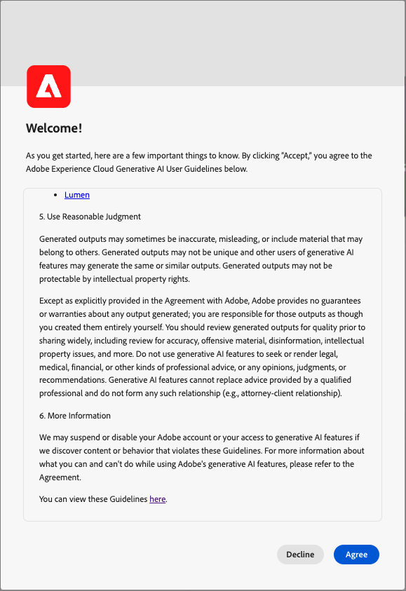

# KI-Assistent in Journey Optimizer B2B edition

Der KI-Assistent in Journey Optimizer B2B edition wird aus derselben Technologiestiftung erstellt wie [KI-Assistent in Adobe Experience Platform](https://experienceleague.adobe.com/de/docs/experience-platform/ai-assistant/home). Dabei handelt es sich um ein Gesprächserlebnis, mit dem Sie Ihre Workflows in Adobe Journey Optimizer B2B edition beschleunigen können. Sie können den KI-Assistenten verwenden, um mehr über die Produktfunktionen zu erfahren, Probleme zu beheben oder Informationen zu durchsuchen und operative Erkenntnisse für Journey Optimizer B2B edition zu erhalten.

>[!IMPORTANT]
>
>Bevor Sie den KI[Assistenten in Journey Optimizer B2B edition verwenden ](https://www.adobe.com/legal/licenses-terms/adobe-dx-gen-ai-user-guidelines.html), müssen Sie den „Benutzerrichtlinien“ zustimmen. Diese Vereinbarung enthält auch die öffentliche Beta-Vereinbarung, sodass Sie zusätzliche KI-Assistenten-Funktionen verwenden können, wenn sie in einer Beta-Funktion eingeführt werden.

+++Anzeigen der Benutzeroberfläche der Benutzervereinbarung

+++

## KI-Assistentenfunktionen in Journey Optimizer B2B edition

Um eine Antwort auf Ihre gesendeten Fragen zu formulieren, fragt der KI-Assistent eine Datenbank ab und übersetzt Daten aus der Datenbank in eine für Menschen lesbare Antwort. Diese Antwort ist eine interne Darstellung der zugrunde liegenden Daten und wird auch als _&#x200B;**_Wissensdiagramm_**&#x200B;_ bezeichnet - ein umfassendes Web aus Konzepten, Daten und Metadaten für eine bestimmte Antwort. Das Wissensdiagramm besteht aus Unterdiagrammen, auf die bei jeder Abfrage verwiesen wird:

* Dokumentation zu Experience League.
* Operative Artefakte, z. B. Schemata, Felder, Zielgruppen und Journey.

Überlegen Sie, welche Art von Anfrage Sie benötigen, bevor Sie eine Abfrage des KI-Assistenten senden:

### Produktkenntnisse

Produktkenntnisse beziehen sich auf Konzepte und Themen, die auf der Dokumentation zu Journey Optimizer B2B edition auf Adobe Experience League basieren. Fragen zum Produktwissen können in den folgenden Untergruppen genauer spezifiziert werden:

| Produktkenntnisse | Beispiele |
| --- | --- |
| Punktuelles Lernen | <li>Was ist eine Einkaufsgruppe? <li> Beispiel für eine Vorlage für Einkaufsgruppen-Rollen anzeigen? |
| Erkennung öffnen | <li>Was sind die Schritte zum Erstellen von Einkaufsgruppen? <li>Wie verwende ich benutzerdefinierte Felder in einer Vorlage für Einkaufsgruppen-Rollen? |
| Fehlerbehebung | <li>Warum wurden keine Gruppen für meinen Journey erstellt? <li>Warum kann ich in der Journey keine Erlebnisereignisse finden, die angehört werden sollen? |

### Operative Erkenntnisse

_Operative Einblicke_ beziehen sich auf Antworten, die der KI-Assistent zu Ihren Metadatenobjekten generiert (Attribute, Konto-Zielgruppen, Datenflüsse, Datensätze, Ziele, Account-Journey, Schemata, Quellen, Einkaufsgruppenvorlagen und Lösungsinteressen). Zu diesen Einblicken gehören Zählungen, Suchen und Auswirkungen auf die Herkunft. Sie sehen sich keine Daten innerhalb der Sandbox an.

* Welche Konto-Zielgruppe hat die größte Zielgruppengröße und wie groß ist diese?
* Wie viele Konto-Zielgruppen wurden noch nie in einer Journey verwendet?
* Welche aktiven Journey verwenden Lösungsinteresse _x_?

Sie können Fragen zum KI-Assistenten zu Ihren betrieblichen Erkenntnissen in den folgenden Bereichen stellen:

| Domain | Unterstützte Metadaten | Nicht unterstützte Metadaten |
| --- | --- | --- |
| Attribute/Felder | <li>Suche nach Attributnamen <li>Attribut - Schemabeziehung <li>Attribut - Datensatzbeziehung <li>Attribut - Zielgruppenbeziehung <li>Attribut - Zielbeziehung | <li>Attributklasse <li>Audit <li>Veraltungsstatus <li>Beschriftungen <li>In Attributen gespeicherter Wert |
| Account-Zielgruppen   **_Hinweis:_**&#x200B;Der AJO B2B-KI-Assistent kann nur Zielgruppenfragen für Account-Zielgruppen beantworten, während der Experience Platform-KI-Assistent nur Fragen für Personen-Zielgruppen beantworten kann | <li>Zielgruppen-Anzahl <li>Zielgruppentyp (Streaming oder Batch) <li>Erstellungs-/Änderungsdatum <li>Aktivierungsstatus <li>Anzahl der Mitglieder <li>Duplizieren von Zielgruppen <li>Name- und ID-Suche | <li>Zielgruppenüberschneidungen <li>Zielgruppenaktivierung <li>Audit <li>Erstellen/Ändern <li>Beschriftungen <li>Trends bei der Mitgliederqualifizierung |
| Datenflüsse | <li>Anzahl der Datenflüsse <li>Datenflussstatus <li>Datenfluss - Datensatzbeziehung <li>Datenfluss-Quelle-Beziehung | <li>Erstellung/Änderung <li>Datenfluss-Batch-Beziehungen <li>Anzahl der aufgenommenen Profile |
| Datensätze | <li>Anzahl der Datensätze <li>Profilaktivierungsstatus <li>Erstellungs-/Änderungsdatum <li>Datensatz - Schemabeziehung <li>Datensatz-Zielgruppen-Beziehung <li>Datensatz - Attributbeziehung <li>Datensatz - Datenflussbeziehung <li>Namenssuche <li>Name- und ID-Suche | <li>Audit <li>Erstellt von <li>Datensatz - Batch-Beziehung <li>Erstellen/Ändern von Datensätzen <li>Datensatzgröße <li>Anzahl der Profile <li>Anzahl Zeilen <li>Wertesuche |
| Ziele | <li>Konfigurierte Zielzählungen <li>Ziel - Zielgruppenbeziehung <li>Zielattributbeziehung | <li>Konto-Setup <li>Informationen zu Kontoanmeldeinformationen <li>Eindeutige Profile aktiviert |
| Journey (Account Journey) | <li>Count <li>Name- und ID-Suche <li>Journey-Status <li>Erstellungs-/Änderungsdatum | <li>Attributes - Journey Relations Audit <li>Erstellung/Änderung <li>Erstellt von |
| Schemata | <li>Anzahl der Schemata <li>Erstellungs-/Änderungsdatum <li>Schema - Attributbeziehung <li>Schema - Datensatzbeziehung <li>Schema - Zielgruppenbeziehung <li>Profilaktivierungsstatus <li>Namenssuche <li>Name- und ID-Suche | <li>Audit <li>Erstellung/Änderung <li>Erstellt von <li>Feldergruppen <li>Identitäten <li>Identity-Namespaces <li>Beschriftungen <li>Anzahl der Profile |
| Quellen | <li>Anzahl der Konten <li>Kontostatus <li>Aktive/inaktive Datenflüsse für jedes Konto <li>Source-Connector - Datenflussbeziehung <li>Source-Konto - Datenflussbeziehung | <li>Informationen zu Kontoanmeldeinformationen <li>Konto-SetupDatenaufnahme -Metriken <li>Anzahl der ProfileQuelle - Batch-Beziehungen |
| Einkaufsgruppenvorlage | <li>Zählungen <li>Status <li>Rollen <li>Name- und ID-Suche | <li>Rollenregeln |
| Interesse an der Lösung | <li>Zählungen <li>Status <li>Interesse an der Lösung - Beziehung der Einkaufsgruppenvorlage <li>Name- und ID-Suche | <li>Lösungsinteresse - Kauf-Gruppenbeziehung |

{style="table-layout:fixed"}

Bei Fragen zu operativen Einblicken spiegeln die Antworten möglicherweise nicht den aktuellen Status der Benutzeroberfläche wider. Die Daten, die diese Fragen stützen, werden alle 24 Stunden einmal aktualisiert. Änderungen, die Benutzende tagsüber in Real-Time CDP vornehmen, werden beispielsweise nachts mit den Datenspeichern synchronisiert und stehen dann morgens für Benutzerfragen zur Verfügung. Melden Sie sich bei einer Sandbox an, um spezifische Daten zu Objekten abzufragen.

### Funktionsumfang

Derzeit umfasst der KI-Assistent Folgendes:

* [Produktwissen](https://experienceleague.adobe.com/de/docs/experience-platform/ai-assistant/home#product-knowledge): Der KI-Assistent beantwortet Fragen zum Produktwissen von Real-Time Customer Data Platform und Adobe Journey Optimizer B2B edition.

* [Operative Insights](https://experienceleague.adobe.com/de/docs/experience-platform/ai-assistant/home#operational-insights): Sie können Fragen zum KI-Assistenten für operative Insights für die folgenden Datenobjekte stellen: Attribute, Account-Zielgruppen, Datenflüsse, Datensätze, Ziele, Account-Journey, Schemata, Quellen, Einkaufsgruppenvorlagen und Lösungsinteressen.

### Datenschutz, Sicherheit und Governance

Der KI-Assistent in Journey Optimizer B2B edition basiert auf Datenschutz, Sicherheit und Governance. Lesen Sie die folgenden Informationen, um mehr über die auf das Kundenvertrauen fokussierten Funktionen zu erfahren, die Sie vom KI-Assistenten erwarten können:

* KI Assistant verwendet heute keine personenbezogenen Daten, auch nicht zu Trainingszwecken.

* KI-Assistent kennt keine Kundendaten wie Personen, Konten, Chancen und Einkaufsgruppen.

* Sie müssen explizit die Berechtigung haben, mit dem KI-Assistenten zu interagieren.

   * Ein Administrator kann Berechtigungen mithilfe der [Benutzeroberfläche „Berechtigungen“ ](https://experienceleague.adobe.com/de/docs/experience-platform/access-control/abac/permissions-ui/permissions) der [Admin Console ](https://experienceleague.adobe.com/de/docs/experience-platform/access-control/ui/browse).

   * Die Berechtigungen sind granular und Ihr Sandbox-Administrator kann konfigurieren, welche Benutzer verschiedene Fragenkategorien stellen können (Produktkenntnisse mit dem KI-Assistenten oder Fragen zu betrieblichen Einblicken).

* Sie können ein Protokoll Ihrer vorherigen Interaktionen mit dem KI-Assistenten mit einer 30-Tage-Aufbewahrungsrichtlinie anzeigen.

* Der KI-Assistent basiert auf Sandbox-spezifischen Daten und der öffentlichen Adobe-Dokumentation, wenn auf Benutzeraufforderungen reagiert wird. Daten werden nicht über Sandboxes hinweg freigegeben.

* Eingabeaufforderungen, die Sie an den KI-Assistenten senden, werden nicht an andere Kunden weitergegeben.

### Häufig gestellte Fragen

Im Folgenden finden Sie eine Liste von Antworten auf häufig gestellte Fragen zum KI-Assistenten in Journey Optimizer B2B edition.

**Werden die Informationen des KI-Assistenten in Echtzeit bereitgestellt?**

Die in den Antworten des KI-Assistenten dargestellten Daten werden täglich aktualisiert. Dieser Zyklus bedeutet, dass die in den Antworten enthaltenen Daten bis zu 24 Stunden älter sein können als die Daten, die zum Zeitpunkt der Antwort auf der Benutzeroberfläche angezeigt werden.

**Welche Funktionen hat der KI-Assistent?**

Der KI-Assistent kann Fragen zum Adobe-Produktwissen beantworten und Fragen zu operativen Einblicken in Ihre operativen Artefakte beantworten.

**Kann der KI-Assistent Informationen zu Kundendaten bereitstellen?**

Nein. Der KI-Assistent hat keinen Zugriff auf Kundendaten und wird daher nicht vom KI-Assistenten angesehen oder verwendet.

**Werden meine personenbezogenen Daten in den Schulungsdaten des KI-Assistenten verwendet?**

AI Assistant verwendet keine personenbezogenen Daten für Trainingszwecke. Geben Sie keine persönlichen Informationen über sich selbst (einschließlich Ihres Namens oder Ihrer Kontaktinformationen) oder andere Parteien von AI Assistant an.

## Nächste Schritte

Fahren Sie mit einem allgemeinen Verständnis des KI-Assistenten fort, um den KI-Assistenten während Ihrer Workflows zu aktivieren und zu verwenden. Weiterführende Informationen finden Sie in der folgenden Dokumentation:

* [Aktivieren des Zugriffs auf den KI-Assistenten](./enable-ai-assistant-access.md)
* [Anleitung zu Fragen](./question-guidance.md)
* [Verwenden des KI-Assistenten](./use-ai-assistant.md)
