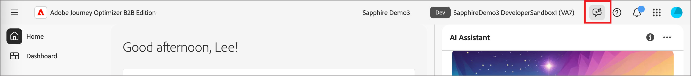

# Aktivieren des Zugriffs auf den KI-Assistenten

>[!IMPORTANT]
>
>Wenn Sie in der Benutzeroberfläche „Berechtigungen“ eine Nachricht erhalten, dass Ihr Unternehmen zusätzlichen rechtlichen Bedingungen zustimmen muss, um Zugriff auf den KI-Assistenten zu erhalten, wenden Sie sich an Ihr Adobe-Account-Team, um Unterstützung zu erhalten.

Die folgenden Parameter regeln den Zugriff auf den KI-Assistenten in Journey Optimizer B2B edition:

* **Zugriff auf die Anwendung:** Sie können auf den KI-Assistenten in Adobe Journey Optimizer B2B edition zugreifen.

* **Berechtigungen:** Verwenden Sie die [Benutzeroberfläche „Berechtigungen](https://experienceleague.adobe.com/en/docs/experience-platform/access-control/abac/permissions-ui/permissions){target="_blank"}, um den Zugriff auf den KI-Assistenten in Ihrer Organisation zu gewähren oder zu widerrufen. Um den KI-Assistenten verwenden zu können, muss ein Benutzer zu einer Rolle gehören, die mit den Berechtigungen _[!UICONTROL KI-Assistent aktivieren]_ und _[!UICONTROL operative Insights anzeigen]_ konfiguriert ist.

Als Administrator haben Sie folgende Möglichkeiten:

* Fügen Sie einer bestimmten Rolle die Berechtigung **[!UICONTROL KI-]** aktivieren) hinzu und fügen Sie dieser Rolle einen Benutzer hinzu. Diese Berechtigung bietet Benutzenden in Ihrer Organisation Zugriff auf den KI-Assistenten.

* Fügen Sie **[!UICONTROL Berechtigung „Operative]** anzeigen“ zu einer bestimmten Rolle hinzu und fügen Sie dieser Rolle einen Benutzer hinzu. Mit dieser Berechtigung kann der Benutzer die Funktionen für operative Insights des KI-Assistenten verwenden.

{width="800" zoomable="yes"}

Verwenden Sie die Benutzeroberfläche „Berechtigungen“, um Berechtigungen für die Verwendung des KI-Assistenten in Journey Optimizer B2B edition zu gewähren. Informationen zum Zugriff auf den KI-Assistenten in Experience Platform und anderen Experience Cloud-Anwendungen finden Sie in der [Dokumentation zu Adobe Experience Platform](https://experienceleague.adobe.com/en/docs/experience-platform/ai-assistant/access){target="_blank"}.

Wenn der/die Benutzende über die erforderlichen Berechtigungen verfügt, kann er/sie auf den KI-_zugreifen, indem er/sie das Symbol KI-Assistent_ in der oberen Kopfzeile der verwendeten Anwendung auswählt.

{width="800" zoomable="yes"}

## Übersichtsvideo zum Zugriff auf KI-Assistenten

Sehen Sie sich das folgende Video an, um zu erfahren, wie Sie den Zugriff auf den KI-Assistenten für Ihre Organisationen und Benutzer konfigurieren.

>[!VIDEO](https://video.tv.adobe.com/v/3436470/?learn=on)

## Nächste Schritte

Nachdem Benutzer Zugriff auf den KI-Assistenten haben, können sie die Funktion während ihrer Workflows verwenden. Weitere Informationen finden Sie in der folgenden Dokumentation:

* [Anleitung zu Fragen](./question-guidance.md)
* [Verwenden des KI-Assistenten](./use-ai-assistant.md)
