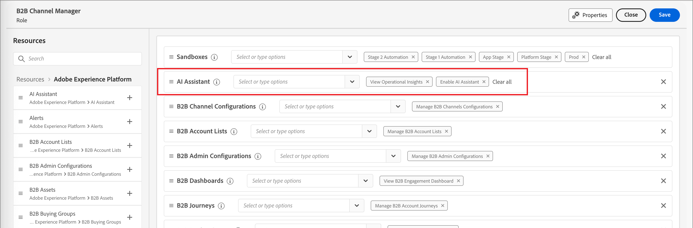

# Zugriff auf AI Assistant aktivieren

>[!IMPORTANT]
>
>Wenn Sie eine Popup Meldung in der UI &quot;Berechtigungen&quot; erhalten, die Sie darüber informiert, dass Ihre Organisation zunächst zusätzlichen rechtlichen Bedingungen zustimmen muss, um Zugriff auf AI Assistant zu erhalten, wenden Sie sich an Ihren Adobe Systems Konto Team, um Informationen zu diesen Bedingungen zu erhalten.

Die folgenden Parameter steuern den Zugriff auf AI Assistant in Journey Optimizer B2B Edition:

* **Zugriff auf die Applikation:** Sie können auf den KI-Assistenten in Adobe Systems Journey Optimizer B2B Edition zugreifen.

* **Berechtigungen:** Verwenden Sie die [UI &quot;Berechtigungen&quot;,](https://experienceleague.adobe.com/en/docs/experience-platform/access-control/abac/permissions-ui/permissions) um den Zugriff auf AI Assistant in Ihrer Organisation zu gewähren oder zu widerrufen. Um AI Assistant verwenden zu können, muss eine bestimmte User zu einer Rolle gehören, die mit den **Berechtigungen KI-Assistent** aktivieren und **Ansicht Operational Insights** konfiguriert ist.

Als Administrator haben Sie folgende Möglichkeiten:

* hinzufügen die **Berechtigung &quot;KI-Assistenten** aktivieren&quot; auf eine bestimmte Rolle und fügen Sie dieser Rolle eine User hinzu. Über diese Berechtigung erhält der User Zugriff auf den KI-Assistenten in Ihrer Organisation.

* hinzufügen die Berechtigung Ansicht **Operational Insights** zu einer bestimmten Rolle und fügen Sie diesem Rolle eine User hinzu. Dieses Berechtigung ermöglicht es dem User, die Funktionen des KI-Assistenten für betriebliche Einblicke zu verwenden.

{width="800" zoomable="yes"}

Verwenden Sie die UI Berechtigungen, um Berechtigungen für die Verwendung von AI Assistant in Journey Optimizer B2B Edition zu erteilen. Informationen zum Zugriff auf AI Assistant in Experience Platform und anderen Experience Cloud Anwendungen finden Sie in der [Adobe Experience Platform-Dokumentation](https://experienceleague.adobe.com/en/docs/experience-platform/ai-assistant/access).

Wenn der User über die erforderlichen Berechtigungen verfügt, kann er auf AI Assistant zugreifen, indem er das _AI Assistant-Symbol_ in der oberen Kopfzeile des von Ihnen verwendeten Applikation auswählt.

{width="800" zoomable="yes"}

## Übersichtsvideo für den AI Assistant-Zugriff

Ansehen das folgende Video an, um zu erfahren, wie Sie den Zugriff auf AI Assistant für Ihre Organisationen und Benutzer konfigurieren.

>[!VIDEO](https://video.tv.adobe.com/v/3436470/?learn=on)

## Nächste Schritte

Nachdem Benutzer Zugriff auf AI Assistant haben, können sie die Funktion während ihrer Workflows verwenden. Weitere Informationen finden Sie in der folgenden Dokumentation:

* [Fragen-Leitfaden](./question-guidance.md)
* [Verwenden des KI-Assistenten](./use-ai-assistant.md)
