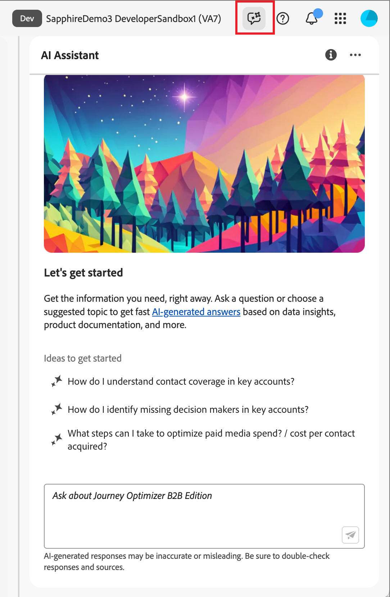

# Verwenden des KI-Assistenten in Journey Optimizer B2B edition

In Journey Optimizer B2B edition ist der KI-Assistent eine Funktion der Benutzeroberfläche, mit der Sie Produktkonzepte verstehen, schnell zu den Funktionen von Journey Optimizer B2B edition navigieren und mehr über diese erfahren und operative Einblicke in Ihre spezifische Umgebung erhalten können. Es ist auch in mehreren Produkten in Adobe Experience Cloud verfügbar.

>[!IMPORTANT]
>
>Bevor Sie den KI-Assistenten verwenden können, ist eine Vereinbarung für die Adobe Experience Cloud Generative AI-Benutzerrichtlinien erforderlich. Weitere Informationen zu dieser Vereinbarung und den Nutzungsrichtlinien finden Sie in den [Benutzerrichtlinien für die generative KI von Adobe Experience Cloud](https://www.adobe.com/legal/licenses-terms/adobe-dx-gen-ai-user-guidelines.html).

Um auf den KI-Assistenten zuzugreifen, klicken Sie auf das Symbol in der Kopfzeile. Der KI-Assistent wird in einem Bedienfeld auf der rechten Seite geöffnet.

{width="420" zoomable="yes"} zuzugreifen{width=„420“ zoomable=„yes“}

Die Benutzeroberfläche des KI-Assistenten wird angezeigt und stellt Ihnen sofort Informationen zum Einstieg bereit. Sie können die unter „Ideen _bereitgestellten Optionen verwenden, um_ zu beantworten, z. B.:

* Welche Journey meines Accounts wurden veröffentlicht?
* Welche Lösungsinteressen wurden geschaffen?
* Erzählen Sie mir die wichtigsten Vorteile von Journey Optimizer B2B edition.

In Adobe Journey Optimizer B2B edition unterstützt der KI-Assistent die folgenden Anwendungsfälle:

## Produktkenntnisse

Fragen zu Produktkenntnissen beziehen sich auf Journey Optimizer B2B edition-Konzepte, die sich auf Aspekte von Adobe Journey Optimizer beziehen. Einige Beispiele für Fragen zum Produktwissen:

* Wie richte ich SMS-Provider-Konten ein?
* Wie sende ich eine E-Mail auf einer Konto-Journey?
* Wie kann ich meinen E-Mail-Inhalt personalisieren?

Um eine Produktfrage zu stellen, geben Sie sie in das Feld unten im Bedienfeld ein und drücken Sie die Eingabetaste.

{width="420" zoomable="yes"}{width=„420“ zoomable=„yes“}

Sie können die vom KI-Assistenten zurückgegebenen Antworten überprüfen, indem Sie die Zitate lesen, die mit jeder Antwort zu Produktkenntnissen verfügbar sind.

Um Zitate anzuzeigen und die Antwort des KI-Assistenten zu validieren, wählen Sie **[!UICONTROL Quellen anzeigen]**.

{width="420" zoomable="yes"}{width=„420“ zoomable=„yes“}

Der KI-Assistent aktualisiert die Benutzeroberfläche und stellt Links zur Dokumentation bereit, die die ursprüngliche Antwort bestätigen. Wenn Zitate aktiviert sind, aktualisiert der KI-Assistent außerdem die Antwort, sodass sie Fußnoten zur Angabe der spezifischen Teile der Antwort enthält, die auf die bereitgestellte Dokumentation verweisen.

Mit dem Daumen hoch oder Daumen runter können Sie die Qualität der Antwort bewerten.

## Operative Erkenntnisse

Fragen zu operativen Erkenntnissen beziehen sich auf die Journey-Objekte in der Sandbox Ihres Unternehmens. Einige Beispiele für Fragen oder Prompts zu operativen Erkenntnissen:

* Wie viele lebende Journey habe ich in Adobe Journey Optimizer B2B edition?
* Erstelle eine Liste aller geplanten Journeys
* Wie viele Journey wurden in den letzten 7 Tagen erstellt?

Sie müssen sich in einer aktiven Sandbox für den KI-Assistenten befinden, um eine ausreichende Antwort auf eine Frage zu Ihren operativen Einblicken bereitstellen zu können.

>[!NOTE]
>
>Die einzigen Adobe Journey Optimizer B2B edition-Objekte, die vom KI-Assistenten für operative Insights unterstützt werden, sind in der Tabelle [Domain für operative Insights](./ai-assistant-overview.md#operational-insights) aufgeführt. Es kann nur für die Sandbox auf Daten zugreifen, in der Sie sich derzeit befinden.

<!-- Select to view an example of an operational insights question.

In the following example, AI Assistant receives the following query: _Show me dataflows that were created using the Amazon S3 source._

screen

AI Assistant responds with a table list of your dataflows and their corresponding IDs. Click the _Download_ icon ( Download icon ) to download the table as a CSV file. To view the entire table, click the _Expand_ icon ( Expand icon ).

screen

An expanded view of the table appears, providing you with a more comprehensive list of dataflows based on the parameters of your query.

screen

When prompted with an operational insights question, AI Assistant provides an explanation of how it computed the answer. In the following example, AI Assistant outlines the steps it took in order to identify the dataflows that were created using the Amazon S3 source.

screen

You can also provide filters and modifications to your questions, and you can instruct AI Assistant to render its findings based on the filters that you include. For example, you can ask AI Assistant to show you a trend of the count of segment definitions in the order of their created date, remove segment definitions with zero total profiles, and use month names instead of integers when displaying the data.

### Verify operational insights responses

You can verify each response related to operational insights questions using an SQL query that AI Assistant provides.

Select to view example of verifying operational insights responses

After receiving an answer for an operational insights question, click **[!UICONTROL Show sources]** and then select **[!UICONTROL View source query]**.

screen

When queried with an operational insights question, AI Assistant provides an SQL query that you can use to verify the process that it took to compute its answer. This source query is for verification purposes only and is not supported on Query Service.

screen  

 -->
