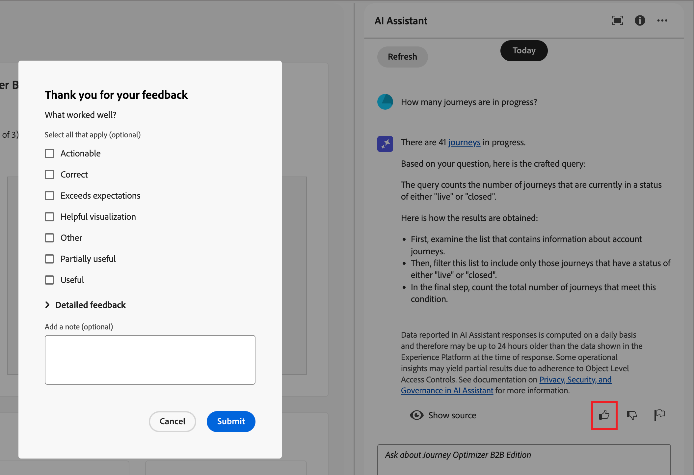

# Verwenden des KI-Assistenten in Journey Optimizer B2B edition

In Journey Optimizer B2B edition ist der KI-Assistent eine Funktion der Benutzeroberfläche, mit der Sie Produktkonzepte verstehen, schnell zu den Produktfunktionen navigieren und sie kennenlernen und operative Einblicke in Ihre Umgebung erhalten können. Es ist auch in mehreren Produkten in Adobe Experience Cloud verfügbar.

>[!IMPORTANT]
>
>Bevor Sie den KI-Assistenten verwenden können, ist eine Vereinbarung für die Adobe Experience Cloud Generative AI-Benutzerrichtlinien erforderlich. Weitere Informationen zu dieser Vereinbarung und den Nutzungsrichtlinien finden Sie in den [Benutzerrichtlinien für die generative KI von Adobe Experience Cloud](https://www.adobe.com/legal/licenses-terms/adobe-dx-gen-ai-user-guidelines.html).

Um auf den KI-Assistenten zuzugreifen, klicken Sie auf das Symbol in der Kopfzeile. Der KI-Assistent wird in einem Bedienfeld auf der rechten Seite geöffnet.

{width="420"}

Die Benutzeroberfläche des KI-Assistenten wird angezeigt und stellt Ihnen sofort Informationen zum Einstieg bereit. Sie können die unter „Ideen _bereitgestellten Optionen verwenden, um_ zu beantworten, z. B.:

* Welche Journey wurden veröffentlicht?
* Welche Lösungsinteressen wurden geschaffen?
* Erzählen Sie mir die wichtigsten Vorteile von Journey Optimizer B2B edition.

In Adobe Journey Optimizer B2B edition unterstützt der KI-Assistent die folgenden Anwendungsfälle:

## Fragen zum Produktwissen stellen

Fragen zu Produktkenntnissen beziehen sich auf Journey Optimizer B2B edition-Konzepte und Anleitungsinformationen. Einige Beispiele für Fragen zum Produktwissen:

* Wie richte ich SMS-Provider-Konten ein?
* Wie sende ich eine E-Mail in einer Journey?
* Wie kann ich meinen E-Mail-Inhalt personalisieren?

Um eine Produktfrage zu stellen, geben Sie sie in das Feld unten im Bedienfeld ein und drücken Sie die Eingabetaste. Beispiel: Sie müssen lernen, wie Sie eine Einkaufsgruppe in einem Journey verwenden. In diesem Fall geben Sie _Wie verwende ich eine Einkaufsgruppe auf einer Journey?_ Nachdem Sie die Frage gesendet haben, fragt der KI-Assistent die Wissensdatenbank ab und erstellt in wenigen Sekunden eine Antwort.

{width="420"}

+++Beispielantwort anzeigen

{width="420"}

+++

## Stellen von Fragen zu betrieblichen Insights

Fragen zu betrieblichen Insights beziehen sich auf die Journey-Objekte in der Sandbox Ihres Unternehmens. Sie können Fragen zu operativen Artefakten stellen, z. B. Konto-Zielgruppe, Konto-Journey, Lösungsinteresse und Einkaufsgruppenvorlage. Einige Beispiele für Fragen oder Eingabeaufforderungen zu betrieblichen Insights sind:

* Wie viele lebende Journey habe ich in Adobe Journey Optimizer B2B edition?
* Erstelle eine Liste aller geplanten Journeys
* Wie viele Journey wurden in den letzten 7 Tagen erstellt?

Sie müssen sich in einer aktiven Sandbox für den KI-Assistenten befinden, um eine ausreichende Antwort auf eine Frage zu Ihren operativen Einblicken bereitstellen zu können.

>[!NOTE]
>
>Die einzigen Adobe Journey Optimizer B2B edition-Objekte, die vom KI-Assistenten für operative Insights unterstützt werden, sind in der Tabelle [Domain für operative Insights](./ai-assistant-overview.md#operational-insights) aufgeführt. Es kann nur für die Sandbox auf Daten zugreifen, in der Sie sich derzeit befinden.

Um eine Frage zu operativen Einblicken zu stellen, geben Sie sie in das Feld am unteren Rand des Bedienfelds ein und drücken Sie die Eingabetaste. Beispiel: Sie möchten mehr über die Zielgruppen für Ihre Sandbox erfahren. In diesem Fall geben Sie ein: &quot;_viele Zielgruppen gibt es?_.  Der KI-Assistent listet die Zielgruppen in Ihrer Sandbox auf und erläutert, wie er die Antwort berechnet hat. In der folgenden Beispielantwort stellt der KI-Assistent einen Link bereit, über den auf die Zielgruppen in der Benutzeroberfläche zugegriffen werden kann, und beschreibt die Schritte, die zum Identifizieren der Anzahl der Zielgruppen unternommen wurden.

{width="420"}

Sie können Ihrer anfänglichen Anfrage folgen, indem Sie nach einer Liste von Artefakten fragen, z. B. _Listen Sie die fünf wichtigsten nach Größe auf_. Der KI-Assistent gibt eine Tabelle mit den fünf wichtigsten Elementen in der Abfrage und den entsprechenden IDs zurück. Klicken Sie auf _Herunterladen_-Symbol  , um die Tabelle als CSV-Datei herunterzuladen.

{width="420"}

Um die gesamte Tabelle im KI-Assistenten anzuzeigen, klicken Sie auf das Symbol _Maximieren_ (  ). Klicken Sie in der erweiterten Tabellenansicht auf **[!UICONTROL CSV herunterladen]**, um die Informationen als CSV-Datei zu speichern.

{width="600" zoomable="yes"}

## Überprüfen von Antworten

Der KI-Assistent enthält Tools, mit denen Sie Antworten überprüfen und validieren können.

### Quellen zum Produktwissen

Nachdem Sie eine Antwort auf eine Produktfrage erhalten haben, wählen Sie **[!UICONTROL Quelle anzeigen]**, um die Zitate aus der Quelle für Produktwissen anzuzeigen, die zum Generieren der Antwort des KI-Assistenten verwendet werden.

Der KI-Assistent enthält Links zur Dokumentation, die die ursprüngliche Antwort bestätigt. Außerdem werden der Antwort Fußnoten hinzugefügt, um die spezifischen Teile der Antwort anzugeben, die auf die verknüpften Dokumentationsquellen verweisen.

{width="420"}

### Operative Insights-Quellen

Nachdem Sie eine Antwort auf eine operative Insights-Frage erhalten haben, klicken Sie auf **[!UICONTROL Quelle anzeigen]** und wählen Sie dann **[!UICONTROL Quellabfrage anzeigen]** aus.

Sie können jede Antwort im Zusammenhang mit Fragen zu operativen Einblicken mithilfe einer SQL-Abfrage überprüfen, die der KI-Assistent bereitstellt. Bei der Abfrage mit einer operativen Insights-Frage stellt der KI-Assistent eine SQL-Abfrage bereit, mit der Sie den Prozess überprüfen können, der zur Berechnung der Antwort erforderlich war. Diese Quellabfrage dient nur zu Verifizierungszwecken und wird vom Abfrage-Service nicht unterstützt.

{width="550" zoomable="yes"}

## Feedback geben

Verwenden Sie die Symbole _Daumen hoch_ (  ) oder _Daumen runter_ (  ), um die Nützlichkeit und Qualität der Antwort zu bewerten. Füllen Sie entsprechend Ihren Erfahrungen das kurze Umfrageformular aus und klicken Sie auf **[!UICONTROL Senden]**. Die von Ihnen bereitgestellten Informationen werden verwendet, um Verbesserungen am KI-Assistenten vorzunehmen.

Wenn Sie in der Antwort etwas Problematisches feststellen, klicken Sie auf das Symbol _Flag_ (  ). Beschreiben Sie das Problem im Formular und klicken Sie auf **[!UICONTROL Senden]** um das Problem zu melden.

{width="420"}

+++Formulare anzeigen

>[!BEGINTABS]

>[!TAB Daumen hoch]

{width="600" zoomable="yes"}

>[!TAB Daumen runter]

{width="600" zoomable="yes"}

>[!TAB Markierung]

{width="600" zoomable="yes"}

>[!ENDTABS]

+++
