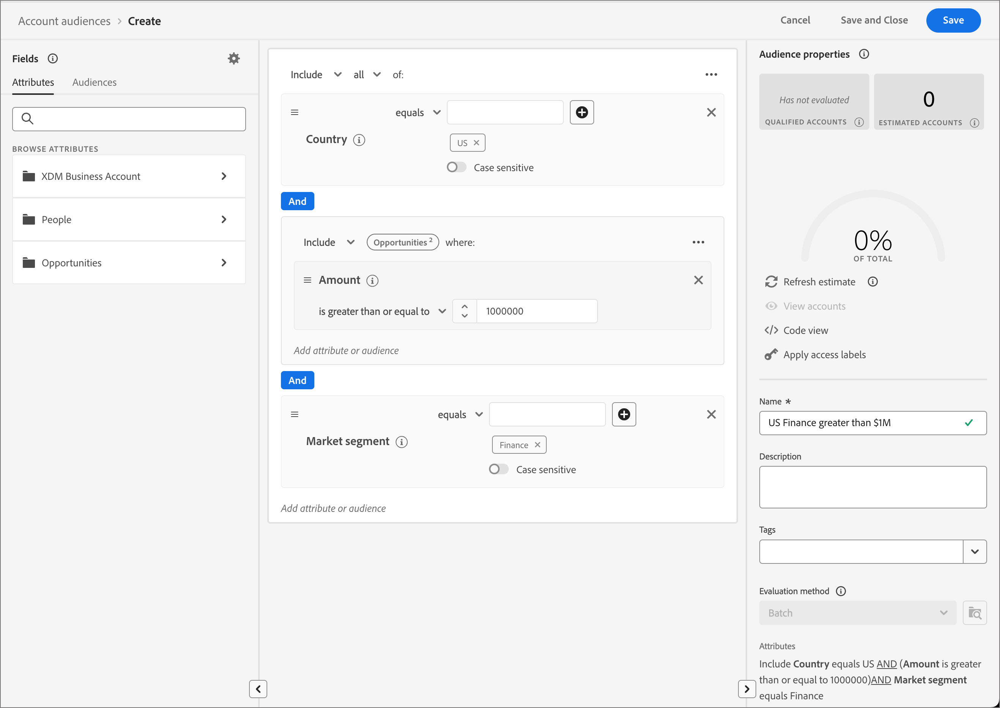

# Kontozielgruppen

Eine Zielgruppe ist eine Gruppe von Personen, die ähnliche Verhaltensweisen und/oder Merkmale aufweisen. Journey Optimizer B2B Edition verwendet die Funktionen zur Kontosegmentierung, die in den Adobe Real-time Customer Data Platform B2B- und B2P-Editionen zu finden sind. Mit der Kontosegmentierung können Benutzer Kontozielgruppen generieren, indem sie Daten aus einer der B2B-Entitäten innerhalb des Systems nutzen. Diese Kontozielgruppen dienen als Eingaben für Journey des Journey Optimizer B2B Edition-Kontos und ermöglichen so eine nahtlose Aktivierung und Personalisierung.

Weitere Informationen zu Kontozielgruppen und deren Definition finden Sie in der Dokumentation zum Adobe Experience Platform Segmentation Service](https://experienceleague.adobe.com/en/docs/experience-platform/segmentation/ui/account-audiences).[

## Workflow der Kontozielgruppe

Sie können sich die Journey Optimizer B2B Edition als ein Experience Platform-Ziel (AEP) vorstellen, das nicht im Zielkatalog erscheint. Aktivieren Sie Kontozielgruppen für Journey Optimizer B2B Edition wie folgt:

1. Erstellen Sie Schemata für Ihre Daten in AEP.
1. Daten in AEP erfassen
1. Erstellen Sie ein Kontosegment, um Ihre Daten zu bewerten.
1. Aktivieren Sie Ihre ausgewerteten Daten in Journey Optimizer B2B Edition.

In Journey Optimizer B2B Edition werden Kontozielgruppen als Eingabe für kontobasierte Journey verwendet, sodass Sie die Personen in diesen Konten auswählen können. Sie können beispielsweise Kontozielgruppen verwenden, um Datensätze aller Konten abzurufen, die keine Kontaktinformationen für Personen mit dem Titel Chief Operating Officer (COO) oder Chief Marketing Officer (CMO) haben.

Mit der Journey Optimizer B2B Edition können Sie Zielgruppen für Adobe Experience Platform-Konten (AEP) direkt im linken Navigationsbereich erstellen und sie in Ihre Konto-Journey integrieren.

{width="800" zoomable="yes"}

## Erstellen einer Konto-Audience

Definieren Sie die Zielgruppe des Kontos, indem Sie eine Kontosegmentierung erstellen. Sie können die Kontosegmentierung direkt in der Anwendung Journey Optimizer B2B Edition erstellen oder die Benutzeroberfläche von [Segment Builder](https://experienceleague.adobe.com/en/docs/experience-platform/segmentation/ui/segment-builder) verwenden. Im Folgenden werden die Schritte beschrieben, mit denen Sie eine Kontosegmentierung in Journey Optimizer B2B Edition erstellen können.

1. Wählen Sie im linken Navigationsbereich **[!UICONTROL Konten]** > **[!UICONTROL Zielgruppen]** aus.

1. Klicken Sie oben rechts auf **[!UICONTROL Zielgruppe erstellen]** .

1. Erstellen Sie die Segmentdefinition.

   Die Kontoattribute und Zielgruppen werden in der linken Navigationsleiste angezeigt. Auf der Registerkarte _[!UICONTROL Attribute]_ können Sie sowohl von Platform erstellte als auch benutzerdefinierte Attribute hinzufügen. Ziehen Sie jedes Attribut, um die Logik für das Segment zu erstellen.

   >[!TIP]
   >
   >Beachten Sie beim Erstellen einer Zielgruppe für ein Konto, dass Ereignisse unter _[!UICONTROL Personen]_ aufgelistet werden, da diese Attribute mit Personen verknüpft sind. 
   >
   >Auf der Registerkarte _[!UICONTROL Zielgruppen]_ können Sie zuvor erstellte personenbasierte Zielgruppen hinzufügen, die bei der Erstellung Ihrer eigenen Kontozielgruppe erstellt werden sollen.

   Im folgenden Beispiel wird die mit `Country Code`, `Revenue Amount` und `Market segment` erstellte Zielgruppe definiert. Die englische Abfrage lautet: &quot;Ich möchte alle Konten in den USA, die sich im Finanzsegment befinden, deren Umsatz 1 Mio. USD übersteigt.&quot;

   Beispiel für den Segment-Builder für das Konto {width="700" zoomable="yes"}

1. Klicken Sie oben rechts auf **[!UICONTROL Speichern und schließen]** .

Um Ihre Kontozielgruppe für Journey Optimizer B2B Edition zu aktivieren, müssen Sie sie [zu einem Konto hinzufügen, Journey](../journeys/journey-overview.md#add-the-account-audience-for-your-journey), und [Journey veröffentlichen](../journeys/journey-overview.md).
