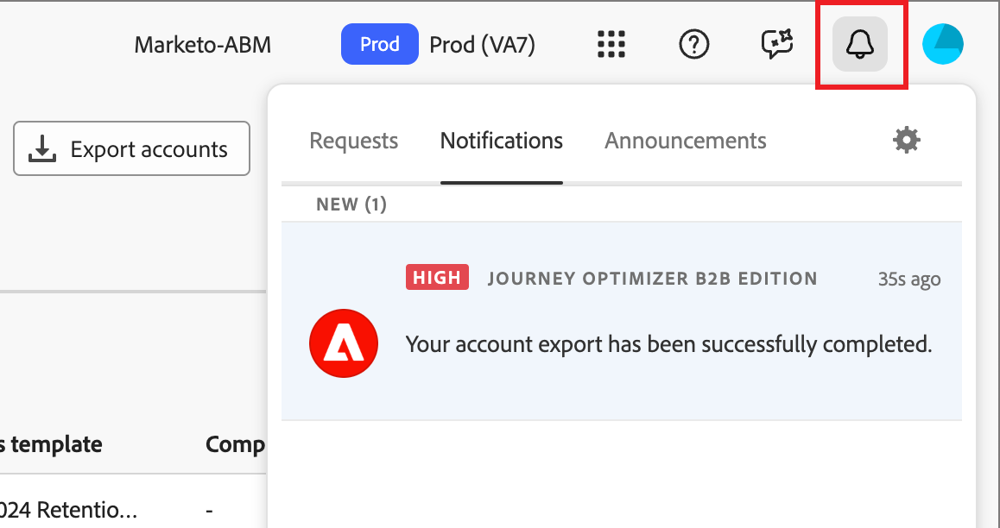

# Kontoliste exportieren

Verwenden Sie die Funktion _Kontoliste exportieren_ um alle Konten oder eine Gruppe von Konten basierend auf der von Ihnen definierten Filterung zu exportieren. Der Exportvorgang erzeugt eine CSV-Datei und sendet die URL für die gespeicherte Datei innerhalb einer Push-Benachrichtigung. Mit dieser Funktion können Sie bei Bedarf Konten in Plattformen von Drittanbietern verschieben.

1. Navigieren Sie in Journey Optimizer B2B edition **[!UICONTROL Konten]** > **[!UICONTROL Einkaufsgruppen]** im linken Navigationsbereich.

1. Wählen Sie die Registerkarte **[!UICONTROL Durchsuchen]** aus.

1. Klicken **[!UICONTROL oben]** auf „Konten exportieren“.

   {width="800" zoomable="yes"}

1. Definieren Sie im Dialogfeld die Parameter der zu exportierenden Konto-Zielgruppen.

   {width="400"}

   Für den **[!UICONTROL Interaktionswert]** ist der `Between` ebenso inklusiv wie Prozentbereiche. Zum Beispiel sind 5.1 und 5 beide _zwischen_ 5 und 6.

   Leere Filterparameter werden wie `Is Any` behandelt.

1. Klicken Sie auf **[!UICONTROL Konten exportieren]**, um die CSV-Datei mit den angegebenen Filtern zu generieren.

1. Wenn Sie eine Benachrichtigung erhalten, dass der Export abgeschlossen ist, klicken Sie auf den Benachrichtigungs-Link, um auf die CSV-Datei zuzugreifen.

   {width="425"}

   >[!NOTE]
   >
   >Wenn Sie über ein Benachrichtigungsabonnement für E-Mail-Benachrichtigungen verfügen, das in den Voreinstellungen Ihres Adobe-Benutzerkontos eingerichtet ist, kann es sich um eine E-Mail-Benachrichtigung handeln.

   Die Anwendungsseite wird zur Registerkarte _Einkaufsgruppe_ Durchsuchen weitergeleitet, und im Dialogfeld „Systemdatei speichern“ werden Sie aufgefordert, die Datei auf Ihrem System zu speichern. Wenn Sie die Daten freigeben müssen, können Sie das Dateifreigabesystem Ihres Teams verwenden.
